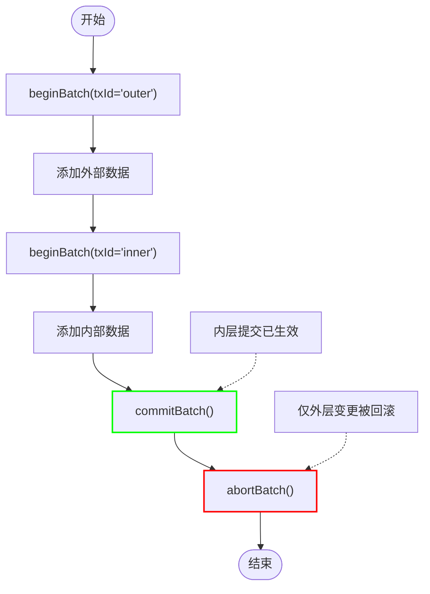
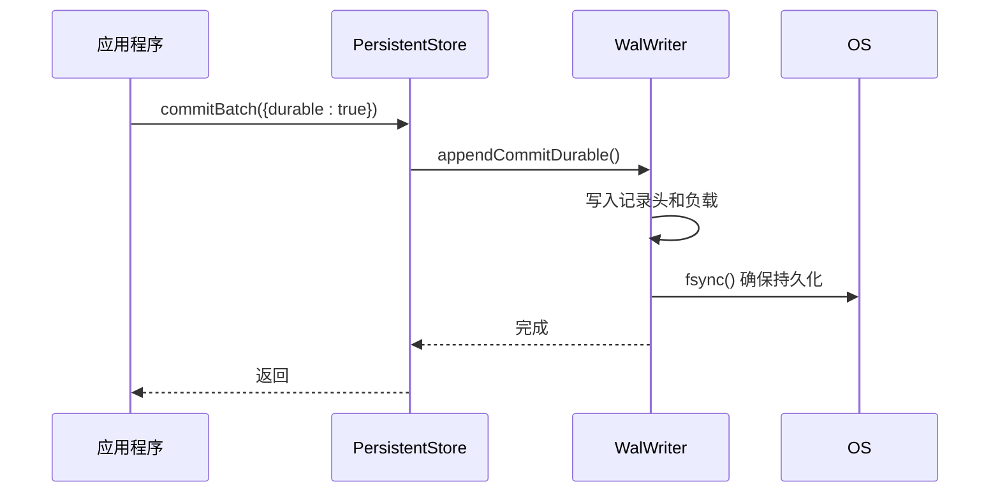
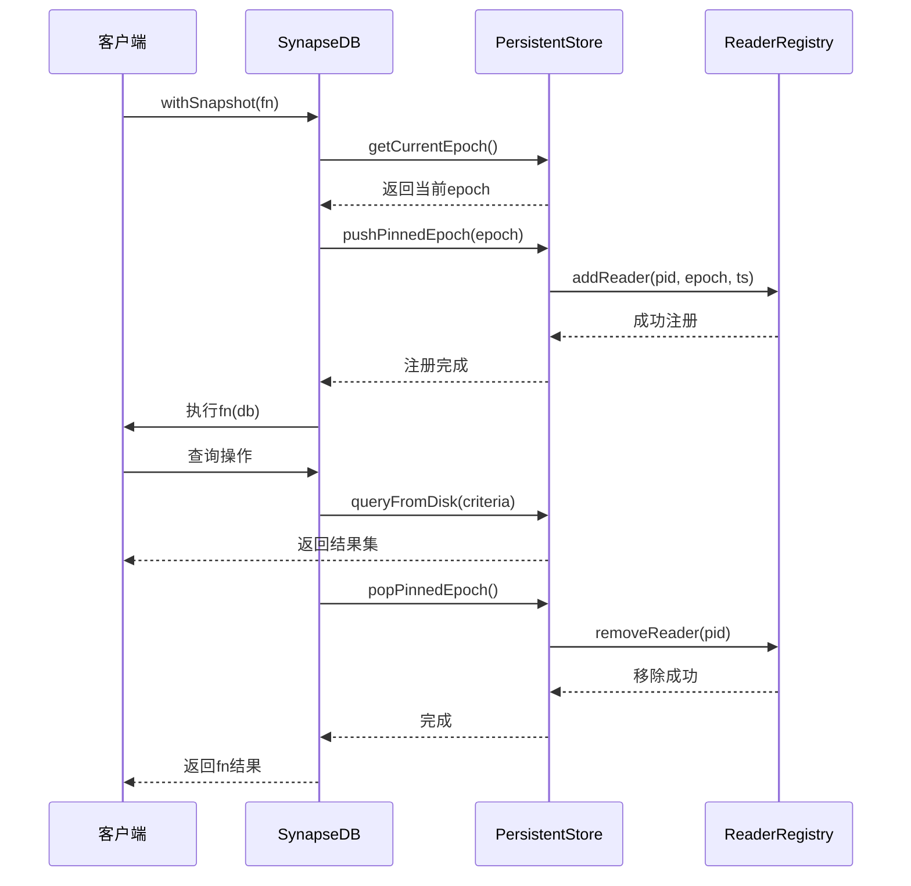
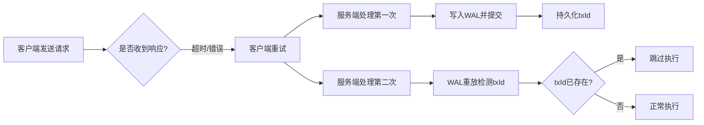
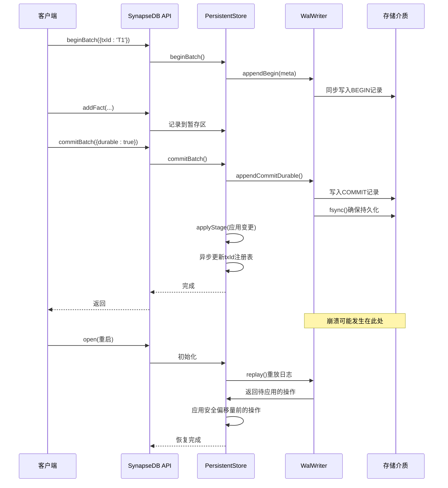

# 事务与快照API

<cite>
**本文档引用文件**  
- [synapseDb.ts](file://src/synapseDb.ts)
- [persistentStore.ts](file://src/storage/persistentStore.ts)
- [wal.ts](file://src/storage/wal.ts)
- [txidRegistry.ts](file://src/storage/txidRegistry.ts)
- [readerRegistry.ts](file://src/storage/readerRegistry.ts)
</cite>

## 目录
1. [简介](#简介)
2. [事务控制协议](#事务控制协议)
3. [WAL日志机制](#wal日志机制)
4. [读取快照实现](#读取快照实现)
5. [显式与隐式事务对比](#显式与隐式事务对比)
6. [事务冲突处理](#事务冲突处理)
7. [持久化与空间回收](#持久化与空间回收)
8. [事务生命周期时序图](#事务生命周期时序图)

## 简介
本系统提供基于批次的事务控制机制，支持嵌套事务、幂等提交和崩溃恢复保证。通过WAL（Write-Ahead Log）v2设计确保数据持久性，并结合epoch版本控制和读者注册表实现一致性的读快照隔离。

## 事务控制协议

### 批次操作语义
系统提供`beginBatch`、`commitBatch`和`abortBatch`三个核心方法来管理事务批次：

- `beginBatch`：开启新事务批次，可携带`txId`和`sessionId`元信息
- `commitBatch`：提交当前批次，可选择是否进行持久化同步
- `abortBatch`：中止并回滚当前批次的所有变更

**Section sources**
- [synapseDb.ts](file://src/synapseDb.ts#L460-L470)
- [persistentStore.ts](file://src/storage/persistentStore.ts#L714-L773)

### 嵌套行为
系统支持事务的嵌套使用，具有以下特性：
- 内层`commitBatch`会立即将变更应用到主存储，使其不受外层`abortBatch`影响
- `abortBatch`仅放弃当前顶层批次，支持部分回滚场景
- 每个`BEGIN`记录都包含完整的元信息栈，便于WAL重放时恢复嵌套状态



**Diagram sources**
- [persistentStore.ts](file://src/storage/persistentStore.ts#L714-L773)
- [wal.ts](file://src/storage/wal.ts#L248-L278)

**Section sources**
- [persistentStore.ts](file://src/storage/persistentStore.ts#L714-L773)
- [wal.ts](file://src/storage/wal.ts#L248-L278)

## WAL日志机制

### 日志结构
WAL v2采用二进制格式，包含魔数标识和版本号，每条记录由类型码、长度和校验和组成：

| 类型码 | 操作 | 描述 |
|-------|------|------|
| 0x10 | addTriple | 添加三元组 |
| 0x20 | deleteTriple | 删除三元组 |
| 0x30 | setNodeProps | 设置节点属性 |
| 0x31 | setEdgeProps | 设置边属性 |
| 0x40 | beginBatch | 开始批次 |
| 0x41 | commitBatch | 提交批次 |
| 0x42 | abortBatch | 中止批次 |

**Section sources**
- [wal.ts](file://src/storage/wal.ts#L0-L24)

### 持久化等级控制
`commitBatch`支持两种持久化级别：
- **非durable提交**：仅写入WAL文件缓冲区
- **durable提交**：写入WAL后调用`fsync()`确保落盘

此机制允许在性能和安全性之间进行权衡。



**Diagram sources**
- [wal.ts](file://src/storage/wal.ts#L120-L143)
- [persistentStore.ts](file://src/storage/persistentStore.ts#L727-L763)

**Section sources**
- [wal.ts](file://src/storage/wal.ts#L120-L143)
- [persistentStore.ts](file://src/storage/persistentStore.ts#L727-L763)

### 崩溃恢复保证
系统通过WAL重放在启动时恢复未刷新的数据：
1. 读取WAL文件并验证魔数和版本
2. 按顺序解析日志记录构建操作栈
3. 对于`COMMIT`操作，检查`txId`是否已应用以实现幂等性
4. 将安全偏移量之前的日志数据重放到主存储

**Section sources**
- [wal.ts](file://src/storage/wal.ts#L180-L300)

## 读取快照实现

### 实现机制
`withSnapshot`方法通过epoch版本控制和读者注册表实现一致性读取：



**Diagram sources**
- [synapseDb.ts](file://src/synapseDb.ts#L477-L491)
- [persistentStore.ts](file://src/storage/persistentStore.ts#L1355-L1378)
- [readerRegistry.ts](file://src/storage/readerRegistry.ts#L55-L66)

**Section sources**
- [synapseDb.ts](file://src/synapseDb.ts#L477-L491)
- [persistentStore.ts](file://src/storage/persistentStore.ts#L1355-L1378)
- [readerRegistry.ts](file://src/storage/readerRegistry.ts#L55-L66)

### 一致性保证
系统通过以下机制确保快照一致性：
- 在查询前固定当前epoch版本
- 向读者注册表注册当前进程为活跃读者
- 使用`queryFromDisk`方法避免内存状态依赖
- 查询完成后注销读者身份

当存在活跃读者时，后台维护任务不会清理相关数据文件。

**Section sources**
- [persistentStore.ts](file://src/storage/persistentStore.ts#L816-L980)
- [persistentStore.ts](file://src/storage/persistentStore.ts#L1305-L1317)

## 显式与隐式事务对比

| 特性 | 显式事务批次 | 隐式自动提交 |
|------|-------------|------------|
| 性能开销 | 较高（需WAL记录） | 较低（直接操作） |
| 原子性保证 | 强（完整ACID） | 弱（单操作原子） |
| 并发冲突 | 可能需要重试 | 即时失败 |
| 使用场景 | 复合业务逻辑 | 简单读写操作 |
| 崩溃恢复 | 完整支持 | 有限支持 |

**Section sources**
- [persistentStore.ts](file://src/storage/persistentStore.ts#L714-L773)
- [synapseDb.ts](file://src/synapseDb.ts#L460-L470)

## 事务冲突处理

### 最佳实践指南
1. **短事务原则**：尽量减少事务持有时间
2. **重试策略**：对预期冲突实现指数退避重试
3. **批量优化**：将多个操作合并为单个批次
4. **只读分离**：使用`withSnapshot`避免读写冲突

```typescript
async function safeUpdateWithRetry(
  db: SynapseDB,
  maxRetries = 3
): Promise<boolean> {
  for (let i = 0; i < maxRetries; i++) {
    try {
      await db.withSnapshot(async (snapshotDb) => {
        // 读取当前状态
        const current = snapshotDb.find({...}).all();
        // 准备更新
        db.beginBatch();
        db.deleteFact(...);
        db.addFact(...);
        db.commitBatch();
      });
      return true;
    } catch (error) {
      if (i === maxRetries - 1) throw error;
      await new Promise(resolve => 
        setTimeout(resolve, Math.pow(2, i) * 100)
      );
    }
  }
  return false;
}
```

**Section sources**
- [synapseDb.ts](file://src/synapseDb.ts#L477-L491)
- [persistentStore.ts](file://src/storage/persistentStore.ts#L714-L773)

## 持久化与空间回收

### idempotent选项语义
`commitBatch`的幂等性通过`txId`去重实现：
- 提交时将`txId`写入持久化注册表（`txids.json`）
- WAL重放时检查`txId`是否已存在
- 若已存在则跳过该次提交，防止重复应用

此特性在分布式场景中极具价值，可安全处理网络重试导致的重复请求。



**Diagram sources**
- [txidRegistry.ts](file://src/storage/txidRegistry.ts#L27-L49)
- [persistentStore.ts](file://src/storage/persistentStore.ts#L734-L777)

**Section sources**
- [txidRegistry.ts](file://src/storage/txidRegistry.ts#L17-L76)
- [persistentStore.ts](file://src/storage/persistentStore.ts#L734-L777)

### 空间回收机制
系统通过以下方式管理WAL空间：
- `truncateTo(offset)`：安全截断已确认处理的日志
- `reset()`：在`flush`后重置WAL文件
- 后台任务定期清理过期的读者注册文件

## 事务生命周期时序图



**Diagram sources**
- [synapseDb.ts](file://src/synapseDb.ts#L460-L470)
- [persistentStore.ts](file://src/storage/persistentStore.ts#L714-L773)
- [wal.ts](file://src/storage/wal.ts#L180-L300)

**Section sources**
- [synapseDb.ts](file://src/synapseDb.ts#L460-L470)
- [persistentStore.ts](file://src/storage/persistentStore.ts#L714-L773)
- [wal.ts](file://src/storage/wal.ts#L180-L300)