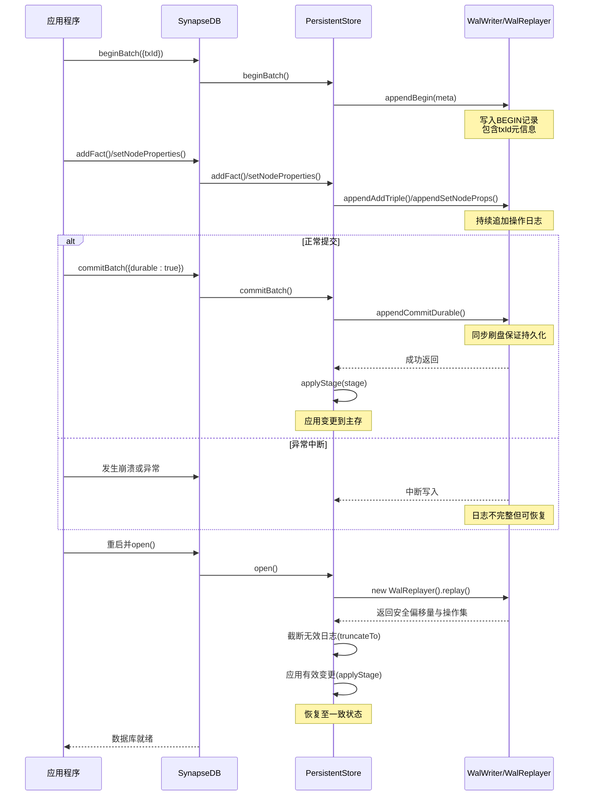
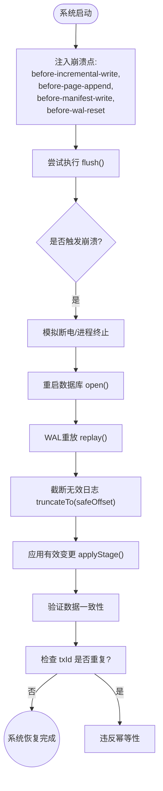

# 事务异常处理

<cite>
**本文档引用的文件**  
- [crash_injection.test.ts](file://tests/system/crash_injection.test.ts)
- [wal.ts](file://src/storage/wal.ts)
- [persistentStore.ts](file://src/storage/persistentStore.ts)
- [synapseDb.ts](file://src/synapseDb.ts)
</cite>

## 目录
1. [简介](#简介)
2. [WAL日志与崩溃恢复机制](#wal日志与崩溃恢复机制)
3. abortBatch在异常清理中的角色
4. WAL中事务记录的状态标记机制
5. 基于fault注入测试的行为验证
6. 异常类型与重试策略建议
7. 资源释放与防御性编程实践
8. 结论

## 简介
本指南详细说明SynapseDB如何通过预写式日志（WAL）保障事务的原子性与持久性。当系统遭遇崩溃或异常时，利用WAL进行自动恢复，确保数据一致性。文档涵盖`abortBatch`方法在回滚过程中的作用、事务状态标记机制，并结合故障注入测试验证系统行为。同时提供开发者面对特定错误时的重试策略及资源管理最佳实践。

## WAL日志与崩溃恢复机制



**图示来源**
- [wal.ts](file://src/storage/wal.ts#L0-L419)
- [persistentStore.ts](file://src/storage/persistentStore.ts#L0-L799)

**本节来源**
- [wal.ts](file://src/storage/wal.ts#L0-L419)
- [persistentStore.ts](file://src/storage/persistentStore.ts#L0-L799)

## abortBatch在异常清理中的角色

`abortBatch` 方法用于放弃当前顶层事务批次，支持嵌套事务的部分回滚。其核心功能包括：

- **减少批处理深度**：将 `batchDepth` 减一，表示退出当前事务层级。
- **记录ABORT日志**：调用 `wal.appendAbort()` 在WAL中写入中止记录，确保崩溃后能识别未完成事务。
- **清理暂存数据**：弹出 `batchMetaStack` 和 `txStack` 的顶层元素，丢弃该层所有暂存的增删改操作和元信息。

此机制保证了即使在多层嵌套事务中发生异常，也能精确回滚到上一层安全状态，避免脏数据污染。

**本节来源**
- [persistentStore.ts](file://src/storage/persistentStore.ts#L765-L773)
- [synapseDb.ts](file://src/synapseDb.ts#L468-L470)

## WAL中事务记录的状态标记机制

WAL使用固定字节类型标识不同类型的事务记录，实现状态追踪：

| 记录类型 | 字节值 | 含义 |
|--------|------|-----|
| beginBatch | 0x40 | 标记事务开始，可携带 txId/sessionId 元数据 |
| commitBatch | 0x41 | 标记事务成功提交，`appendCommitDurable` 可强制刷盘 |
| abortBatch | 0x42 | 标记事务中止，用于回滚 |

在恢复阶段，`WalReplayer.replay()` 会解析这些状态标记：
- 遇到 `BEGIN` 创建新的暂存层；
- 遇到 `COMMIT` 将顶层暂存合并至全局视图（最外层需检查 txId 幂等性）；
- 遇到 `ABORT` 直接丢弃顶层暂存层。

此外，`WalBeginMeta` 接口允许为每个事务附加唯一 `txId`，配合 `txidRegistry` 实现跨周期幂等去重，防止重复执行已提交事务。

**本节来源**
- [wal.ts](file://src/storage/wal.ts#L24-L320)
- [persistentStore.ts](file://src/storage/persistentStore.ts#L714-L763)

## 基于fault注入测试的行为验证



**图示来源**
- [crash_injection.test.ts](file://tests/system/crash_injection.test.ts#L0-L97)

**本节来源**
- [crash_injection.test.ts](file://tests/system/crash_injection.test.ts#L0-L97)
- [wal.ts](file://src/storage/wal.ts#L145-L320)

## 异常类型与重试策略建议

当开发者遇到以下异常时，应采取相应策略：

### TransactionAbortedError
- **原因**：事务因冲突或显式调用 `abortBatch` 被中止。
- **建议策略**：
  - 使用指数退避算法重试，初始延迟 10ms，每次乘以 1.5~2.0，上限 1s。
  - 最多重试 5~10 次，避免无限循环。
  - 记录重试次数与上下文，便于调试。

### WriteConflictError
- **原因**：多个写事务修改同一数据项导致冲突。
- **建议策略**：
  - 立即重试前先短暂休眠（如 10–50ms），降低竞争概率。
  - 结合随机抖动（jitter）避免多个客户端同步重试。
  - 若频繁发生，考虑优化业务逻辑减少热点更新。

通用原则：**永远在 finally 块中释放资源**，确保连接、锁等不会泄露。

**本节来源**
- [persistentStore.ts](file://src/storage/persistentStore.ts#L765-L773)
- [wal.ts](file://src/storage/wal.ts#L110-L112)

## 资源释放与防御性编程实践

为防止死锁或资源泄露，必须遵循以下防御性编程范例：

```typescript
let db: SynapseDB;
try {
  db = await SynapseDB.open('path');
  db.beginBatch({ txId: 'unique-id' });

  // 执行事务操作
  db.addFact({ subject: 'A', predicate: 'B', object: 'C' });
  await db.flush();

  db.commitBatch();
} catch (err) {
  if (db && err instanceof TransactionAbortedError) {
    console.warn('事务被中止，准备重试...');
    db.abortBatch(); // 显式清理
  } else {
    throw err;
  }
} finally {
  if (db) {
    await db.close(); // 必须释放文件句柄
  }
}
```

关键点：
- `beginBatch` 后务必配对 `commitBatch` 或 `abortBatch`；
- 所有异步资源（如数据库连接）必须在 `finally` 块中关闭；
- 即使抛出异常也应尝试调用 `abortBatch` 清理状态。

**本节来源**
- [synapseDb.ts](file://src/synapseDb.ts#L460-L470)
- [persistentStore.ts](file://src/storage/persistentStore.ts#L765-L773)

## 结论
SynapseDB通过WAL机制实现了强一致性的事务保障。在崩溃场景下，系统能够自动恢复至最近的一致状态，确保ACID属性中的原子性与持久性。`abortBatch` 提供了高效的异常清理能力，而基于 `txId` 的幂等控制进一步增强了可靠性。开发者应结合合理的重试策略与严格的资源管理，构建健壮的应用程序。