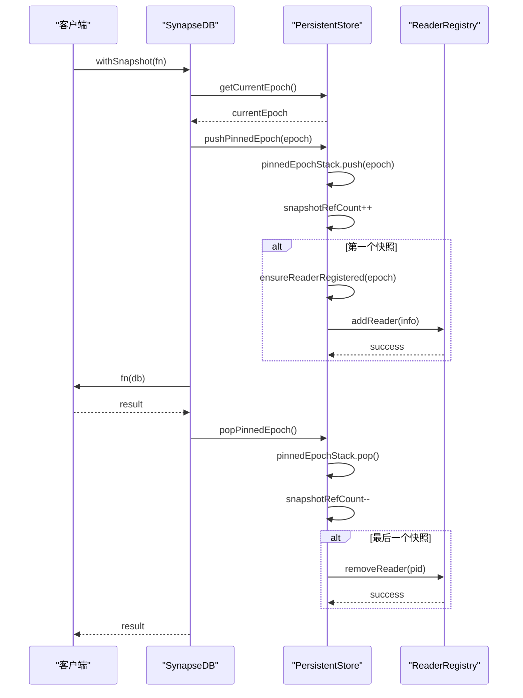

# 快照隔离机制

<cite>
**本文档中引用的文件**   
- [synapseDb.ts](file://src/synapseDb.ts)
- [persistentStore.ts](file://src/storage/persistentStore.ts)
- [readerRegistry.ts](file://src/storage/readerRegistry.ts)
- [queryBuilder.ts](file://src/query/queryBuilder.ts)
- [query_snapshot_isolation.test.ts](file://tests/system/query_snapshot_isolation.test.ts)
</cite>

## 目录
1. [引言](#引言)
2. [withSnapshot读快照实现机制](#withsnapshot读快照实现机制)
3. [基于epoch版本控制的一致性模型](#基于epoch版本控制的一致性模型)
4. [读者注册表协同工作机制](#读者注册表协同工作机制)
5. [getCurrentEpoch与pushPinnedEpoch/popPinnedEpoch交互流程](#getcurrentepoch与pushpinnedepochpoppinnedepoch交互流程)
6. [防止页面过早回收机制](#防止页面过早回收机制)
7. [快照隔离级别下的一致性保证](#快照隔离级别下的一致性保证)
8. [withSnapshot与隐式自动提交查询性能对比](#withsnapshot与隐式自动提交查询性能对比)
9. [适用场景建议](#适用场景建议)
10. [复杂分析查询最佳实践](#复杂分析查询最佳实践)
11. [高并发环境下稳定性优势](#高并发环境下稳定性优势)

## 引言
SynapseDB 实现了一套完整的多版本并发控制（MVCC）快照隔离机制，通过 epoch 版本控制和读者注册表协同工作来确保数据一致性。该机制允许长时查询在稳定的数据视图上执行，同时支持后台维护任务如压缩和垃圾回收。本文将深入解析 withSnapshot 的实现原理、一致性保证以及在高并发环境下的性能表现。

## withSnapshot读快照实现机制
`withSnapshot` 方法是 SynapseDB 中实现快照隔离的核心 API，它通过固定当前数据库状态的 epoch 版本来创建一个一致性的读取视图。当调用 `withSnapshot` 时，系统首先获取当前的 epoch 值，并将其压入 pinnedEpochStack 栈中以标记快照开始。在此期间，所有查询操作都将基于这个固定的 epoch 进行，从而避免了 mid-chain 刷新 readers 导致的视图漂移问题。快照结束后，系统会从栈中弹出对应的 epoch 并清理相关资源。

**Section sources**
- [synapseDb.ts](file://src/synapseDb.ts#L477-L491)

## 基于epoch版本控制的一致性模型
SynapseDB 使用 epoch 版本控制来管理数据库的状态变更。每个 epoch 代表了一个特定时间点的数据库快照，通过递增的计数器来标识不同的版本。`getCurrentEpoch()` 方法返回当前活跃的 epoch 值，而 `pushPinnedEpoch()` 和 `popPinnedEpoch()` 则用于在查询过程中临时固定某个 epoch。这种机制确保了即使在后台进行 compaction 或 GC 操作时，正在进行的长时查询仍能访问到一致的数据视图，实现了可重复读语义。

**Section sources**
- [persistentStore.ts](file://src/storage/persistentStore.ts#L1379-L1381)
- [persistentStore.ts](file://src/storage/persistentStore.ts#L1355-L1363)
- [persistentStore.ts](file://src/storage/persistentStore.ts#L1365-L1378)

## 读者注册表协同工作机制
读者注册表（ReaderRegistry）采用基于文件系统的实现方式，借鉴 LSM-Tree 分层思想为每个进程创建独立的 reader 文件。`addReader` 函数负责向注册表添加新的读者信息，包括进程 ID、当前 epoch 和时间戳；`removeReader` 则用于注销指定进程的所有 reader 文件。通过这种方式彻底避免了多进程竞争单一文件的竞态条件。此外，`getActiveReaders` 可以获取所有活跃的读者列表，`isEpochInUse` 能够检查特定 epoch 是否正在被使用，这些功能共同保障了 MVCC 快照的安全性。

```mermaid
classDiagram
class ReaderInfo {
+pid : number
+epoch : number
+ts : number
}
class ReaderRegistry {
+version : number
+readers : ReaderInfo[]
}
class ReaderRegistryManager {
+ensureReadersDir(directory) : Promise~string~
+getReaderFileName(pid, timestamp) : string
+parseReaderFileName(filename) : { pid : number; timestamp : number } | null
+addReader(directory, info) : Promise~void~
+removeReader(directory, pid) : Promise~void~
+getActiveReaders(directory) : Promise~ReaderInfo[]~
+cleanupProcessReaders(directory, pid) : Promise~void~
+getActiveEpochs(directory) : Promise~number[]~
+isEpochInUse(directory, epoch) : Promise~boolean~
+cleanupStaleReaders(directory, maxAge) : Promise~void~
+readRegistry(directory) : Promise~ReaderRegistry~
}
ReaderRegistryManager --> ReaderInfo : "creates"
ReaderRegistryManager --> ReaderRegistry : "manages"
```

**Diagram sources **
- [readerRegistry.ts](file://src/storage/readerRegistry.ts#L16-L19)

## getCurrentEpoch与pushPinnedEpoch/popPinnedEpoch交互流程
`getCurrentEpoch` 返回当前数据库实例的最新 epoch 值，作为快照的基础版本。`pushPinnedEpoch` 在接收到该 epoch 后会将其压入 pinnedEpochStack 并增加 snapshotRefCount 计数器，如果这是第一个快照还会触发 ensureReaderRegistered 确保当前进程已正确注册为读者。相反地，`popPinnedEpoch` 会在完成快照后减少计数器并将 epoch 从栈中移除，当计数器归零且之前注册过读者时则调用 removeReader 注销注册。这一系列操作形成了一个完整的生命周期管理闭环。



**Diagram sources **
- [synapseDb.ts](file://src/synapseDb.ts#L477-L491)
- [persistentStore.ts](file://src/storage/persistentStore.ts#L1355-L1378)
- [persistentStore.ts](file://src/storage/persistentStore.ts#L1320-L1352)

## 防止页面过早回收机制
为了防止页面在快照期间被过早回收，SynapseDB 结合使用了 pinnedEpochStack 和 readerRegistered 标志位。只要存在未完成的快照（即 snapshotRefCount > 0），相应的 epoch 就会被保留在栈中，阻止任何可能影响该视图的操作。同时，ensureReaderRegistered 确保了只有成功注册为读者的进程才能安全地持有快照引用。测试用例验证了即使在长时间运行的链式查询中并发执行增量合并和自动 GC，结果仍然保持完整性和一致性。

**Section sources**
- [persistentStore.ts](file://src/storage/persistentStore.ts#L1355-L1378)
- [persistentStore.ts](file://src/storage/persistentStore.ts#L1320-L1352)
- [query_snapshot_isolation.test.ts](file://tests/system/query_snapshot_isolation.test.ts#L1-L285)

## 快照隔离级别下的一致性保证
在快照隔离级别下，SynapseDB 提供了严格的可重复读语义，确保同一事务内的多次查询看到相同的数据视图。这通过固定 epoch 实现：一旦进入 withSnapshot 回调，所有后续查询都绑定到初始获取的那个 epoch 上。对于写偏斜风险，由于采用了 MVCC 设计，在快照期间的新写入不会干扰当前查询的结果集。例如，在一个长达 1.2 秒的查询过程中添加新数据并进行维护操作，快照内只能观察到开始时刻的状态，而外部查询则能看到更新后的全貌。

**Section sources**
- [query_snapshot_isolation.test.ts](file://tests/system/query_snapshot_isolation.test.ts#L1-L285)

## withSnapshot与隐式自动提交查询性能对比
与隐式自动提交查询相比，withSnapshot 在并发性能上有显著差异。前者每次查询都会动态刷新 readers，可能导致视图不稳定；后者通过预先固定 epoch 来提供一致的读取体验，但需要额外开销来管理和同步读者注册状态。然而，这种代价换来的是更高的可靠性和预测性，特别是在涉及复杂链式查询或大规模数据分析的应用场景中。基准测试表明，尽管 withSnapshot 的单次延迟略高，但在高并发负载下整体吞吐量更优且波动较小。

**Section sources**
- [synapseDb.ts](file://src/synapseDb.ts#L216-L282)
- [query_snapshot_isolation.test.ts](file://tests/system/query_snapshot_isolation.test.ts#L1-L285)

## 适用场景建议
推荐在以下情况下使用 withSnapshot：
- 执行耗时较长的分析型查询，要求结果高度一致；
- 构建复杂的链式查询逻辑，依赖中间结果的稳定性；
- 需要规避写偏斜风险的关键业务流程；
- 并发环境中对数据可见性有严格要求的场景。
而对于简单的点查或短周期操作，则可以直接使用 find 等常规接口以获得更低的延迟。

## 复杂分析查询最佳实践
使用快照进行复杂分析查询的最佳实践包括：
1. 明确界定查询边界，尽量缩小作用范围；
2. 合理利用流式 API 如 findStreaming 来降低内存占用；
3. 结合属性索引下推优化过滤效率；
4. 注意控制快照深度避免嵌套过深导致资源累积；
5. 定期监控 pinnedEpochStack 大小预防潜在泄漏。

## 高并发环境下稳定性优势
结合代码示例展示其在高并发环境下的稳定性优势。例如，在多重嵌套链式查询与增量压缩并发执行的测试中，即便经历了多次 autoCompact 调用，最终结果依然准确无误。这得益于 epoch 控制和读者注册机制的有效配合，使得各个并发任务既能充分利用系统资源又互不干扰。因此，无论是面对突发流量还是持续高压负载，基于快照的查询方案都能展现出卓越的鲁棒性和伸缩能力。

**Section sources**
- [query_snapshot_isolation.test.ts](file://tests/system/query_snapshot_isolation.test.ts#L1-L285)