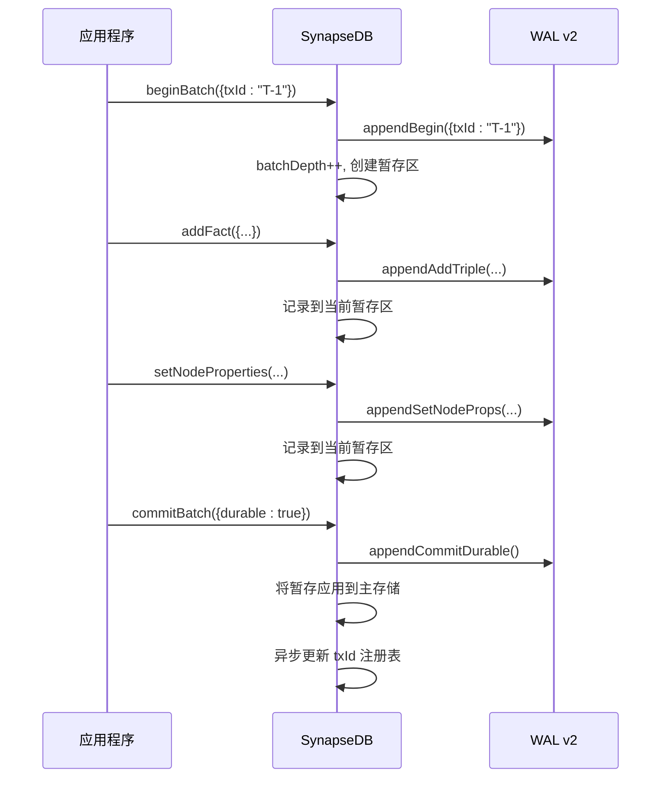
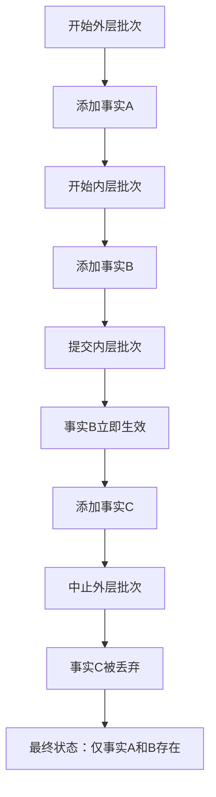

# 显式事务控制

<cite>
**本文档引用的文件**
- [synapseDb.ts](file://src/synapseDb.ts)
- [persistentStore.ts](file://src/storage/persistentStore.ts)
- [wal.ts](file://src/storage/wal.ts)
- [txidRegistry.ts](file://src/storage/txidRegistry.ts)
- [教程-04-事务-WAL-幂等.md](file://docs/教学文档/教程-04-事务-WAL-幂等.md)
- [wal_commit_durable.test.ts](file://tests/integration/storage/wal_commit_durable.test.ts)
- [wal_abort_semantics.test.ts](file://tests/integration/storage/wal_abort_semantics.test.ts)
- [wal_nested_bug_reproduce.test.ts](file://tests/integration/storage/wal_nested_bug_reproduce.test.ts)
</cite>

## 目录
1. [简介](#简介)
2. [批次事务机制](#批次事务机制)
3. [嵌套事务行为模式](#嵌套事务行为模式)
4. [幂等性设计与分布式重试](#幂等性设计与分布式重试)
5. [WALv2日志系统与持久化等级](#walv2日志系统与持久化等级)
6. [事务生命周期时序图](#事务生命周期时序图)
7. [API使用示例与最佳实践](#api使用示例与最佳实践)
8. [结论](#结论)

## 简介
本文件深入解析SynapseDB中`beginBatch`、`commitBatch`和`abortBatch`构成的显式事务控制协议。重点阐述其在内存级批次操作中的语义保证，结合WALv2（Write-Ahead Logging）实现崩溃恢复，并支持通过`txId`实现跨周期幂等性。该机制为构建高可靠、可恢复的数据系统提供了基础保障。

**Section sources**
- [教程-04-事务-WAL-幂等.md](file://docs/教学文档/教程-04-事务-WAL-幂等.md#L1-L42)

## 批次事务机制
批次事务是SynapseDB中进行原子性数据变更的核心手段。通过`beginBatch`开启一个逻辑批次，在此之后的所有写入操作（如`addFact`、`setNodeProperties`）都会被暂存于内存中，直到调用`commitBatch`或`abortBatch`。

- **`beginBatch(options?: { txId?: string; sessionId?: string })`**: 开启一个新的事务批次。可选参数允许附加`txId`（用于幂等去重）和`sessionId`（用于追踪来源）。
- **`commitBatch(options?: { durable?: boolean })`**: 提交当前批次。若`durable`设为`true`，则会执行`fsync`确保日志落盘，提供更强的持久性保证。
- **`abortBatch()`**: 中止当前批次，丢弃所有暂存的变更。

提交或中止后，变更才会对后续读取可见，从而实现了基本的ACID特性中的原子性和隔离性。



**Diagram sources**
- [synapseDb.ts](file://src/synapseDb.ts#L460-L470)
- [persistentStore.ts](file://src/storage/persistentStore.ts#L714-L773)
- [wal.ts](file://src/storage/wal.ts#L18-L143)

**Section sources**
- [synapseDb.ts](file://src/synapseDb.ts#L460-L470)
- [persistentStore.ts](file://src/storage/persistentStore.ts#L714-L773)

## 嵌套事务行为模式
SynapseDB支持事务的嵌套，这通过维护一个事务栈（`txStack`）和元信息栈（`batchMetaStack`）来实现。每一层`beginBatch`都会向栈中压入一个新的暂存区。

关键行为模式如下：
- **内层提交 (`commitBatch`) 的立即可见性**: 当内层事务提交时，其变更会立即应用到主存储，使其不受外层事务`abortBatch`的影响。这确保了“部分成功”的语义。
- **外层回滚 (`abortBatch`) 的局部性**: 外层事务的回滚只会丢弃其自身的暂存区，不会影响已经提交的内层事务。
- **最外层提交的特殊处理**: 只有当`batchDepth`降为0时，才表示最外层事务提交，此时会触发持久化`txId`的操作。

此设计通过WAL重放器（`WalReplayer`）精确模拟，确保了即使在崩溃重启后，嵌套事务的语义也能得到正确恢复。



**Diagram sources**
- [persistentStore.ts](file://src/storage/persistentStore.ts#L727-L763)
- [wal.ts](file://src/storage/wal.ts#L248-L278)
- [wal_nested_bug_reproduce.test.ts](file://tests/integration/storage/wal_nested_bug_reproduce.test.ts#L0-L104)

**Section sources**
- [persistentStore.ts](file://src/storage/persistentStore.ts#L714-L773)
- [wal.ts](file://src/storage/wal.ts#L248-L278)
- [wal_nested_bug_reproduce.test.ts](file://tests/integration/storage/wal_nested_bug_reproduce.test.ts#L0-L104)

## 幂等性设计与分布式重试
为了应对网络不稳定导致的“至少一次”消息投递场景，SynapseDB引入了基于`txId`的幂等性设计。

### 语义设计
- **单次重放幂等**: 在数据库启动时，WAL重放器会检查每个已提交事务的`txId`。如果该`txId`已被记录（在`appliedTxIds`集合中），则跳过此次提交，避免重复写入。
- **跨周期幂等**: 当数据库配置项`enablePersistentTxDedupe`启用时，系统会在`*.synapsedb.pages/txids.json`文件中持久化已成功提交的`txId`列表。每次`commitBatch`成功后，会异步将本次`txId`写入该注册表。重启后，重放器会先加载历史`txId`集，再进行重放判断。

### 分布式重试价值
此设计极大地简化了分布式系统的容错逻辑：
1.  客户端在发起写请求时，可以为同一次业务逻辑分配一个唯一的`txId`。
2.  如果请求因超时等原因失败，客户端可以安全地使用相同的`txId`进行重试。
3.  无论底层是否已成功处理第一次请求，最终结果都是该`txId`对应的变更只生效一次。

这有效防止了因重复重放而导致的“最后写入获胜”异常，保证了数据的一致性。

**Section sources**
- [README.md](file://README.md#L124-L174)
- [教程-04-事务-WAL-幂等.md](file://docs/教学文档/教程-04-事务-WAL-幂等.md#L1-L42)
- [txidRegistry.ts](file://src/storage/txidRegistry.ts#L9-L77)

## WALv2日志系统与持久化等级
WALv2是支撑整个事务系统的核心组件，它是一个预写式日志，所有变更都必须先写入WAL才能被视为“已记录”。

### 日志写入时机
- `beginBatch`: 调用`wal.appendBegin()`，记录批次开始及元信息。
- `addFact`/`setNodeProperties`等: 调用相应的`append*`方法，记录具体操作。
- `commitBatch`: 调用`wal.appendCommit()`或`wal.appendCommitDurable()`，记录提交指令。
- `abortBatch`: 调用`wal.appendAbort()`，记录中止指令。

### 持久化等级
- **Ephemeral (短暂)**: 默认的`commitBatch()`。仅将提交记录写入WAL文件，不保证立即落盘。性能最高，但若系统在`fsync`前崩溃，该提交可能丢失。
- **Durable (持久)**: `commitBatch({ durable: true })`。在写入提交记录后，立即调用`fd.sync()`强制操作系统将文件缓冲区刷新到磁盘。性能较低，但能提供最强的持久性保证，确保提交不会因崩溃而丢失。

选择合适的等级需要在性能和可靠性之间权衡。对于关键业务数据，推荐使用`durable`模式。

**Section sources**
- [wal.ts](file://src/storage/wal.ts#L0-L143)
- [wal_commit_durable.test.ts](file://tests/integration/storage/wal_commit_durable.test.ts#L43-L134)

## 事务生命周期时序图
下图展示了一个典型事务从开始到提交的完整生命周期，包括各阶段的数据状态变化。

```mermaid
sequenceDiagram
    participant Client as 客户端
    participant DB as 数据库
    participant WAL as WAL 文件
    participant Storage as 主存储

    Note over Client,Storage: 初始状态: 数据未存在

    Client->>DB: beginBatch({txId: "T-1"})
    DB->>WAL: 写入 BEGIN 记录
    DB->>DB: 创建内存暂存区
    Note over DB: 状态: 变更暂存于内存

    Client->>DB: addFact({s:"A",p:"R",o:"B"})
    DB->>WAL: 写入 ADD_TRIPLE 记录
    DB->>DB: 将事实加入暂存区
    Note over DB: 状态: 暂存区包含新事实

    Client->>DB: commitBatch({durable: true})
    DB->>WAL: 写入 COMMIT 记录
    WAL-->>WAL: fsync() 确保日志落盘
    DB->>Storage: 将暂存区变更