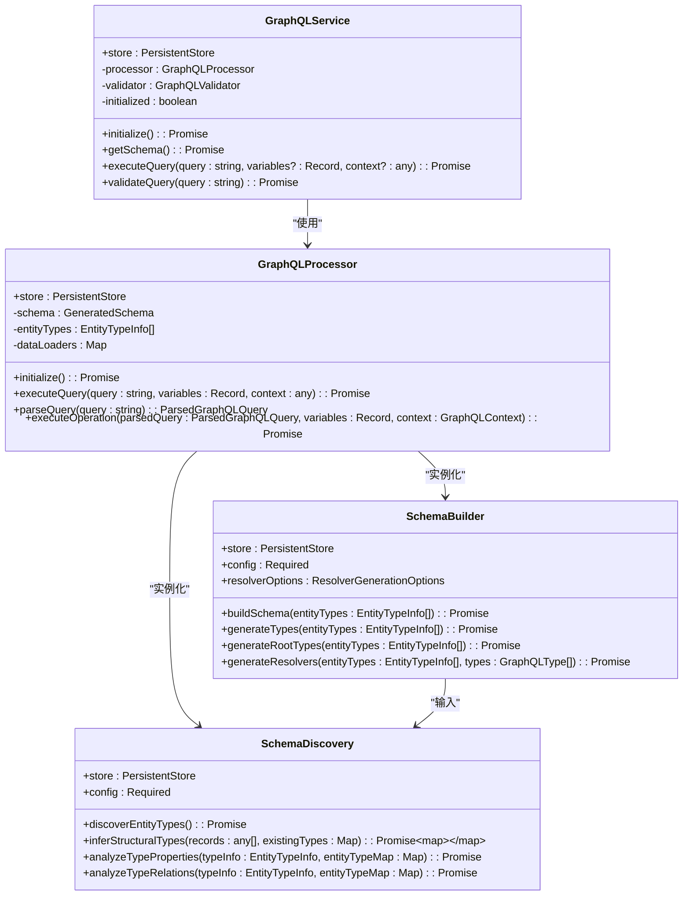
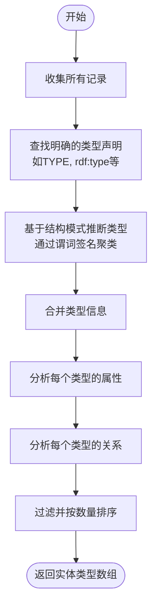
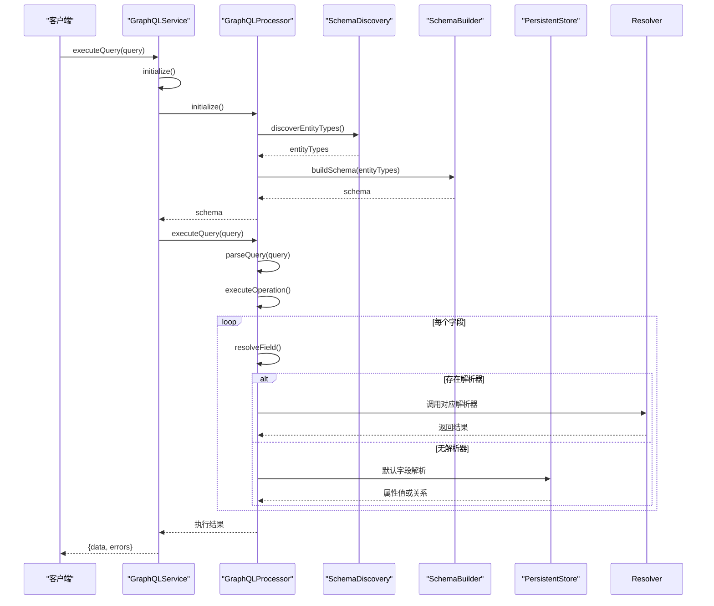
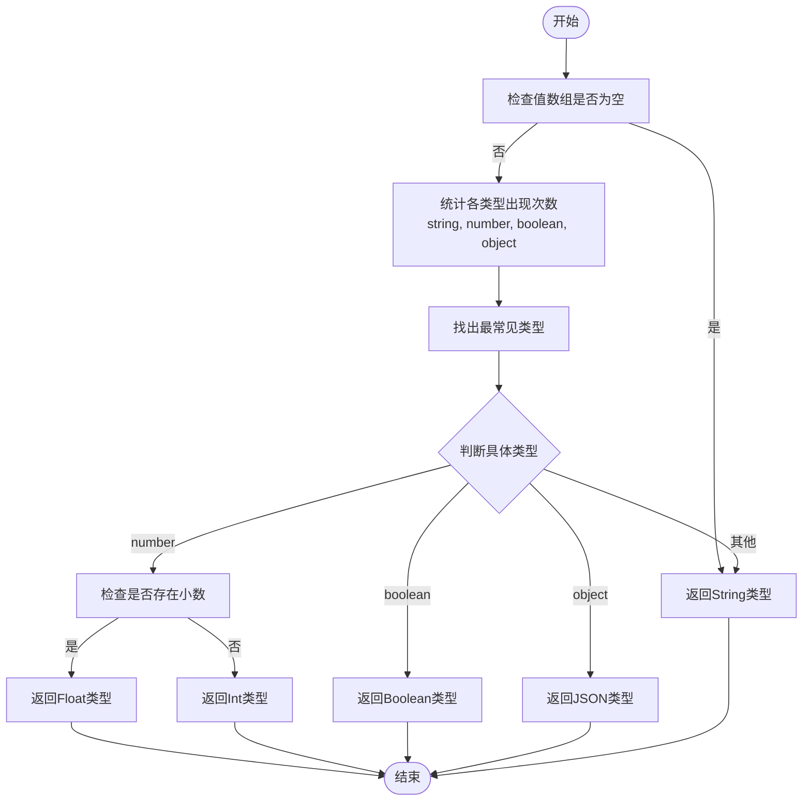
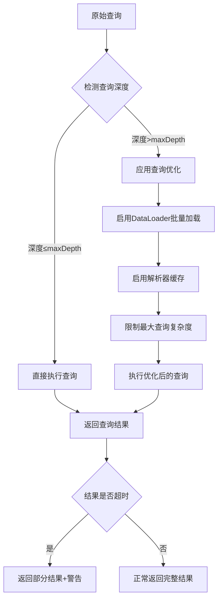
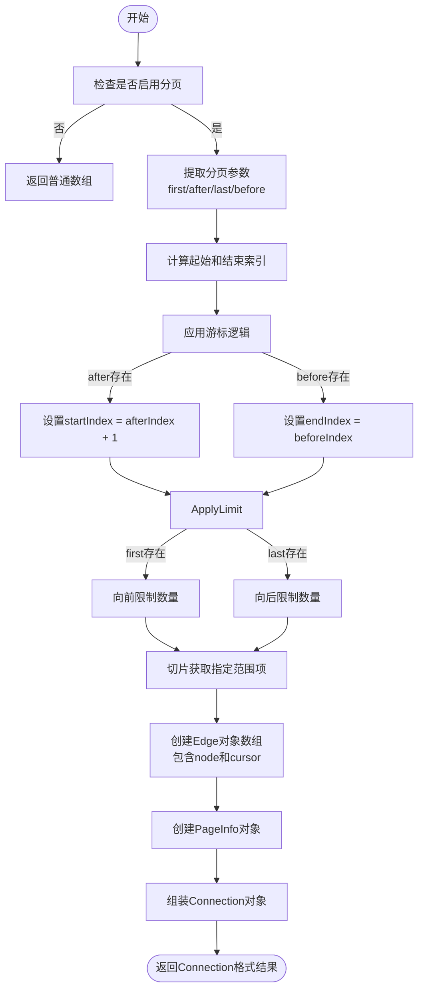
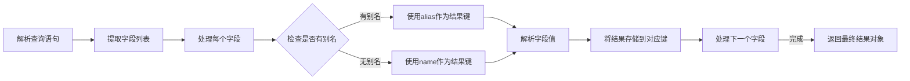
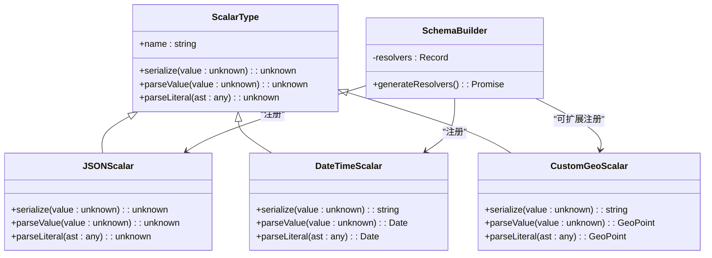

# GraphQL查询接口

<cite>
**本文档引用文件**  
- [processor.ts](file://src/query/graphql/processor.ts)
- [discovery.ts](file://src/query/graphql/discovery.ts)
- [builder.ts](file://src/query/graphql/builder.ts)
- [types.ts](file://src/query/graphql/types.ts)
- [index.ts](file://src/query/graphql/index.ts)
</cite>

## 目录
1. [介绍](#介绍)
2. [核心组件分析](#核心组件分析)
3. [Schema自动发现机制](#schema自动发现机制)
4. [查询处理流程](#查询处理流程)
5. [类型映射与元数据构建](#类型映射与元数据构建)
6. [嵌套关系遍历优化](#嵌套关系遍历优化)
7. [分页与过滤实现](#分页与过滤实现)
8. [别名与联合类型支持](#别名与联合类型支持)
9. [自定义标量类型扩展](#自定义标量类型扩展)

## 介绍
SynapseDB的GraphQL查询接口提供了一套完整的动态Schema生成和查询执行能力，能够从知识图谱中自动推断类型结构并生成相应的API。该系统支持查询优化、缓存和批量加载等高级特性。

## 核心组件分析

### GraphQL处理器架构

**图表来源**
- [processor.ts](file://src/query/graphql/processor.ts#L0-L59)
- [index.ts](file://src/query/graphql/index.ts#L29-L50)
- [discovery.ts](file://src/query/graphql/discovery.ts#L21-L479)
- [builder.ts](file://src/query/graphql/builder.ts#L77-L102)

**本节来源**
- [processor.ts](file://src/query/graphql/processor.ts#L0-L638)
- [index.ts](file://src/query/graphql/index.ts#L29-L331)

## Schema自动发现机制

### 实体类型发现流程

**图表来源**
- [discovery.ts](file://src/query/graphql/discovery.ts#L21-L479)

**本节来源**
- [discovery.ts](file://src/query/graphql/discovery.ts#L21-L479)

## 查询处理流程

### GraphQL查询执行序列

**图表来源**
- [processor.ts](file://src/query/graphql/processor.ts#L107-L134)
- [index.ts](file://src/query/graphql/index.ts#L124-L150)

**本节来源**
- [processor.ts](file://src/query/graphql/processor.ts#L107-L338)
- [index.ts](file://src/query/graphql/index.ts#L124-L150)

## 类型映射与元数据构建

### 值类型推断逻辑

**图表来源**
- [discovery.ts](file://src/query/graphql/discovery.ts#L385-L418)

**本节来源**
- [discovery.ts](file://src/query/graphql/discovery.ts#L385-L418)
- [types.ts](file://src/query/graphql/types.ts#L1-L256)

## 嵌套关系遍历优化

### 深度查询优化策略

**图表来源**
- [processor.ts](file://src/query/graphql/processor.ts#L288-L331)
- [index.ts](file://src/query/graphql/index.ts#L295-L302)

**本节来源**
- [processor.ts](file://src/query/graphql/processor.ts#L288-L331)
- [index.ts](file://src/query/graphql/index.ts#L295-L302)

## 分页与过滤实现

### 分页参数处理逻辑

**图表来源**
- [builder.ts](file://src/query/graphql/builder.ts#L791-L834)

**本节来源**
- [builder.ts](file://src/query/graphql/builder.ts#L791-L834)
- [index.ts](file://src/query/graphql/index.ts#L61-L113)

## 别名与联合类型支持

### 字段别名处理流程

**本节来源**
- [processor.ts](file://src/query/graphql/processor.ts#L298-L338)
- [types.ts](file://src/query/graphql/types.ts#L185-L195)

## 自定义标量类型扩展

### 标量类型注册机制

**本节来源**
- [builder.ts](file://src/query/graphql/builder.ts#L77-L102)
- [types.ts](file://src/query/graphql/types.ts#L1-L256)