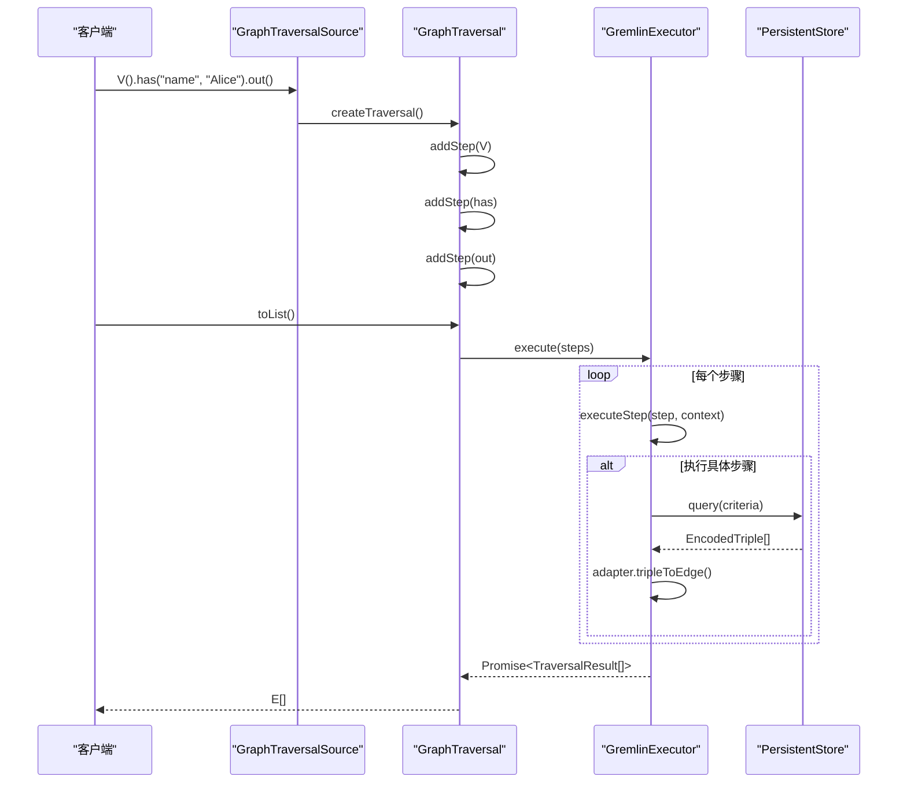
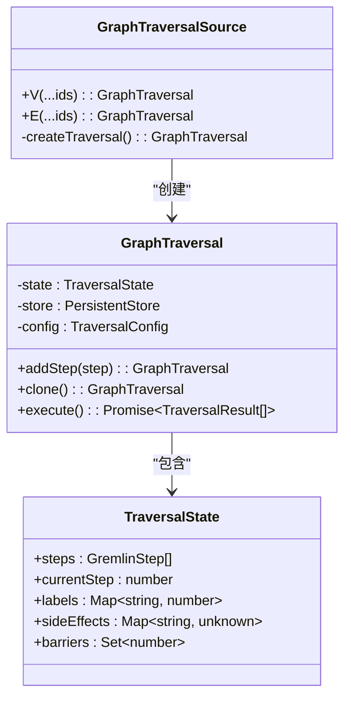
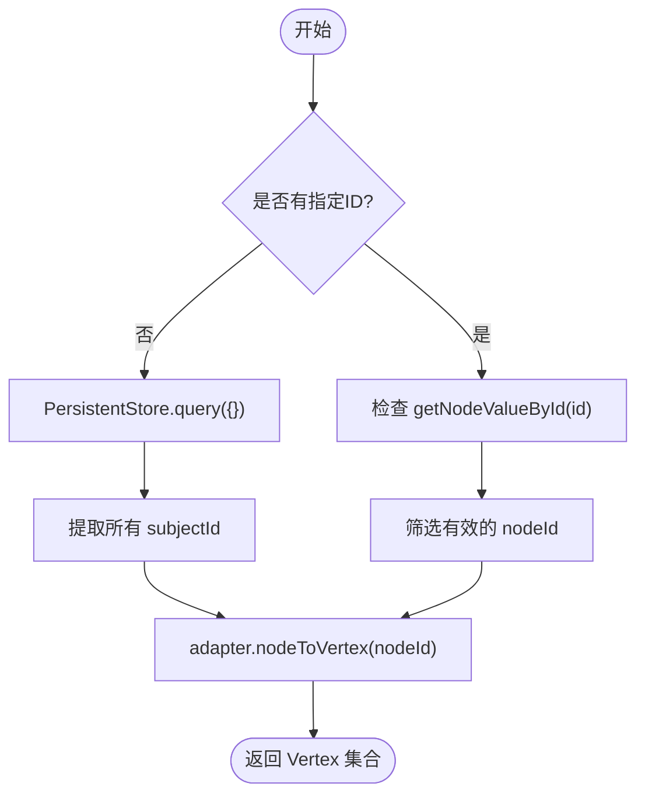
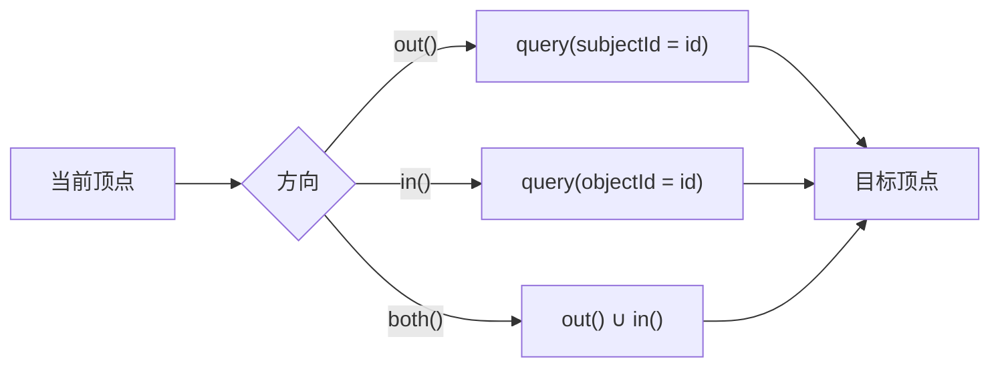

# Gremlin查询接口

<cite>
**本文档引用的文件**
- [traversal.ts](file://src/query/gremlin/traversal.ts)
- [source.ts](file://src/query/gremlin/source.ts)
- [executor.ts](file://src/query/gremlin/executor.ts)
- [step.ts](file://src/query/gremlin/step.ts)
- [types.ts](file://src/query/gremlin/types.ts)
- [persistentStore.ts](file://src/storage/persistentStore.ts)
- [tripleStore.ts](file://src/storage/tripleStore.ts)
</cite>

## 目录
1. [引言](#引言)
2. [遍历执行模型](#遍历执行模型)
3. [Traversal实例构建与Step链注册](#traversal实例构建与step链注册)
4. [起点源初始化与TripleStore交互](#起点源初始化与triplestore交互)
5. [常用步骤实现原理](#常用步骤实现原理)
6. [终端操作与惰性求值](#终端操作与惰性求值)
7. [性能优化建议](#性能优化建议)
8. [结论](#结论)

## 引言

本技术文档系统阐述SynapseDB中Gremlin查询接口的核心执行机制。文档详细解析了`GraphTraversal`类如何通过方法链构建查询计划，以及`GremlinExecutor`如何将这些步骤转换为对底层存储引擎的实际查询。重点说明了从V()/E()起点开始的查询上下文初始化过程、常见遍历步骤（如has()、out()、in()等）的内部实现逻辑，特别是路径追踪和唯一性约束的维护方式。同时，文档还解释了toList()等终端操作如何触发惰性求值，并提供了关于使用limit()提前裁剪结果集以避免全图扫描的性能优化建议。

## 遍历执行模型

SynapseDB的Gremlin查询采用基于方法链的流式API和惰性求值模型。整个执行流程始于`GraphTraversalSource`，它作为所有遍历的入口点。用户通过调用`V()`或`E()`方法创建一个`GraphTraversal`实例，该实例封装了当前的查询状态和一系列待执行的步骤。

每个遍历步骤（如`has()`、`out()`）并不立即执行，而是通过`addStep`方法将对应的指令添加到一个内部的步骤链（`steps`数组）中。这种设计实现了查询的延迟编译和执行。只有当遇到终端操作（如`toList()`）时，才会触发实际的数据检索过程。

此时，`GraphTraversal`会延迟导入并实例化`GremlinExecutor`，将完整的步骤链传递给它。`GremlinExecutor`负责遍历步骤列表，根据每一步的类型（`type`字段）调用相应的执行方法，逐步推进查询状态，最终生成结果集。这种分离的设计使得查询构建与执行解耦，支持复杂的查询优化和流式处理。

**图表来源**
- [source.ts](file://src/query/gremlin/source.ts#L37-L271)
- [traversal.ts](file://src/query/gremlin/traversal.ts#L40-L545)
- [executor.ts](file://src/query/gremlin/executor.ts#L97-L799)
- [persistentStore.ts](file://src/storage/persistentStore.ts#L61-L1633)

**章节来源**
- [source.ts](file://src/query/gremlin/source.ts#L37-L271)
- [traversal.ts](file://src/query/gremlin/traversal.ts#L40-L545)

## Traversal实例构建与Step链注册

`GraphTraversal`实例的构建始于`GraphTraversalSource`的`V()`或`E()`方法。这些方法首先调用私有方法`createTraversal()`来创建一个新的`GraphTraversal`对象，并传入一个空的初始步骤列表和从`TraversalSourceConfig`继承的配置。

**图表来源**
- [source.ts](file://src/query/gremlin/source.ts#L37-L271)
- [traversal.ts](file://src/query/gremlin/traversal.ts#L40-L545)

**章节来源**
- [source.ts](file://src/query/gremlin/source.ts#L69-L78)
- [traversal.ts](file://src/query/gremlin/traversal.ts#L40-L545)

每当在`GraphTraversal`实例上调用一个遍历方法（如`has()`、`out()`），都会触发`addStep`方法。`addStep`是构建步骤链的核心。它首先克隆当前的`GraphTraversal`实例，确保原实例的状态不变，从而保证了遍历的不可变性。然后，它创建一个代表当前操作的`GremlinStep`对象（例如，一个`HasStep`或`OutStep`），将其推入新实例的`steps`数组中，并重置编译和结果缓存标志。最后，返回这个新的、已更新的`GraphTraversal`实例，允许链式调用继续进行。

这种“克隆-修改-返回”的模式确保了每次调用都产生一个独立的新遍历实例，这对于支持分支查询（如`union()`）和保持函数式编程风格至关重要。

## 起点源初始化与TripleStore交互

查询的起点由`V()`和`E()`步骤定义，它们直接与`PersistentStore`交互以获取初始记录集。当`GremlinExecutor`执行`V()`步骤时，其行为取决于是否指定了顶点ID。

如果未指定ID（即`g.V()`），则需要获取图中的所有顶点。执行器会调用`PersistentStore.query({})`来获取所有三元组，然后通过提取所有唯一的`subjectId`来确定顶点集合。对于每一个`subjectId`，它使用`ElementAdapter.nodeToVertex()`方法将其转换为符合Gremlin规范的`Vertex`对象。此方法不仅设置ID和标签，还会查询以该节点为主体的所有出边，将边的谓词和对象值作为属性附加到顶点上，从而丰富了顶点的表示。

如果指定了ID（即`g.V(1)`），则执行器会直接检查这些ID对应节点的存在性。它通过`getNodeValueById`确认节点有效后，再调用`nodeToVertex`进行转换。

类似地，`E()`步骤用于获取边。它同样通过`query({})`获取所有三元组，然后对每一个三元组调用`ElementAdapter.tripleToEdge()`，将其转换为`Edge`对象。该对象包含了边的ID（通常由主体、谓词、客体ID组合而成）、标签（来自谓词值）以及指向入顶点和出顶点的引用。

**图表来源**
- [executor.ts](file://src/query/gremlin/executor.ts#L285-L350)
- [persistentStore.ts](file://src/storage/persistentStore.ts#L61-L1633)
- [tripleStore.ts](file://src/storage/tripleStore.ts#L1-L71)

**章节来源**
- [executor.ts](file://src/query/gremlin/executor.ts#L285-L350)

## 常用步骤实现原理

### has() 步骤

`has()`步骤用于根据属性过滤元素。在`GraphTraversal`中，`has()`方法根据参数的不同重载形式，构造一个`HasStep`对象并将其加入步骤链。当`GremlinExecutor`执行此步骤时，它会遍历当前上下文中的每个元素。

对于顶点，执行器会检查其属性是否满足条件。这通过查询`PersistentStore`中是否存在特定的三元组来实现。例如，`has('name', 'Alice')`会被转换为查询`{ subjectId: vertex.id, predicateId: 'name' }`，然后检查返回的记录中是否有`objectValue`等于'Alice'的。如果存在匹配，则该顶点被保留在结果集中。对于更复杂的谓词（如范围比较），执行器会调用`evaluatePredicate`函数进行评估。

### out(), in(), both() 步骤

这些步骤用于沿边进行图遍历。
- `out()`：从当前顶点出发，查找所有以该顶点为主体的出边，并返回这些边所指向的客体顶点。执行器通过`query({ subjectId: currentVertex.id })`获取出边记录。
- `in()`：查找所有以当前顶点为客体的入边，并返回这些边的主体顶点。执行器通过`query({ objectId: currentVertex.id })`获取入边记录。
- `both()`：简单地合并`out()`和`in()`的结果，返回所有相邻的顶点。

当指定了边标签（如`out('knows')`）时，执行器会先通过`getNodeIdByValue(label)`将标签字符串转换为内部ID，然后将其作为`predicateId`添加到查询条件中，从而实现高效的索引查找。

**图表来源**
- [executor.ts](file://src/query/gremlin/executor.ts#L352-L467)

**章节来源**
- [traversal.ts](file://src/query/gremlin/traversal.ts#L92-L120)
- [executor.ts](file://src/query/gremlin/executor.ts#L352-L467)

### 路径追踪与唯一性约束

路径追踪功能由`withPath()`配置启用，它会在`TraversalConfig.requirements`中添加'path'标记。在执行过程中，`ExecutionContext`维护一个`pathHistory`映射，记录从起点到当前元素的完整路径。每当一个元素被处理时，其路径信息会被更新。

唯一性约束（如`dedup()`步骤）的维护依赖于`ExecutionContext`中的`seen`集合。`dedup()`步骤会遍历当前元素，使用`getElementKey(element)`生成一个唯一键（通常是元素ID）。只有当该键不在`seen`集合中时，元素才会被添加到结果集中，从而确保了结果的唯一性。

## 终端操作与惰性求值

终端操作（Terminal Step）是触发整个查询惰性求值的关键。`toList()`是最典型的终端操作。当被调用时，它首先检查`this.results`缓存和`this.compiled`标志。如果查询已经执行过