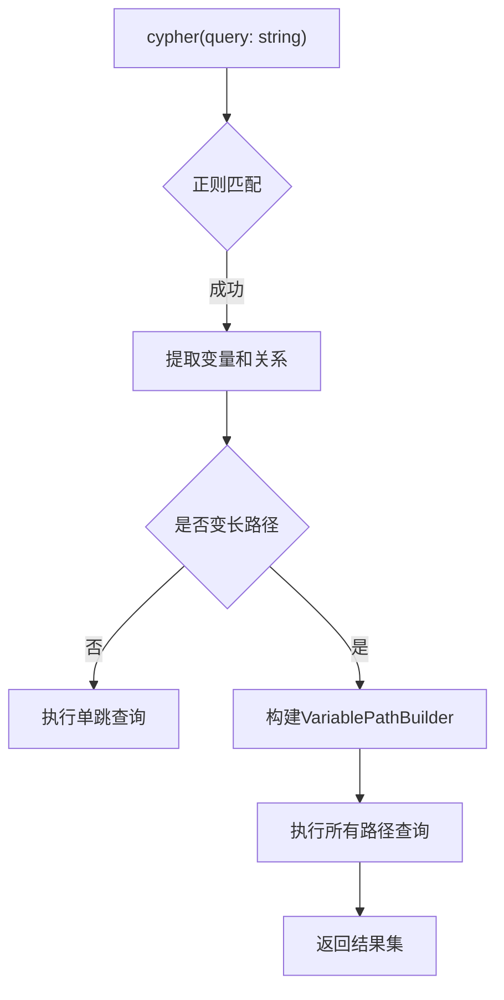
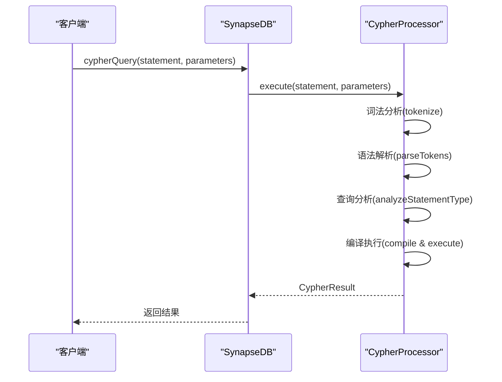
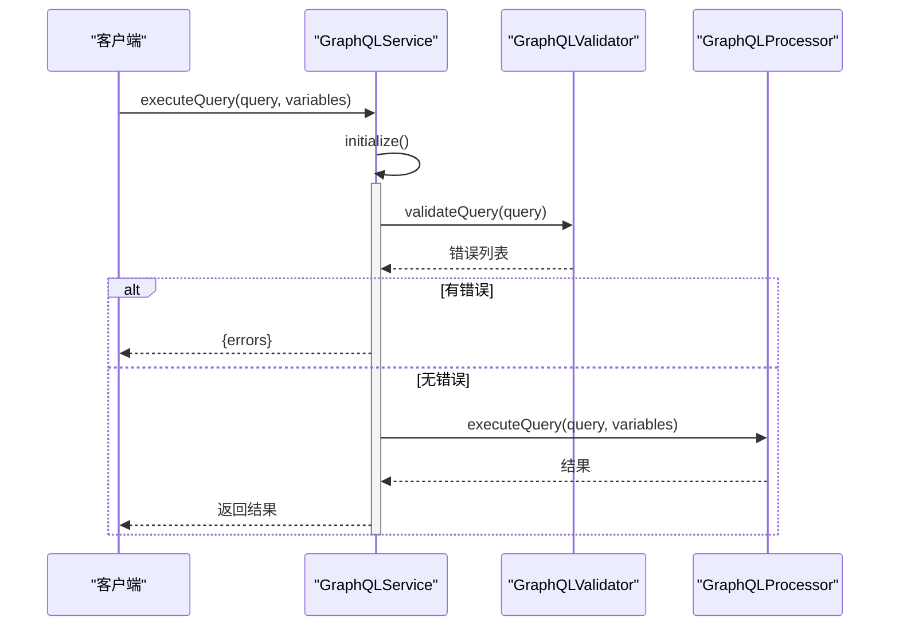
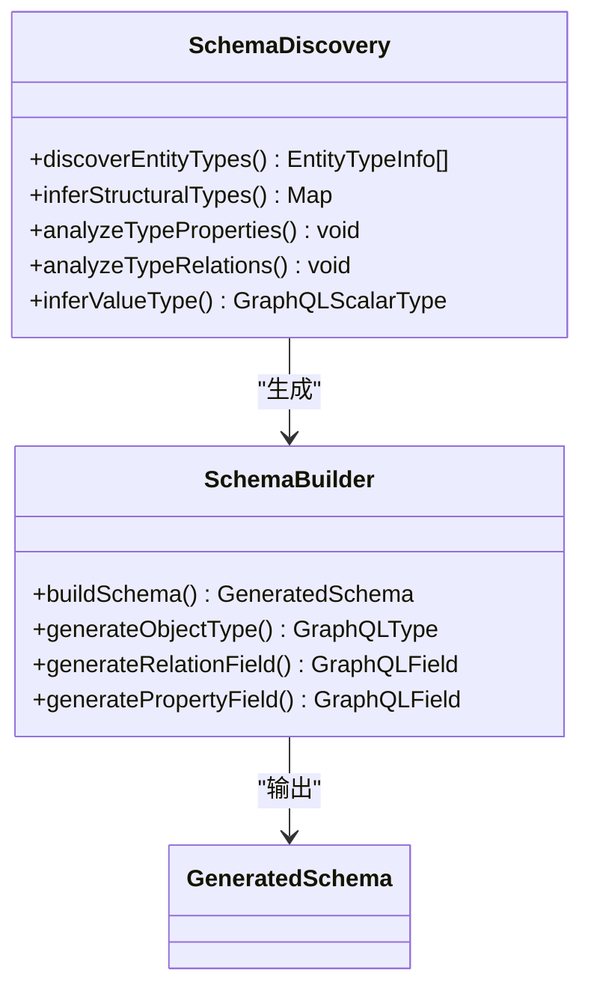
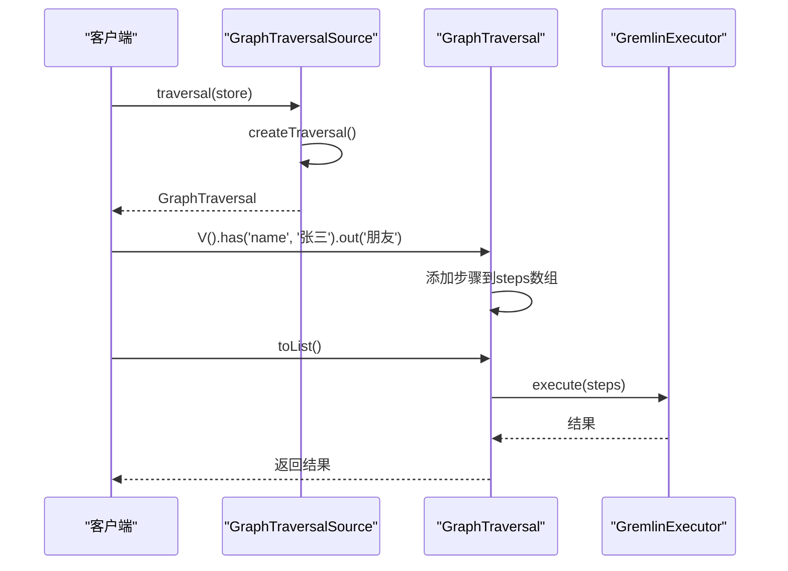
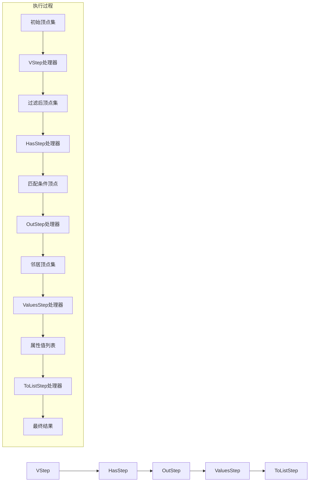

# 扩展查询API

<cite>
**本文档引用文件**   
- [synapseDb.ts](file://src/synapseDb.ts)
- [cypher.ts](file://src/query/cypher.ts)
- [aggregation.ts](file://src/query/aggregation.ts)
- [pattern/index.ts](file://src/query/pattern/index.ts)
- [pattern/compiler.ts](file://src/query/pattern/compiler.ts)
- [pattern/match.ts](file://src/query/pattern/match.ts)
- [path/variable.ts](file://src/query/path/variable.ts)
- [path/bidirectional.ts](file://src/query/path/bidirectional.ts)
- [path/astar.ts](file://src/query/path/astar.ts)
- [graphql/index.ts](file://src/query/graphql/index.ts)
- [graphql/builder.ts](file://src/query/graphql/builder.ts)
- [graphql/discovery.ts](file://src/query/graphql/discovery.ts)
- [gremlin/index.ts](file://src/query/gremlin/index.ts)
- [gremlin/source.ts](file://src/query/gremlin/source.ts)
</cite>

## 目录
1. [多语言查询接口概述](#多语言查询接口概述)
2. [Cypher查询语言支持](#cypher查询语言支持)
3. [GraphQL查询语言支持](#graphql查询语言支持)
4. [Gremlin查询语言支持](#gremlin查询语言支持)
5. [路径查找算法API](#路径查找算法api)
6. [聚合管道与模式匹配](#聚合管道与模式匹配)

## 多语言查询接口概述

SynapseDB提供对Cypher、GraphQL和Gremlin三种主流图查询语言的全面支持，允许开发者根据应用场景选择最适合的查询方式。系统通过统一的存储引擎为不同查询语言提供一致的数据访问能力，同时保持各语言特有的表达优势。

**Section sources**
- [synapseDb.ts](file://src/synapseDb.ts#L805-L896)
- [cypher.ts](file://src/query/cypher.ts#L222-L240)

## Cypher查询语言支持

### 同步cypher()极简实现

`cypher()`方法提供了一个极简的同步Cypher查询接口，仅支持最基础的MATCH-RETURN语法模式。该实现直接在内存中解析和执行查询，适用于简单场景下的快速数据检索。



**Diagram sources **
- [synapseDb.ts](file://src/synapseDb.ts#L805-L859)

### 异步cypherQuery/cypherRead标准接口

`cypherQuery`和`cypherRead`提供了完整的异步Cypher查询能力，基于词法分析、语法解析、编译执行的完整处理流程。两者主要区别在于：

- `cypherQuery`: 通用查询接口，可执行读写操作
- `cypherRead`: 只读查询接口，确保查询不会修改数据

两种接口均返回`CypherResult`对象，包含记录集、执行摘要和统计信息。



**Diagram sources **
- [synapseDb.ts](file://src/synapseDb.ts#L869-L888)
- [cypher.ts](file://src/query/cypher.ts#L222-L235)

### 参数绑定与只读执行

Cypher接口支持参数化查询，通过`parameters`参数传递参数值，有效防止SQL注入并提高查询性能。`cypherRead`方法通过设置`readonly: true`选项强制只读执行，当检测到写操作时会抛出异常。

**Section sources**
- [cypher.ts](file://src/query/cypher.ts#L222-L235)
- [cypher.ts](file://src/query/cypher.ts#L240-L240)

### 缓存管理机制

系统实现了查询优化器缓存，可通过以下方法进行管理：
- `clearOptimizationCache()`: 清理查询计划缓存
- `getOptimizerStats()`: 获取优化器统计信息
- `warmUpOptimizer()`: 预热查询优化器

这些方法有助于在生产环境中优化查询性能和资源使用。

**Section sources**
- [cypher.ts](file://src/query/cypher.ts#L240-L240)

### validateCypher语法验证工具

`validateCypher`方法提供独立的Cypher语法验证功能，可用于前端输入验证或查询预检。该方法返回包含`valid`布尔值和`errors`字符串数组的对象，便于集成到各种开发工作流中。

```mermaid
flowchart TD
A["validateCypher(statement)"] --> B[创建Lexer]
B --> C[分词(tokenize)]
C --> D{是否有错误}
D --> |是| E[捕获异常]
E --> F[返回{valid: false, errors}]
D --> |否| G[创建Parser]
G --> H[解析tokens]
H --> I{是否有错误}
I --> |是| J[捕获异常]
J --> K[返回{valid: false, errors}]
I --> |否| L[返回{valid: true, errors: []}]
```

**Diagram sources **
- [synapseDb.ts](file://src/synapseDb.ts#L893-L896)
- [cypher.ts](file://src/query/cypher.ts#L240-L240)

## GraphQL查询语言支持

### graphqlQuery入口函数

`graphqlQuery`入口函数提供GraphQL查询执行能力，其处理流程包括：
1. 初始化服务（首次调用时）
2. 查询语法验证
3. 执行查询
4. 返回结果

该函数自动处理Schema生成和更新，确保始终反映最新的数据结构。



**Diagram sources **
- [graphql/index.ts](file://src/query/graphql/index.ts#L178-L230)

### 类型映射规则

GraphQL Schema生成器采用以下类型映射规则：
- 字符串值 → String
- 整数值 → Int
- 浮点数值 → Float  
- 布尔值 → Boolean
- 对象值 → JSON

属性名称转换支持camelCase和snake_case等命名规范，可通过配置进行调整。



**Diagram sources **
- [graphql/discovery.ts](file://src/query/graphql/discovery.ts#L22-L480)
- [graphql/builder.ts](file://src/query/graphql/builder.ts#L22-L799)

## Gremlin查询语言支持

### gremlinQuery遍历执行模型

Gremlin查询通过`GraphTraversalSource`启动，构建链式遍历管道。每个步骤添加到`steps`数组中，最终由`GremlinExecutor`执行。



**Diagram sources **
- [gremlin/source.ts](file://src/query/gremlin/source.ts#L22-L289)
- [gremlin/index.ts](file://src/query/gremlin/index.ts#L22-L283)

### 步骤处理器链

Gremlin实现采用步骤处理器链模式，每个步骤类型对应特定的处理器。执行时按顺序应用每个处理器，逐步转换结果集。



**Diagram sources **
- [gremlin/source.ts](file://src/query/gremlin/source.ts#L22-L289)

## 路径查找算法API

### BFS单向搜索

`shortestPath`