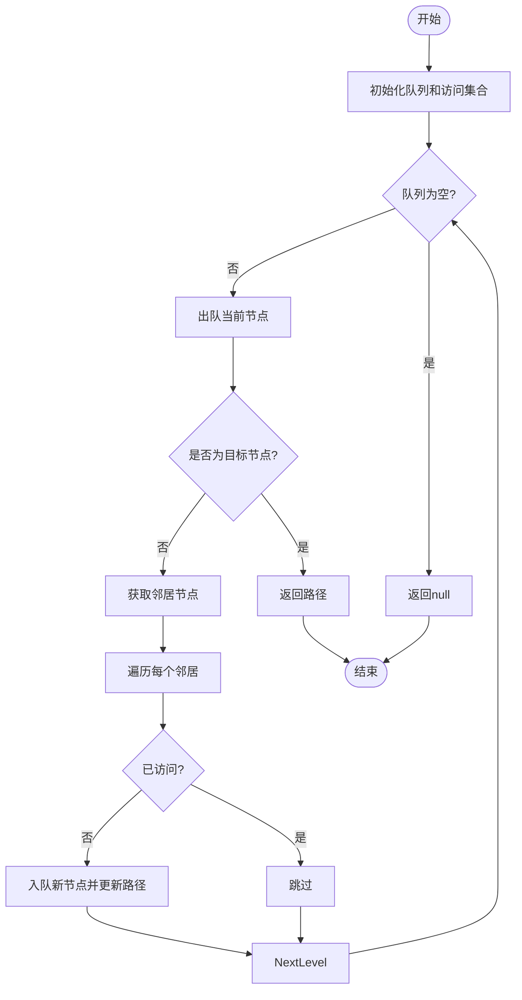
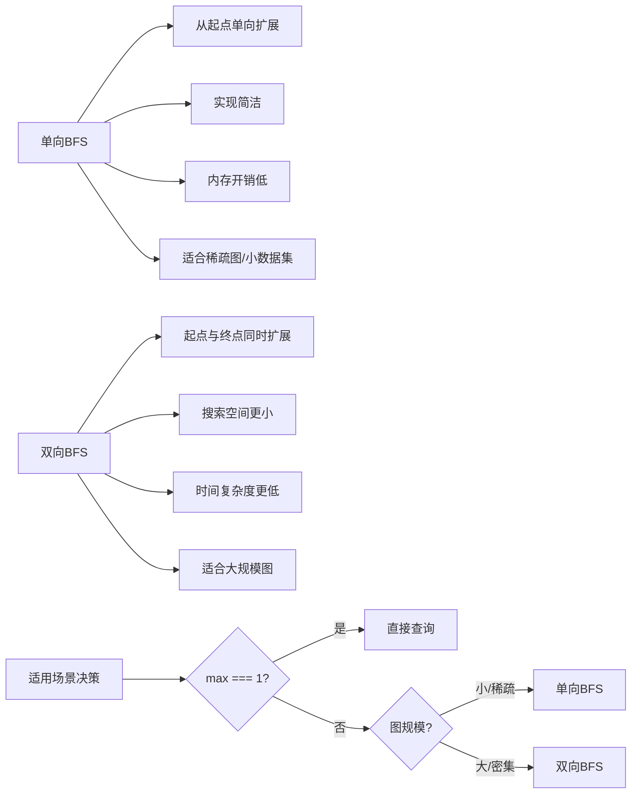
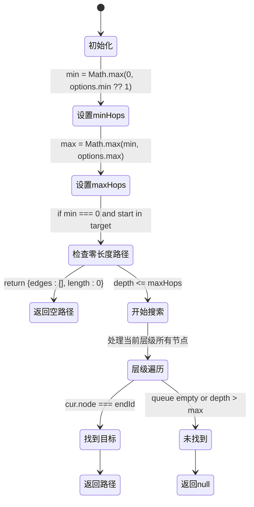
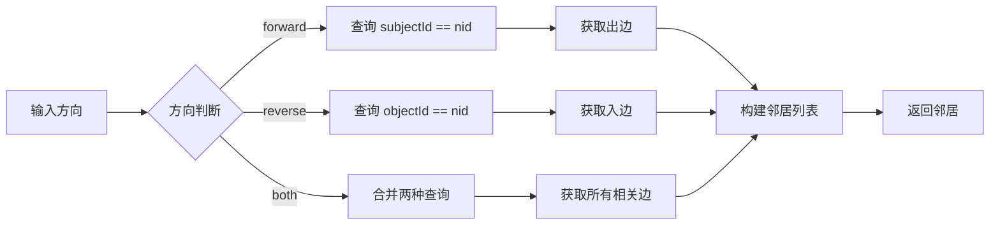

# 最短路径算法

<cite>
**本文档引用的文件**
- [synapseDb.ts](file://src/synapseDb.ts#L513-L577)
- [bidirectionalSimple.ts](file://src/query/path/bidirectionalSimple.ts#L15-L148)
- [variable.ts](file://src/query/path/variable.ts#L5-L22)
</cite>

## 目录
1. [简介](#简介)
2. [核心实现机制](#核心实现机制)
3. [单向BFS与双向BFS对比分析](#单向bfs与双向bfs对比分析)
4. [路径约束参数解析](#路径约束参数解析)
5. [方向选项对邻居扩展的影响](#方向选项对邻居扩展的影响)
6. [路径构建过程与空值语义](#路径构建过程与空值语义)
7. [优化策略与自适应选择机制](#优化策略与自适应选择机制)

## 简介
SynapseDB中的最短路径查找功能基于广度优先搜索（BFS）算法实现，支持灵活的路径约束和方向控制。系统通过`shortestPath`方法提供基础路径查询能力，并结合多种优化策略在不同场景下自动选择最优算法。该机制适用于稀疏图或小规模数据集，在保证简洁性的同时确保高效的路径发现性能。

## 核心实现机制
最短路径查找的核心是广度优先搜索（BFS），其工作流程包括队列管理、访问集合控制和层级遍历逻辑。算法从起始节点开始，逐层扩展邻居节点，直到找到目标节点或达到最大跳数限制。

在`SynapseDB.shortestPath`方法中，使用一个队列存储待探索的节点及其路径信息，并用`visited`集合记录已访问的节点以避免重复处理。每一轮循环处理当前层级的所有节点，依次检查其邻居并加入队列，同时更新路径。当某个节点等于目标节点时，立即返回对应的路径结果。



**图表来源**
- [synapseDb.ts](file://src/synapseDb.ts#L513-L577)

**本节来源**
- [synapseDb.ts](file://src/synapseDb.ts#L513-L577)

## 单向BFS与双向BFS对比分析
单向BFS从起始节点向目标节点单向扩展，适合稀疏图或小规模数据集，因其实现简单且内存开销较低。而双向BFS同时从起始节点和目标节点双向扩展，显著减少搜索空间，时间复杂度由O(b^d)降低至O(b^(d/2))，其中b为分支因子，d为深度。

在小图或简单路径场景下，双向BFS的额外复杂性和维护成本可能超过其性能收益。因此，系统在`SimpleBidirectionalPathBuilder`中采用自适应策略：当最大跳数为1时直接进行一步查询；否则回退到标准单向BFS实现，避免不必要的复杂性。



**图表来源**
- [bidirectionalSimple.ts](file://src/query/path/bidirectionalSimple.ts#L36-L63)
- [bidirectional.ts](file://src/query/path/bidirectional.ts#L61-L146)

**本节来源**
- [bidirectionalSimple.ts](file://src/query/path/bidirectionalSimple.ts#L36-L63)
- [bidirectional.ts](file://src/query/path/bidirectional.ts#L61-L146)

## 路径约束参数解析
`minHops`和`maxHops`参数用于约束路径长度。`minHops`定义了路径的最小跳数，若未指定则默认为1；`maxHops`定义了最大跳数限制，防止无限扩展，默认值为8。

在`VariablePathOptions`接口中，`min`字段可选，`max`字段必填。系统通过`Math.max(1, options?.maxHops ?? 8)`确保最大跳数至少为1。当实际路径长度超出`maxHops`限制时，算法将提前终止并返回null，表示未找到符合条件的路径。



**图表来源**
- [variable.ts](file://src/query/path/variable.ts#L5-L10)
- [synapseDb.ts](file://src/synapseDb.ts#L513-L577)

**本节来源**
- [variable.ts](file://src/query/path/variable.ts#L5-L10)
- [synapseDb.ts](file://src/synapseDb.ts#L513-L577)

## 方向选项对邻居扩展的影响
`direction`选项控制邻居节点的扩展方向，支持`forward`（正向）、`reverse`（反向）和`both`（双向）三种模式。正向扩展基于主语ID匹配，反向扩展基于宾语ID匹配，双向则两者兼有。

在`qNeighbors`函数中，根据`dir`值决定查询条件：`forward`时使用`{subjectId: nid}`，`reverse`时使用`{objectId: nid}`，`both`时合并两种条件。这使得算法能够灵活应对不同类型的图遍历需求，如仅追踪关系发出者、接收者或两者之间的连接。



**图表来源**
- [synapseDb.ts](file://src/synapseDb.ts#L513-L577)

**本节来源**
- [synapseDb.ts](file://src/synapseDb.ts#L513-L577)

## 路径构建过程与空值语义
路径构建过程始于起始节点，通过队列逐层扩展，记录每个节点到达路径。当发现目标节点时，立即返回累积的边序列。若队列为空仍未找到目标，则返回null，表示不存在满足条件的路径。

返回null具有明确语义：即在给定约束条件下无法建立从起始节点到目标节点的有效路径。这种设计使调用方能清晰区分“无路径”与“空路径”（零跳数路径），后者仅在起始节点与目标节点相同时发生，并返回空边数组而非null。

```mermaid
sequenceDiagram
    participant Client
    participant BFS as BFS引擎
    participant Store as 存储层
    Client->>BFS: "shortestPath(from, to, options)"
    BFS->>Store: "getNodeIdByValue(from/to)"
    Store-->>BFS: "nodeId 或 undefined"
    alt 节点不存在
        BFS-->>Client: "null"
    else 继续执行
        BFS->>BFS: "初始化队列[{node : start, path : []}]"
        loop 按层级遍历
            BFS->>BFS: "取出当前节点"
            BFS->>Store: "query 邻居"
            Store-->>BFS: "FactRecord[]"
            loop 遍历邻居
                BFS->>BFS: "计算下一节点"
                alt 已访问?
                    BFS->>BFS: "跳过"
                else 新节点
                    BFS->>BFS: "入队并更新路径"
                end
                alt 下一节点==目标?
                    BFS-->>Client: "返回path"
                    deactivate BFS
                end
            end
        end
        BFS-->>Client: "null"
    end
```

**图表来源**
- [synapseDb.ts](file://src/synapseDb.ts#L513-L577)

**本节来源**
- [synapseDb.ts](file://src/synapseDb.ts#L513-L577)

## 优化策略与自适应选择机制
系统在`SimpleBidirectionalPathBuilder`中实现了智能优化策略：当`max===1`时退化为直接查询，避免完整BFS的开销。