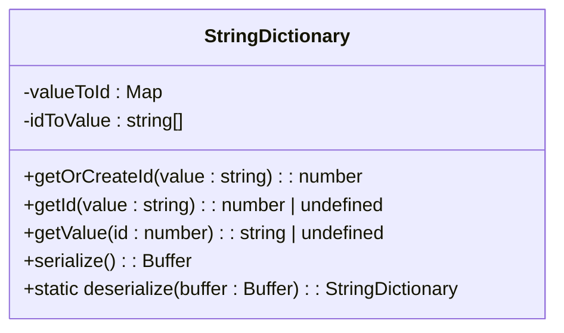

# 元数据查询

<cite>
**本文档引用的文件**  
- [synapseDb.ts](file://src/synapseDb.ts)
- [persistentStore.ts](file://src/storage/persistentStore.ts)
- [dictionary.ts](file://src/storage/dictionary.ts)
</cite>

## 目录
1. [简介](#简介)
2. [ID映射机制原理](#id映射机制原理)
3. [字典模块设计与管理](#字典模块设计与管理)
4. [性能优势分析](#性能优势分析)
5. [典型使用场景](#典型使用场景)
6. [风险与应对措施](#风险与应对措施)

## 简介
`getNodeId` 和 `getNodeValue` 方法是 SynapseDB 中用于元数据查询的核心接口，它们实现了字符串值与内部整数 ID 之间的双向映射。该机制基于全局唯一的字典系统，将频繁出现的字符串（如节点名称、谓词等）转换为紧凑的整数标识符，从而在存储和查询过程中显著提升效率。

这种映射不仅减少了内存占用，还加速了比较操作，因为整数比较远快于字符串比较。此外，通过集中管理所有字符串到 ID 的映射关系，系统能够支持高效的反向查找，并在整个图遍历过程中保持高性能。

本文档详细解释这一机制的工作原理、实现细节、性能优势以及潜在风险。

**Section sources**
- [synapseDb.ts](file://src/synapseDb.ts#L180-L186)

## ID映射机制原理
`getNodeId(value: string)` 和 `getNodeValue(id: number)` 构成了一个双向字典映射系统：

- **`getNodeId`**：接收一个字符串值，返回其对应的唯一整数 ID。如果该字符串尚未注册，则为其分配一个新的 ID。
- **`getNodeValue`**：接收一个整数 ID，返回其对应的原始字符串值。

这两个方法并不直接维护映射逻辑，而是委托给底层的 `PersistentStore` 实例中的 `dictionary` 模块处理：

```ts
getNodeId(value: string): number | undefined {
  return this.store.getNodeIdByValue(value);
}

getNodeValue(id: number): string | undefined {
  return this.store.getNodeValueById(id);
}
```

最终调用的是 `StringDictionary` 类的 `getId` 和 `getValue` 方法，分别从 `Map<string, number>` 和 `string[]` 数组中进行查找。

此设计确保了无论是在添加事实（fact）、查询还是删除操作中，都能快速完成字符串与 ID 的互转，避免重复存储相同字符串带来的空间浪费。

**Section sources**
- [synapseDb.ts](file://src/synapseDb.ts#L180-L186)
- [persistentStore.ts](file://src/storage/persistentStore.ts#L640-L646)

## 字典模块设计与管理
核心映射功能由 `StringDictionary` 类实现，位于 `src/storage/dictionary.ts` 文件中。该类采用双结构存储策略以实现高效双向查找：



**Diagram sources**
- [dictionary.ts](file://src/storage/dictionary.ts#L5-L79)

### 双向映射结构
- **`valueToId: Map<string, number>`**：哈希表结构，用于将字符串映射到其唯一 ID，支持 O(1) 时间复杂度的查找。
- **`idToValue: string[]`**：数组结构，索引即为 ID，值为对应字符串，实现 O(1) 的反向查找。

新字符串通过 `getOrCreateId` 方法插入：
1. 首先检查是否已存在（利用 `valueToId.get()`）
2. 若不存在，则使用当前数组长度作为新 ID
3. 将字符串推入 `idToValue` 数组，并在 `valueToId` 中建立映射

这种方法保证了 ID 的连续性和唯一性，同时避免了手动管理 ID 分配的复杂性。

### 序列化与持久化
字典支持完整的序列化（`serialize`）和反序列化（`deserialize`）能力，使其状态可在数据库启动/关闭时保存和恢复。序列化格式包含：
- 条目总数（4 字节）
- 每个条目的长度前缀 + UTF-8 编码内容

这使得字典可以在不同会话间保持一致性，且不影响系统的整体持久化特性。

**Section sources**
- [dictionary.ts](file://src/storage/dictionary.ts#L5-L79)

## 性能优势分析
ID 映射机制在多个层面提升了系统性能：

### 压缩存储
通过将长字符串替换为短整数，三元组（SPO）在内存和磁盘上的表示更加紧凑。例如，三个字符串 `"Alice"`, `"knows"`, `"Bob"` 被替换为三个整数（如 `1, 2, 3`），大幅减少存储开销。

### 加速比较
整数比较比字符串比较更快，尤其是在大规模图遍历或排序操作中。例如，在索引查找、路径搜索或聚合操作中，使用 ID 可显著降低 CPU 开销。

### 提升缓存命中率
由于整数占用更少内存，更多的数据可以驻留在 CPU 缓存或内存中，从而提高缓存局部性（cache locality）。这对于频繁访问的热点数据尤其重要。

### 减少内存占用
共享字典避免了同一字符串在多个位置重复存储。例如，若 `"Person"` 标签被数千个节点使用，系统只需存储一次该字符串，其余均引用其 ID。

这些优化共同作用，使 SynapseDB 在处理大规模知识图谱时仍能保持高吞吐和低延迟。

**Section sources**
- [synapseDb.ts](file://src/synapseDb.ts#L180-L186)
- [persistentStore.ts](file://src/storage/persistentStore.ts#L640-L646)

## 典型使用场景
### 快速定位实体
通过节点 ID 快速检索实体信息，无需遍历字符串集合：

```ts
const nodeId = db.getNodeId("Alice");
const nodeValue = db.getNodeValue(nodeId); // "Alice"
```

适用于需要根据名称频繁查找节点的应用场景。

### 构建轻量级图结构
在