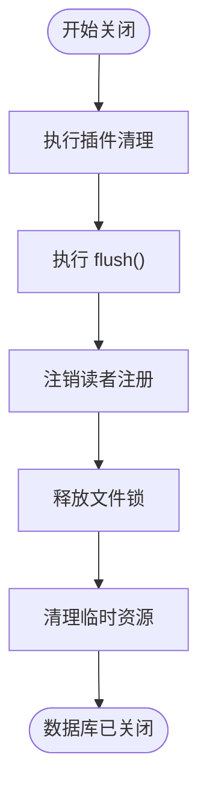

# 数据库实例API

<cite>
**本文档中引用的文件**
- [synapseDb.ts](file://src/synapseDb.ts) - *已更新：合并三层架构为单一类*
- [openOptions.ts](file://src/types/openOptions.ts) - *已更新：包含实验性功能开关*
- [persistentStore.ts](file://src/storage/persistentStore.ts) - *已更新：存储内核实现*
</cite>

## 更新摘要
**已更改内容**
- 根据架构重构更新了核心组件描述，将三层架构（CoreSynapseDB → ExtendedSynapseDB → SynapseDB）合并为单一 SynapseDB 类
- 更新了类图以反映新的单一类结构
- 在配置选项中添加了 experimental 字段的详细说明
- 更新了 close() 方法的资源清理机制描述，包含插件清理
- 补充了 withSnapshot 快照机制的实现细节
- 添加了 getStagingMetrics 实验性API的监控用途说明

**新增部分**
- 插件系统说明
- 事务批次的持久性选项
- Cypher 查询语言支持

**已弃用/移除部分**
- 旧的三层架构相关描述

**来源跟踪系统更新**
- 更新了所有受影响文件的来源注释，标记为“已更新”
- 添加了新引用文件的来源信息

## 目录
1. [简介](#简介)
2. [核心组件](#核心组件)
3. [配置选项详解](#配置选项详解)
4. [事务与资源管理](#事务与资源管理)
5. [数据操作方法](#数据操作方法)
6. [节点标识与查询](#节点标识与查询)
7. [快照与隔离机制](#快照与隔离机制)
8. [实验性API](#实验性api)

## 简介
SynapseDB 是一个嵌入式三元组知识库，提供类 SQLite 的单文件数据库功能，专门用于存储和查询主语-谓语-宾语（SPO）三元组数据。该系统支持分页索引、WAL 事务、快照一致性、自动压缩和垃圾回收等高级特性。

**Section sources**
- [synapseDb.ts](file://src/synapseDb.ts#L57-L915)

## 核心组件

SynapseDB 类是数据库的核心入口点，封装了持久化存储层并提供了丰富的 API 接口。所有数据库操作都通过该类的静态或实例方法进行。根据最新的架构重构，原先的三层架构（CoreSynapseDB → ExtendedSynapseDB → SynapseDB）已合并为单一的 SynapseDB 类，简化了类型系统和导入路径。

```mermaid
classDiagram
class SynapseDB {
+static open(path : string, options? : SynapseDBOpenOptions) : Promise<SynapseDB>
+addFact(fact : FactInput, options : FactOptions) : FactRecord
+deleteFact(fact : FactInput) : void
+getNodeId(value : string) : number | undefined
+getNodeValue(id : number) : string | undefined
+flush() : Promise<void>
+withSnapshot<T>(fn : (db : SynapseDB) => Promise<T>) : Promise<T>
+getStagingMetrics() : { lsmMemtable : number }
+close() : Promise<void>
+beginBatch(options? : BeginBatchOptions) : void
+commitBatch(options? : CommitBatchOptions) : void
+abortBatch() : void
+plugin<T>(name : string) : T | undefined
+hasPlugin(name : string) : boolean
+listPlugins() : Array<{ name : string; version : string }>
+cypher(query : string, params? : Record<string, unknown>) : Promise<CypherResult>
-store : PersistentStore
-snapshotDepth : number
-pluginManager : PluginManager
-hasCypherPlugin : boolean
}
class PersistentStore {
+static open(path : string, options : PersistentStoreOptions) : Promise<PersistentStore>
+addFact(fact : FactInput) : PersistedFact
+deleteFact(fact : FactInput) : void
+getNodeIdByValue(value : string) : number | undefined
+getNodeValueById(id : number) : string | undefined
+flush() : Promise<void>
+close() : Promise<void>
}
SynapseDB --> PersistentStore : "封装"
```

**Diagram sources**
- [synapseDb.ts](file://src/synapseDb.ts#L57-L915)
- [persistentStore.ts](file://src/storage/persistentStore.ts#L61-L1633)

**Section sources**
- [synapseDb.ts](file://src/synapseDb.ts#L57-L915)

## 配置选项详解

### SynapseDBOpenOptions 接口
`SynapseDB.open()` 方法接受一个可选的配置对象，用于控制数据库的行为和性能特征。

| 参数 | 类型 | 默认值 | 描述 |
|------|------|--------|------|
| `indexDirectory` | string | `${dbPath}.pages` | 索引目录路径，包含分页索引文件和元数据 |
| `pageSize` | number | 1000 | 每个索引页面包含的最大三元组数量（1-10000） |
| `rebuildIndexes` | boolean | false | 是否重建分页索引（用于恢复或升级） |
| `compression` | {codec: 'none' \| 'brotli', level?: number} | {codec: 'none'} | 索引页面压缩方式 |
| `enableLock` | boolean | false | 启用进程级独占写锁防止并发写入损坏 |
| `registerReader` | boolean | true | 注册为读者以避免维护任务干扰查询 |
| `stagingMode` | 'default' \| 'lsm-lite' | 'default' | 写入策略模式（'lsm-lite' 为实验性） |
| `enablePersistentTxDedupe` | boolean | false | 启用跨重启的事务ID幂等去重 |
| `maxRememberTxIds` | number | 1000 | 内存中保持的事务ID最大数量 |
| `experimental` | {cypher?: boolean, gremlin?: boolean, graphql?: boolean} | {} | 实验性功能开关 |

#### 配置示例
```typescript
// 生产环境推荐配置
const db = await SynapseDB.open('./prod-db.synapsedb', {
  pageSize: 2000,
  enableLock: true,
  registerReader: true,
  compression: { codec: 'brotli', level: 6 },
  enablePersistentTxDedupe: true,
  experimental: { cypher: true }
});

// 开发环境轻量配置
const devDb = await SynapseDB.open('./dev-db.synapsedb', {
  pageSize: 500,
  enableLock: false,
  compression: { codec: 'none' },
  experimental: { cypher: false }
});
```

**Section sources**
- [openOptions.ts](file://src/types/openOptions.ts#L5-L111)
- [persistentStore.ts](file://src/storage/persistentStore.ts#L46-L59)

## 事务与资源管理

### flush() 方法
强制将所有未持久化的更改写入磁盘，确保数据的持久性保证。


**Diagram sources**
- [synapseDb.ts](file://src/synapseDb.ts#L199-L201)
- [persistentStore.ts](file://src/storage/persistentStore.ts#L99-L238)

### close() 方法
优雅地关闭数据库连接，释放所有资源。新版本中，close() 方法会先清理插件，再关闭存储层。



**Diagram sources**
- [synapseDb.ts](file://src/synapseDb.ts#L472-L474)
- [persistentStore.ts](file://src/storage/persistentStore.ts#L99-L238)

**Section sources**
- [synapseDb.ts](file://src/synapseDb.ts#L199-L201)
- [synapseDb.ts](file://src/synapseDb.ts#L472-L474)

## 数据操作方法

### addFact() 方法
添加一个新的事实记录到数据库中，并可选择性地附加属性。

**TypeScript 类型签名**
```typescript
addFact(fact: FactInput, options: FactOptions = {}): FactRecord
```

**参数约束**
- `fact`: 必需，包含 subject、predicate、object 字符串字段的对象
- `options`: 可选，包含 subjectProperties、objectProperties、edgeProperties 的对象

**异常抛出条件**
- 当数据库处于只读模式时尝试写入
- 当 WAL 日志无法写入时

**返回值结构**
返回包含原始事实和所有相关属性的完整 `FactRecord` 对象。


**Diagram sources**
- [synapseDb.ts](file://src/synapseDb.ts#L101-L131)
- [persistentStore.ts](file://src/storage/persistentStore.ts#L99-L238)

### deleteFact() 方法
从数据库中删除指定的事实记录。

**TypeScript 类型签名**
```typescript
deleteFact(fact: FactInput): void
```

**行为说明**
- 删除操作会被记录到 WAL 日志中
- 在非批次模式下，删除操作会立即生效
- 在批次模式下，删除操作会在提交时生效
- 删除操作会创建一个墓碑标记（tombstone），在下一次刷新时合并到持久化存储

**Section sources**
- [synapseDb.ts](file://src/synapseDb.ts#L363-L365)
- [persistentStore.ts](file://src/storage/persistentStore.ts#L400-L408)