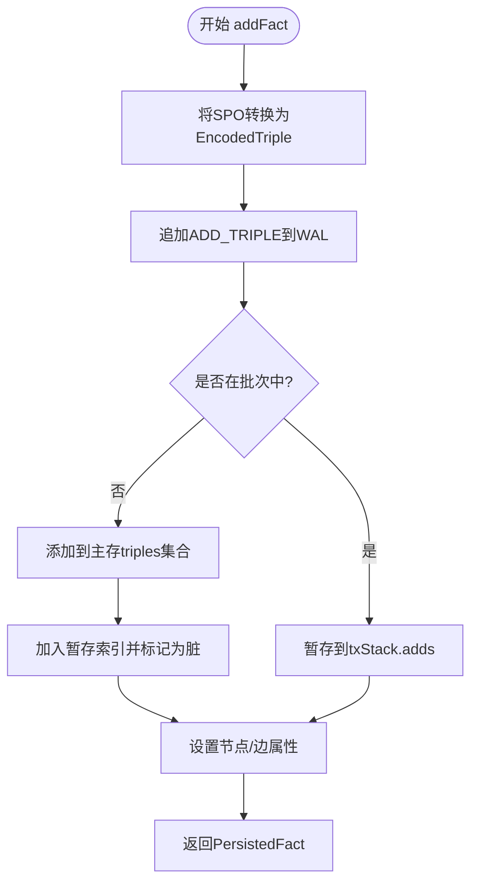
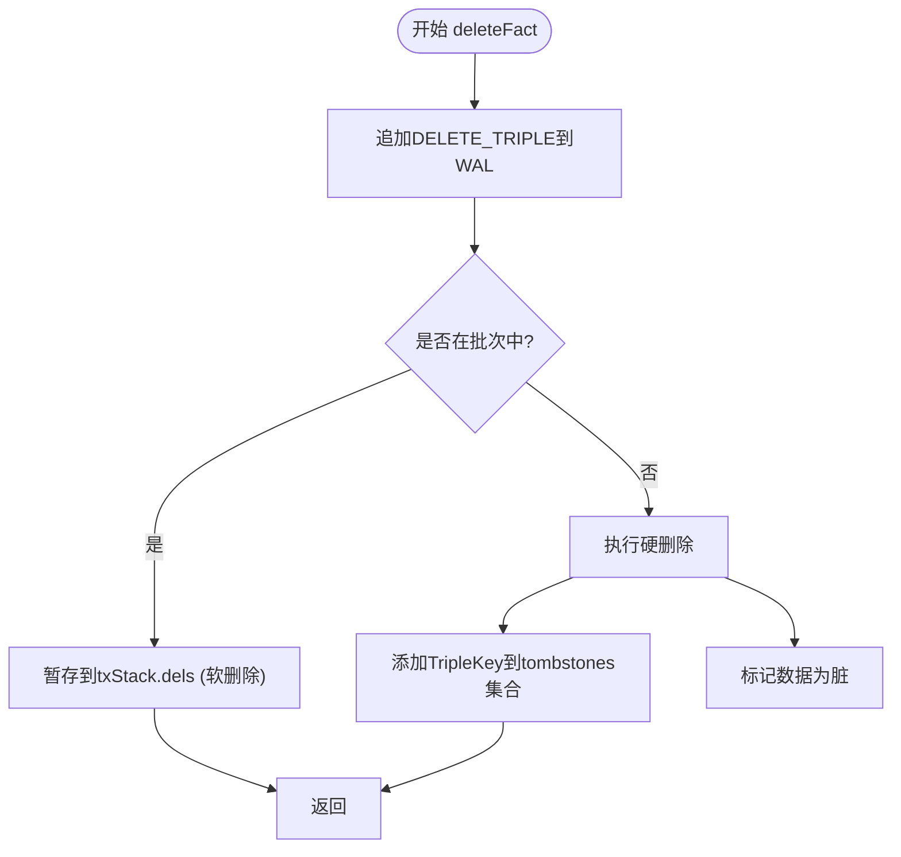

# 数据操作

<cite>
**本文档引用的文件**
- [synapseDb.ts](file://src/synapseDb.ts)
- [persistentStore.ts](file://src/storage/persistentStore.ts)
- [wal.ts](file://src/storage/wal.ts)
- [queryBuilder.ts](file://src/query/queryBuilder.ts)
- [propertyIndex.ts](file://src/storage/propertyIndex.ts)
- [tripleStore.ts](file://src/storage/tripleStore.ts)
- [dictionary.ts](file://src/storage/dictionary.ts)
- [propertyStore.ts](file://src/storage/propertyStore.ts)
</cite>

## 目录
1. [简介](#简介)
2. [数据写入机制](#数据写入机制)
3. [数据删除机制](#数据删除机制)
4. [数据读取与一致性](#数据读取与一致性)
5. [批量插入性能优化](#批量插入性能优化)
6. [错误处理策略](#错误处理策略)

## 简介
SynapseDB 是一个嵌入式三元组知识库，专门用于存储和查询 SPO（主语-谓语-宾语）三元组数据。本文档重点阐述 `addFact` 和 `deleteFact` 方法的内部处理流程，包括数据转换、暂存区管理、属性序列化、索引更新以及查询一致性保证等核心机制。

**Section sources**
- [synapseDb.ts](file://src/synapseDb.ts#L1-L948)

## 数据写入机制

### addFact方法处理流程
`addFact` 方法是向数据库添加事实记录的核心入口。其处理流程如下：

1.  **SPO三元组转换为TripleKey**：首先，将输入的字符串形式的 SPO 三元组通过 `StringDictionary` 映射为整数ID，生成 `EncodedTriple` 结构。
2.  **WAL日志追加**：无论是否在批次中，都会先将添加操作追加到预写式日志（WAL）中，确保数据持久性。
3.  **暂存区或直接提交**：
    *   **非批次模式**：如果不在事务批次中（`batchDepth = 0`），则直接将三元组添加到内存中的 `triples` 集合，并调用 `stageAdd` 将其加入暂存索引（`TripleIndexes`），标记数据为脏（`dirty = true`）。
    *   **批次模式**：如果在事务批次中，则将三元组暂存到当前事务栈（`txStack`）的 `adds` 数组中，不立即修改主存。
4.  **属性设置**：根据调用时提供的 `options`，分别调用 `setNodeProperties` 或 `setEdgeProperties` 来设置节点或边的属性。

**Diagram sources**
- [persistentStore.ts](file://src/storage/persistentStore.ts#L436-L467)
- [synapseDb.ts](file://src/synapseDb.ts#L101-L131)

### 属性对象的序列化与索引更新
当通过 `setNodeProperties` 或 `setEdgeProperties` 设置属性时，系统会执行以下操作：

1.  **序列化**：属性对象（`Record<string, unknown>`）会被序列化为JSON字符串，并使用 `encodeJson` 函数包装，其中包含一个版本号（`__v`），每次更新版本号递增。
2.  **暂存或直接写入**：与 `addFact` 类似，属性设置也会根据是否在批次中决定是暂存到 `txStack` 还是直接写入 `PropertyStore` 的内存映射中。
3.  **索引更新**：在非批次模式下，系统会比较新旧属性的差异，并触发 `updateNodePropertyIndex` 或 `updateEdgePropertyIndex` 方法。这些方法会生成 `PropertyChange` 操作，并应用到 `MemoryPropertyIndex` 中，从而维护基于属性值的倒排索引，支持高效的 `whereProperty` 查询。

**Section sources**
- [persistentStore.ts](file://src/storage/persistentStore.ts#L500-L550)
- [propertyStore.ts](file://src/storage/propertyStore.ts#L1-L184)
- [propertyIndex.ts](file://src/storage/propertyIndex.ts#L1-L754)

## 数据删除机制

### deleteFact方法行为分析
`deleteFact` 方法负责从数据库中移除事实记录，其行为分为软删除和硬删除两种模式：

1.  **软删除（Soft Delete）**：在批次模式下，删除操作被视为“软删除”。它不会立即从主存中移除数据，而是将要删除的三元组暂存到当前事务栈（`txStack`）的 `dels` 数组中。这允许在事务回滚（`abortBatch`）时恢复数据。
2.  **硬删除（Hard Delete）**：在非批次模式下，执行“硬删除”。系统会调用 `deleteFactDirect`，将该三元组的 `TripleKey` 添加到 `tombstones` 集合中。`tombstones` 是一个墓碑集，用于标记已被删除但尚未被清理的三元组。

**Diagram sources**
- [persistentStore.ts](file://src/storage/persistentStore.ts#L648-L661)

### 对查询可见性的影响
*   **查询过滤**：在执行任何查询（如 `query`, `find`）时，系统会检查结果集中每个三元组的 `TripleKey` 是否存在于 `tombstones` 集合中。如果存在，则该三元组会被过滤掉，对用户不可见。
*   **最终一致性**：被标记为删除的三元组（在 `tombstones` 中）会在后续的 `flush` 操作中，随着分页索引的重建而被永久移除，实现物理删除。因此，在 `flush` 之前，删除操作是逻辑上的，不影响已存在的快照视图。

**Section sources**
- [persistentStore.ts](file://src/storage/persistentStore.ts#L662-L670)
- [persistentStore.ts](file://src/storage/persistentStore.ts#L700-L750)

## 数据读取与一致性

### QueryBuilder链式调用
`QueryBuilder` 提供了强大的链式API来构建复杂查询。`find`、`follow`、`where` 等方法的调用流程如下：

1.  **find**：作为查询起点，根据条件创建初始的 `QueryBuilder` 实例，包含匹配的事实记录和前沿节点集（`frontier`）。
2.  **follow**：基于当前前沿节点和指定的谓词进行关联查询。它会查找所有以当前前沿节点为主语（正向）或宾语（反向）且谓词匹配的三元组，扩展查询结果和前沿。
3.  **where**：对当前查询结果集进行过滤。它接收一个谓词函数，保留满足条件的记录，并重新计算前沿。

### 一致性保证
系统通过多种机制保证数据读写的强一致性：
*   **WAL（Write-Ahead Logging）**：所有写操作（增、删、改）都必须先写入WAL，再修改内存状态。这保证了即使在崩溃后，也能通过重放WAL来恢复未持久化的数据。
*   **快照隔离（Snapshot Isolation）**：`withSnapshot` 方法和 `findStreaming` 在查询期间会固定一个 `epoch`，确保在整个查询链路中看到的是数据库在某一时刻的一致性快照，避免了中途数据变更导致的视图漂移。
*   **原子性提交**：`commitBatch` 操作是原子的。对于最外层的提交，WAL会记录 `COMMIT` 记录，只有成功写入后，暂存的数据才会被应用到主存，对外部查询可见。

**Section sources**
- [queryBuilder.ts](file://src/query/queryBuilder.ts#L38-L812)
- [synapseDb.ts](file://src/synapseDb.ts#L400-L446)
- [persistentStore.ts](file://src/storage/wal.ts#L1-L419)

## 批量插入性能优化

### 批量插入技巧
为了优化大批量数据插入的性能，应遵循以下最佳实践：

1.  **使用事务批次**：将多个 `addFact` 操作包裹在 `beginBatch` 和 `commitBatch` 之间。这样可以将多次WAL刷盘（fsync）合并为一次，极大地减少I/O开销。
2.  **合理设置批次大小**：过小的批次无法有效摊平WAL刷盘成本；过大的批次则可能导致单次 `commitBatch` 时间过长，影响并发性能。建议根据实际硬件和负载进行测试，找到最优的批次大小（例如1000-5000条记录）。
3.  **延迟刷新**：在批量插入完成后，再调用 `flush` 方法。`flush` 会将内存中的增量数据合并到分页索引中，这是一个相对昂贵的操作。避免在每条记录后都调用 `flush`。

**Section sources**
- [synapseDb.ts](file://src/synapseDb.ts#L447-L455)
- [persistentStore.ts](file://src/storage/persistentStore.ts#L470-L490)

## 错误处理策略

### 常见异常情况
系统在运行过程中可能会遇到以下异常情况：

*   **重复插入冲突**：由于底层使用 `Set` 结构存储三元组，重复的SPO三元组会被自动去重，不会抛出异常，但也不会产生新的记录。
*   **无效谓词格式**：如果查询中使用的谓词在 `StringDictionary` 中不存在，相关的查询方法（如 `follow`）会返回空结果集，而不会中断程序执行。
*   **WAL损坏**：在 `WalReplayer.replay` 过程中，如果检测到校验和（checksum）不匹配，会停止重放，防止损坏数据被加载。

### 恢复策略
*   **幂等性设计**：`commitBatch` 支持通过 `txId` 实现跨周期的幂等去重。如果一个带有 `txId` 的批次被成功提交，再次提交相同 `txId` 的批次将被忽略，防止重复写入。
*   **安全重启**：得益于WAL机制，数据库在意外崩溃后重启时，能够自动重放WAL日志，恢复到崩溃前的状态，保证了数据的持久性和一致性。

**Section sources**
- [persistentStore.ts](file://src/storage/persistentStore.ts#L200-L250)
- [wal.ts](file://src/storage/wal.ts#L200-L300)