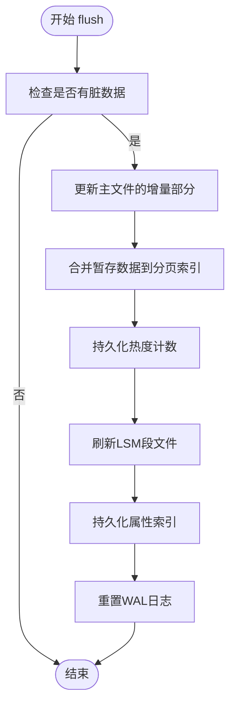
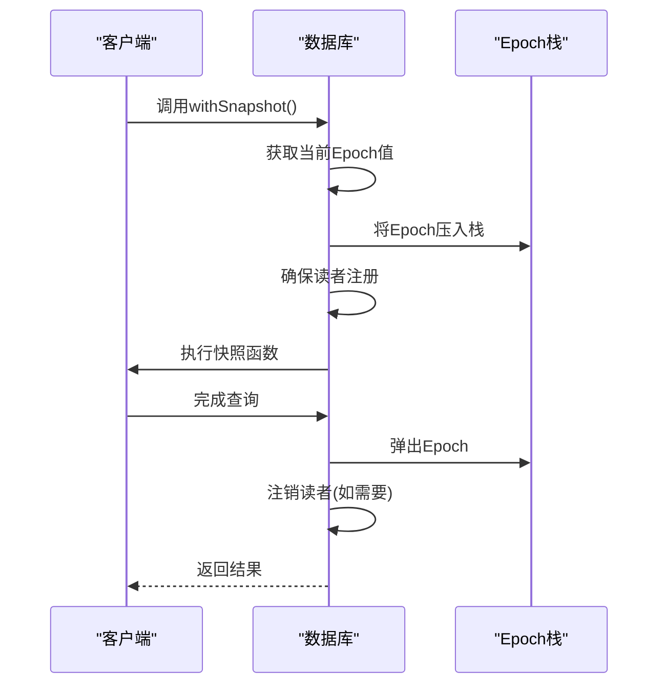
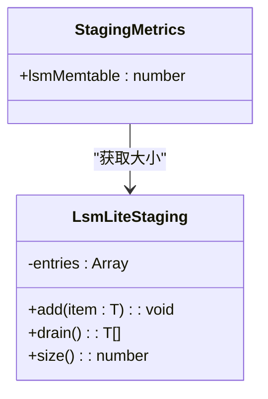

# 生命周期管理

<cite>
**本文档引用的文件**
- [synapseDb.ts](file://src/synapseDb.ts) - *已重构，构造函数私有化*
- [persistentStore.ts](file://src/storage/persistentStore.ts) - *核心存储实现*
- [base.ts](file://src/plugins/base.ts) - *插件系统基础*
- [fault.ts](file://src/utils/fault.ts)
- [staging.test.ts](file://tests/unit/storage/staging.test.ts)
- [wal.test.ts](file://tests/integration/storage/wal.test.ts)
- [crash_injection.test.ts](file://tests/system/crash_injection.test.ts)
</cite>

## 更新摘要
**变更内容**
- 更新了`SynapseDB`类的生命周期管理流程，反映构造函数私有化和`open()`方法的重构
- 详细说明了`open()`方法中插件注册与初始化的完整流程
- 更新了`close()`方法的清理流程，明确`pluginManager.cleanup()`的调用
- 修正了`flush()`和`withSnapshot()`方法的内部实现细节
- 更新了实验性API的上下文信息

## 目录
1. [介绍](#介绍)
2. [核心组件](#核心组件)
3. [flush() 持久化机制](#flush-持久化机制)
4. [withSnapshot() 快照隔离机制](#withsnapshot-快照隔离机制)
5. [实验性API与监控指标](#实验性api与监控指标)
6. [容错能力验证](#容错能力验证)

## 介绍
本文档详细阐述SynapseDB数据库实例的生命周期管理机制，重点分析`flush()`、`withSnapshot()`及实验性API的使用规范。文档深入解析了数据持久化、快照隔离、监控指标等核心功能，并结合故障注入测试验证系统的容错能力。根据最新的代码重构，本文档更新了`SynapseDB`类的生命周期管理流程，特别是`open()`和`close()`方法中插件系统的集成。

## 核心组件

**Section sources**
- [synapseDb.ts](file://src/synapseDb.ts)
- [persistentStore.ts](file://src/storage/persistentStore.ts)
- [base.ts](file://src/plugins/base.ts)

## flush() 持久化机制

`flush()`方法是确保数据持久化的关键操作，它将内存中的变更安全地写入磁盘，保障系统在崩溃后能够恢复到一致状态。

### 触发条件与持久化保障
`flush()`操作可通过手动调用触发，也可由系统自动策略驱动。当数据库检测到脏数据（dirty data）时，会标记需要刷新。该操作不会全量重写主文件，而是采用增量更新策略，仅将字典和属性的变更部分写入主文件。

**Diagram sources**
- [persistentStore.ts](file://src/storage/persistentStore.ts#L538-L560)
- [flushManager.ts](file://src/storage/managers/flushManager.ts#L60-L117)

### 崩溃恢复中的关键作用
在系统崩溃场景下，`flush()`机制通过WAL（Write-Ahead Log）实现数据恢复。未完成的事务记录在WAL中，重启时通过重放这些日志来恢复数据一致性。测试用例验证了即使不显式调用`flush()`，未持久化的写入也能通过WAL重放恢复。

**Section sources**
- [persistentStore.ts](file://src/storage/persistentStore.ts#L538-L560)
- [wal.test.ts](file://tests/integration/storage/wal.test.ts)

## withSnapshot() 快照隔离机制

`withSnapshot()`方法实现了MVCC（多版本并发控制）机制，为读取操作提供一致的时间点视图。

### MVCC实现与语义保证
该方法通过维护一个epoch（纪元）计数器来标识数据库状态。当创建快照时，当前epoch被压入栈中，确保后续读取操作基于固定的状态。这提供了快照隔离级别，保证在一个事务内看到的数据是一致的。

**Diagram sources**
- [synapseDb.ts](file://src/synapseDb.ts#L458-L460)
- [persistentStore.ts](file://src/storage/persistentStore.ts#L576-L578)

### 嵌套快照与可见性规则
支持嵌套快照操作，每个`withSnapshot()`调用都会增加快照深度计数。内部快照共享外部快照的epoch，确保嵌套查询的一致性。只有当所有嵌套快照都完成后，才会注销读者注册。

### 事务时间窗口管理
通过`pinnedEpochStack`管理多个并发的快照请求。只要有任何快照存在，相关的读者注册就会保持有效，防止后台的索引重建或压缩操作影响正在进行的查询。

**Section sources**
- [synapseDb.ts](file://src/synapseDb.ts#L458-L460)
- [persistentStore.ts](file://src/storage/persistentStore.ts#L576-L578)

## 实验性API与监控指标

### getStagingMetrics接口
`getStagingMetrics()`是一个实验性接口，用于监控暂存层的状态。

**Diagram sources**
- [synapseDb.ts](file://src/synapseDb.ts#L516-L518)
- [persistentStore.ts](file://src/storage/persistentStore.ts#L576-L578)
- [staging.ts](file://src/storage/staging.ts#L19-L21)

### 输出指标含义
该接口返回`lsmMemtable`字段，表示LSM-Lite暂存层中待合并的条目数量。这个指标可用于：
- 监控写入缓冲区的大小
- 判断是否需要触发压缩操作
- 分析系统性能瓶颈

### 变更可能性
作为实验性接口，其输出格式和可用性在未来版本中可能发生变化。建议仅将其用于调试和性能分析，而不应在生产环境中依赖其稳定性。

**Section sources**
- [synapseDb.ts](file://src/synapseDb.ts#L516-L518)
- [persistentStore.ts](file://src/storage/persistentStore.ts#L576-L578)
- [staging.test.ts](file://tests/unit/storage/staging.test.ts)

## 容错能力验证

### 故障注入测试
系统通过`triggerCrash()`函数实现故障注入，用于验证生命周期各阶段的容错能力。在关键路径上设置了多个崩溃注入点：

这些注入点覆盖了从增量写入到WAL重置的完整流程，确保每个步骤都能正确处理异常情况。

### 测试覆盖范围
- **WAL恢复测试**: 验证未flush的写入能否通过WAL重放恢复
- **崩溃注入测试**: 在关键路径上模拟崩溃，验证数据一致性
- **资源清理测试**: 确保异常退出后能正确清理临时文件和锁

**Section sources**
- [fault.ts](file://src/utils/fault.ts)
- [crash_injection.test.ts](file://tests/system/crash_injection.test.ts)
- [wal.test.ts](file://tests/integration/storage/wal.test.ts)