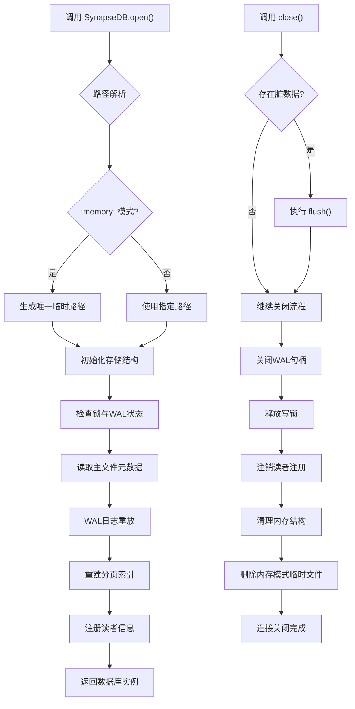
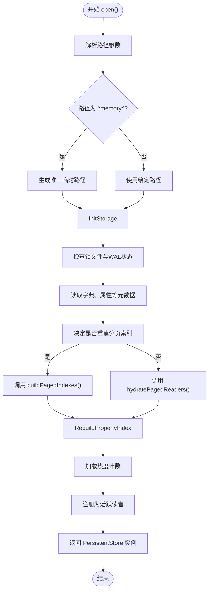

# 连接管理

<cite>
**本文档引用的文件**
- [synapseDb.ts](file://src/synapseDb.ts)
- [persistentStore.ts](file://src/storage/persistentStore.ts)
- [wal.ts](file://src/storage/wal.ts)
- [openOptions.ts](file://src/types/openOptions.ts)
- [readerRegistry.ts](file://src/storage/readerRegistry.ts)
- [pagedIndex.ts](file://src/storage/pagedIndex.ts)
</cite>

## 目录
1. [连接生命周期概述](#连接生命周期概述)
2. [打开机制详解](#打开机制详解)
3. [关闭机制详解](#关闭机制详解)
4. [高并发场景下的连接池实践](#高并发场景下的连接池实践)
5. [常见问题与解决方案](#常见问题与解决方案)

## 连接生命周期概述

SynapseDB 的连接管理围绕 `SynapseDB.open()` 和 `close()` 两个核心方法构建，形成一个完整的数据库实例生命周期。`open()` 方法负责初始化存储层、恢复未持久化状态并准备查询服务；而 `close()` 方法则确保所有写入安全落盘、释放系统资源并维护数据一致性。整个过程严格遵循原子性与安全性原则，为应用提供可靠的持久化保障。



**图示来源**
- [synapseDb.ts](file://src/synapseDb.ts#L96-L99)
- [persistentStore.ts](file://src/storage/persistentStore.ts#L99-L238)
- [persistentStore.ts](file://src/storage/persistentStore.ts#L1388-L1451)

## 打开机制详解

### 路径解析与选项配置

`SynapseDB.open()` 方法首先接收一个路径参数和可选的 `SynapseDBOpenOptions` 配置对象。当路径为特殊值 `':memory:'` 时，系统会自动在操作系统临时目录下创建一个基于进程ID和时间戳的唯一文件路径，实现真正的内存数据库语义，并在 `close()` 时自动清理相关文件。



**图示来源**
- [persistentStore.ts](file://src/storage/persistentStore.ts#L99-L238)
- [openOptions.ts](file://src/types/openOptions.ts#L5-L111)

#### 选项配置对存储层的影响

- **pageSize**: 控制每个分页索引页面包含的三元组数量，默认为1000。该值直接影响查询性能和内存占用。若现有索引的 `pageSize` 与配置不符，将触发索引重建。
- **compression**: 指定索引页面的压缩算法（`none` 或 `brotli`）及级别。此设置决定了 `PagedIndexWriter` 在写入时采用的压缩策略，影响磁盘空间利用率和I/O性能。
- **enableLock**: 当设为 `true` 时，通过 `acquireLock()` 获取文件级独占写锁，防止多个写者进程同时访问同一数据库导致数据损坏。若以无锁模式打开且检测到写锁存在且WAL非空，则拒绝访问以避免并发风险。

### 底层文件系统交互

`PersistentStore.open()` 是实际与文件系统交互的核心方法。它通过 `readStorageFile()` 从主数据库文件中解析出字典、属性等序列化部分，并利用 `initializeIfMissing()` 确保文件存在或创建空文件。

#### WAL日志恢复与元数据加载

在实例创建时，系统会执行一系列资源分配与状态恢复操作：
1.  **WAL重放**: 创建 `WalReplayer` 实例，读取 `.wal` 文件中的记录。通过校验和验证记录完整性，按 `BEGIN`/`COMMIT`/`ABORT` 事务边界处理嵌套批次，并将已提交的新增事实、删除事实及属性变更直接应用到 `PersistentStore` 的内存结构中（如 `triples`, `properties`）。
2.  **元数据加载**: 从主文件反序列化 `StringDictionary` 和 `PropertyStore`，这些构成了数据库的基础元数据。
3.  **索引重建**: 根据 `rebuildIndexes` 选项或现有 `manifest.json` 的兼容性判断，决定是调用 `buildPagedIndexes()` 全量重建所有六种排序（SPO, SOP, ...）的分页索引，还是通过 `hydratePagedReaders()` 加载现有的索引元数据。重建过程会从主文件读取历史三元组数据，确保新索引的完整性。

**章节来源**
- [persistentStore.ts](file://src/storage/persistentStore.ts#L99-L238)
- [wal.ts](file://src/storage/wal.ts#L145-L320)
- [fileHeader.ts](file://src/storage/fileHeader.ts#L129-L169)

## 关闭机制详解

`close()` 方法的设计目标是确保关闭操作的原子性与安全性，协调好写入缓冲区刷新、文件句柄释放与读者锁清理。

```mermaid
sequenceDiagram
    participant App as 应用程序
    participant DB