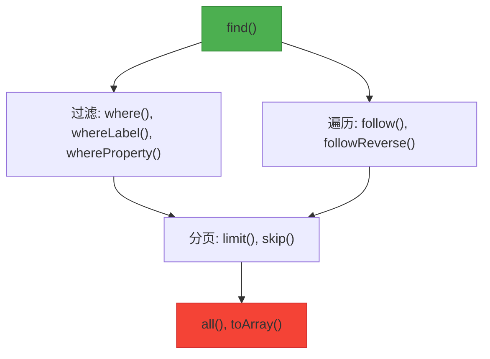
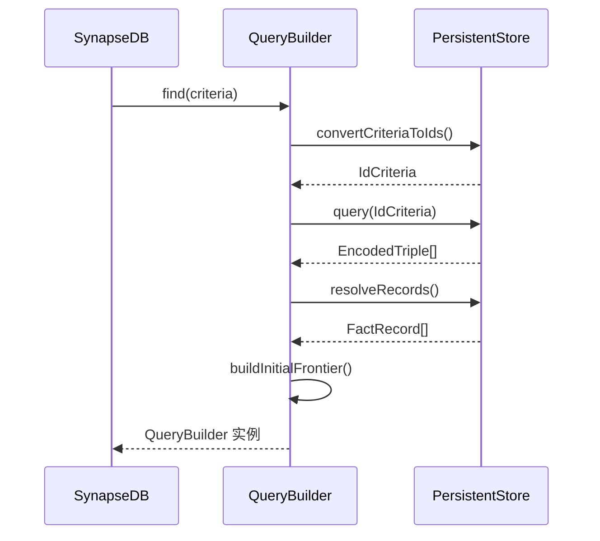
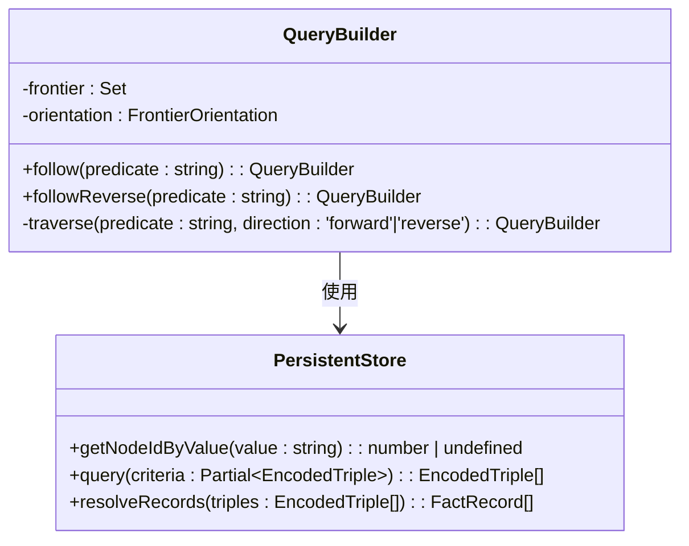
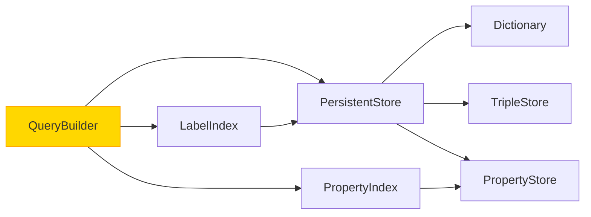

# 基础链式方法

<cite>
**本文档中引用的文件**  
- [queryBuilder.ts](file://src/query/queryBuilder.ts) - *where() 方法已废弃，新增运行时警告*
- [synapseDb.ts](file://src/synapseDb.ts) - *find() 方法实现*
- [persistentStore.ts](file://src/storage/persistentStore.ts) - *底层存储与查询引擎*
</cite>

## 更新摘要
**已更新内容**  
- 更新了 `where()` 方法的文档，明确其已被废弃并添加运行时警告机制
- 修正了性能考量部分，强调使用 `whereProperty`/`whereLabel` 等索引下推方法的重要性
- 更新了故障排除指南，添加了关于大结果集警告的说明

## 目录
1. [简介](#简介)
2. [项目结构](#项目结构)
3. [核心组件](#核心组件)
4. [架构概述](#架构概述)
5. [详细组件分析](#详细组件分析)
6. [依赖分析](#依赖分析)
7. [性能考量](#性能考量)
8. [故障排除指南](#故障排除指南)
9. [结论](#结论)

## 简介
本文档深入解析SynapseDB中`QueryBuilder`类的基础链式调用方法，重点阐述其作为图数据库查询引擎的核心机制。文档将系统性地说明`find()`如何作为查询起点返回`QueryBuilder`实例，并深入剖析`follow`与`followReverse`的图遍历原理、`where`方法的谓词执行逻辑、以及`limit`/`skip`/`take`的分页行为。同时，文档还将探讨属性索引协同优化和多条件组合查询的最佳实践。

## 项目结构
`QueryBuilder`是SynapseDB查询功能的核心实现，位于`src/query/`目录下，与存储层和上层API紧密协作。

```mermaid
graph TB
subgraph "查询层"
QB[QueryBuilder]
StreamingQB[StreamingQueryBuilder]
PathBuilder[VariablePathBuilder]
Pattern[PatternBuilder]
end
subgraph "存储层"
Store[PersistentStore]
LabelIndex[LabelIndex]
PropertyIndex[PropertyIndex]
end
subgraph "API层"
SynapseDB[SynapseDB]
end
SynapseDB --> QB : 创建实例
QB --> Store : 查询数据
QB --> LabelIndex : 标签过滤
QB --> PropertyIndex : 属性索引
StreamingQB --> Store : 流式查询
```

**图表来源**
- [queryBuilder.ts](file://src/query/queryBuilder.ts#L0-L1184)
- [synapseDb.ts](file://src/synapseDb.ts#L0-L949)
- [persistentStore.ts](file://src/storage/persistentStore.ts#L0-L1544)

**章节来源**
- [queryBuilder.ts](file://src/query/queryBuilder.ts#L0-L1184)
- [synapseDb.ts](file://src/synapseDb.ts#L0-L949)

## 核心组件
`QueryBuilder`通过链式调用构建复杂的图查询。每个方法在当前上下文的基础上进行操作，并返回一个新的`QueryBuilder`实例以供后续调用，从而形成流畅的查询语句。其核心状态由`facts`（当前匹配的事实集合）、`frontier`（前沿节点集合）和`orientation`（方向锚点）构成。

**章节来源**
- [queryBuilder.ts](file://src/query/queryBuilder.ts#L116-L1184)

## 架构概述
`QueryBuilder`的架构围绕“从初始结果集出发，通过一系列转换操作逐步精炼”的理念设计。`find()`方法负责启动整个流程，而后续的`follow`、`where`等方法则扮演着转换器的角色。



**图表来源**
- [queryBuilder.ts](file://src/query/queryBuilder.ts#L138-L387)
- [synapseDb.ts](file://src/synapseDb.ts#L234-L282)

## 详细组件分析
本节将对`QueryBuilder`的关键方法进行深度分析。

### find() 方法：查询的起点
`find()`是所有链式查询的入口点，由`SynapseDB`实例调用。它根据提供的`criteria`（如主语、谓语、宾语）从`PersistentStore`中检索出初始的`FactRecord`集合，并据此创建一个`QueryBuilder`实例。

该方法首先通过`convertCriteriaToIds`将字符串形式的查询条件转换为内部ID，然后调用`store.query()`获取编码后的三元组，再通过`store.resolveRecords()`将其解析为包含完整属性信息的`FactRecord`对象。最后，`buildInitialFrontier`函数会根据`anchor`选项（'subject', 'object', 'both'）确定初始的前沿节点集合，用于指导后续的`follow`操作。



**图表来源**
- [synapseDb.ts](file://src/synapseDb.ts#L234-L282)
- [queryBuilder.ts](file://src/query/queryBuilder.ts#L888-L919)
- [persistentStore.ts](file://src/storage/persistentStore.ts#L816-L921)

**章节来源**
- [synapseDb.ts](file://src/synapseDb.ts#L234-L282)

### follow/followReverse 方法：图遍历机制
`follow`和`followReverse`是实现图数据库关联查询的核心方法，它们基于当前`QueryBuilder`实例的`frontier`（前沿节点）进行一步扩展。

- **方向控制**：`follow`表示正向遍历（从主语到宾语），`followReverse`表示反向遍历（从宾语到主语）。两者都通过调用私有的`traverse(predicate, direction)`方法来实现。
- **前沿传播**：方法遍历`frontier`中的每一个节点ID，使用`store.getNodeIdByValue(predicate)`获取谓词ID，然后构造查询条件（正向时`{ subjectId: nodeId, predicateId }`，反向时`{ predicateId, objectId: nodeId }`），并调用`store.query()`和`store.resolveRecords()`获取新的事实记录。
- **新前沿生成**：对于每一条新获取的事实记录，根据遍历方向，将其对应的宾语ID或主语ID添加到新的`nextFrontier`集合中。这个新的前沿集合将作为下一次`follow`操作的起点。
- **性能影响**：此操作的时间复杂度与`frontier`的大小和每个节点的平均连接数成正比。如果`frontier`过大或存在高度连接的“枢纽”节点，可能会导致性能下降。



**图表来源**
- [queryBuilder.ts](file://src/query/queryBuilder.ts#L643-L649)
- [queryBuilder.ts](file://src/query/queryBuilder.ts#L651-L699)
- [persistentStore.ts](file://src/storage/persistentStore.ts#L640-L642)

**章节来源**
- [queryBuilder.ts](file://src/query/queryBuilder.ts#L643-L699)

### where 方法：谓词函数与异常处理
`where`方法允许用户传入一个自定义的谓词函数`(record: FactRecord) => boolean`，对当前的事实集合进行过滤。

- **执行逻辑**：该方法会遍历当前的`facts`数组，对每一条`FactRecord`应用谓词函数。
- **异常处理策略**：为了保证查询的健壮性，代码使用了`try-catch`块包裹谓词函数的执行。如果谓词函数抛出任何异常，该条记录将被静默丢弃（返回`false`），而不会中断整个查询流程。
- **与属性索引的协同**：`where`方法本身不直接利用属性索引，它是在内存中对已加载的数据进行过滤。因此，它适用于复杂的、无法通过索引下推的逻辑。为了获得最佳性能，应优先使用`whereProperty`等能利用索引的方法进行初步筛选，再用`where`进行精细过滤。
- **废弃警告**：此API已被标记为废弃，当结果集大小超过阈值（默认5000）时，会触发运行时警告。建议改用`whereProperty()`、`whereLabel()`或`followWithNodeProperty()`等支持索引下推的方法。

**章节来源**
- [queryBuilder.ts](file://src/query/queryBuilder.ts#L200-L221)
- [queryBuilder.ts](file://src/query/queryBuilder.ts#L862-L876)

### limit/skip/take 方法：分页与内存占用
这三个方法用于实现查询结果的分页和截取。

- **分页行为**：
  - `limit(n)`：保留前`n`条记录。
  - `skip(n)`：跳过前`n`条记录。
  - `take(n)`：是`limit(n)`的别名，提供更符合流式API直觉的名称。
- **内存占用影响**：这些方法通过对`this.facts`数组进行`slice`操作来实现。这意味着它们需要将当前结果集的全部内容加载到内存中，然后创建一个新的子数组。因此，在处理超大规模结果集时，`limit`和`skip`操作本身也会消耗大量内存。对于大数据集，推荐使用`findStreaming` API结合`take`来实现真正的流式分页，以保持恒定的内存占用。

**章节来源**
- [queryBuilder.ts](file://src/query/queryBuilder.ts#L244-L286)

## 依赖分析
`QueryBuilder`的正常运行依赖于多个底层模块。



**图表来源**
- [queryBuilder.ts](file://src/query/queryBuilder.ts#L138-L387)
- [persistentStore.ts](file://src/storage/persistentStore.ts#L1535-L1544)

**章节来源**
- [queryBuilder.ts](file://src/query/queryBuilder.ts#L138-L387)
- [persistentStore.ts](file://src/storage/persistentStore.ts#L1535-L1544)

## 性能考量
- **索引利用**：`whereProperty`和`whereLabel`等方法能有效利用底层的属性索引和标签索引，避免全表扫描，是高性能查询的关键。
- **快照一致性**：`find()`方法在检测到分页索引数据时会自动启用快照模式，确保查询期间视图的一致性，但这也可能带来额外的开销。
- **内存管理**：链式调用中的每一步都会创建新的`facts`数组和`QueryBuilder`实例，应避免在单次查询中进行过多的链式操作，尤其是在处理大数据集时。
- **运行时警告**：当对大结果集（默认超过5000条）执行`where()`、`all()`、`batch()`等操作时，系统会输出运行时警告，提示用户改用索引下推或流式查询API。可通过环境变量`SYNAPSEDB_SILENCE_QUERY_WARNINGS=1`关闭警告，或通过`SYNAPSEDB_QUERY_WARN_THRESHOLD`调整阈值。

## 故障排除指南
- **查询无结果**：检查`find()`的查询条件是否正确，特别是字符串拼写。确认相关数据已通过`addFact`成功
- **性能低下警告**：当执行`where()`、`all()`等操作时，若控制台出现“正在对 ~N 条结果在内存中处理”的警告，表明当前操作可能非常慢并占用大量内存。应优先使用`whereProperty()`、`whereLabel()`等索引下推方法，或改用`findStreaming()`进行流式查询。