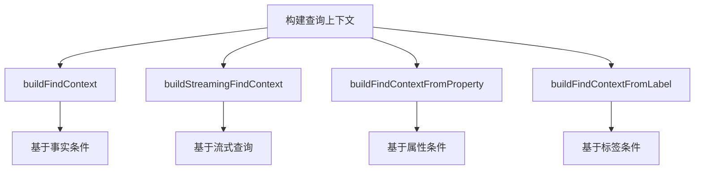

# 查询构建器API

<cite>
**本文档引用的文件**  
- [queryBuilder.ts](file://src/query/queryBuilder.ts) - *新增 explain 估算输出、collect 方法及流式遍历支持*  
- [persistentStore.ts](file://src/storage/persistentStore.ts) - *查询上下文构建依赖*  
- [propertyIndex.ts](file://src/storage/propertyIndex.ts) - *属性索引下推支持*  
</cite>

## 更新摘要
**变更内容**  
- 新增 `explain()` 方法的 `estimatedOutput` 字段，用于传播估算输出量  
- 在 `explain()` 中引入 `hotnessPrimary` 热度数据进行基数粗略估算  
- 新增 `collect()` 异步收集方法作为 `all()` 的异步替代  
- 增强 `followPath` 的流式处理能力与执行计划诊断  
- 更新终止操作与流式迭代器相关文档以反映新功能  
- 增强查询诊断能力说明，包含估算传播机制  

## 目录
1. [介绍](#介绍)  
2. [查询上下文构建](#查询上下文构建)  
3. [链式调用能力](#链式调用能力)  
4. [图遍历语义](#图遍历语义)  
5. [过滤与分页](#过滤与分页)  
6. [锚点机制](#锚点机制)  
7. [终止操作](#终止操作)  
8. [流式迭代器](#流式迭代器)  
9. [高级查询模式](#高级查询模式)  
10. [内部优化策略](#内部优化策略)  

## 介绍
`QueryBuilder` 是 SynapseDB 中用于构建复杂图查询的核心组件，它提供了一套流畅的链式 API 来表达复杂的图遍历和数据过滤逻辑。该 API 设计旨在提高代码可读性和开发效率，同时保持高性能的数据访问能力。

**Section sources**  
- [queryBuilder.ts](file://src/query/queryBuilder.ts#L38-L812)

## 查询上下文构建
查询上下文是 `QueryBuilder` 操作的基础，它定义了查询的初始状态和方向。系统提供了多种方式来构建查询上下文：



**Diagram sources**  
- [queryBuilder.ts](file://src/query/queryBuilder.ts#L888-L919)  
- [queryBuilder.ts](file://src/query/queryBuilder.ts#L924-L961)  
- [queryBuilder.ts](file://src/query/queryBuilder.ts#L970-L1074)  
- [queryBuilder.ts](file://src/query/queryBuilder.ts#L1083-L1117)

**Section sources**  
- [queryBuilder.ts](file://src/query/queryBuilder.ts#L888-L1117)

## 链式调用能力
`QueryBuilder` 提供了丰富的链式方法来组合查询逻辑，每个方法都返回一个新的 `QueryBuilder` 实例，允许连续调用。

### 核心链式方法
| 方法 | 描述 | 返回类型 |
|------|------|---------|
| `follow(predicate)` | 正向联想查询 | QueryBuilder |
| `followReverse(predicate)` | 反向联想查询 | QueryBuilder |
| `where(predicate)` | 基于谓词过滤 | QueryBuilder |
| `limit(n)` | 限制结果数量 | QueryBuilder |
| `skip(n)` | 跳过前n个结果 | QueryBuilder |
| `union(other)` | 合并两个查询结果（去重） | QueryBuilder |
| `unionAll(other)` | 合并两个查询结果（不去重） | QueryBuilder |

**Section sources**  
- [queryBuilder.ts](file://src/query/queryBuilder.ts#L38-L812)

## 图遍历语义
图遍历是 `QueryBuilder` 的核心功能之一，支持正向和反向两种遍历方向。

### 遍历方向控制
```mermaid
graph LR
A[起始节点] -- follow("关系") --> B[目标节点]
C[目标节点] -- followReverse("关系") --> D[起始节点]
```

**Diagram sources**  
- [queryBuilder.ts](file://src/query/queryBuilder.ts#L643-L645)  
- [queryBuilder.ts](file://src/query/queryBuilder.ts#L647-L649)

### 性能影响分析
- **正向遍历** (`follow`)：从主体到客体的遍历，通常利用 SPO 索引进行高效查找  
- **反向遍历** (`followReverse`)：从客体到主体的遍历，依赖 OSP 索引，可能比正向稍慢  
- 遍历操作会自动利用索引优化，避免全表扫描  

## 过滤与分页
通过 `where`、`limit` 和 `skip` 方法实现数据过滤与分页控制。

### 属性条件过滤
使用 `whereProperty()` 方法可基于节点或边的属性进行高效过滤，支持等值与范围查询：
```typescript
query.whereProperty('age', '>=', 18, 'node')
```

### 分页行为
- `limit(n)`：限制返回结果的最大数量  
- `skip(n)`：跳过前 n 个结果，常用于分页偏移  

**Section sources**  
- [queryBuilder.ts](file://src/query/queryBuilder.ts#L450-L500)

## 锚点机制
`anchor()` 方法用于重新定义查询的前沿方向，支持在复杂查询中灵活切换主体与客体角色。

```typescript
query.follow('worksAt').anchor('subject') // 将当前结果的主体作为新前沿
```

**Section sources**  
- [queryBuilder.ts](file://src/query/queryBuilder.ts#L620-L630)

## 终止操作
终止操作用于执行查询并获取最终结果。

### all() 与 collect()
- `all()`：同步返回所有结果数组，适用于小结果集  
- `collect()`：新增的异步收集方法，返回 `Promise<FactRecord[]>`，便于统一异步流程处理，避免阻塞事件循环  

```typescript
const results = await query.collect();
```

**Section sources**  
- [queryBuilder.ts](file://src/query/queryBuilder.ts#L170-L192)

## 流式迭代器
支持同步与异步迭代器，适用于处理大规模数据集。

### Symbol.asyncIterator 实现
通过 `Symbol.asyncIterator` 提供流式处理能力，结合背压机制防止内存溢出：
```typescript
for await (const record of query) {
  // 逐条处理，内存友好
}
```

**Section sources**  
- [queryBuilder.ts](file://src/query/queryBuilder.ts#L150-L170)

## 高级查询模式
展示多跳查询、循环遍历、条件分支等高级用法。

### 多跳查询示例
```typescript
db.find({ subject: 'Alice' })
  .follow('friend')
  .follow('friend') // 二度好友
  .whereLabel('Active')
  .limit(10)
```

## 内部优化策略
### explain() 诊断增强
`explain()` 方法现已支持更详细的执行计划估算：
- 新增 `estimatedOutput` 字段，反映 `limit/skip` 对输出量的传播影响  
- 引入 `hotnessPrimary` 字段，融合热度数据进行基数粗略估算  
- `estimate` 对象包含 `upperBound`、`pagesForPrimary` 等优化指标  

```json
{
  "type": "LAZY",
  "estimate": {
    "order": "SPO",
    "upperBound": 1000,
    "pagesForPrimary": 2,
    "hotnessPrimary": 45,
    "estimatedOutput": 10
  }
}
```

**Section sources**  
- [queryBuilder.ts](file://src/query/queryBuilder.ts#L1292-L1322)  
- [queryBuilder.ts](file://src/query/queryBuilder.ts#L1422-L1448)