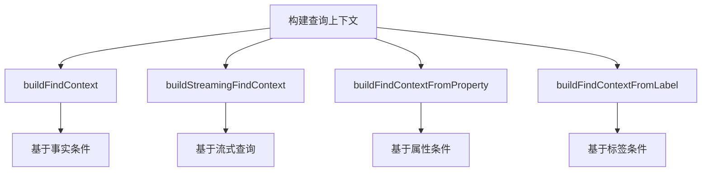

# 查询构建器API

<cite>
**本文档引用的文件**
- [queryBuilder.ts](file://src/query/queryBuilder.ts)
- [persistentStore.ts](file://src/storage/persistentStore.ts)
- [propertyIndex.ts](file://src/storage/propertyIndex.ts)
</cite>

## 目录
1. [介绍](#介绍)
2. [查询上下文构建](#查询上下文构建)
3. [链式调用能力](#链式调用能力)
4. [图遍历语义](#图遍历语义)
5. [过滤与分页](#过滤与分页)
6. [锚点机制](#锚点机制)
7. [终止操作](#终止操作)
8. [流式迭代器](#流式迭代器)
9. [高级查询模式](#高级查询模式)
10. [内部优化策略](#内部优化策略)

## 介绍
`QueryBuilder` 是 SynapseDB 中用于构建复杂图查询的核心组件，它提供了一套流畅的链式 API 来表达复杂的图遍历和数据过滤逻辑。该 API 设计旨在提高代码可读性和开发效率，同时保持高性能的数据访问能力。

**Section sources**
- [queryBuilder.ts](file://src/query/queryBuilder.ts#L38-L812)

## 查询上下文构建
查询上下文是 `QueryBuilder` 操作的基础，它定义了查询的初始状态和方向。系统提供了多种方式来构建查询上下文：



**Diagram sources**
- [queryBuilder.ts](file://src/query/queryBuilder.ts#L888-L919)
- [queryBuilder.ts](file://src/query/queryBuilder.ts#L924-L961)
- [queryBuilder.ts](file://src/query/queryBuilder.ts#L970-L1074)
- [queryBuilder.ts](file://src/query/queryBuilder.ts#L1083-L1117)

**Section sources**
- [queryBuilder.ts](file://src/query/queryBuilder.ts#L888-L1117)

## 链式调用能力
`QueryBuilder` 提供了丰富的链式方法来组合查询逻辑，每个方法都返回一个新的 `QueryBuilder` 实例，允许连续调用。

### 核心链式方法
| 方法 | 描述 | 返回类型 |
|------|------|---------|
| `follow(predicate)` | 正向联想查询 | QueryBuilder |
| `followReverse(predicate)` | 反向联想查询 | QueryBuilder |
| `where(predicate)` | 基于谓词过滤 | QueryBuilder |
| `limit(n)` | 限制结果数量 | QueryBuilder |
| `skip(n)` | 跳过前n个结果 | QueryBuilder |
| `union(other)` | 合并两个查询结果（去重） | QueryBuilder |
| `unionAll(other)` | 合并两个查询结果（不去重） | QueryBuilder |

**Section sources**
- [queryBuilder.ts](file://src/query/queryBuilder.ts#L38-L812)

## 图遍历语义
图遍历是 `QueryBuilder` 的核心功能之一，支持正向和反向两种遍历方向。

### 遍历方向控制
```mermaid
graph LR
A[起始节点] -- follow("关系") --> B[目标节点]
C[目标节点] -- followReverse("关系") --> D[起始节点]
```

**Diagram sources**
- [queryBuilder.ts](file://src/query/queryBuilder.ts#L643-L645)
- [queryBuilder.ts](file://src/query/queryBuilder.ts#L647-L649)

### 性能影响分析
- **正向遍历** (`follow`)：从主体到客体的遍历，通常