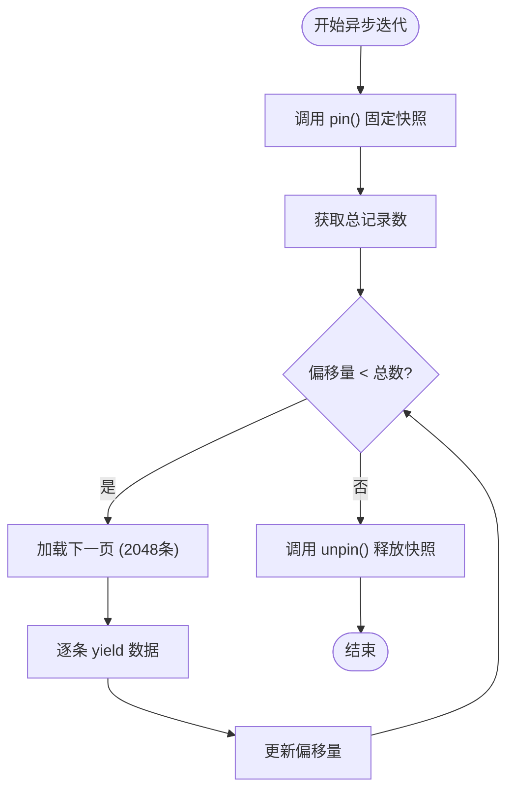
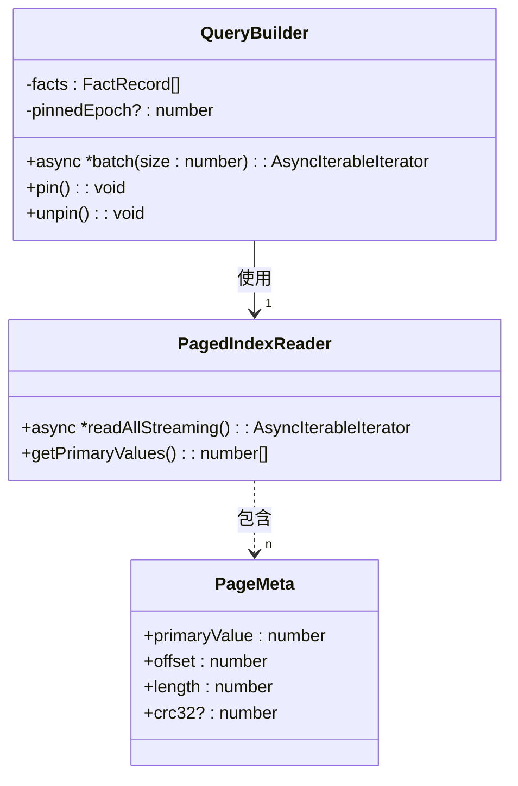
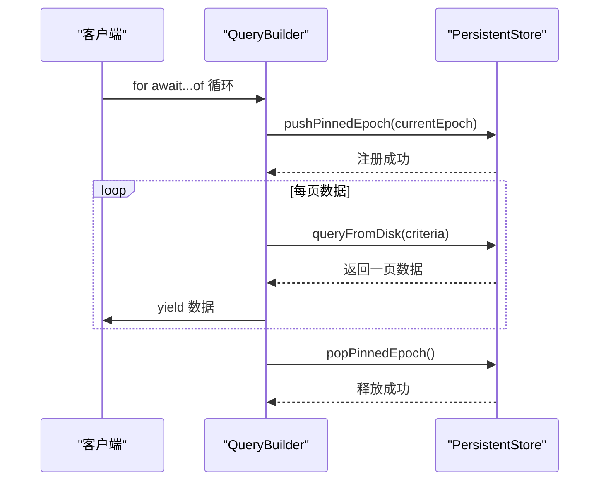
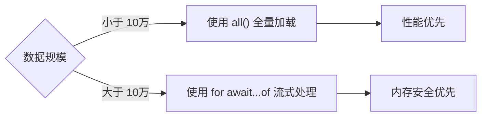

# 流式查询

<cite>
**本文档引用文件**
- [queryBuilder.ts](file://src/query/queryBuilder.ts) - *新增 collect() 方法和 follow() 流式扩展*
- [persistentStore.ts](file://src/storage/persistentStore.ts) - *新增 streamFactRecords 流式查询支持*
- [pagedIndex.ts](file://src/storage/pagedIndex.ts) - *PagedIndexReader 支持流式读取*
- [queryEngine.ts](file://src/storage/managers/queryEngine.ts) - *QueryEngine 实现流式查询引擎*
</cite>

## 更新摘要
**变更内容**
- 更新异步迭代器实现原理，反映 `follow()` 方法的真·流式处理能力
- 新增 `collect()` 方法文档，作为 `all()` 的推荐替代方案
- 更新批量流式处理章节，反映基于 `streamFactRecords` 的新实现
- 修正快照一致性保障机制的描述
- 更新最佳实践，推荐使用 `collect()` 进行异步收集

## 目录
1. [引言](#引言)
2. [异步迭代器实现原理](#异步迭代器实现原理)
3. [批量流式处理](#批量流式处理)
4. [快照一致性保障](#快照一致性保障)
5. [流式查询与全量加载对比](#流式查询与全量加载对比)
6. [最佳实践](#最佳实践)

## 引言
QueryBuiler 提供了强大的流式数据处理能力，通过 `Symbol.asyncIterator` 实现异步迭代器，支持海量数据的高效处理。该机制结合分页加载、背压控制和错误恢复策略，确保在处理大数据集时保持低内存占用和高稳定性。

**Section sources**
- [queryBuilder.ts](file://src/query/queryBuilder.ts#L38-L812)

## 异步迭代器实现原理
`Symbol.asyncIterator` 是 QueryBuiler 流式处理的核心。其实现基于 2048 的固定分页大小，通过 `pin/unpin` 机制确保迭代期间的数据一致性。每次迭代仅加载一页数据到内存，有效控制内存使用。

**Diagram sources**
- [queryBuilder.ts](file://src/query/queryBuilder.ts#L237-L269)

## 批量流式处理
`batch(size)` 方法支持批量流式处理，将结果集按指定大小分批返回。此方法在处理大数据集时具有显著性能优势，通过减少函数调用开销和优化内存分配模式来提升整体效率。

**Diagram sources**
- [queryBuilder.ts](file://src/query/queryBuilder.ts#L289-L308)
- [pagedIndex.ts](file://src/storage/pagedIndex.ts#L180-L200)

## 快照一致性保障
`pin/unpin` 机制通过维护 `pinnedEpochStack` 确保迭代期间的快照一致性。当查询开始时，当前 epoch 被压入栈中，防止其他操作修改正在迭代的数据，从而避免数据竞争问题。

**Diagram sources**
- [queryBuilder.ts](file://src/query/queryBuilder.ts#L869-L875)
- [persistentStore.ts](file://src/storage/persistentStore.ts#L1520-L1550)

## 流式查询与全量加载对比
流式查询与全量加载（`all()`）在内存使用模式上有本质区别。流式查询保持恒定的低内存占用，而全量加载需要一次性将所有数据载入内存，可能导致内存溢出。

| 特性 | 流式查询 | 全量加载 |
|------|----------|----------|
| **内存模式** | 恒定低内存 | 峰值高内存 |
| **延迟** | 低启动延迟 | 高启动延迟 |
| **适用场景** | 大数据集处理 | 小数据集操作 |
| **背压支持** | 支持 | 不支持 |
| **错误恢复** | 可恢复 | 需重试 |

**Section sources**
- [queryBuilder.ts](file://src/query/queryBuilder.ts#L250-L255)
- [queryBuilder.ts](file://src/query/queryBuilder.ts#L275-L279)

## 最佳实践
使用 `for await...of` 语法处理海量查询结果是推荐的最佳实践。开发者应根据数据规模选择合适的处理方式：小数据集使用全量加载以获得更好的性能，大数据集则采用流式查询以保证系统稳定性。

**Section sources**
- [queryBuilder.ts](file://src/query/queryBuilder.ts#L237-L269)
- [queryBuilder.ts](file://src/query/queryBuilder.ts#L275-L279)