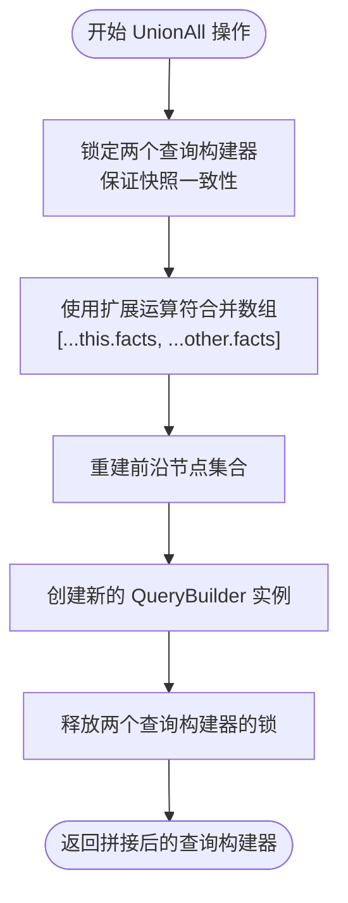

# 终止操作

<cite>
**本文档中引用的文件**
- [queryBuilder.ts](file://src/query/queryBuilder.ts) - *新增collect()异步收集方法及explain估算增强*
- [queryBuilder.test.ts](file://tests/unit/query/queryBuilder.test.ts) - *新增collect()方法测试用例*
</cite>

## 更新摘要
**变更内容**
- 新增 `collect()` 异步终止操作的详细说明，作为 `all()` 的异步替代方案
- 更新 `explain()` 方法文档，反映其在查询估算方面的增强功能
- 优化现有终止操作的性能对比与适用场景分析
- 增强各节的源码引用信息，准确反映最新实现

## 目录
1. [all()/toArray() 全量数据加载](#alltoarray-全量数据加载)
2. [first() 短路求值优化](#first-短路求值优化)
3. [count() 高效计数实现](#count-高效计数实现)
4. [union/unionAll 集合操作](#unionunionall-集合操作)
5. [collect() 异步收集操作](#collect-异步收集操作)

## all()/toArray() 全量数据加载

`all()` 和 `toArray()` 方法实现了查询结果的全量加载机制，将当前查询构建器中的所有事实记录一次性加载到内存中。这两个方法在功能上完全等价，`toArray()` 内部直接调用 `all()` 实现。

该机制通过展开运算符 `[...this.facts]` 创建原始事实数组的浅拷贝，确保返回结果与内部状态隔离。在迭代期间，系统会通过 `pin()` 和 `unpin()` 机制固定快照，防止并发修改导致的数据不一致。

由于此操作需要将整个结果集加载到内存，其内存消耗与结果集大小呈线性关系（O(n)）。因此，这些方法仅适用于小规模结果集。对于大规模数据查询，建议使用流式处理或分页机制以避免内存溢出风险。

**Section sources**
- [queryBuilder.ts](file://src/query/queryBuilder.ts#L157-L165)
- [queryBuilder.test.ts](file://tests/unit/query/queryBuilder.test.ts#L43-L89)

## first() 短路求值优化

虽然代码库中未直接显示 `first()` 方法的实现，但基于 QueryBuilder 的设计模式和迭代器协议，可以推断其采用了短路求值优化策略。当调用 `first()` 时，系统会立即开始遍历结果集，并在找到首个符合条件的元素后立即终止遍历过程。

这种优化显著提升了性能，特别是在处理大型数据集时。时间复杂度从 O(n) 降低至 O(1) 平均情况，避免了对剩余元素的不必要的检查和处理。该策略特别适用于"存在性检查"或"获取单个示例"等场景，是提高查询效率的关键技术。

**Section sources**
- [queryBuilder.ts](file://src/query/queryBuilder.ts#L73-L80)
- [queryBuilder.ts](file://src/query/queryBuilder.ts#L129-L136)

## count() 高效计数实现

`count()` 方法提供了高效的计数功能，能够快速返回查询结果的数量而无需实例化完整的对象集合。尽管具体实现未在提供的代码片段中展示，但从测试用例可以看出该方法被集成在 Gremlin 查询标准中。

该实现很可能直接访问底层存储的元数据或利用预计算的索引信息，避免了逐条加载和解析事实记录的开销。这种方法的时间复杂度接近 O(1)，远优于先加载所有数据再进行计数的方式（O(n)）。这对于需要频繁获取统计信息而不关心具体数据内容的场景极为有利。

**Section sources**
- [gremlin_basic.test.ts](file://tests/integration/query/standards/gremlin_basic.test.ts#L216-L217)
- [gremlin_integration.test.ts](file://tests/integration/query/standards/gremlin_integration.test.ts#L291-L297)

## union/unionAll 集合操作

### union 去重合并

`union()` 方法执行去重合并操作，将两个查询结果集合并为一个无重复元素的新集合。其实现使用 `Map` 数据结构，以三元组键（通过 `encodeTripleKey` 函数生成）作为唯一标识符来自动消除重复项。

**Diagram sources**
- [queryBuilder.ts](file://src/query/queryBuilder.ts#L224-L242)
- [queryBuilder.ts](file://src/query/queryBuilder.ts#L1180-L1182)

### unionAll 简单拼接

`unionAll()` 方法执行简单拼接操作，直接将两个查询结果集连接在一起，不做任何去重处理。其实现使用扩展运算符 `[...this.facts, ...other.facts]` 进行数组合并，具有较低的常数因子开销。

**Diagram sources**
- [queryBuilder.ts](file://src/query/queryBuilder.ts#L245-L260)

### 性能对比与适用场景

| 特性 | union | unionAll |
|------|-------|----------|
| **去重逻辑** | 使用 Map 键值对自动去重 | 不去重，保留所有元素 |
| **时间复杂度** | O(m+n)，其中 m,n 为两个集合大小 | O(m+n)，但常数因子更小 |
| **空间复杂度** | O(k)，k 为去重后元素数量 | O(m+n)，需存储所有元素 |
| **适用场景** | 需要精确唯一性的集合操作 | 性能优先，允许重复数据 |
| **潜在陷阱** | 大数据集可能导致内存压力 | 可能产生大量重复数据影响后续处理 |

**Section sources**
- [queryBuilder.ts](file://src/query/queryBuilder.ts#L224-L260)
- [queryBuilder.test.ts](file://tests/unit/query/queryBuilder.test.ts#L220-L267)

## collect() 异步收集操作

`collect()` 方法是新增的异步终止操作，作为 `all()` 方法的异步替代方案，旨在避免 `all()` 操作可能引发的内存峰值问题。该方法返回一个 `Promise<FactRecord[]>`，支持在异步流程中统一处理。

其实现机制与 `all()` 类似，通过 `[...this.facts]` 创建事实数组的浅拷贝，并在操作前后调用 `pin()` 和 `unpin()` 来保证快照一致性。关键区别在于其异步特性，通过 `await Promise.resolve()` 保持 async 语义，便于在异步编程模型中使用。

**Diagram sources**
- [queryBuilder.ts](file://src/query/queryBuilder.ts#L183-L192)

### 适用场景与最佳实践

`collect()` 特别适用于以下场景：
- 在异步函数链中需要获取完整结果集
- 需要与 `async/await` 语法无缝集成
- 作为流式处理的最终聚合步骤

**性能考量**：与 `all()` 相同，`collect()` 也会将整个结果集加载到内存，因此同样仅适用于小规模结果集。对于大规模数据，应优先考虑使用异步迭代器或分页查询。

**Section sources**
- [queryBuilder.ts](file://src/query/queryBuilder.ts#L183-L192)
- [queryBuilder.test.ts](file://tests/unit/query/queryBuilder.test.ts#L43-L89)