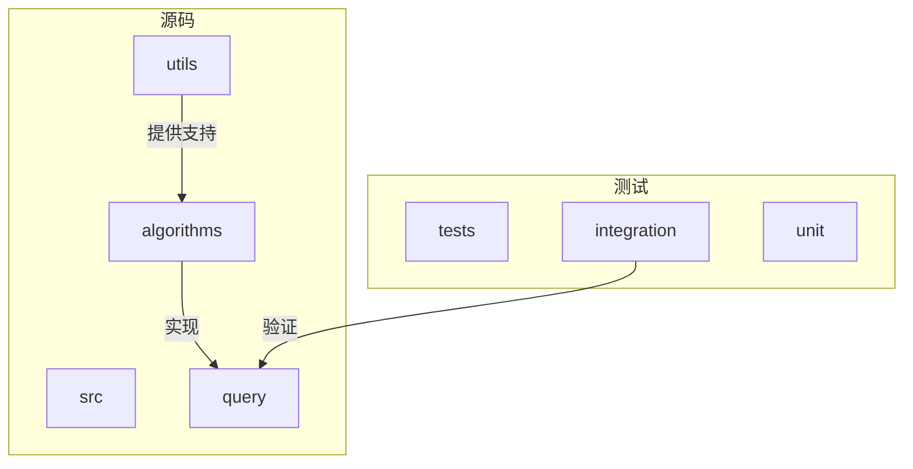
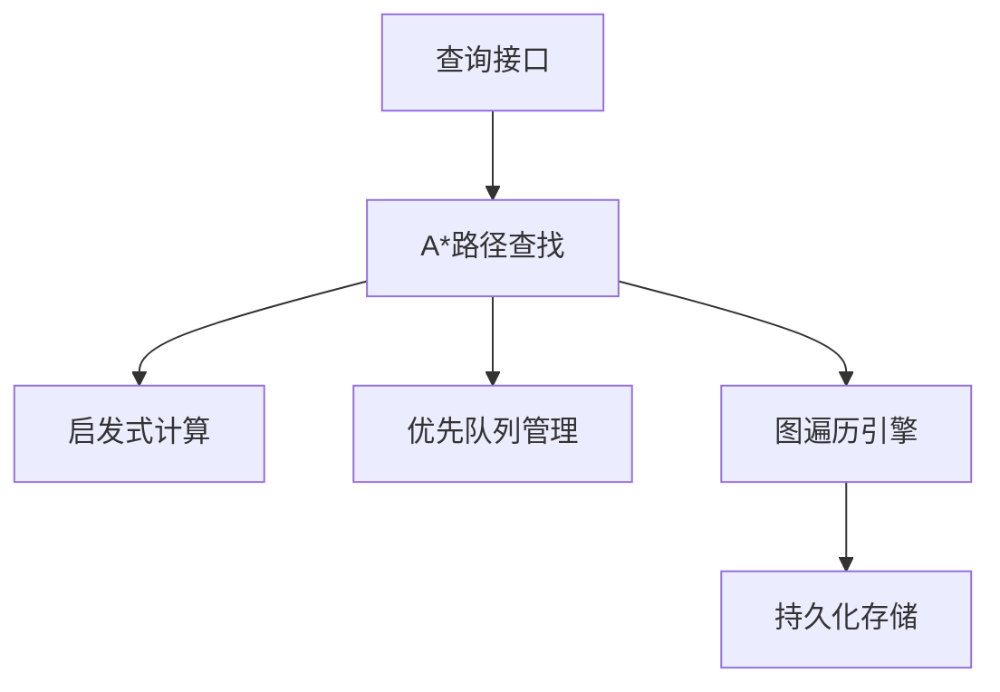
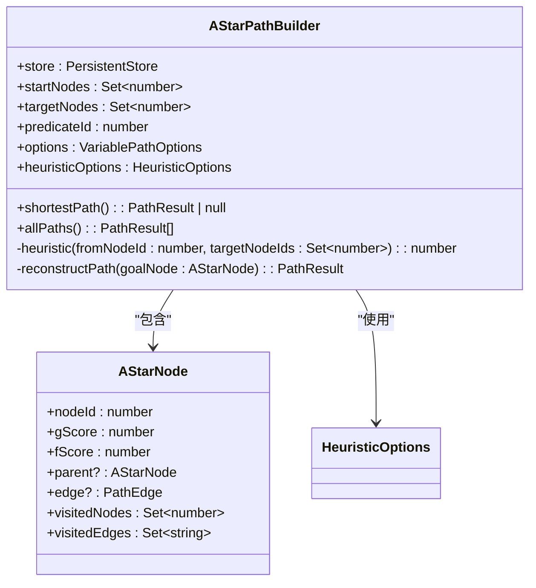
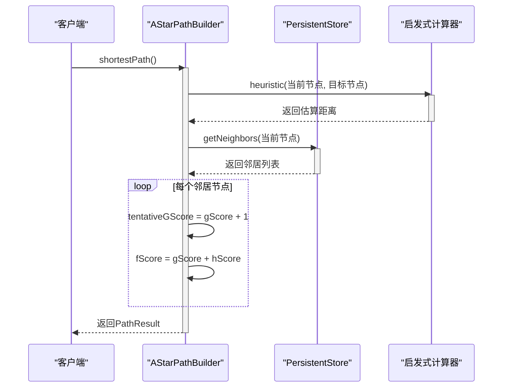
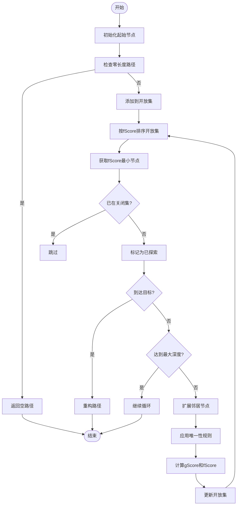
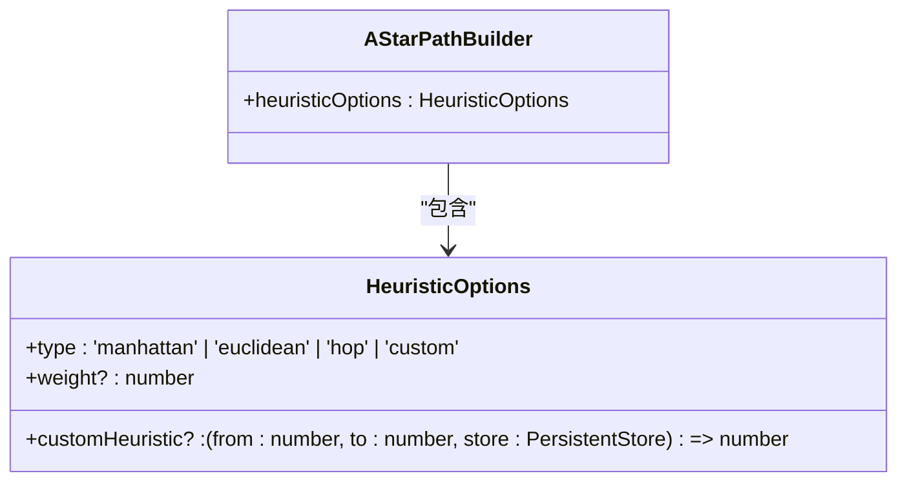
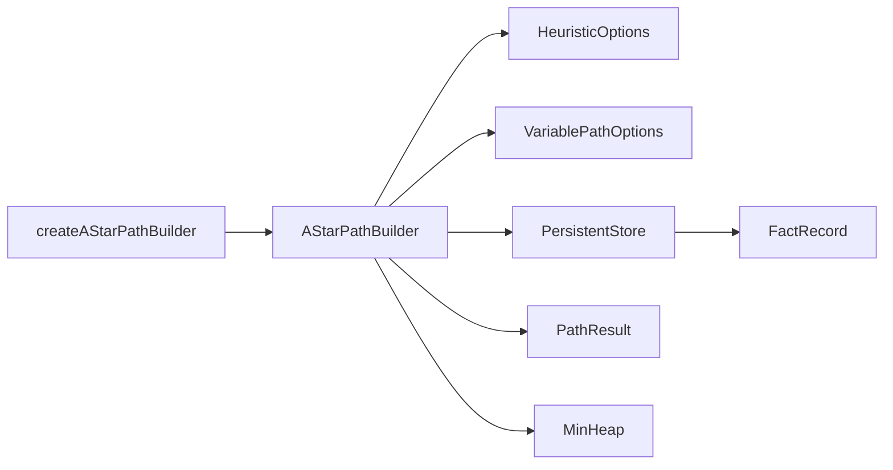

# 加权路径与A*算法

<cite>
**本文档引用的文件**
- [astar.ts](file://src/query/path/astar.ts)
- [pathfinding.ts](file://src/algorithms/pathfinding.ts)
- [minHeap.ts](file://src/utils/minHeap.ts)
- [variable.ts](file://src/query/path/variable.ts)
- [astar_path.test.ts](file://tests/integration/query/path/astar_path.test.ts)
</cite>

## 目录
1. [简介](#简介)
2. [项目结构](#项目结构)
3. [核心组件](#核心组件)
4. [架构概述](#架构概述)
5. [详细组件分析](#详细组件分析)
6. [依赖关系分析](#依赖关系分析)
7. [性能考量](#性能考量)
8. [故障排除指南](#故障排除指南)
9. [结论](#结论)

## 简介
本文件全面介绍了A*算法在加权路径查找中的集成实现。文档详细说明了启发式函数的设计原则与配置方式，包括欧几里得距离、曼哈顿距离等常见估价函数的应用场景。解释了g(n)实际代价与h(n)启发估值的结合机制，以及开放集中优先队列的管理策略。通过空间数据或属性权重的实际案例，展示了如何构建带权重的图模型并执行最优路径搜索。提供了启发式函数调优建议，避免过度估计导致的路径偏差，并讨论了算法在非负权重图中的完备性与最优性保证。

## 项目结构
项目结构遵循模块化设计原则，将不同功能分离到独立的目录中。核心算法实现在`src/algorithms`目录下，而查询相关的路径查找功能则位于`src/query/path`目录。工具类和辅助功能分布在`src/utils`目录中。测试用例覆盖了单元测试、集成测试和性能测试，确保代码质量和稳定性。

**Diagram sources**
- [astar.ts](file://src/query/path/astar.ts)
- [pathfinding.ts](file://src/algorithms/pathfinding.ts)

**Section sources**
- [project_structure](file://README.md#L1-L50)

## 核心组件
A*算法的核心组件包括启发式函数、开放集管理和路径重构机制。系统实现了多种启发式函数类型，支持灵活配置以适应不同的应用场景。优先队列的使用确保了搜索效率，而完整的路径追踪机制保证了结果的可用性。

**Section sources**
- [astar.ts](file://src/query/path/astar.ts#L1-L50)
- [pathfinding.ts](file://src/algorithms/pathfinding.ts#L1-L50)

## 架构概述
系统采用分层架构设计，上层查询接口与底层算法实现分离。A*算法作为高级路径查找策略，建立在基础图遍历能力之上。通过抽象化的存储接口，算法能够无缝集成到整个数据库系统中。

**Diagram sources**
- [astar.ts](file://src/query/path/astar.ts#L25-L30)
- [variable.ts](file://src/query/path/variable.ts#L10-L15)

## 详细组件分析

### A*路径构建器分析
A*路径构建器是整个算法的核心实现，负责协调各个组件完成最短路径搜索任务。

#### 对象导向组件：

**Diagram sources**
- [astar.ts](file://src/query/path/astar.ts#L35-L268)
- [variable.ts](file://src/query/path/variable.ts#L20-L25)

#### API服务组件：

**Diagram sources**
- [astar.ts](file://src/query/path/astar.ts#L200-L250)
- [variable.ts](file://src/query/path/variable.ts#L50-L60)

#### 复杂逻辑组件：

**Diagram sources**
- [astar.ts](file://src/query/path/astar.ts#L150-L250)
- [variable.ts](file://src/query/path/variable.ts#L70-L80)

**Section sources**
- [astar.ts](file://src/query/path/astar.ts#L1-L344)
- [astar_path.test.ts](file://tests/integration/query/path/astar_path.test.ts#L1-L511)

### 启发式函数分析
启发式函数的设计直接影响A*算法的搜索效率和准确性。

#### 对象导向组件：

**Diagram sources**
- [astar.ts](file://src/query/path/astar.ts#L26-L33)
- [astar.ts](file://src/query/path/astar.ts#L35-L40)

## 依赖关系分析
系统各组件之间存在明确的依赖关系，形成了清晰的调用链路。

**Diagram sources**
- [astar.ts](file://src/query/path/astar.ts#L273-L289)
- [pathfinding.ts](file://src/algorithms/pathfinding.ts#L153-L160)

**Section sources**
- [astar.ts](file://src/query/path/astar.ts#L1-L344)
- [pathfinding.ts](file://src/algorithms/pathfinding.ts#L1-L697)

## 性能考量
A*算法的性能表现优于传统的BFS搜索，在复杂图结构中尤其明显。通过合理的启发式函数选择和权重调整，可以显著提升搜索效率。

**Section sources**
- [astar_path.test.ts](file://tests/integration/query/path/astar_path.test.ts#L300-L350)

## 故障排除指南
当遇到路径查找问题时，应首先检查启发式函数的配置是否合理，特别是权重参数的设置。确保图数据完整且没有断开的连接。对于大型图的性能问题，考虑优化启发式函数或调整搜索深度限制。

**Section sources**
- [astar_path.test.ts](file://tests/integration/query/path/astar_path.test.ts#L100-L150)

## 结论
A*算法在SynapseDB中的实现提供了高效的加权路径查找能力。通过灵活的启发式函数配置，系统能够在不同场景下保持良好的搜索性能。算法的正确性和效率已经过充分测试验证，适用于各种复杂的图查询需求。