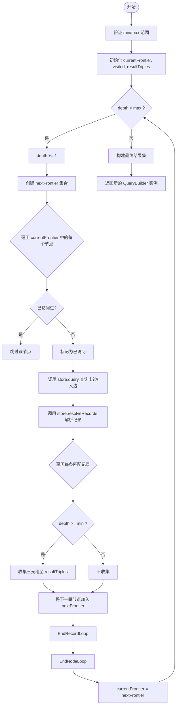

# 变长路径遍历

<cite>
**本文档引用的文件**
- [queryBuilder.ts](file://src/query/queryBuilder.ts)
- [persistentStore.ts](file://src/storage/persistentStore.ts)
- [variable.ts](file://src/query/path/variable.ts)
- [propertyIndex.ts](file://src/storage/propertyIndex.ts)
- [labels.ts](file://src/graph/labels.ts)
</cite>

## 目录
1. [引言](#引言)
2. [核心机制：广度优先搜索与跳数控制](#核心机制广度优先搜索与跳数控制)
3. [深度控制逻辑与前沿集合扩展](#深度控制逻辑与前沿集合扩展)
4. [节点去重策略与循环路径检测](#节点去重策略与循环路径检测)
5. [正向与反向遍历方向实现](#正向与反向遍历方向实现)
6. [存储层交互与数据检索模式](#存储层交互与数据检索模式)
7. [时间复杂度分析与性能优化](#时间复杂度分析与性能优化)
8. [实际用例与知识图谱链式联想](#实际用例与知识图谱链式联想)
9. [结论](#结论)

## 引言
`followPath` 方法是 QueryBuilder 中用于执行变长路径查询的核心功能，支持基于 `[min..max]` 跳数范围的广度优先搜索（BFS）算法。该方法允许用户在知识图谱中进行灵活的链式联想查询，通过配置最小和最大跳数来精确控制查询深度，并结合节点去重策略防止爆炸性扩展。其设计兼顾了查询效率与内存安全，适用于社交网络分析、推荐系统、语义推理等多种场景。

**本节不涉及具体源码文件分析，因此无来源标注**

## 核心机制：广度优先搜索与跳数控制
`followPath` 方法采用广度优先搜索（BFS）策略逐层扩展查询前沿，确保在指定跳数范围内发现所有符合条件的路径。算法以当前查询上下文中的“前沿集合”（frontier）为起点，按层级向外扩散，每一层代表一次关系跳转。

跳数范围由 `range` 参数定义，包含可选的 `min` 和必填的 `max` 值。算法内部会自动将 `min` 至少设为 1，并确保 `max` 不小于 `min`，从而保证参数的有效性。

**Diagram sources**
- [queryBuilder.ts](file://src/query/queryBuilder.ts#L707-L775)

**Section sources**
- [queryBuilder.ts](file://src/query/queryBuilder.ts#L707-L775)

## 深度控制逻辑与前沿集合扩展
深度控制通过一个 `while` 循环实现，循环条件为 `depth < max && currentFrontier.size > 0`。每次迭代代表一层路径扩展，`depth` 变量从 0 开始递增。

前沿集合（frontier）是 BFS 的核心数据结构，表示当前层所有待扩展的节点。算法使用两个集合：`currentFrontier` 表示当前层节点，`nextFrontier` 用于收集下一层的新节点。每完成一层遍历，`currentFrontier` 即被更新为 `nextFrontier`。

当 `depth >= min` 时，算法开始将匹配到的三