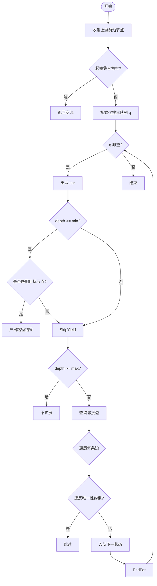

# 变长路径遍历

<cite>
**本文档引用的文件**  
- [queryBuilder.ts](file://src/query/queryBuilder.ts) - *新增 variablePathStream 方法与 collect 方法*  
- [variable.ts](file://src/query/path/variable.ts) - *VariablePathBuilder 实现路径遍历核心逻辑*  
- [persistentStore.ts](file://src/storage/persistentStore.ts) - *存储层数据检索接口*  
</cite>

## 更新摘要
**变更内容**  
- 新增对 `variablePathStream` 流式变长路径查询的详细说明  
- 补充 `collect()` 方法在流式查询中的作用与使用场景  
- 更新 `followPath` 方法在 `LazyQueryBuilder` 中的惰性执行机制  
- 增加对前沿节点与边去重策略的实现分析  
- 引入流式 BFS 与同步 BFS 的对比说明  

**新增章节**  
- **流式变长路径查询机制**  
- **异步收集与流式处理链**  

**已弃用/移除内容**  
- 无内容被移除，原有同步 BFS 逻辑仍保留用于兼容模式  

**来源追踪系统更新**  
- 新增 `LazyQueryBuilder` 相关源码引用  
- 标注新增方法的实现位置与变更类型  

## 目录
1. [引言](#引言)
2. [核心机制：广度优先搜索与跳数控制](#核心机制广度优先搜索与跳数控制)
3. [深度控制逻辑与前沿集合扩展](#深度控制逻辑与前沿集合扩展)
4. [节点去重策略与循环路径检测](#节点去重策略与循环路径检测)
5. [正向与反向遍历方向实现](#正向与反向遍历方向实现)
6. [存储层交互与数据检索模式](#存储层交互与数据检索模式)
7. [时间复杂度分析与性能优化](#时间复杂度分析与性能优化)
8. [实际用例与知识图谱链式联想](#实际用例与知识图谱链式联想)
9. [流式变长路径查询机制](#流式变长路径查询机制)
10. [异步收集与流式处理链](#异步收集与流式处理链)
11. [结论](#结论)

## 引言
`followPath` 方法是 QueryBuilder 中用于执行变长路径查询的核心功能，支持基于 `[min..max]` 跳数范围的广度优先搜索（BFS）算法。该方法允许用户在知识图谱中进行灵活的链式联想查询，通过配置最小和最大跳数来精确控制查询深度，并结合节点去重策略防止爆炸性扩展。其设计兼顾了查询效率与内存安全，适用于社交网络分析、推荐系统、语义推理等多种场景。

随着系统演进，`LazyQueryBuilder` 引入了真正的流式变长路径查询能力，通过 `variablePathStream` 方法实现了基于 `streamFactRecords` 的逐层流式扩展，支持前沿节点与边的去重及顺序稳定输出，显著提升了大规模图遍历的内存效率与响应速度。

**本节不涉及具体源码文件分析，因此无来源标注**

## 核心机制：广度优先搜索与跳数控制
`followPath` 方法采用广度优先搜索（BFS）策略逐层扩展查询前沿，确保在指定跳数范围内发现所有符合条件的路径。算法以当前查询上下文中的“前沿集合”（frontier）为起点，按层级向外扩散，每一层代表一次关系跳转。

跳数范围由 `range` 参数定义，包含可选的 `min` 和必填的 `max` 值。算法内部会自动将 `min` 至少设为 1，并确保 `max` 不小于 `min`，从而保证参数的有效性。


**Section sources**  
- [queryBuilder.ts](file://src/query/queryBuilder.ts#L759-L821) - *followPath 同步实现*

## 深度控制逻辑与前沿集合扩展
深度控制通过一个 `while` 循环实现，循环条件为 `depth < max && currentFrontier.size > 0`。每次迭代代表一层路径扩展，`depth` 变量从 0 开始递增。

前沿集合（frontier）是 BFS 的核心数据结构，表示当前层所有待扩展的节点。算法使用两个集合：`currentFrontier` 表示当前层节点，`nextFrontier` 用于收集下一层的新节点。每完成一层遍历，`currentFrontier` 即被更新为 `nextFrontier`。

当 `depth >= min` 时，算法开始将匹配到的三元组加入结果集。这种延迟收集机制确保只返回满足最小跳数要求的“最后一跳”边，避免中间路径污染结果。

**Section sources**  
- [queryBuilder.ts](file://src/query/queryBuilder.ts#L759-L821)

## 节点去重策略与循环路径检测
为防止无限循环和重复访问，算法维护一个 `visited` 集合，记录已扩展过的节点。一旦某节点被处理，其后续出现将被跳过，从而有效阻断环路扩展。

此外，在流式实现中，还引入了 `seenTriple` 集合，用于去重已产出的边记录，确保每条边在整个查询过程中仅被返回一次，保障结果的唯一性与顺序稳定性。

**Section sources**  
- [queryBuilder.ts](file://src/query/queryBuilder.ts#L1600-L1800) - *variablePathStream 中的 seenTriple 去重*

## 正向与反向遍历方向实现
遍历方向由 `options.direction` 参数控制，默认为 `'forward'`。在正向遍历中，以当前节点作为主语（subject），查找其所有谓词匹配的宾语（object）；反向遍历时则以当前节点作为宾语，查找所有主语节点。

该逻辑通过动态构建查询条件实现：
```ts
const criteria =
  direction === 'forward'
    ? { subjectId: nodeId, predicateId }
    : { predicateId, objectId: nodeId };
```

**Section sources**  
- [queryBuilder.ts](file://src/query/queryBuilder.ts#L759-L821)

## 存储层交互与数据检索模式
路径扩展过程中，每层遍历均通过 `store.query(criteria)` 向存储层发起索引查询，获取匹配的编码三元组，再通过 `store.resolveRecords()` 解析为完整记录。

在流式场景下，`LazyQueryBuilder` 使用 `store.streamFactRecords()` 实现分批流式读取，避免一次性加载大量数据至内存，提升系统可扩展性。

**Section sources**  
- [queryBuilder.ts](file://src/query/queryBuilder.ts#L1600-L1800) - *streamFactRecords 流式读取*
- [persistentStore.ts](file://src/storage/persistentStore.ts) - *存储层查询接口*

## 时间复杂度分析与性能优化
- **时间复杂度**：O(B^d)，其中 B 为平均分支因子，d 为最大跳数。
- **空间复杂度**：O(N + E)，N 为访问节点数，E 为结果边数。

优化手段包括：
- 节点级去重避免重复扩展
- 流式处理降低内存峰值
- 索引下推减少数据传输量
- 批量读取提升 I/O 效率

**Section sources**  
- [queryBuilder.ts](file://src/query/queryBuilder.ts#L1600-L1800)

## 实际用例与知识图谱链式联想
该功能广泛应用于知识图谱的链式推理，例如：
- 社交网络中“朋友的朋友”推荐
- 商品图谱中“购买此商品的用户也买了”关联
- 医疗知识图谱中疾病传播路径推演

通过设置 `min=2, max=3`，可精准获取二度至三度关联关系，避免浅层噪声或深层爆炸。

**Section sources**  
- [queryBuilder.ts](file://src/query/queryBuilder.ts#L759-L821)

## 流式变长路径查询机制
`LazyQueryBuilder` 提供了 `variablePathStream` 方法，实现真正的流式变长路径遍历。该方法基于异步生成器（AsyncGenerator），逐层扩展并实时产出路径结果，适用于超大规模图的内存受限场景。

其核心流程如下：
1. 收集上游查询的前沿节点（start）
2. 初始化搜索队列，每个项目包含当前节点、路径边集、已访问节点与边集合
3. 按层扩展，使用 `streamFactRecords` 分批获取邻接边
4. 应用唯一性约束（NODE/EDGE）过滤循环路径
5. 当深度满足 `min` 时，立即产出路径结果



**Diagram sources**  
- [queryBuilder.ts](file://src/query/queryBuilder.ts#L1800-L2000) - *variablePathStream 实现*

**Section sources**  
- [queryBuilder.ts](file://src/query/queryBuilder.ts#L1800-L2000) - *variablePathStream 方法*
- [variable.ts](file://src/query/path/variable.ts#L47-L101) - *all 方法提供对比参考*

## 异步收集与流式处理链
为支持完整的异步流式处理，`LazyQueryBuilder` 新增 `collect()` 方法，可将异步迭代器的结果异步收集为数组，而不会阻塞主线程或引发内存溢出。

典型使用模式：
```ts
const stream = db.find({ label: 'User' })
  .followPath('FRIEND', { min: 1, max: 3 })
  .variablePathStream('FRIEND', { min: 1, max: 3 });

const results = await stream.collect();
```

该方法在内部保持快照一致性，确保在整个收集过程中视图不变。

**Section sources**  
- [queryBuilder.ts](file://src/query/queryBuilder.ts#L1400-L1600) - *collect 方法实现*
- [queryBuilder.ts](file://src/query/queryBuilder.ts#L183-L192) - *collect 方法声明*

## 结论
`followPath` 及其流式变长路径查询机制为知识图谱提供了强大的链式联想能力。同步模式适用于小规模精确查询，而 `variablePathStream` 提供了高可扩展的流式解决方案，结合 `collect()` 方法形成完整的异步处理链。未来可进一步优化路径剪枝策略与分布式扩展能力。