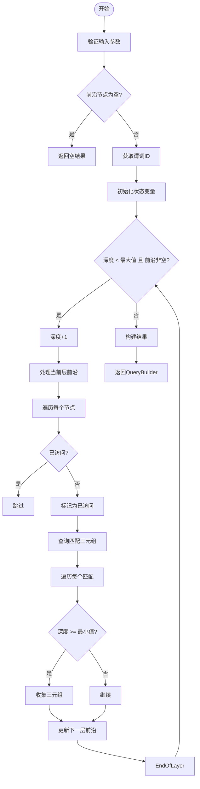
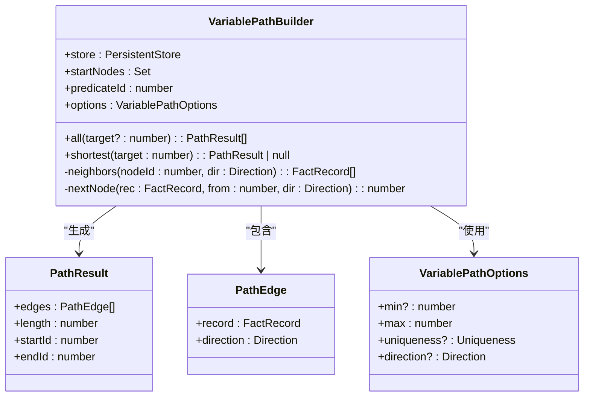
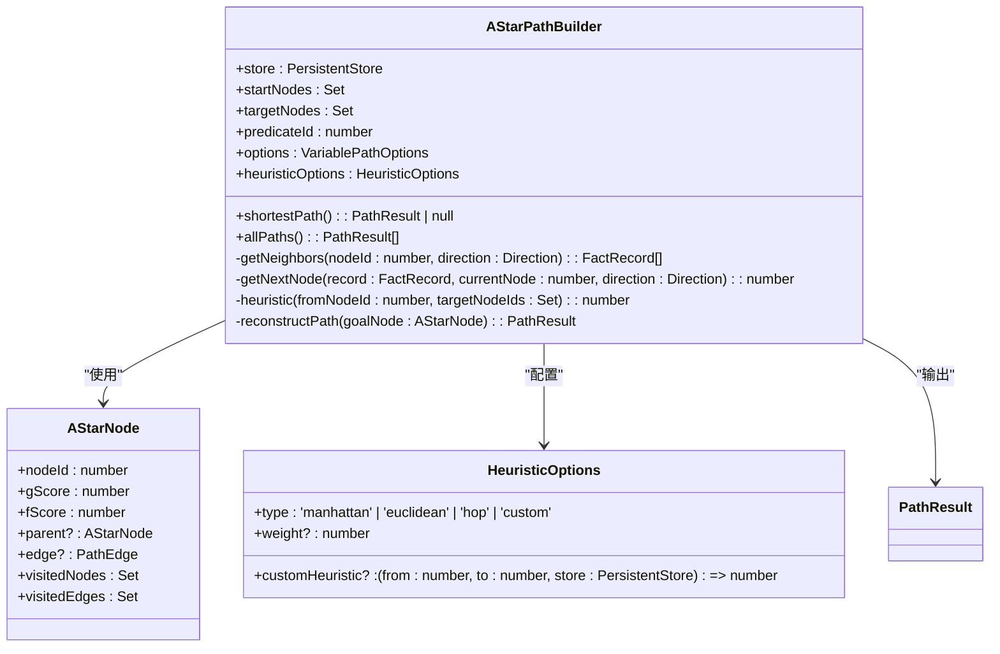
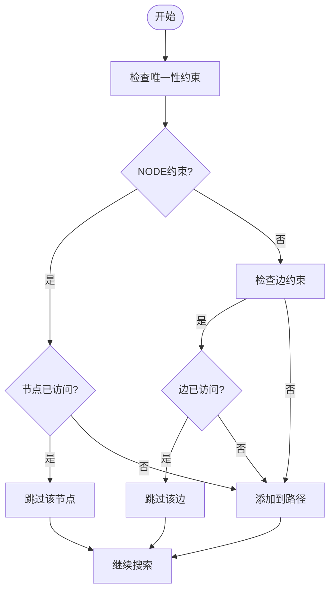
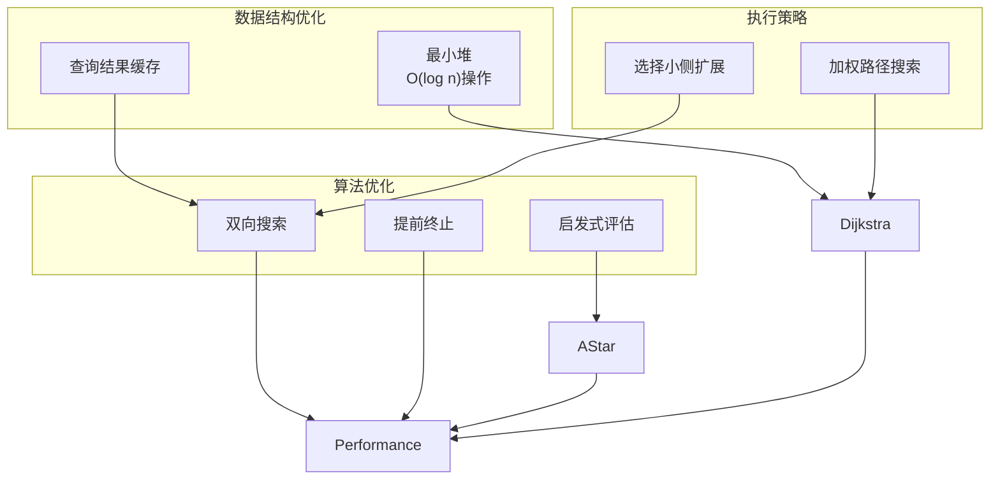

# 路径遍历操作

<cite>
**本文档引用的文件**
- [queryBuilder.ts](file://src/query/queryBuilder.ts)
- [variable.ts](file://src/query/path/variable.ts)
- [bidirectional.ts](file://src/query/path/bidirectional.ts)
- [astar.ts](file://src/query/path/astar.ts)
- [synapseDb.ts](file://src/synapseDb.ts)
- [minHeap.ts](file://src/utils/minHeap.ts)
</cite>

## 目录
1. [路径遍历机制概述](#路径遍历机制概述)
2. [followPath方法实现原理](#followpath方法实现原理)
3. [VariablePathBuilder与变长路径查询](#variablepathbuilder与变长路径查询)
4. [双向最短路径查找](#双向最短路径查找)
5. [A*加权路径查找算法](#a加权路径查找算法)
6. [唯一性约束与循环检测](#唯一性约束与循环检测)
7. [性能优化策略](#性能优化策略)

## 路径遍历机制概述

SynapseDB提供了多层次的路径遍历能力，支持从简单的固定跳数遍历到复杂的启发式搜索。系统通过QueryBuilder构建链式查询，结合BFS、双向BFS和A*等算法实现高效的图遍历。核心功能包括变长路径查询、最短路径查找和加权路径搜索，满足不同场景下的图分析需求。

## followPath方法实现原理

`followPath`方法实现了基于广度优先搜索（BFS）的变长路径查询机制，支持[min..max]跳数范围的同谓词遍历。该方法从当前前沿节点集出发，按层扩展搜索空间，在指定深度范围内收集符合条件的三元组。



**Diagram sources**
- [queryBuilder.ts](file://src/query/queryBuilder.ts#L707-L775)

**Section sources**
- [queryBuilder.ts](file://src/query/queryBuilder.ts#L707-L775)

## VariablePathBuilder与变长路径查询

`variablePath`方法返回`VariablePathBuilder`实例，支持更复杂的路径模式匹配。该构建器允许设置最小/最大跳数、唯一性约束和遍历方向，提供灵活的路径查询能力。



**Diagram sources**
- [variable.ts](file://src/query/path/variable.ts#L0-L110)

**Section sources**
- [variable.ts](file://src/query/path/variable.ts#L0-L110)
- [queryBuilder.ts](file://src/query/queryBuilder.ts#L56-L70)

## 双向最短路径查找

双向BFS算法通过同时从起点和终点进行搜索，显著减少搜索空间。当两个搜索前沿相遇时，即可构建完整路径。相比单向BFS，时间复杂度从O(b^d)降低到O(b^(d/2))，其中b为分支因子，d为深度。

```mermaid
sequenceDiagram
participant Client as "客户端"
participant Forward as "前向搜索"
participant Backward as "后向搜索"
participant Intersection as "交点检测"
Client->>Forward : 初始化起点队列
Client->>Backward : 初始化终点队列
loop 搜索过程
Forward->>Forward : 扩展当前层
Backward->>Backward : 扩展当前层
Forward->>Intersection : 提交前向访问记录
Backward->>Intersection : 提交后向访问记录
Intersection->>Intersection : 检查交集
alt 找到交点
Intersection-->>Client : 返回路径
break
end
end
```

**Diagram sources**
- [bidirectional.ts](file://src/query/path/bidirectional.ts#L0-L301)
- [synapseDb.ts](file://src/synapseDb.ts#L580-L743)

**Section sources**
- [bidirectional.ts](file://src/query/path/bidirectional.ts#L0-L301)
- [synapseDb.ts](file://src/synapseDb.ts#L580-L743)

## A*加权路径查找算法

A*算法结合了Dijkstra算法的准确性和贪心最佳优先搜索的效率，使用启发式函数估算从当前节点到目标的距离。系统支持多种启发式函数类型，并可通过权重因子调节启发式的影响程度。



**Diagram sources**
- [astar.ts](file://src/query/path/astar.ts#L0-L344)
- [synapseDb.ts](file://src/synapseDb.ts#L746-L802)

**Section sources**
- [astar.ts](file://src/query/path/astar.ts#L0-L344)
- [synapseDb.ts](file://src/synapseDb.ts#L746-L802)

## 唯一性约束与循环检测

系统提供三种唯一性约束模式：NODE（节点不重复）、EDGE（边不重复）和NONE（无约束）。这些约束在路径搜索过程中用于防止循环路径，确保结果的合理性。



**Section sources**
- [variable.ts](file://src/query/path/variable.ts#L0-L110)
- [bidirectional.ts](file://src/query/path/bidirectional.ts#L0-L301)
- [astar.ts](file://src/query/path/astar.ts#L0-L344)

## 性能优化策略

系统采用多种技术优化路径查询性能：
1. 使用MinHeap实现Dijkstra算法的优先队列，将插入和删除操作优化至O(log n)
2. 在双向BFS中缓存邻居查询结果，避免重复查询
3. 选择较小的一侧前沿进行扩展，提高搜索效率
4. 启发式函数支持自定义实现，可根据具体场景优化搜索行为



**Diagram sources**
- [minHeap.ts](file://src/utils/minHeap.ts#L0-L114)
- [astar.ts](file://src/query/path/astar.ts#L0-L344)
- [bidirectional.ts](file://src/query/path/bidirectional.ts#L0-L301)

**Section sources**
- [minHeap.ts](file://src/utils/minHeap.ts#L0-L114)
- [astar.ts](file://src/query/path/astar.ts#L0-L344)
- [bidirectional.ts](file://src/query/path/bidirectional.ts#L0-L301)