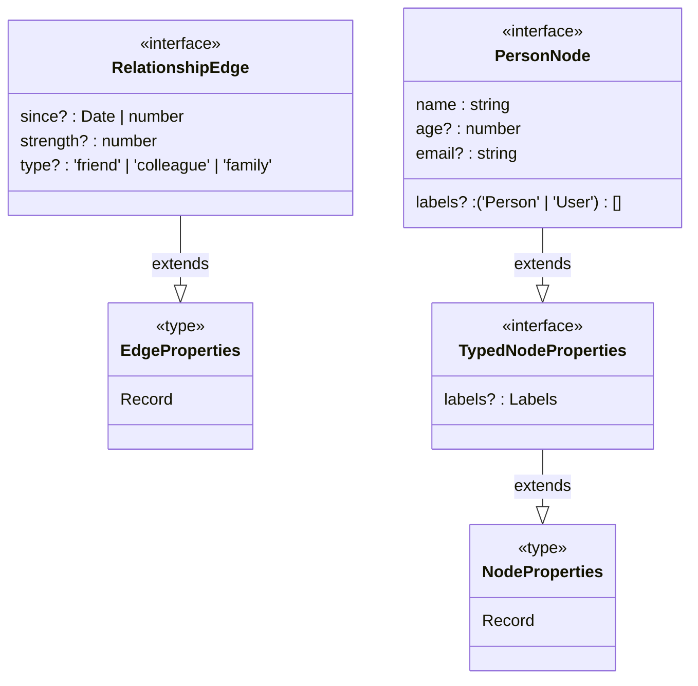
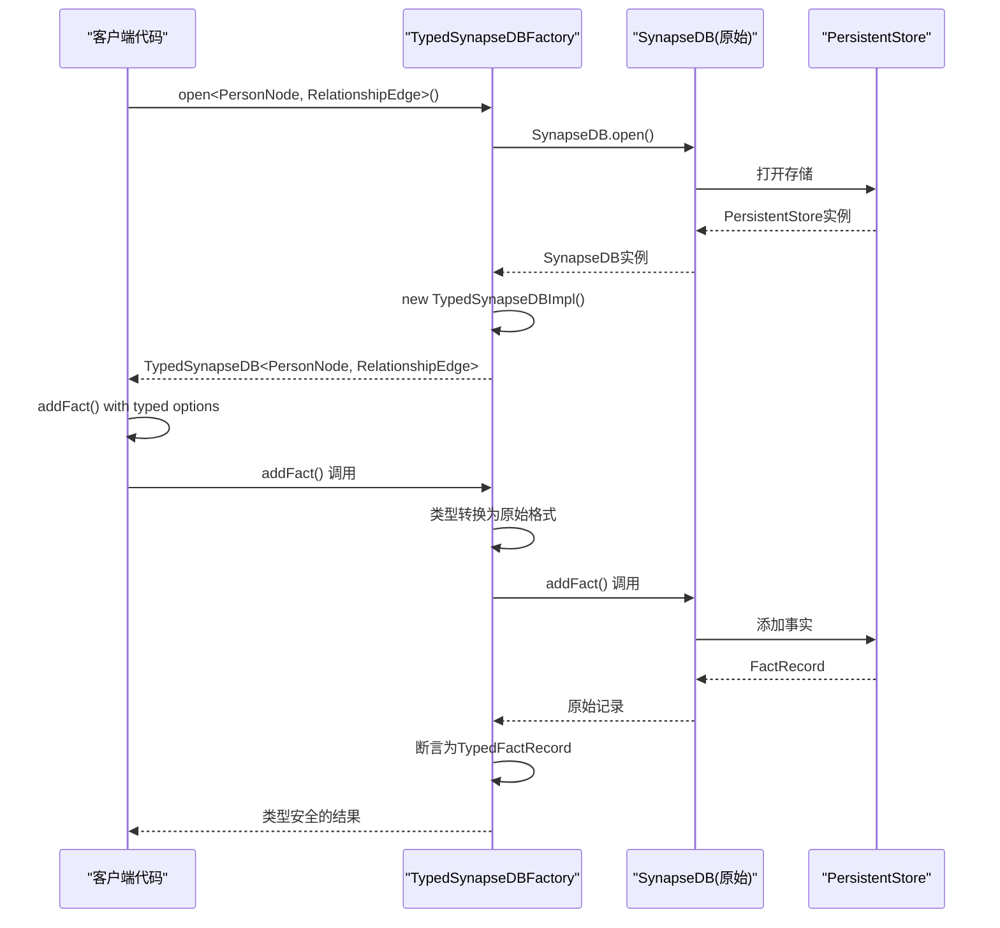

# 类型安全API

<cite>
**Referenced Files in This Document **   
- [typedSynapseDb.ts](file://src/typedSynapseDb.ts)
- [enhanced.ts](file://src/types/enhanced.ts)
- [synapseDb.ts](file://src/synapseDb.ts)
- [queryBuilder.ts](file://src/query/queryBuilder.ts)
- [typed-synapsedb.test.ts](file://tests/types/typed-synapsedb.test.ts)
</cite>

## 目录
1. [简介](#简介)
2. [核心类型系统设计](#核心类型系统设计)
3. [泛型API实现机制](#泛型api实现机制)
4. [类型信息继承与链式调用](#类型信息继承与链式调用)
5. 领域模型类型绑定最佳实践
6. 类型安全API优势对比
7. 当前限制与规避策略

## 简介

TypedSynapseDB是SynapseDB数据库的类型安全包装器，通过TypeScript泛型参数`TNodeProps`和`TEdgeProps`实现了编译时类型检查。该系统在保持运行时兼容性的同时，为图数据库操作提供了强类型的接口，显著提升了开发体验、错误预防能力和重构安全性。

**Section sources**
- [typedSynapseDb.ts](file://src/typedSynapseDb.ts#L1-L292)

## 核心类型系统设计

TypedSynapseDB的核心在于其精心设计的类型系统，通过泛型约束和接口定义实现了对节点属性和边属性的精确类型描述。

### 基础类型约束

系统定义了两个基础类型约束：
- `NodeProperties`: 节点属性的基础类型，定义为`Record<string, unknown>`
- `EdgeProperties`: 边属性的基础类型，同样定义为`Record<string, unknown>`

这些基础类型作为所有具体领域模型的基类，确保了类型系统的灵活性和扩展性。



**Diagram sources **
- [enhanced.ts](file://src/types/enhanced.ts#L11-L16)
- [enhanced.ts](file://src/types/enhanced.ts#L240-L254)

### 泛型化数据结构

系统通过泛型化关键数据结构来传递类型信息：

- `TypedFactRecord<TNodeProps, TEdgeProps>`: 泛型化的事实记录，包含类型安全的主体、客体和边属性
- `TypedFactOptions<TNodeProps, TEdgeProps>`: 泛型化的事实选项，用于创建新事实时指定属性
- `TypedPropertyFilter<T>`: 泛型化的属性过滤器，支持精确值和范围查询

这种设计使得类型信息能够贯穿整个数据操作流程，从数据创建到查询结果都保持类型完整性。

**Section sources**
- [enhanced.ts](file://src/types/enhanced.ts#L51-L80)

## 泛型API实现机制

TypedSynapseDB通过工厂模式和包装器模式实现了类型安全的API封装，将原有的普通SynapseDB API进行类型增强。

### 工厂函数设计

系统提供了`TypedSynapseDBFactory`工厂对象，包含两个核心方法：

- `open<TNodeProps, TEdgeProps>()`: 异步打开类型化的数据库实例
- `wrap()`: 将现有的SynapseDB实例包装为类型安全版本

```typescript
// 使用预定义类型
const socialDb = await TypedSynapseDB.open<PersonNode, RelationshipEdge>('./social.db');

// 使用自定义类型
interface MyNode { name: string; score: number; }
interface MyEdge { weight: number; }
const customDb = await TypedSynapseDB.open<MyNode, MyEdge>('./custom.db');
```

### 运行时类型转换

由于JavaScript运行时无法识别TypeScript泛型，系统采用了谨慎的类型断言策略：

- 在输入时，将类型化的选项转换为兼容的原始格式
- 在输出时，将原始的事实记录断言为类型化的记录
- 通过`as`关键字进行必要的类型转换，同时保持运行时行为不变

这种设计确保了类型安全性和运行时兼容性的平衡。



**