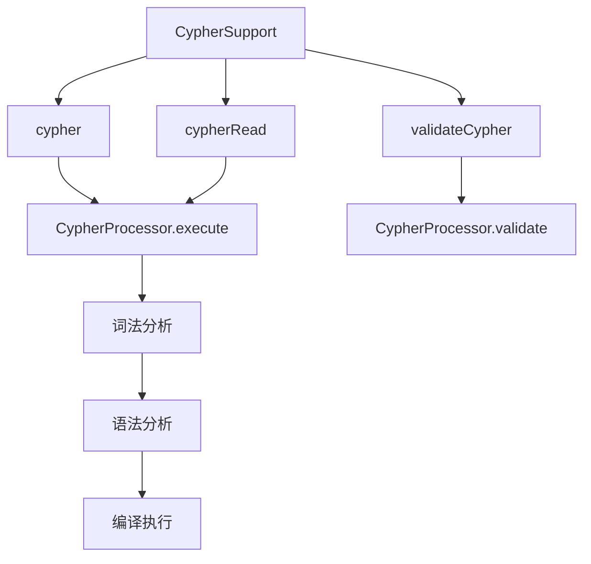
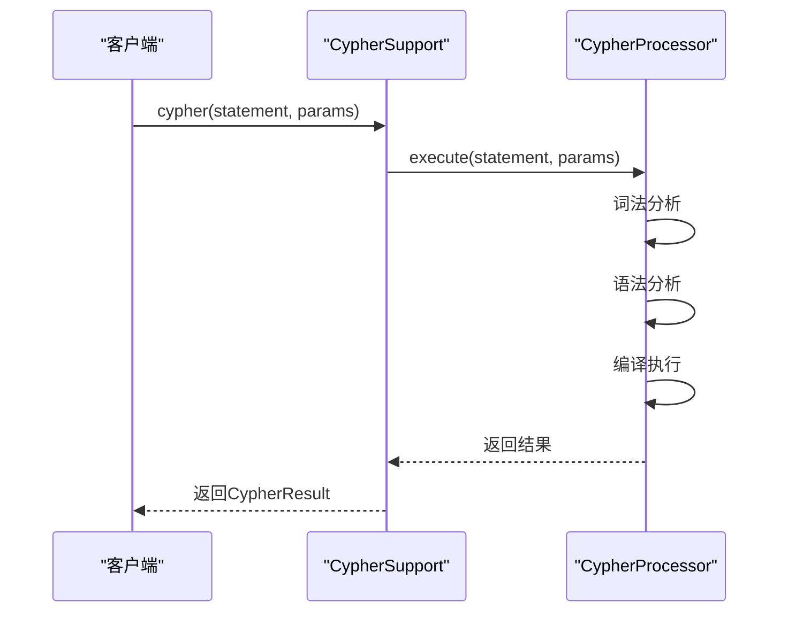
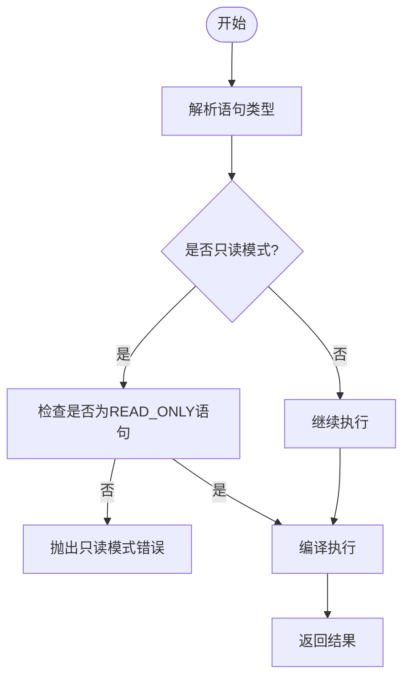
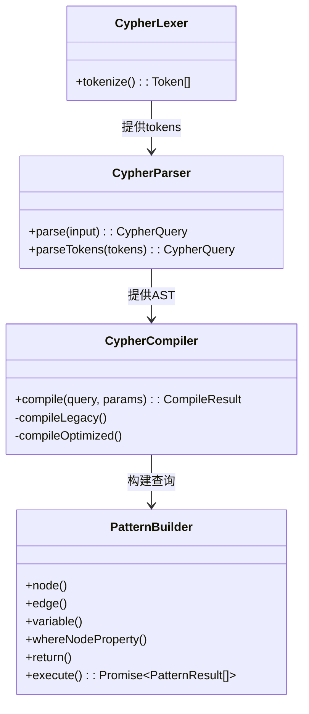

# Cypher查询接口

<cite>
**本文档引用的文件**
- [cypher.ts](file://src/query/cypher.ts)
- [compiler.ts](file://src/query/pattern/compiler.ts)
- [parser.ts](file://src/query/pattern/parser.ts)
- [lexer.ts](file://src/query/pattern/lexer.ts)
- [match.ts](file://src/query/pattern/match.ts)
</cite>

## 目录
1. [简介](#简介)
2. [Cypher调用方式概述](#cypher调用方式概述)
3. [同步极简实现：cypher()](#同步极简实现cypher)
4. [异步标准接口：cypherQuery与cypherRead](#异步标准接口cypherquery与cypherread)
5. [cypher()方法语法支持限制](#cypher方法语法支持限制)
6. [参数绑定与安全查询机制](#参数绑定与安全查询机制)
7. [缓存控制策略](#缓存控制策略)
8. [语法验证工具validateCypher](#语法验证工具validatecypher)
9. [总结](#总结)

## 简介
SynapseDB提供了一套完整的Cypher查询接口，支持通过文本形式执行图数据库查询。本文档详细说明了三种主要的调用方式：同步极简实现`cypher()`、异步标准接口`cypherQuery`和`cypherRead`。同时涵盖语法子集限制、内部实现机制、事务上下文处理差异、参数绑定安全机制、缓存控制策略以及语法验证工具的实际应用。

**Section sources**
- [cypher.ts](file://src/query/cypher.ts#L1-L286)

## Cypher调用方式概述
SynapseDB提供了多种Cypher查询调用方式以适应不同场景需求：

- **`cypher()`**：同步风格但实际返回Promise的极简调用方式，适合简单查询场景
- **`cypherQuery()`**：功能完整的异步标准接口，可参与写事务
- **`cypherRead()`**：强制使用只读快照的异步接口，确保读取一致性

这些接口均由`createCypherSupport`工厂函数注入到数据库实例中，统一通过`CypherProcessor`进行处理。



**Diagram sources**
- [cypher.ts](file://src/query/cypher.ts#L261-L285)
- [cypher.ts](file://src/query/cypher.ts#L61-L124)

**Section sources**
- [cypher.ts](file://src/query/cypher.ts#L218-L256)

## 同步极简实现：cypher()
`cypher()`方法提供了一种简洁的API调用方式，虽然名为"同步"但实际上返回Promise对象，符合现代JavaScript异步编程范式。

该方法直接委托给`CypherProcessor`的`execute`方法，接受Cypher语句字符串、参数对象和执行选项作为输入，并返回标准化的`CypherResult`结构。

其核心优势在于简化了调用语法，使开发者能够以最少的代码完成查询操作，特别适用于交互式环境或脚本场景。



**Diagram sources**
- [cypher.ts](file://src/query/cypher.ts#L261-L285)
- [cypher.ts](file://src/query/cypher.ts#L61-L124)

**Section sources**
- [cypher.ts](file://src/query/cypher.ts#L218-L256)

## 异步标准接口：cypherQuery与cypherRead
### 事务上下文处理差异
`cypherQuery`与`cypherRead`在事务上下文处理上存在关键差异：

- **`cypherQuery`**：可在当前事务上下文中执行，既能读取也能写入数据，适合需要修改数据的复合操作
- **`cypherRead`**：强制启用只读模式，通过`{ ...options, readonly: true }`配置确保查询运行在只读快照上

这种设计保证了读写分离的安全性，避免意外的数据修改，同时为只读查询提供了更好的并发性能。

### 内部实现机制
两种接口均基于相同的`CypherProcessor.execute`方法实现，通过传递不同的选项参数来区分行为。`cypherRead`在调用时自动添加`readonly: true`选项，触发处理器内部的只读检查逻辑。

当检测到非只读语句（如包含CREATE、SET等关键字）试图在只读模式下执行时，系统会抛出明确的错误提示："在只读模式下不能执行写操作"。



**Diagram sources**
- [cypher.ts](file://src/query/cypher.ts#L61-L124)
- [cypher.ts](file://src/query/cypher.ts#L130-L150)

**Section sources**
- [cypher.ts](file://src/query/cypher.ts#L61-L124)

## cypher()方法语法支持限制
### 支持的语法子集
当前`cypher()`方法对Cypher语法的支持有限，主要集中在MATCH-RETURN模式的基本查询能力：

- 支持基础MATCH模式匹配 `(a)-[:REL]->(b)`
- 支持RETURN子句返回变量
- 支持WHERE条件过滤（仅限简单属性比较）
- 支持参数化查询 `$param`

### 不支持的高级特性
以下Cypher特性尚未实现或部分支持：

- **CREATE子句**：完全未实现，抛出"CREATE 子句尚未实现"错误
- **OPTIONAL MATCH**：不支持，抛出"OPTIONAL MATCH 尚未实现"错误
- **SET/DELETE/MERGE**：虽能解析但编译时抛出相应错误
- **UNION/UNWIND**：不支持复杂子句组合
- **复杂表达式**：仅支持基本的二元比较操作

### 内部实现机制
语法支持的限制源于编译器的分层架构：

1. **词法分析**：由`CypherLexer`将文本分解为标记流
2. **语法分析**：`CypherParser`构建抽象语法树(AST)
3. **编译执行**：`CypherCompiler`将AST转换为`PatternBuilder`调用链

对于不支持的子句类型，在`compileLegacy`方法的switch-case中会显式抛出`CompileError`异常。



**Diagram sources**
- [lexer.ts](file://src/query/pattern/lexer.ts#L171-L194)
- [parser.ts](file://src/query/pattern/parser.ts#L68-L74)
- [compiler.ts](file://src/query/pattern/compiler.ts#L77-L89)
- [match.ts](file://src/query/pattern/match.ts#L68-L233)

**Section sources**
- [compiler.ts](file://src/query/pattern/compiler.ts#L125-L178)

## 参数绑定与安全查询机制
### 参数绑定实现
参数绑定机制通过`parameters`对象实现安全查询，有效防止Cypher注入攻击。系统采用`$`前缀标识参数引用，例如`$name`。

在表达式求值阶段(`evaluateExpression`)，系统会：
1. 检测参数表达式类型
2. 从`context.parameters`映射中查找对应值
3. 若参数未定义则抛出"未定义的参数"错误

这种方式确保所有动态值都经过预定义的参数通道进入查询，杜绝了字符串拼接带来的安全风险。

### 安全性保障
- 所有用户输入必须通过参数化方式传入
- 直接字符串拼接被视为高危操作并被禁止
- 参数验证在编译阶段完成，早于实际执行

此机制使得即使面对恶意输入也能保持数据库安全，是生产环境必备的最佳实践。

**Section sources**
- [compiler.ts](file://src/query/pattern/compiler.ts#L680-L705)

## 缓存控制策略
### 查询计划缓存
系统实现了查询优化器缓存机制，可通过以下方式控制：

- **启用缓存**：设置`enableOptimization: true`选项激活查询计划缓存
- **禁用缓存**：默认情况下不启用优化路径，每次重新编译
- **清除缓存**：调用`clearOptimizationCache()`方法重置缓存状态

### 行为差异
| 配置 | 编译路径 | 性能特征 | 适用场景 |
|------|----------|----------|----------|
| `enableOptimization: false` | 传统编译路径 | 每次重新解析编译 | 调试、低频查询 |
| `enableOptimization: true` | 优化编译路径 | 复用执行计划 | 高频重复查询 |

优化路径使用`CypherQueryPlanner`生成可复用的执行计划，显著提升重复查询的性能表现。

**Section sources**
- [cypher.ts](file://src/query/cypher.ts#L200-L210)
- [compiler.ts](file://src/query/pattern/compiler.ts#L94-L120)

## 语法验证工具validateCypher
### 实际应用案例
`validateCypher`工具可用于生产环境中的预校验流程，典型应用场景包括：

1. **API网关层校验**：在请求进入数据库前验证Cypher语法正确性
2. **管理界面实时反馈**：为用户提供即时的语法错误提示
3. **自动化测试套件**：批量验证预设查询语句的有效性

### 集成示例
```typescript
// 在API中间件中集成
app.use('/cypher', (req, res, next) => {
  const { query } = req.body;
  const validationResult = db.validateCypher(query);
  
  if (!validationResult.valid) {
    return res.status(400).json({
      error: 'Invalid Cypher',
      details: validationResult.errors
    });
  }
  
  next();
});
```

通过提前捕获语法错误，可以显著提升系统稳定性和用户体验，避免无效查询占用数据库资源。

**Section sources**
- [cypher.ts](file://src/query/cypher.ts#L152-L178)

## 总结
SynapseDB的Cypher查询接口提供了灵活而安全的图数据访问能力。理解三种调用方式的区别、语法支持范围、参数绑定机制和缓存策略，对于高效且安全地使用该系统至关重要。建议在生产环境中结合`validateCypher