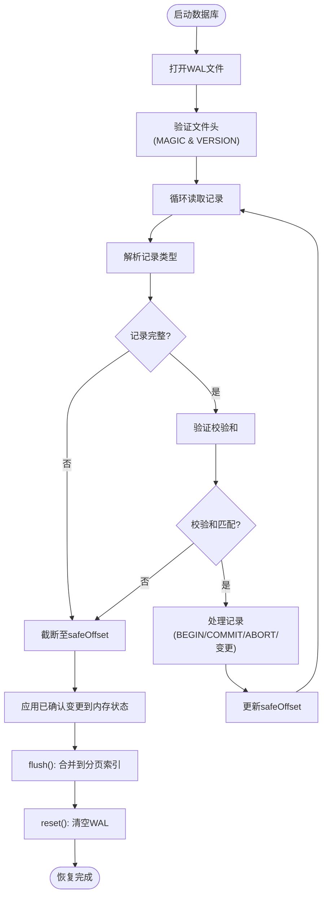

# WAL机制与崩溃恢复

<cite>
**本文档引用的文件**
- [wal.ts](file://src/storage/wal.ts)
- [persistentStore.ts](file://src/storage/persistentStore.ts)
- [txidRegistry.ts](file://src/storage/txidRegistry.ts)
- [wal.test.ts](file://tests/integration/storage/wal.test.ts)
</cite>

## 目录
1. [WAL日志条目格式](#wal日志条目格式)
2. [事务边界标记与批次提交协议](#事务边界标记与批次提交协议)
3. [幂等写入实现原理](#幂等写入实现原理)
4. [txidRegistry协同机制](#txidregistry协同机制)
5. [数据库启动恢复流程](#数据库启动恢复流程)
6. [与persistentStore集成点](#与persistentstore集成点)
7. [WAL配置参数指南](#wal配置参数指南)
8. [测试用例行为分析](#测试用例行为分析)
9. [调试技巧](#调试技巧)

### WAL日志条目格式

WAL v2机制使用二进制格式记录所有写操作，每条记录由固定头部和可变负载组成。头部包含类型码（1字节）、负载长度（4字节）和校验和（4字节），总长9字节。支持的日志类型包括：添加三元组（0x10）、删除三元组（0x20）、设置节点属性（0x30）、设置边属性（0x31）、事务开始（0x40）、事务提交（0x41）和事务中止（0x42）。字符串数据采用长度前缀编码，属性值以JSON格式存储并附带长度信息。

**Section sources**
- [wal.ts](file://src/storage/wal.ts#L3-L10)
- [wal.ts](file://src/storage/wal.ts#L21-L24)

### 事务边界标记与批次提交协议

WAL通过BEGIN、COMMIT和ABORT记录实现嵌套事务语义。`beginBatch()`调用生成BEGIN记录，携带可选的`txId`和`sessionId`元数据；`commitBatch()`生成COMMIT记录，支持`durable: true`选项触发fsync确保持久化；`abortBatch()`生成ABORT记录用于回滚。在重放过程中，这些记录形成一个栈结构：BEGIN压入新层，COMMIT弹出顶层并应用变更，ABORT丢弃顶层变更。内层COMMIT的变更会立即提升为全局可见，不受外层ABORT影响。

**Section sources**
- [wal.ts](file://src/storage/wal.ts#L142-L321)
- [persistentStore.ts](file://src/storage/persistentStore.ts#L714-L725)

### 幂等写入实现原理

幂等性通过`txId`去重机制实现。当启用`enablePersistentTxDedupe`选项时，系统维护一个已提交事务ID的集合。在WAL重放过程中，若遇到带有`txId`的最外层COMMIT记录且该`txId`已在集合中，则跳过该事务的所有变更。这确保了"至少一次"消息投递场景下重复提交不会产生副作用。未启用此选项时，仅在内存中维护去重集，重启后失效。

**Section sources**
- [wal.ts](file://src/storage/wal.ts#L142-L321)
- [persistentStore.ts](file://src/storage/persistentStore.ts#L99-L238)

### txidRegistry协同机制

`txidRegistry`负责持久化事务ID历史记录。它将`txId`列表存储在`*.synapsedb.pages/txids.json`文件中，受`maxRememberTxIds`配置限制。`PersistentStore.open()`时读取注册表构建已知`txId`集供WAL重放使用；`commitBatch()`成功后异步更新注册表，合并新提交的`txId`。这种协同确保了跨数据库生命周期的幂等性保障，即使在崩溃恢复后也能正确识别重复事务。

**Section sources**
- [txidRegistry.ts](file://src/storage/txidRegistry.ts#L9-L13)
- [persistentStore.ts](file://src/storage/persistentStore.ts#L99-L238)

### 数据库启动恢复流程

数据库启动时执行以下恢复步骤：
1. **日志重放**：创建`WalReplayer`实例读取WAL文件，从偏移量12（跳过魔数和版本头）开始解析记录。
2. **完整性验证**：检查魔数`SYNWAL`和版本号，计算并验证每条记录的校验和。
3. **安全截断**：遇到不完整或校验失败的记录时停止重放，并将`safeOffset`作为新的文件末尾。
4. **未完成事务回滚**：WAL中无对应COMMIT的变更被视为未完成，自动回滚。
5. **检查点同步**：重放完成后调用`flush()`将增量变更合并到分页索引，并重置WAL文件。



**Diagram sources**
- [wal.ts](file://src/storage/wal.ts#L142-L321)
- [persistentStore.ts](file://src/storage/persistentStore.ts#L1147-L1207)

**Section sources**
- [wal.ts](file://src/storage/wal.ts#L142-L321)
- [persistentStore.ts](file://src/storage/persistentStore.ts#L99-L238)

### 与persistentStore集成点

`PersistentStore`在多个关键点与WAL集成：
- **写操作拦截**：`addFact()`、`deleteFact()`等方法首先调用`wal.append*()`记录变更，再根据是否在批次中决定立即应用或暂存。
- **事务管理**：`beginBatch()`、`commitBatch()`和`abortBatch()`直接映射到WAL的BEGIN、COMMIT和ABORT记录。
- **启动初始化**：`open()`方法最后阶段执行WAL重放，恢复未持久化的变更。
- **关闭清理**：`close()`方法确保在释放资源前调用`flush()`，避免依赖WAL重放。

```mermaid
classDiagram
class PersistentStore {
+addFact(fact)
+deleteFact(fact)
+setNodeProperties(nodeId, props)
+setEdgeProperties(key, props)
+beginBatch(options)
+commitBatch(options)
+abortBatch()
+static open(path, options)
+close()
}
class WalWriter {
+appendAddTriple(fact)
+appendDeleteTriple(fact)
+appendSetNodeProps(nodeId, props)
+appendSetEdgeProps(ids, props)
+appendBegin(meta)
+appendCommit()
+appendCommitDurable()
+appendAbort()
+reset()
+truncateTo(offset)
+close()
}
class WalReplayer {
+replay(knownTxIds)
}
PersistentStore --> WalWriter : "使用"
PersistentStore --> WalReplayer : "使用"
PersistentStore ..> "拦截所有写操作" : "关联"
```

**Diagram sources**
- [persistentStore.ts](file://src/storage/persistentStore.ts#L436-L467)
- [persistentStore.ts](file://src/storage/persistentStore.ts#L648-L661)
- [wal.ts](file://src/storage/wal.ts#L26-L140)

**Section sources**
- [persistentStore.ts](file://src/storage/persistentStore.ts#L61-L1633)

### WAL配置参数指南

开发者可通过`PersistentStoreOptions`配置WAL行为：
- `enablePersistentTxDedupe`: 布尔值，启用跨周期`txId`幂等去重，默认`false`。
- `maxRememberTxIds`: 数字，记忆的最大`txId`数量，默认1000。
- 批次提交时的`durable`选项控制是否执行fsync，权衡持久性与性能。

**Section sources**
- [persistentStore.ts](file://src/storage/persistentStore.ts#L67-L77)

### 测试用例行为分析

`wal.test.ts`中的测试用例验证了核心恢复行为：创建数据库实例并执行写操作但不调用`flush()`，模拟崩溃；重新打开同一数据库路径，验证之前未持久化的写入能否通过WAL重放正确恢复。该测试证实了WAL作为主要持久化保障的有效性，即使在异常终止后也能保证数据完整性。

**Section sources**
- [wal.test.ts](file://tests/integration/storage/wal.test.ts#L1-L61)

### 调试技巧

- **日志截断分析**：检查WAL文件末尾是否存在不完整记录，`safeOffset`指示有效数据边界。
- **性能瓶颈定位**：监控`append*()`方法的调用频率和`flush()`的执行时间，高频率小批量提交可能导致I/O瓶颈。
- **幂等性验证**：在启用`enablePersistentTxDedupe`时，重复提交相同`txId`的事务应产生零变更。
- **恢复过程观察**：通过`replay()`返回的`committedTx`数组确认哪些新事务被实际应用。

**Section sources**
- [wal.ts](file://src/storage/wal.ts#L142-L321)
- [persistentStore.ts](file://src/storage/persistentStore.ts#L1388-L1451)