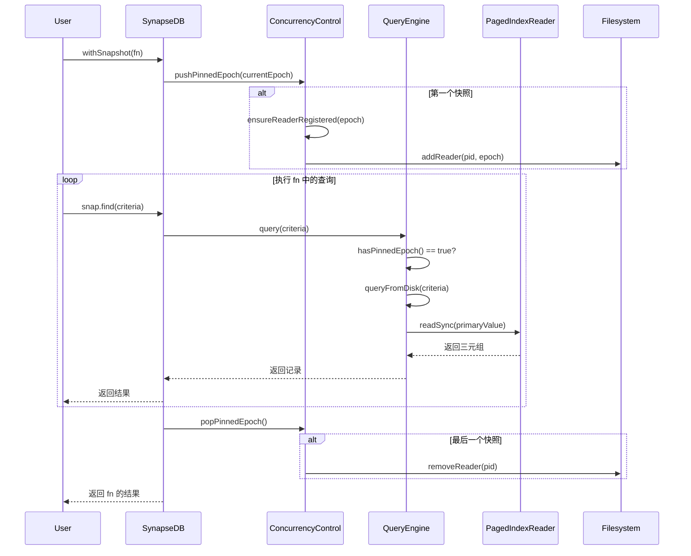

# 事务与快照

<cite>
**本文档引用文件**
- [persistentStore.ts](file://src/storage/persistentStore.ts) - *更新了快照内存优化与事务管理*
- [queryBuilder.ts](file://src/query/queryBuilder.ts) - *新增 collect() 方法并修复物化行为*
- [concurrencyControl.ts](file://src/storage/managers/concurrencyControl.ts) - *快照期间的并发控制逻辑*
- [queryEngine.ts](file://src/storage/managers/queryEngine.ts) - *快照模式下的查询执行*
- [snapshot_memory_optimization.test.ts](file://tests/system/snapshot_memory_optimization.test.ts) - *快照内存测试用例*
</cite>

## 更新摘要
**变更内容**   
- 更新了“事务与快照”机制的文档，重点说明 `withSnapshot()` 的一致性保证
- 新增了 `collect()` 方法的说明，该方法用于异步收集查询结果
- 修正了在快照中使用 `find()` 时的物化行为，确保视图稳定
- 更新了相关代码文件的引用和说明

## 目录
1. [引言](#引言)
2. [快照隔离机制](#快照隔离机制)
3. [事务批次管理](#事务批次管理)
4. [查询构建器与流式处理](#查询构建器与流式处理)
5. [性能与内存优化](#性能与内存优化)

## 引言

SynapseDB 的事务与快照机制是其保证数据一致性和查询隔离性的核心。通过 `withSnapshot()` 方法，用户可以在一个稳定的数据库视图上执行复杂的查询操作，而不受其他并发写入的影响。该机制利用 `PersistentStore` 中的 `ConcurrencyControl` 组件来管理读写者之间的协调，并通过 `QueryEngine` 在快照模式下执行纯磁盘查询，从而避免内存占用的无限制增长。

**本文档引用文件**
- [persistentStore.ts](file://src/storage/persistentStore.ts)
- [synapseDb.ts](file://src/synapseDb.ts)

## 快照隔离机制

`withSnapshot()` 方法提供了一种读取一致性（Read Consistency）的机制，确保在快照执行期间，查询看到的数据库状态是固定的，不会受到其他并发写入的影响。

### 快照的创建与管理

当调用 `withSnapshot()` 时，系统会执行以下步骤：

1.  **固定当前 Epoch**：`ConcurrencyControl` 组件会将当前的 `epoch` 压入一个栈中，并增加快照引用计数。
2.  **注册读者**：如果这是第一个快照，系统会向 `.pages` 目录下的读者注册文件中添加当前进程的 PID 和 epoch，防止后台的压缩（compaction）或垃圾回收（GC）操作删除正在被快照引用的旧索引文件。
3.  **执行查询**：在快照函数 `fn` 内部，所有查询操作都会通过 `QueryEngine` 执行。由于 `hasPinnedEpoch()` 返回 `true`，`QueryEngine` 会自动选择 `queryFromDisk()` 路径，即直接从分页索引文件中读取数据，而不会合并内存中的增量数据。
4.  **释放快照**：当 `fn` 执行完毕后，`popPinnedEpoch()` 会被调用，将 epoch 从栈中弹出。如果这是最后一个快照，系统会注销读者注册，允许后台维护任务清理旧文件。



**Diagram sources**
- [synapseDb.ts](file://src/synapseDb.ts#L458-L460) - *withSnapshot 方法实现*
- [concurrencyControl.ts](file://src/storage/managers/concurrencyControl.ts#L188-L214) - *pushPinnedEpoch 和 popPinnedEpoch*
- [queryEngine.ts](file://src/storage/managers/queryEngine.ts#L37-L50) - *快照模式下的查询*

**本文档引用文件**
- [synapseDb.ts](file://src/synapseDb.ts)
- [concurrencyControl.ts](file://src/storage/managers/concurrencyControl.ts)
- [queryEngine.ts](file://src/storage/managers/queryEngine.ts)

## 事务批次管理

SynapseDB 支持嵌套的事务批次（Batch），允许将多个写入操作组合成一个原子单元。

### 批次的生命周期

1.  **开始批次**：调用 `beginBatch()` 会创建一个新的事务上下文，并将其压入 `TransactionManager` 的栈中。此时，所有写入操作（如 `addFact`）不会直接修改主存储，而是暂存到当前批次的 `adds`、`dels` 等集合中。
2.  **提交批次**：调用 `commitBatch()` 会将当前批次的暂存数据应用到主存储（`TripleStore`、`PropertyStore` 等），并将其从栈中弹出。如果存在外层批次，内层提交的数据会立即对后续查询可见，但不会被持久化到 WAL 直到最外层提交。
3.  **回滚批次**：调用 `abortBatch()` 会丢弃当前批次的所有暂存数据，并将其从栈中弹出。

```typescript
db.beginBatch();
try {
  db.addFact({ subject: 'A', predicate: 'knows', object: 'B' });
  db.setNodeProperties(1, { name: 'Alice' });

  db.beginBatch(); // 内层批次
  db.addFact({ subject: 'B', predicate: 'knows', object: 'C' });
  db.commitBatch(); // 内层提交，'B knows C' 现在可见

  db.addFact({ subject: 'A', predicate: 'knows', object: 'D' });
  db.commitBatch(); // 外层提交，所有数据持久化
} catch (error) {
  db.abortBatch(); // 如果出错，回滚所有操作
}
```

**Section sources**
- [persistentStore.ts](file://src/storage/persistentStore.ts#L416-L436) - *beginBatch, commitBatch, abortBatch 方法*
- [transactionManager.ts](file://src/storage/managers/transactionManager.ts#L34-L208) - *TransactionManager 实现*

## 查询构建器与流式处理

`QueryBuilder` 是执行复杂查询的核心组件，它支持链式调用和流式处理。

### `collect()` 方法

为了统一异步处理流程，`QueryBuilder` 新增了 `collect()` 方法。该方法返回一个 `Promise<FactRecord[]>`，与 `all()` 方法功能相同，但明确表示其异步语义。这有助于在 `async/await` 环境中保持代码的一致性。

```typescript
const results = await db.withSnapshot(async (snap) => {
  return snap.find({ predicate: 'knows' }).collect(); // 返回 Promise<FactRecord[]>
});
```

**关键修复**：在 `withSnapshot()` 内部使用 `find()` 时，之前的实现可能会导致查询视图不稳定。现在，`QueryBuilder` 在 `pin()` 和 `unpin()` 的保护下执行，确保在整个查询链路中使用的是同一个固定的快照视图。

**Section sources**
- [queryBuilder.ts](file://src/query/queryBuilder.ts#L183-L192) - *collect 方法实现*
- [queryBuilder.ts](file://src/query/queryBuilder.ts#L1043) - *默认不固定快照，由 withSnapshot 控制*

## 性能与内存优化

快照机制的一个重要目标是控制内存使用，避免在处理大数据集时发生内存溢出。

### 内存增长控制

`snapshot_memory_optimization.test.ts` 测试用例验证了快照查询的内存稳定性。测试表明，在执行全量扫描或流式查询时，内存增长被严格控制在合理范围内（例如，小于 15MB），即使在后台同时执行压缩和垃圾回收操作。

**优化策略**：
- **纯磁盘查询**：在快照模式下，`QueryEngine` 避免将整个数据集加载到内存，而是按需从分页索引文件中读取。
- **流式迭代**：对于大结果集，推荐使用 `findStream()` 或 `batch()` 方法，以分批处理数据，避免一次性加载所有结果。

**Section sources**
- [snapshot_memory_optimization.test.ts](file://tests/system/snapshot_memory_optimization.test.ts) - *内存优化测试*
- [queryEngine.ts](file://src/storage/managers/queryEngine.ts#L92-L100) - *streamFactRecords 方法*