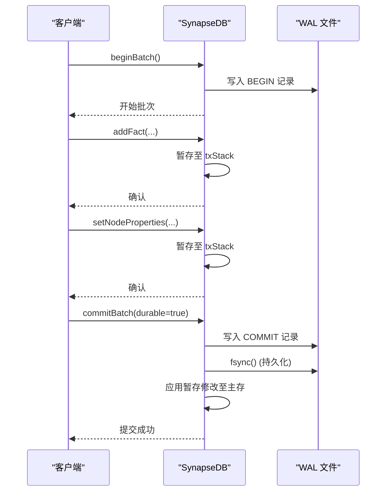
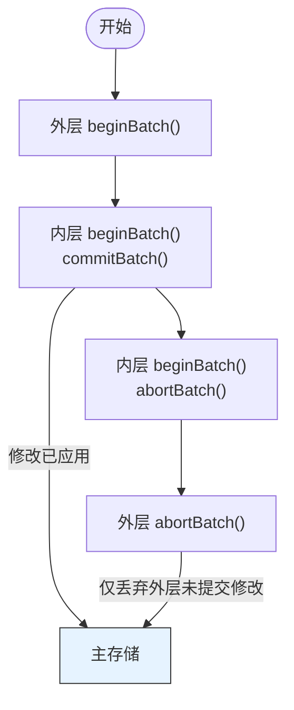
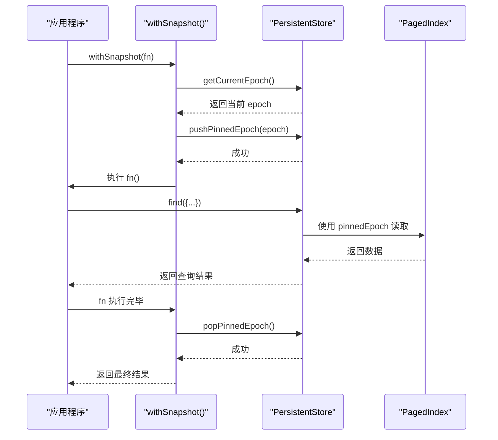
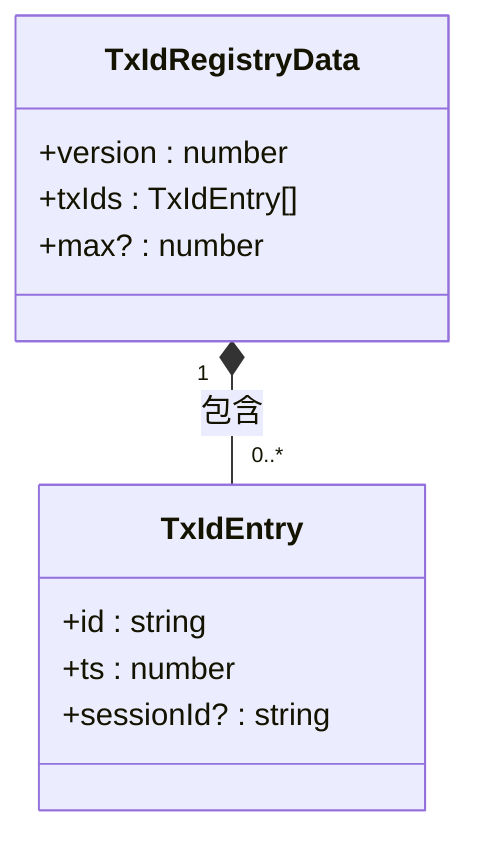

# 事务与快照

<cite>
**本文档引用的文件**
- [synapseDb.ts](file://src/synapseDb.ts)
- [persistentStore.ts](file://src/storage/persistentStore.ts)
- [wal.ts](file://src/storage/wal.ts)
- [txidRegistry.ts](file://src/storage/txidRegistry.ts)
- [readerRegistry.ts](file://src/storage/readerRegistry.ts)
- [query_snapshot_isolation.test.ts](file://tests/system/query_snapshot_isolation.test.ts)
- [wal_nested_bug_reproduce.test.ts](file://tests/integration/storage/wal_nested_bug_reproduce.test.ts)
</cite>

## 目录
1. [引言](#引言)
2. [批次事务与原子性](#批次事务与原子性)
3. [嵌套事务管理](#嵌套事务管理)
4. [快照隔离机制](#快照隔离机制)
5. [事务ID与可见性](#事务id与可见性)
6. [并发隔离测试](#并发隔离测试)
7. [写锁与读者注册表](#写锁与读者注册表)
8. [最佳实践](#最佳实践)

## 引言
SynapseDB 实现了一套基于预写式日志（WAL）的高级事务系统，支持批次事务、嵌套事务和快照隔离。本专题文档深入解析其核心机制，包括 `beginBatch()` 和 `commitBatch()` 如何保证原子性与持久性，`withSnapshot()` 如何创建一致性读视图以避免脏读和不可重复读，以及 `txidRegistry` 和 `readerRegistry` 如何协同工作以确保数据一致性和垃圾回收安全。

**Section sources**
- [synapseDb.ts](file://src/synapseDb.ts#L460-L491)
- [persistentStore.ts](file://src/storage/persistentStore.ts#L1-L1665)

## 批次事务与原子性
SynapseDB 的事务模型围绕 `beginBatch()` 和 `commitBatch()` 接口构建，通过 WAL 实现了强原子性和可选的持久性保障。

当调用 `beginBatch()` 时，系统会向 WAL 写入一条 `BEGIN` 记录，并将后续的所有写操作（如 `addFact`, `setNodeProperties`）暂存于一个内存栈中，而不是立即应用到主存储。这确保了在 `commitBatch()` 被调用前，任何修改对其他会话都是不可见的。



**Diagram sources**
- [synapseDb.ts](file://src/synapseDb.ts#L460-L466)
- [persistentStore.ts](file://src/storage/persistentStore.ts#L1-L1665)
- [wal.ts](file://src/storage/wal.ts#L3-L10)

**Section sources**
- [synapseDb.ts](file://src/synapseDb.ts#L460-L466)
- [persistentStore.ts](file://src/storage/persistentStore.ts#L1-L1665)

## 嵌套事务管理
SynapseDB 支持真正的嵌套事务，其行为遵循“内层提交即生效”的语义。这是通过维护一个事务栈（`txStack`）来实现的。

每次 `beginBatch()` 都会在栈上创建一个新的层级。当 `commitBatch()` 被调用时：
- 如果是**最外层**的提交，整个批次的修改会被一次性应用到主存储。
- 如果是**内层**的提交，其修改会立即被提升为全局可见，即使外层事务随后被 `abortBatch()` 回滚，这些已提交的内层修改也不会丢失。

这种设计允许部分回滚，提供了极大的灵活性。例如，在一个复杂的业务流程中，可以将某些关键步骤作为内层事务提交，确保其结果不会因后续非关键步骤的失败而丢失。



**Diagram sources**
- [persistentStore.ts](file://src/storage/persistentStore.ts#L1-L1665)
- [wal_nested_bug_reproduce.test.ts](file://tests/integration/storage/wal_nested_bug_reproduce.test.ts#L0-L105)

**Section sources**
- [persistentStore.ts](file://src/storage/persistentStore.ts#L1-L1665)
- [wal_nested_bug_reproduce.test.ts](file://tests/integration/storage/wal_nested_bug_reproduce.test.ts#L0-L105)

## 快照隔离机制
`withSnapshot()` 方法是实现快照隔离的核心。它通过固定数据库的“epoch”（一个随每次分页索引更新而递增的版本号）来创建一个一致性读视图。

当 `withSnapshot()` 被调用时，它会执行以下步骤：
1.  获取当前的 epoch 值。
2.  将此 epoch 值推入一个“钉住的 epoch 栈”（`pinnedEpochStack`），并增加一个内部计数器（`snapshotDepth`）。
3.  在这个回调函数执行期间，所有查询都将使用这个固定的 epoch 来访问分页索引，从而保证在整个查询链路中看到的是同一时刻的数据状态。
4.  回调结束后，无论是否发生异常，都会从栈中弹出该 epoch 并减少计数器。

这种方法有效地防止了“幻读”和“不可重复读”，因为查询过程中底层的物理存储结构（如分页索引）不会被后台的压缩或合并任务所改变。



**Diagram sources**
- [synapseDb.ts](file://src/synapseDb.ts#L477-L491)
- [persistentStore.ts](file://src/storage/persistentStore.ts#L1-L1665)

**Section sources**
- [synapseDb.ts](file://src/synapseDb.ts#L477-L491)
- [persistentStore.ts](file://src/storage/persistentStore.ts#L1-L1665)

## 事务ID与可见性
### 事务ID分配 (`txidRegistry`)
为了支持跨重启周期的幂等性，SynapseDB 引入了 `txidRegistry` 机制。当数据库打开时，它会从 `*.synapsedb.pages/txids.json` 文件中读取一个历史 `txId` 的集合。

在 `commitBatch()` 时，如果指定了 `txId`，系统会检查该 `txId` 是否已在注册表中。如果存在，则本次提交被视为重复操作而被跳过；如果不存在，则将其加入注册表并正常处理。这确保了在“至少一次”消息投递场景下，重试不会导致数据重复。



**Diagram sources**
- [txidRegistry.ts](file://src/storage/txidRegistry.ts#L9-L13)

**Section sources**
- [txidRegistry.ts](file://src/storage/txidRegistry.ts#L9-L77)
- [persistentStore.ts](file://src/storage/persistentStore.ts#L1-L1665)

### 可见性判断规则
事务的可见性由两个主要因素决定：
1.  **WAL 重放顺序**：在崩溃恢复时，`WalReplayer` 会严格按照 WAL 中记录的顺序重放操作。`COMMIT` 记录标志着一批修改成为永久状态。
2.  **快照 epoch**：对于正在运行的查询，其可见性由 `withSnapshot()` 创建时固定的 epoch 决定。只有在此 epoch 之前已经 `flush()` 到分页索引中的数据才是可见的。

## 并发隔离测试
系统测试用例 `query_snapshot_isolation.test.ts` 验证了在高并发场景下的隔离效果。

例如，一个测试用例启动了一个长时间的 `withSnapshot()` 查询，同时并发地执行自动压缩（`autoCompact`）和垃圾回收（`garbageCollectPages`）。测试结果证明，尽管后台维护任务可能改变了底层的物理存储布局，但长查询仍然能返回一个完整且一致的结果集，没有出现数据丢失或不一致的情况。

另一个测试验证了快照的“时间点”特性：在一个快照查询执行期间，外部的新写入操作不会影响该查询的结果，从而实现了严格的快照隔离。

**Section sources**
- [query_snapshot_isolation.test.ts](file://tests/system/query_snapshot_isolation.test.ts#L0-L285)

## 写锁与读者注册表
### 协同作用
写锁（由 `acquireLock` 实现）和读者注册表（`readerRegistry`）共同协作，解决了多进程环境下的并发控制和垃圾回收安全问题。

- **写锁**：确保在同一时间只有一个写者进程可以持有数据库的独占访问权，防止多个写者之间的冲突。
- **读者注册表**：每个开启 `registerReader` 选项的进程（无论是读还是写）都会在 `*.synapsedb.pages/readers/` 目录下创建一个以其 PID 命名的临时文件。这个文件包含了它所依赖的 epoch。

### 防止活跃读取被误清除
垃圾回收（GC）在清理旧的页面文件时，会首先检查 `readerRegistry`。它会遍历所有活跃读者的 epoch，确定哪些 epoch 仍在被使用。只有那些比所有活跃读者都更老的 epoch 对应的页面才会被安全地删除。

这确保了即使一个长查询正在进行，其依赖的旧数据页也不会被 GC 清除，从而保证了查询的正确性。

```mermaid
erDiagram
WRITER ||--o{ READER_REGISTRY : "注册"
READER_REGISTRY }o--|| GARBAGE_COLLECTOR : "检查"
GARBAGE_COLLECTOR }|--|| PAGE_FILE : "删除"
class WRITER {
pid: number
epoch: number
}
class READER_REGISTRY {
readers: ReaderInfo[]
}
class GARBAGE_COLLECTOR {
safe_epoch: number
}
class PAGE_FILE {
epoch: number
status: enum
}
```

**Diagram sources**
- [readerRegistry.ts](file://src/storage/readerRegistry.ts#L16-L19)
- [persistentStore.ts](file://src/storage/persistentStore.ts#L1-L1665)

**Section sources**
- [readerRegistry.ts](file://src/storage/readerRegistry.ts#L16-L208)
- [persistentStore.ts](file://src/storage/persistentStore.ts#L1-L1665)

## 最佳实践
### 长事务对GC的影响
长时间运行的 `withSnapshot()` 会阻止 GC 清理其 epoch 之后的所有旧页面。这可能导致磁盘空间占用持续增长。因此，应尽量缩短快照的生命周期，避免在快照中执行不必要的长时间操作。

### 快照内存占用控制
虽然 `withSnapshot()` 主要通过固定 epoch 来保证一致性，但其内部的查询仍可能加载大量数据到内存。建议结合流式查询 API（如 `findStreaming`）来处理大数据集，以保持恒定的内存占用。

### 合理配置 `maxRememberTxIds`
`enablePersistentTxDedupe` 是一个强大的功能，但 `maxRememberTxIds` 设置过大可能会导致 `txids.json` 文件无限增长。应根据实际的事务吞吐量和重试窗口期来设置一个合理的上限值。

**Section sources**
- [persistentStore.ts](file://src/storage/persistentStore.ts#L1-L1665)
- [readerRegistry.ts](file://src/storage/readerRegistry.ts#L16-L208)
- [txidRegistry.ts](file://src/storage/txidRegistry.ts#L9-L77)