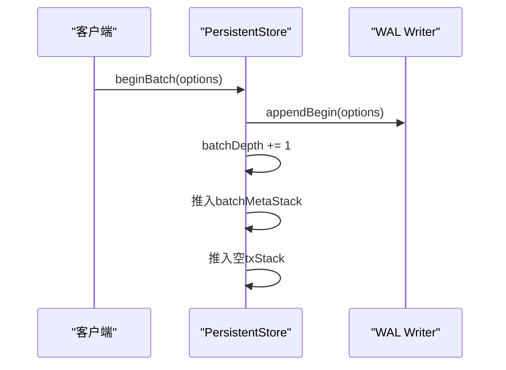
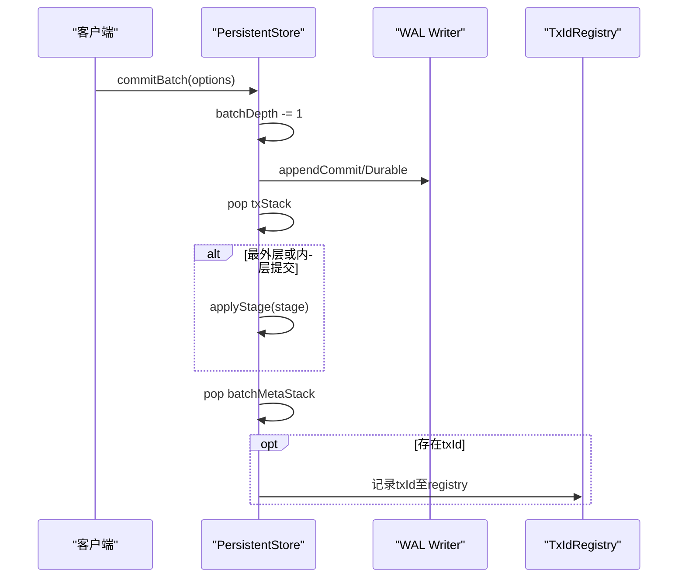
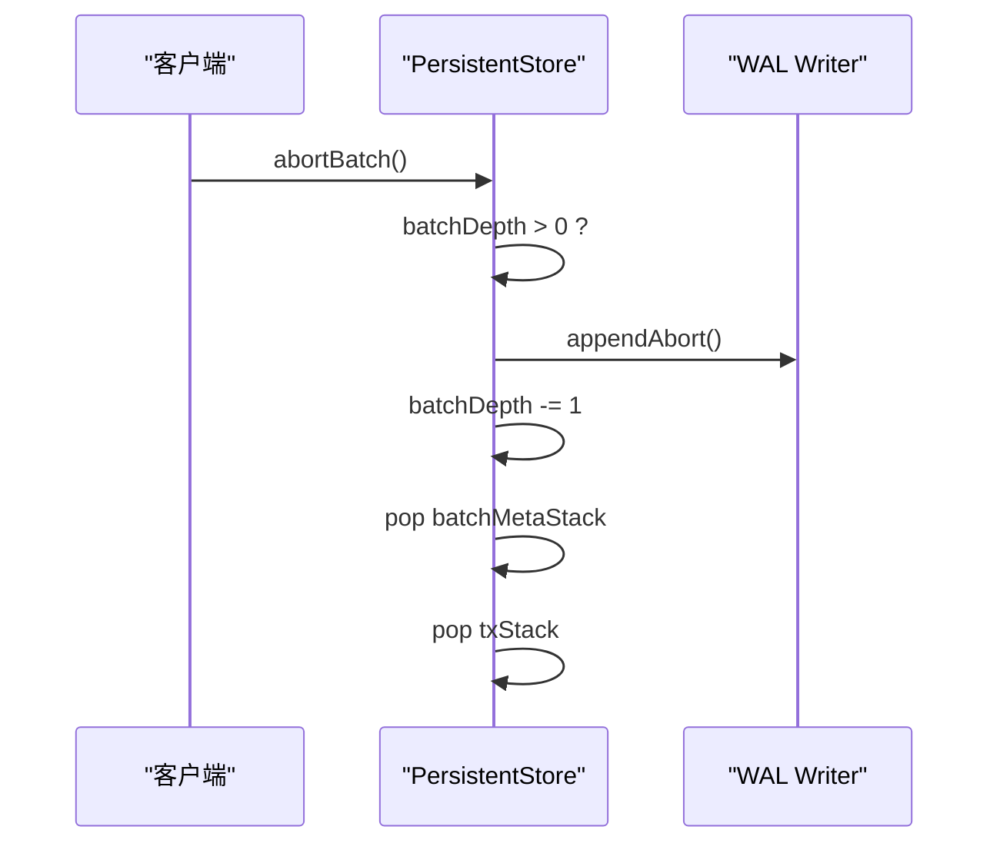
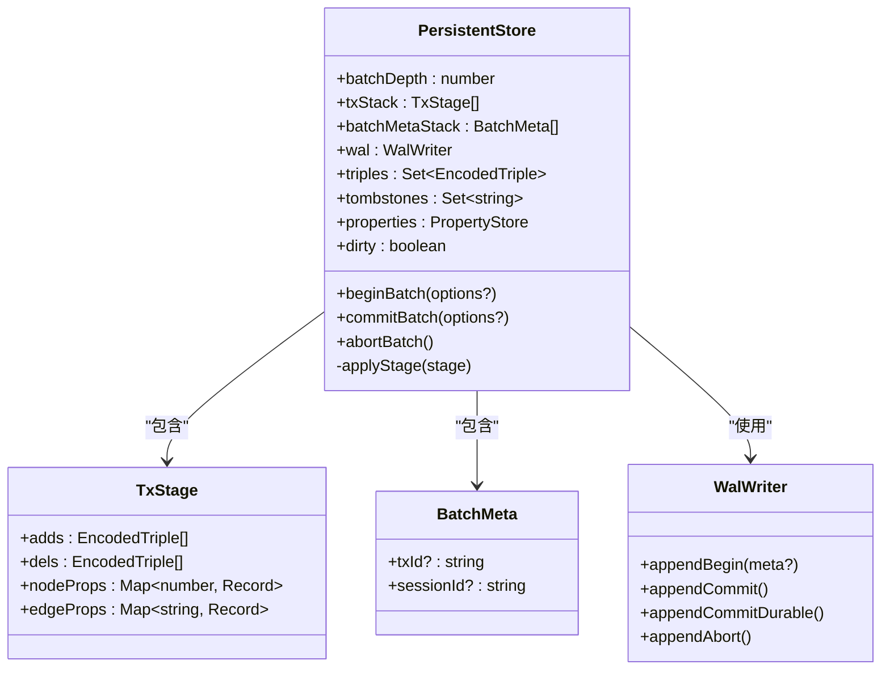
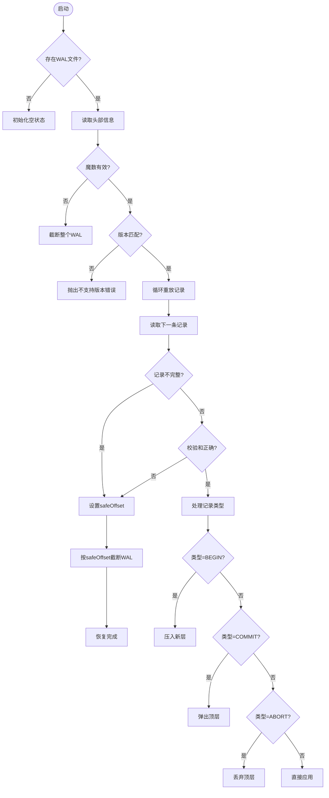
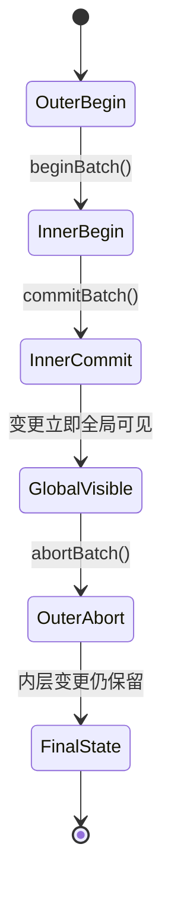
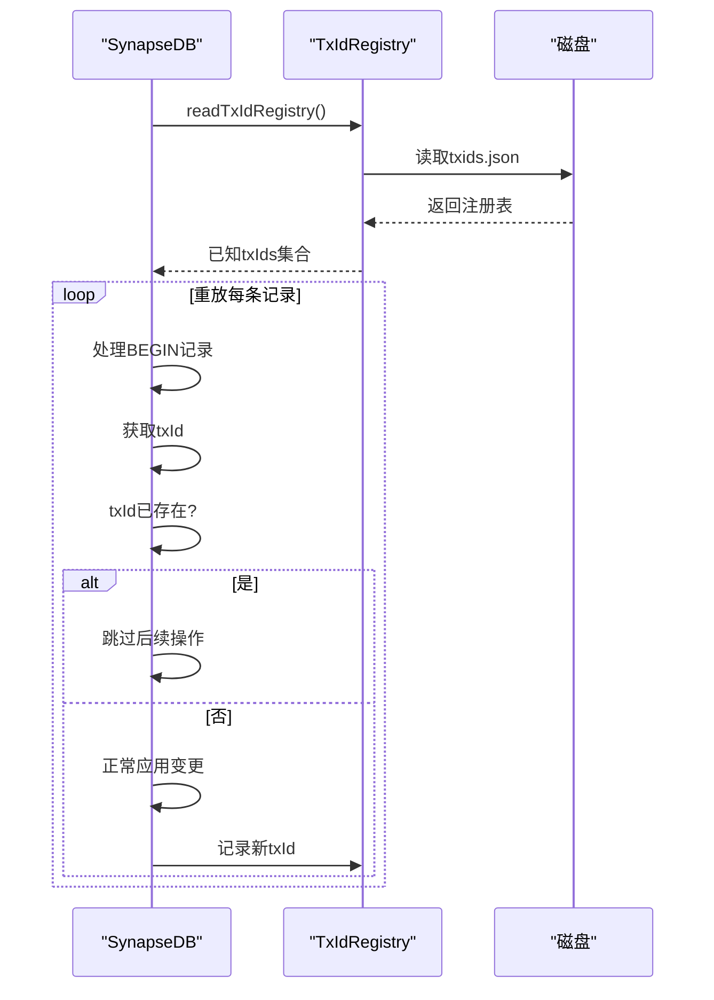

# 事务生命周期管理

<cite>
**本文档引用的文件**
- [persistentStore.ts](file://src/storage/persistentStore.ts)
- [wal.ts](file://src/storage/wal.ts)
- [txidRegistry.ts](file://src/storage/txidRegistry.ts)
- [openOptions.ts](file://src/types/openOptions.ts)
- [wal_txid_idempotent.test.ts](file://tests/integration/storage/wal_txid_idempotent.test.ts)
- [wal_nested_bug_reproduce.test.ts](file://tests/integration/storage/wal_nested_bug_reproduce.test.ts)
- [wal_commit_durable.test.ts](file://tests/integration/storage/wal_commit_durable.test.ts)
- [wal_abort_semantics.test.ts](file://tests/integration/storage/wal_abort_semantics.test.ts)
- [教程-04-事务-WAL-幂等.md](file://docs/教学文档/教程-04-事务-WAL-幂等.md)
</cite>

## 目录
1. [引言](#引言)
2. [事务核心阶段解析](#事务核心阶段解析)
3. [持久化存储协调机制](#持久化存储协调机制)
4. [WAL日志系统与崩溃恢复](#wal日志系统与崩溃恢复)
5. [事务选项与提交行为控制](#事务选项与提交行为控制)
6. [嵌套事务管理策略](#嵌套事务管理策略)
7. [事务ID分配与幂等性实现](#事务id分配与幂等性实现)
8. [常见问题排查指南](#常见问题排查指南)
9. [结论](#结论)

## 引言
SynapseDB采用基于批次的事务模型，通过`beginBatch`、`commitBatch`和`abortBatch`三个核心方法管理事务生命周期。该系统结合WAL（预写式日志）确保数据的原子性与持久性，并支持可选的幂等提交机制以应对失败重试场景。本文档深入解析其内部实现原理及关键特性。

**Section sources**
- [教程-04-事务-WAL-幂等.md](file://docs/教学文档/教程-04-事务-WAL-幂等.md#L0-L41)

## 事务核心阶段解析

### beginBatch：事务开始
`beginBatch`方法启动一个新的事务批次，记录元信息并初始化暂存区。它接受可选的`txId`和`sessionId`参数用于审计和幂等控制。



**Diagram sources**
- [persistentStore.ts](file://src/storage/persistentStore.ts#L714-L725)

**Section sources**
- [persistentStore.ts](file://src/storage/persistentStore.ts#L714-L725)

### commitBatch：事务提交
`commitBatch`完成当前事务批次的提交。根据是否为最外层事务决定是否将变更应用到主存储，并可选择强制同步到磁盘以保证持久性。



**Diagram sources**
- [persistentStore.ts](file://src/storage/persistentStore.ts#L727-L763)

**Section sources**
- [persistentStore.ts](file://src/storage/persistentStore.ts#L727-L763)

### abortBatch：事务中止
`abortBatch`放弃当前事务批次的所有修改，仅影响栈顶一层，支持嵌套事务的部分回滚。



**Diagram sources**
- [persistentStore.ts](file://src/storage/persistentStore.ts#L765-L773)

**Section sources**
- [persistentStore.ts](file://src/storage/persistentStore.ts#L765-L773)

## 持久化存储协调机制
`PersistentStore`作为核心协调者，管理所有写入操作并通过`applyStage`方法将暂存变更应用到主存储结构。



**Diagram sources**
- [persistentStore.ts](file://src/storage/persistentStore.ts#L714-L773)
- [wal.ts](file://src/storage/wal.ts#L142-L321)

**Section sources**
- [persistentStore.ts](file://src/storage/persistentStore.ts#L1468-L1504)

## WAL日志系统与崩溃恢复
WAL（Write-Ahead Logging）系统确保所有写操作先记录日志再应用到内存，保障崩溃后的数据一致性。

### WAL记录类型
| 类型码 | 名称 | 说明 |
|-------|------|------|
| 0x10 | addTriple | 添加三元组 |
| 0x20 | deleteTriple | 删除三元组 |
| 0x30 | setNodeProps | 设置节点属性 |
| 0x31 | setEdgeProps | 设置边属性 |
| 0x40 | beginBatch | 开始批次事务 |
| 0x41 | commitBatch | 提交批次事务 |
| 0x42 | abortBatch | 中止批次事务 |

### 崩溃恢复流程


**Diagram sources**
- [wal.ts](file://src/storage/wal.ts#L142-L321)

**Section sources**
- [wal.ts](file://src/storage/wal.ts#L142-L321)
- [教程-04-事务-WAL-幂等.md](file://docs/教学文档/教程-04-事务-WAL-幂等.md#L14-L18)

## 事务选项与提交行为控制

### BeginBatchOptions
定义事务开始时的可选参数：

**标签**: txId  
*描述*: 可选的事务标识符，用于幂等性控制。相同 `txId` 的事务只会执行一次，重复提交将被忽略。  

**标签**: sessionId  
*描述*: 可选的会话标识符，用于审计和调试。

```typescript
interface BeginBatchOptions {
  txId?: string;
  sessionId?: string;
}
```

### CommitBatchOptions
控制事务提交的行为：

**标签**: durable  
*描述*: 当设为 `true` 时，提交操作将强制同步到磁盘（fsync），确保在系统崩溃后数据不会丢失。默认值为 `false`，启用会显著降低写入性能但提供更强的持久性保证。

```typescript
interface CommitBatchOptions {
  durable?: boolean;
}
```

**Section sources**
- [openOptions.ts](file://src/types/openOptions.ts#L116-L151)

## 嵌套事务管理策略
SynapseDB支持嵌套事务，采用栈式管理策略，每层独立维护其变更集和元信息。

### 内层提交语义
当内层事务调用`commitBatch`时，其变更立即应用到全局状态，不受外层后续`abortBatch`的影响。这与传统数据库的嵌套事务语义不同，更接近于“保存点”概念。



**Diagram sources**
- [wal_nested_bug_reproduce.test.ts](file://tests/integration/storage/wal_nested_bug_reproduce.test.ts#L0-L105)

**Section sources**
- [wal_nested_bug_reproduce.test.ts](file://tests/integration/storage/wal_nested_bug_reproduce.test.ts#L0-L105)

## 事务ID分配与幂等性实现
通过`txidRegistry`机制实现跨周期的事务幂等性，防止因网络重试导致的重复提交。

### 实现原理
1. 在`commitBatch`时异步将`txId`写入`txids.json`
2. 崩溃恢复时由`WalReplayer`读取已知`txIds`集合
3. 重放过程中跳过已存在的`txId`对应的提交



**Diagram sources**
- [txidRegistry.ts](file://src/storage/txidRegistry.ts#L9-L13)
- [wal_txid_idempotent.test.ts](file://tests/integration/storage/wal_txid_idempotent.test.ts#L0-L69)

**Section sources**
- [txidRegistry.ts](file://src/storage/txidRegistry.ts#L9-L77)
- [wal_txid_idempotent.test.ts](file://tests/integration/storage/wal_txid_idempotent.test.ts#L0-L69)
- [教程