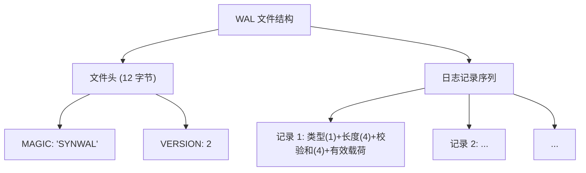
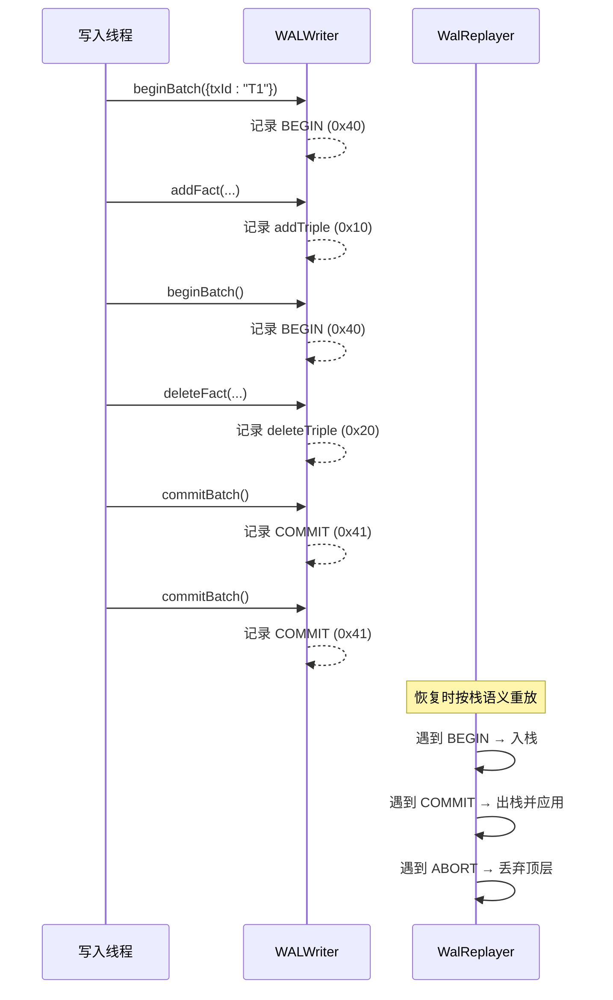
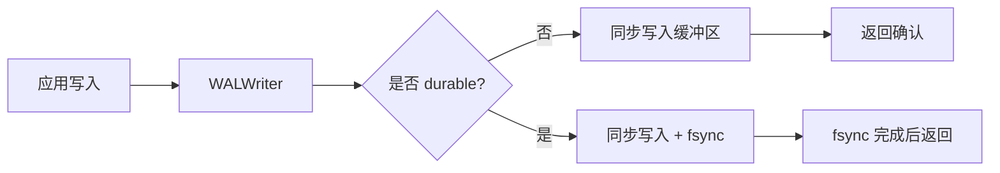
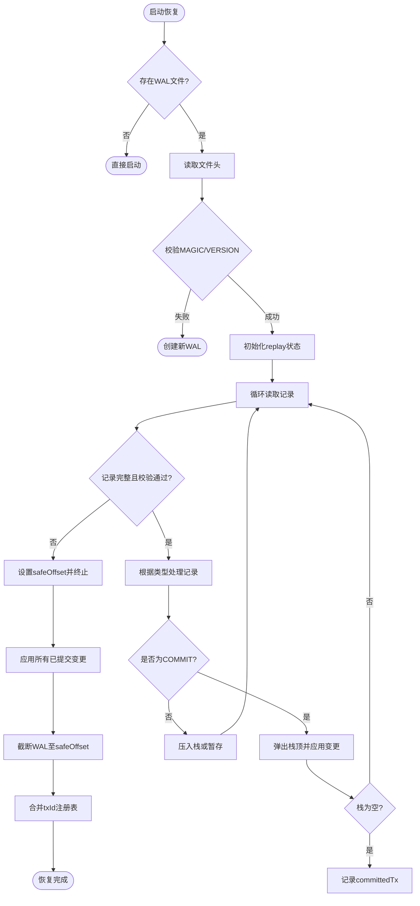
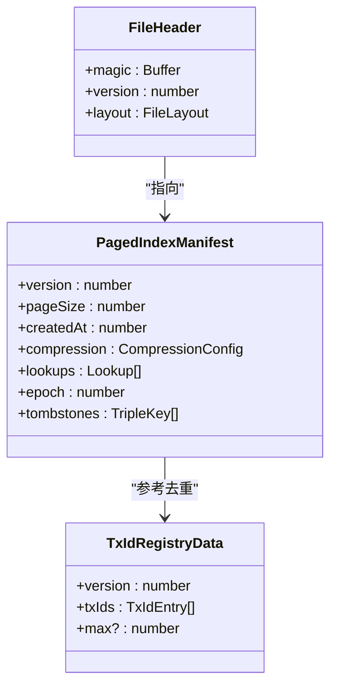
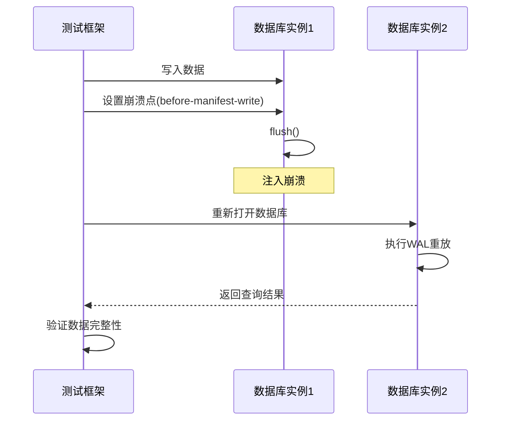

# 崩溃恢复与WAL持久化

<cite>
**本文档引用的文件**
- [wal.ts](file://src/storage/wal.ts)
- [persistentStore.ts](file://src/storage/persistentStore.ts)
- [txidRegistry.ts](file://src/storage/txidRegistry.ts)
- [layout.ts](file://src/storage/layout.ts)
- [crash_injection.test.ts](file://tests/system/crash_injection.test.ts)
- [wal_tail_truncation.test.ts](file://tests/integration/storage/wal_tail_truncation.test.ts)
</cite>

## 目录
1. [引言](#引言)
2. [WAL v2日志记录格式](#wal-v2日志记录格式)
3. [事务边界标记与嵌套语义](#事务边界标记与嵌套语义)
4. [校验和与刷盘策略](#校验和与刷盘策略)
5. [重启恢复流程](#重启恢复流程)
6. [恢复起点定位算法](#恢复起点定位算法)
7. [断电场景耐久性验证](#断电场景耐久性验证)
8. [WAL截断与归档管理](#wal截断与归档管理)
9. [结论](#结论)

## 引言
本系统采用基于WAL v2（Write-Ahead Logging）的日志重放机制来确保在系统崩溃后能够恢复到一致状态。该机制通过将所有数据修改操作先写入预写式日志（WAL），再异步刷新到主存储文件，从而提供强大的数据持久性和一致性保障。当数据库意外关闭或发生断电时，系统会在下次启动时自动执行恢复流程，解析并重放WAL中的未完成事务，以重建完整的数据视图。

**Section sources**
- [wal.ts](file://src/storage/wal.ts#L0-L24)
- [persistentStore.ts](file://src/storage/persistentStore.ts#L1170-L1207)

## WAL v2日志记录格式
WAL v2使用二进制格式存储操作日志，每条记录由固定头部和可变长度的有效载荷组成。头部包含类型码、有效载荷长度和校验和三个字段，总长9字节。有效载荷则根据操作类型编码具体数据。

日志记录类型包括：
- `0x10`：添加三元组（addTriple）
- `0x20`：删除三元组（deleteTriple）
- `0x30`：设置节点属性（setNodeProps）
- `0x31`：设置边属性（setEdgeProps）
- `0x40`：开始批次（beginBatch）
- `0x41`：提交批次（commitBatch）
- `0x42`：中止批次（abortBatch）

所有WAL文件以6字节魔数"SYNWAL"和4字节版本号开头，构成12字节的文件头，用于标识文件格式和兼容性。

**Diagram sources**
- [wal.ts](file://src/storage/wal.ts#L0-L24)
- [wal.ts](file://src/storage/wal.ts#L18-L71)

**Section sources**
- [wal.ts](file://src/storage/wal.ts#L0-L24)

## 事务边界标记与嵌套语义
系统支持嵌套事务语义，通过BEGIN、COMMIT和ABORT三种特殊记录来标记事务边界。BEGIN记录（0x40）可携带txId和sessionId等元数据，用于实现幂等性控制；COMMIT记录（0x41）表示事务成功提交；ABORT记录（0x42）表示事务被回滚。

在恢复过程中，WAL重放器维护一个栈结构来处理嵌套事务。内层事务的COMMIT会立即将其变更提升为全局可见，不受外层事务后续ABORT的影响。只有最外层的COMMIT才会触发持久化去重逻辑，防止重复应用已提交的事务。

**Diagram sources**
- [wal.ts](file://src/storage/wal.ts#L142-L321)
- [persistentStore.ts](file://src/storage/persistentStore.ts#L61-L904)

**Section sources**
- [wal.ts](file://src/storage/wal.ts#L142-L321)

## 校验和与刷盘策略
为确保日志完整性，每条记录都包含一个简单的累加校验和。在写入时计算有效载荷的校验和，并随记录一同写入；在读取时重新计算并与存储值比较，若不匹配则停止重放，保证不会应用损坏的数据。

对于关键的持久化操作，系统提供两种刷盘策略：
1. **普通提交**：仅保证日志写入操作系统缓冲区
2. **持久化提交**（durable=true）：调用fsync强制将日志刷入磁盘，确保即使断电也不会丢失

用户可通过commitBatch({durable: true})显式请求强持久性保障，代价是更高的提交延迟。

**Diagram sources**
- [wal.ts](file://src/storage/wal.ts#L73-L123)
- [wal.ts](file://src/storage/wal.ts#L120-L143)

**Section sources**
- [wal.ts](file://src/storage/wal.ts#L73-L123)

## 重启恢复流程
数据库重启时的恢复流程如下：

1. 打开WAL文件并验证魔数和版本号
2. 初始化一个空的状态暂存区
3. 逐条读取并校验日志记录
4. 根据事务栈语义处理BEGIN/COMMIT/ABORT
5. 对于已完成的事务，将其变更累积到结果集中
6. 遇到校验失败或不完整记录时停止，并记录安全偏移量
7. 将重放得到的数据应用到内存状态
8. 截断WAL至安全偏移量，防止重复重放

此过程确保了只有完全写入且校验通过的事务才会被重放，未完成的事务将被安全丢弃。

**Diagram sources**
- [wal.ts](file://src/storage/wal.ts#L142-L321)
- [persistentStore.ts](file://src/storage/persistentStore.ts#L61-L904)

**Section sources**
- [wal.ts](file://src/storage/wal.ts#L142-L321)

## 恢复起点定位算法
恢复起点由fileHeader中的epoch与checkpoint信息共同决定。fileHeader包含一个64字节的固定头部，其中定义了文件布局和版本信息。分页索引的manifest文件中保存了当前epoch编号，每次flush成功后递增。

恢复时首先读取manifest获取最后稳定的epoch，然后打开WAL进行重放。WAL重放器会跳过那些已在之前epoch中处理过的事务（通过txidRegistry去重），只重放新的变更。这种机制结合了检查点和增量日志的优点，在保证快速恢复的同时维持了高吞吐量。

**Diagram sources**
- [layout.ts](file://src/storage/layout.ts#L16-L20)
- [txidRegistry.ts](file://src/storage/txidRegistry.ts#L9-L13)

**Section sources**
- [layout.ts](file://src/storage/layout.ts#L16-L20)
- [txidRegistry.ts](file://src/storage/txidRegistry.ts#L9-L13)

## 断电场景耐久性验证
系统通过crash_injection测试验证断电场景下的耐久性保障。测试框架允许在flush过程的关键路径上注入崩溃点，如：
- before-incremental-write：增量写入前
- before-page-append：页面追加前
- before-manifest-write：清单写入前
- before-wal-reset：WAL重置前

测试表明，无论在哪个阶段发生崩溃，重启后都能正确恢复到最后一次成功的提交状态，且不会出现数据重复或丢失。特别是before-wal-reset阶段的崩溃，由于WAL尚未清空，重放机制会自动去重，确保最终一致性。

**Diagram sources**
-