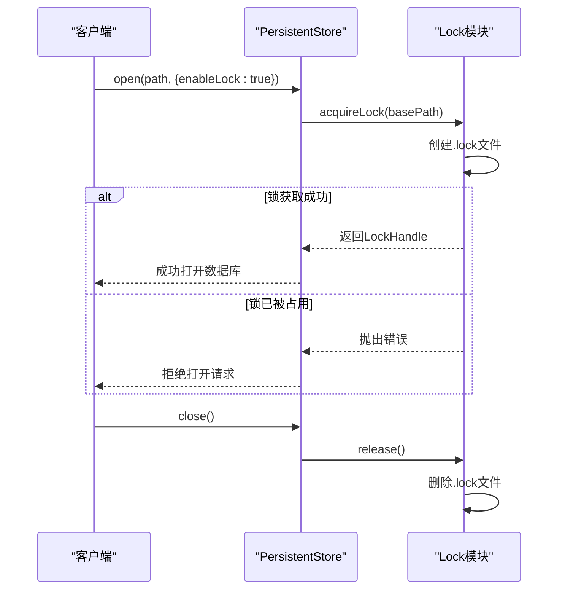
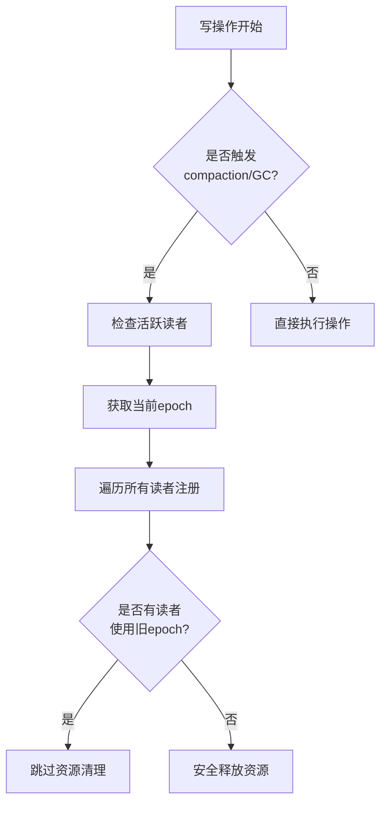
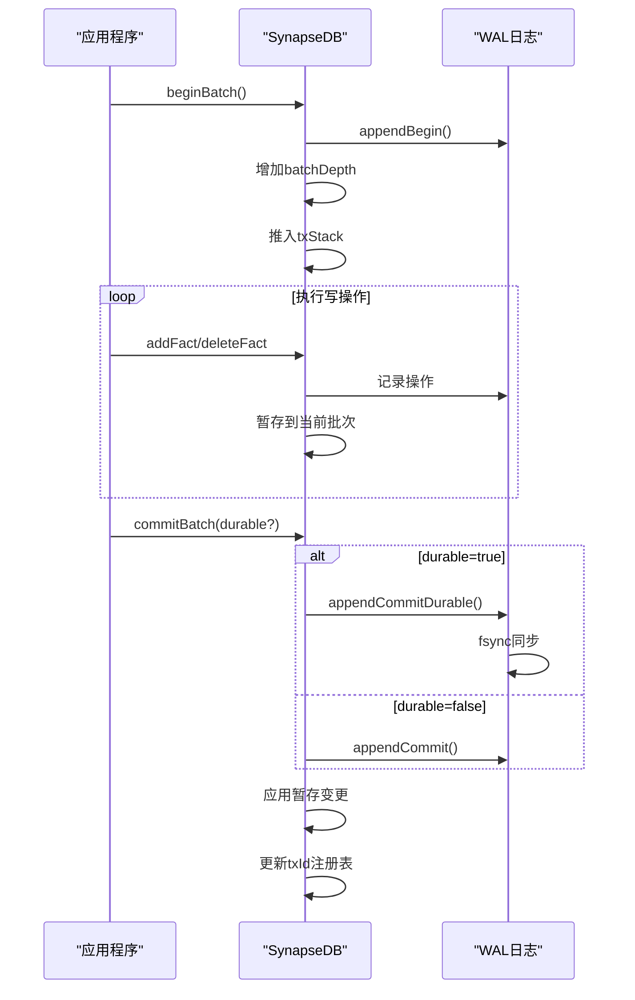

# 并发控制与写锁机制

<cite>
**本文档引用的文件**   
- [lock.ts](file://src/utils/lock.ts)
- [persistentStore.ts](file://src/storage/persistentStore.ts)
- [readerRegistry.ts](file://src/storage/readerRegistry.ts)
- [wal.ts](file://src/storage/wal.ts)
- [openOptions.ts](file://src/types/openOptions.ts)
</cite>

## 目录
1. [单写者多读者并发模型](#单写者多读者并发模型)
2. [写锁实现机制](#写锁实现机制)
3. [读写协作与资源保护](#读写协作与资源保护)
4. [高并发场景下的写饥饿分析](#高并发场景下的写饥饿分析)
5. [事务生命周期中的锁管理](#事务生命周期中的锁管理)
6. [性能调优建议](#性能调优建议)

## 单写者多读者并发模型

SynapseDB 采用单写者多读者（Single Writer Multiple Readers, SWMR）并发模型，确保数据一致性和系统稳定性。该模型允许多个读取者同时访问数据库，但严格限制同一时间只有一个写入者可以修改数据。

这种设计通过进程级独占写锁来实现排他性写访问，防止多个写事务同时进入系统导致数据损坏。写锁机制在打开数据库时通过 `enableLock` 配置选项启用，当设置为 `true` 时，同一路径只允许一个写者进程访问。

对于读取操作，系统支持无锁模式打开，允许多个读者与写者共存。这种分离的设计既保证了写操作的原子性和一致性，又最大化了读取性能和并发能力。

**Section sources**
- [persistentStore.ts](file://src/storage/persistentStore.ts#L99-L238)
- [openOptions.ts](file://src/types/openOptions.ts#L65-L65)

## 写锁实现机制

写锁通过 `Lock` 类在 `utils/lock.ts` 文件中实现，使用文件系统级别的互斥机制来确保排他性写访问。

**Diagram sources **
- [lock.ts](file://src/utils/lock.ts#L6-L41)
- [persistentStore.ts](file://src/storage/persistentStore.ts#L76-L76)

`acquireLock` 函数尝试创建一个以 `.lock` 结尾的文件，如果文件已存在则抛出异常，表示数据库正被其他写者占用。锁文件包含持有者的进程ID和启动时间等元数据，便于诊断和故障排查。

当数据库实例关闭或进程退出时，锁会自动释放并删除锁文件。系统还注册了 `exit`、`SIGINT` 和 `SIGTERM` 等信号处理器，确保在各种终止情况下都能正确清理锁资源。

**Section sources**
- [lock.ts](file://src/utils/lock.ts#L6-L41)
- [persistentStore.ts](file://src/storage/persistentStore.ts#L99-L238)

## 读写协作与资源保护

当写操作触发 compaction 或垃圾回收（GC）时，系统需要检查活跃读取者以避免提前释放正在使用的资源。这一机制通过 `readerRegistry` 实现，允许多个读者在查询期间安全地访问特定版本的数据。

**Diagram sources **
- [readerRegistry.ts](file://src/storage/readerRegistry.ts#L16-L19)
- [persistentStore.ts](file://src/storage/persistentStore.ts#L714-L725)

读者注册表基于文件系统实现，每个进程管理独立的 reader 文件，彻底避免多进程竞争单一文件的竞态条件。当开启快照查询时，系统会将当前 epoch 固定，并在 readers 目录下创建对应的 reader 文件进行注册。

维护任务如自动压缩和垃圾回收在执行前会检查是否存在使用旧 epoch 的活跃读者。如果有，则跳过相关操作以保护正在使用的资源；如果没有，则可以安全地进行资源清理和优化。

**Section sources**
- [readerRegistry.ts](file://src/storage/readerRegistry.ts#L51-L93)
- [persistentStore.ts](file://src/storage/persistentStore.ts#L714-L725)

## 高并发场景下的写饥饿分析

在高并发场景下，可能存在写饥饿的可能性，即写操作长时间无法获得锁而被阻塞。当前实现通过以下策略应对这一问题：

1. **快速失败而非等待**：当第二个写者尝试获取已被占用的锁时，系统立即抛出错误而不是无限等待，这有助于应用程序快速感知冲突并采取相应措施。
2. **明确的错误信息**：提供清晰的错误消息"数据库正被占用（可能有写入者存在）"，帮助开发者诊断问题。
3. **进程崩溃恢复**：即使进程异常退出导致锁文件残留，新实例仍可启动并通过检查实际进程状态来判断是否真正存在活跃写者。

然而，系统并未实现复杂的锁调度算法或优先级机制，这意味着在持续高负载环境下，某些写操作可能会经历较长的延迟。建议应用层实现重试逻辑和退避策略来缓解此问题。

**Section sources**
- [lock.ts](file://src/utils/lock.ts#L6-L41)
- [persistentStore.ts](file://src/storage/persistentStore.ts#L99-L238)

## 事务生命周期中的锁管理

从 `beginBatch` 到 `commit` 期间，锁的获取与释放时机遵循严格的规则，确保事务的完整性和一致性。

**Diagram sources **
- [persistentStore.ts](file://src/storage/persistentStore.ts#L714-L725)
- [wal.ts](file://src/storage/wal.ts#L101-L108)

在 `beginBatch` 调用时，系统记录 BEGIN 操作到 WAL 日志，并增加批处理深度计数器。所有写操作都被暂存到当前批次栈中，不会立即影响主存储。

当调用 `commitBatch` 时，根据 `durable` 参数决定是否进行 fsync 同步。若 `durable` 为 true，则强制将提交记录同步到磁盘，确保系统崩溃后数据不会丢失。提交完成后，暂存的变更被应用到主存储，并更新事务ID注册表以支持幂等性控制。

值得注意的是，锁在整个事务期间一直保持持有状态，直到整个批处理完全提交或中止。这种设计确保了事务的原子性，但也意味着长时间运行的