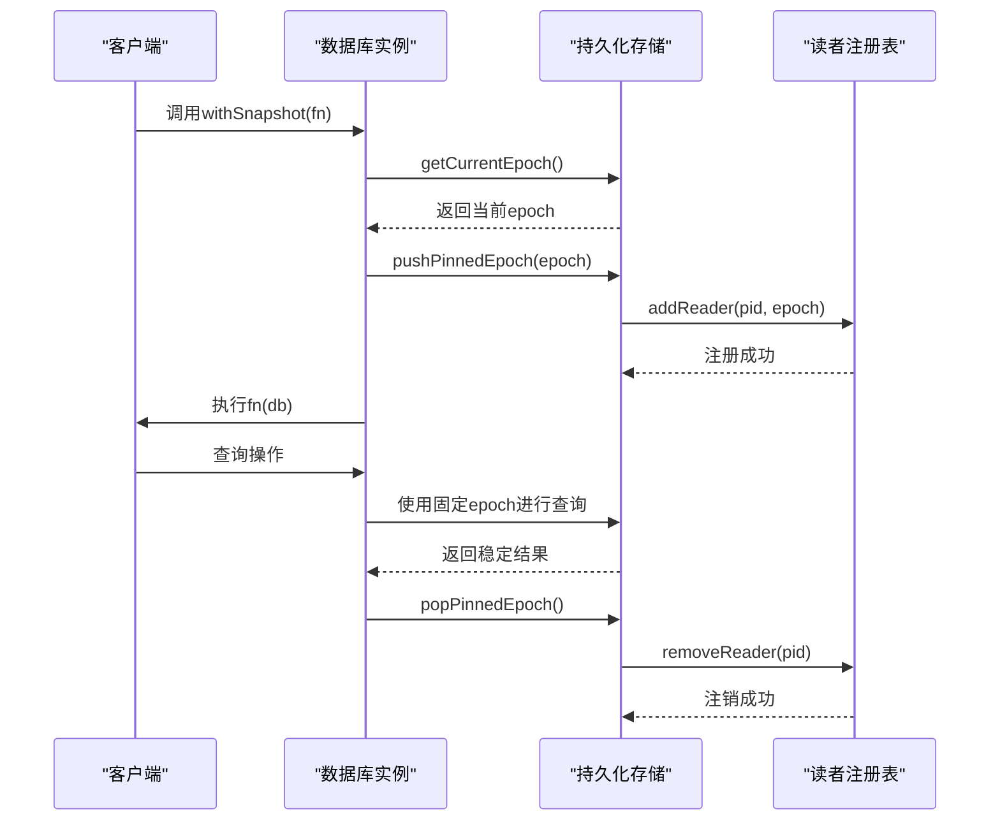
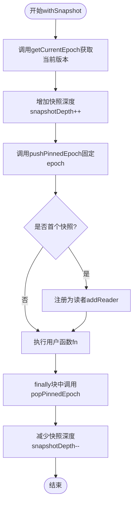
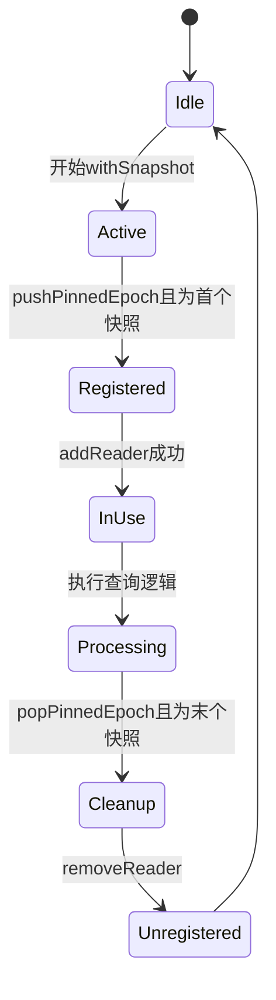
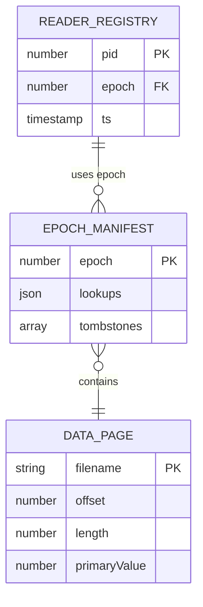

# 快照隔离与一致性读视图

<cite>
**本文档引用文件**  
- [synapseDb.ts](file://src/synapseDb.ts)
- [persistentStore.ts](file://src/storage/persistentStore.ts)
- [readerRegistry.ts](file://src/storage/readerRegistry.ts)
- [query_snapshot_isolation.test.ts](file://tests/system/query_snapshot_isolation.test.ts)
</cite>

## 目录
1. [引言](#引言)
2. [withSnapshot机制与MVCC实现](#withsnapshot机制与mvcc实现)
3. [读视图创建与epoch管理](#读视图创建与epoch管理)
4. [读者注册表与垃圾回收安全](#读者注册表与垃圾回收安全)
5. [系统测试用例解析](#系统测试用例解析)
6. [实际使用建议](#实际使用建议)
7. [结论](#结论)

## 引言
SynapseDB采用多版本并发控制（MVCC）机制，通过快照隔离级别保障数据库在高并发环境下的数据一致性和查询稳定性。本文档深入分析其核心组件`withSnapshot`的实现原理，涵盖读视图创建、epoch版本标记、读者注册表防止数据页被误清除等关键机制，并结合系统测试用例说明如何规避不可重复读与幻读问题。

## withSnapshot机制与MVCC实现

### MVCC快照隔离的核心设计
SynapseDB通过`withSnapshot`方法为每个查询提供独立且一致的数据视图，确保在执行期间不受其他写操作的影响。该机制基于MVCC模型，利用epoch作为数据库状态的时间戳，使得长查询能够安全地访问特定历史版本的数据。

**Diagram sources**
- [synapseDb.ts](file://src/synapseDb.ts#L477-L491)
- [persistentStore.ts](file://src/storage/persistentStore.ts#L1355-L1378)

**Section sources**
- [synapseDb.ts](file://src/synapseDb.ts#L477-L491)
- [persistentStore.ts](file://src/storage/persistentStore.ts#L1355-L1378)

## 读视图创建与epoch管理

### getCurrentEpoch的作用
`getCurrentEpoch()`方法返回当前数据库的状态版本号，用于标识一个全局一致的时间点。每当数据库发生结构性变更（如分页索引合并），epoch会递增，从而形成新的数据库版本。

### pushPinnedEpoch与popPinnedEpoch的协同
这两个方法共同维护了一个嵌套式的读视图栈：

- `pushPinnedEpoch(epoch)`：将指定的epoch压入栈中，并增加快照引用计数。当首次进入快照模式时，会触发向读者注册表注册当前进程。
- `popPinnedEpoch()`：从栈中弹出epoch并减少引用计数。当最后一个快照退出时，自动注销读者身份。

这种设计支持任意深度的快照嵌套，同时保证最外层快照结束后才释放资源。

**Diagram sources**
- [persistentStore.ts](file://src/storage/persistentStore.ts#L1355-L1378)
- [synapseDb.ts](file://src/synapseDb.ts#L477-L491)

**Section sources**
- [persistentStore.ts](file://src/storage/persistentStore.ts#L1355-L1378)
- [synapseDb.ts](file://src/synapseDb.ts#L477-L491)

## 读者注册表与垃圾回收安全

### ReaderRegistry的设计原理
读者注册表（ReaderRegistry）是一个基于文件系统的分布式锁机制，允许多个进程共享对数据库的只读访问信息。每个读者以独立文件形式注册，避免了竞态条件。

#### 核心接口
- `addReader(directory, info)`：添加读者记录
- `removeReader(directory, pid)`：移除指定PID的所有读者文件
- `getActiveReaders(directory)`：获取所有活跃读者
- `isEpochInUse(directory, epoch)`：检查某epoch是否正在被使用

### 防止垃圾回收清除正在使用的数据页
当存在活跃读者时，垃圾回收（GC）和压缩任务会跳过相关操作，确保正在被查询的数据页不会被删除或覆盖。

**Diagram sources**
- [readerRegistry.ts](file://src/storage/readerRegistry.ts#L16-L19)
- [gc.ts](file://src/maintenance/gc.ts#L20-L115)
- [autoCompact.ts](file://src/maintenance/autoCompact.ts#L41-L337)

**Section sources**
- [readerRegistry.ts](file://src/storage/readerRegistry.ts#L16-L19)
- [gc.ts](file://src/maintenance/gc.ts#L20-L115)

## 系统测试用例解析

### 不可重复读的规避
通过`query_snapshot_isolation.test.ts`中的测试用例验证，在`withSnapshot`内部多次查询同一条件，结果始终保持一致，即使外部有新数据写入也不会影响已建立的读视图。

### 幻读的规避
测试用例表明，链式查询（如`.follow()`）在整个过程中看到的是同一个epoch下的数据集，因此不会出现新增匹配项导致的结果不一致问题。

### 并发场景下的隔离性
多个并发的`withSnapshot`调用各自拥有独立的读视图，互不影响。后台的增量压缩和GC操作在检测到活跃读者时会自动跳过，保障查询完整性。

**Diagram sources**
- [query_snapshot_isolation.test.ts](file://tests/system/query_snapshot_isolation.test.ts#L14-L284)

**Section sources**
- [query_snapshot_isolation.test.ts](file://tests/system/query_snapshot_isolation.test.ts#L14-L284)

## 实际使用建议

### 快照嵌套深度限制
虽然支持任意深度嵌套，但应避免过深嵌套以防栈溢出。推荐最大嵌套层级不超过10层。

### 长时间持有快照的影响
长时间持有快照会导致：
- 存储膨胀：旧版本数据无法被GC清理
- 内存占用：pinnedEpochStack持续增长
- 性能下降：查询需过滤更多tombstone条目

### 优化策略
1. **及时释放快照**：使用`try-finally`或`async/await`确保`popPinnedEpoch`被调用。
2. **批量处理**：尽量在一个快照内完成所有相关查询。
3. **监控机制**：定期检查`snapshotDepth`和`snapshotRefCount`指标。
4. **合理设置pageSize**：较小的页大小有助于更精细的GC，但可能增加I/O开销。

## 结论
SynapseDB通过`withSnapshot`机制实现了高效的MVCC快照隔离，结合epoch版本控制和读者注册表，有效解决了并发环境下的数据一致性问题。其设计兼顾了性能与安全性，适用于需要强一致性的复杂查询场景。开发者应遵循最佳实践，合理管理快照生命周期，以充分发挥其优势。