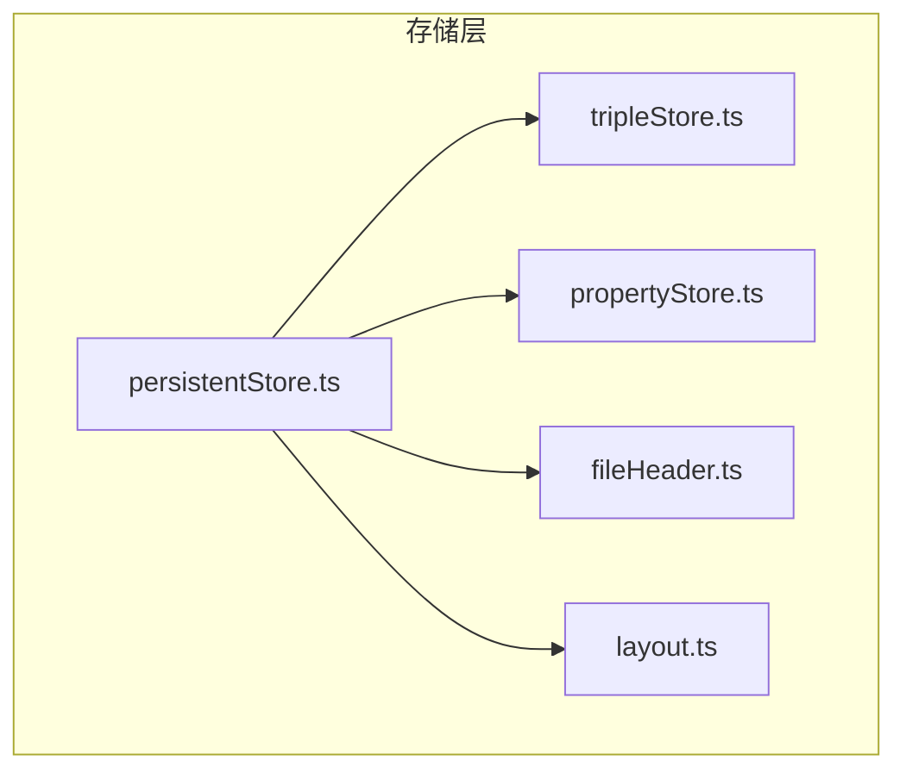
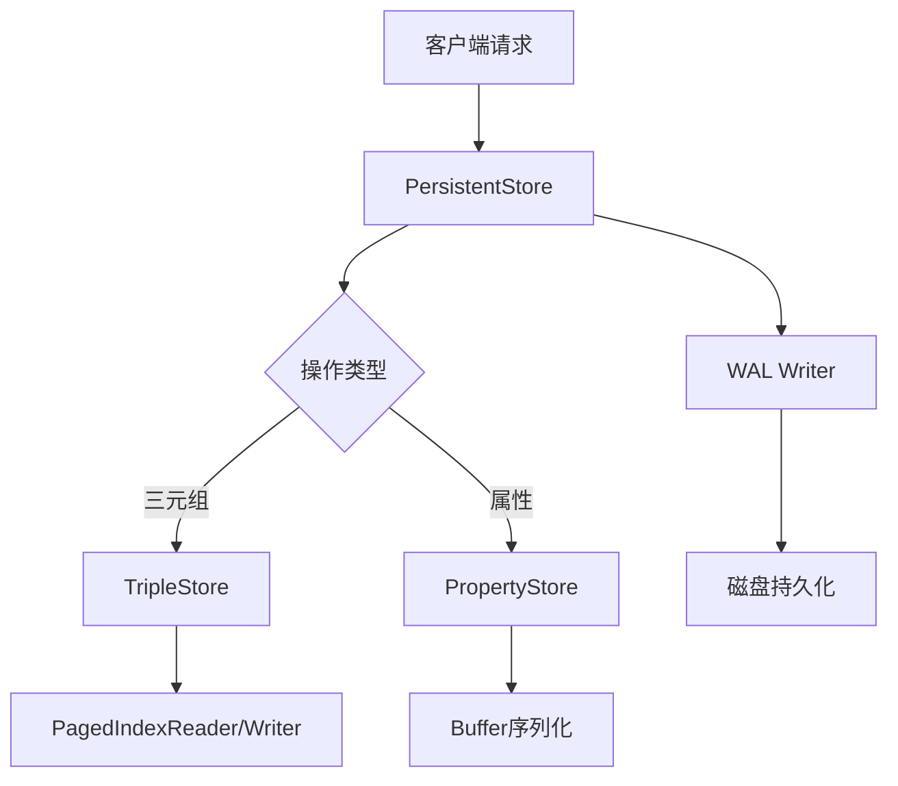
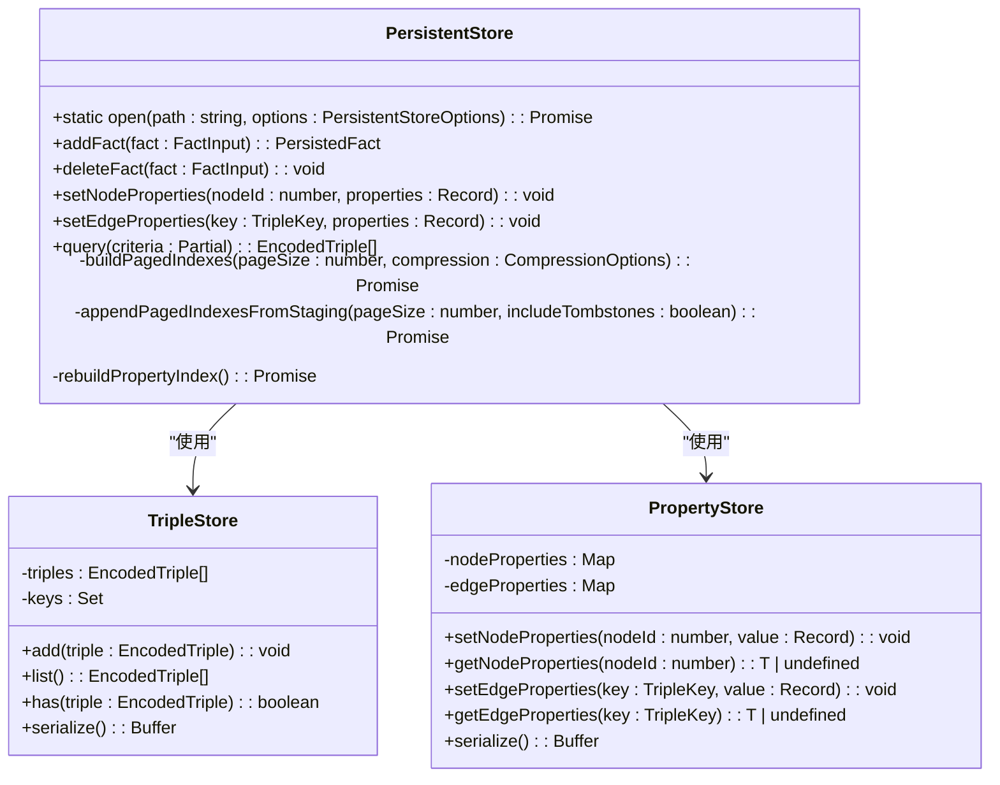

# 数据组织与存储模型

<cite>
**本文档引用的文件**
- [persistentStore.ts](file://src/storage/persistentStore.ts)
- [tripleStore.ts](file://src/storage/tripleStore.ts)
- [propertyStore.ts](file://src/storage/propertyStore.ts)
- [fileHeader.ts](file://src/storage/fileHeader.ts)
- [layout.ts](file://src/storage/layout.ts)
</cite>

## 目录
1. [引言](#引言)
2. [项目结构](#项目结构)
3. [核心组件](#核心组件)
4. [架构概述](#架构概述)
5. [详细组件分析](#详细组件分析)
6. [依赖分析](#依赖分析)
7. [性能考虑](#性能考虑)
8. [故障排除指南](#故障排除指南)
9. [结论](#结论)

## 引言
本文档旨在深入解析SynapseDB嵌入式图数据库的数据组织与存储模型，重点阐述其如何通过PersistentStore协调三元组和属性数据的物理布局。文档将详细说明TripleStore中SPO三元组的编码方式、主键（TripleKey）结构及其在磁盘上的排列策略；描述PropertyStore对节点和边属性的存储机制，包括变长字段处理和偏移寻址。同时，结合fileHeader.ts说明数据库文件头中版本、容量、根页指针等元数据的定义与作用，并通过layout.ts揭示逻辑页与物理块之间的映射关系及空间分配策略。此外，文档还将提供实际代码示例展示数据写入路径，并解释各组件间的调用关系，为初学者解释嵌入式数据库的数据局部性优化意义，为高级用户分析页对齐、缓存行友好设计带来的性能优势。

## 项目结构
SynapseDB的项目结构清晰地划分了不同功能模块，其中`src/storage`目录是本研究的核心，包含了所有与数据持久化相关的实现。该目录下的关键文件包括：`persistentStore.ts`作为顶层协调组件，负责管理整个存储引擎；`tripleStore.ts`和`propertyStore.ts`分别处理三元组和属性数据的存储；`fileHeader.ts`和`layout.ts`则定义了数据库文件的底层物理格式和布局规则。这种分层设计使得系统具有良好的可维护性和扩展性。

**图表来源**
- [persistentStore.ts](file://src/storage/persistentStore.ts)
- [tripleStore.ts](file://src/storage/tripleStore.ts)
- [propertyStore.ts](file://src/storage/propertyStore.ts)
- [fileHeader.ts](file://src/storage/fileHeader.ts)
- [layout.ts](file://src/storage/layout.ts)

**章节来源**
- [persistentStore.ts](file://src/storage/persistentStore.ts)
- [tripleStore.ts](file://src/storage/tripleStore.ts)
- [propertyStore.ts](file://src/storage/propertyStore.ts)
- [fileHeader.ts](file://src/storage/fileHeader.ts)
- [layout.ts](file://src/storage/layout.ts)

## 核心组件
本节将深入分析SynapseDB中的几个核心组件，这些组件共同构成了其高效的数据组织与存储能力。`PersistentStore`作为系统的入口点，不仅负责初始化和协调其他组件，还实现了事务管理和快照隔离等高级特性。`TripleStore`和`PropertyStore`则是具体的数据存储单元，前者专注于三元组的高效存取，后者则处理复杂的属性数据。而`fileHeader.ts`和`layout.ts`提供的底层支持确保了数据的一致性和可靠性。

**章节来源**
- [persistentStore.ts](file://src/storage/persistentStore.ts)
- [tripleStore.ts](file://src/storage/tripleStore.ts)
- [propertyStore.ts](file://src/storage/propertyStore.ts)
- [fileHeader.ts](file://src/storage/fileHeader.ts)
- [layout.ts](file://src/storage/layout.ts)

## 架构概述
SynapseDB采用了一种分层的存储架构，以实现高性能和高可靠性的平衡。在最上层，`PersistentStore`充当协调者，它利用WAL（Write-Ahead Logging）技术保证数据的持久性和一致性。当有新的三元组或属性被添加时，首先会被记录到WAL中，然后才更新内存中的状态。对于三元组数据，系统使用了多种索引顺序（如SPO, SOP等），并通过分页索引来优化大容量数据集的查询性能。属性数据则被序列化后存储在一个独立的区域，通过高效的编码方案支持变长字段。

**图表来源**
- [persistentStore.ts](file://src/storage/persistentStore.ts)
- [tripleStore.ts](file://src/storage/tripleStore.ts)
- [propertyStore.ts](file://src/storage/propertyStore.ts)

**章节来源**
- [persistentStore.ts](file://src/storage/persistentStore.ts)
- [tripleStore.ts](file://src/storage/tripleStore.ts)
- [propertyStore.ts](file://src/storage/propertyStore.ts)

## 详细组件分析
### PersistentStore 分析
`PersistentStore`是整个存储系统的中枢神经，它不仅负责打开和关闭数据库连接，还管理着所有内部组件的生命周期。通过静态方法`open`，它可以创建一个新的数据库实例或者加载一个已存在的实例。在此过程中，会进行一系列检查，比如验证文件头的有效性、重建必要的索引以及重放WAL日志来恢复未完成的事务。此外，`PersistentStore`还提供了丰富的API用于执行CRUD操作，例如`addFact`用于插入新的三元组，`setNodeProperties`用于设置节点属性等。

#### 对象导向组件：

**图表来源**
- [persistentStore.ts](file://src/storage/persistentStore.ts#L61-L1633)
- [tripleStore.ts](file://src/storage/tripleStore.ts#L6-L66)
- [propertyStore.ts](file://src/storage/propertyStore.ts#L45-L174)

**章节来源**
- [persistentStore.ts](file://src/storage/persistentStore.ts#L61-L1633)
- [tripleStore.ts](file://src/storage/tripleStore.ts#L6-L66)
- [propertyStore.ts](file://src/storage/propertyStore.ts#L45-L174)

### TripleStore 分析
`TripleStore`专门用于存储和检索三元组数据。每个三元组由三个32位无符号整数表示，分别是主体ID、谓词ID和客体ID，总共占用12字节。为了快速查找，系统使用了一个字符串键`encodeTripleKey`，该键由三个ID通过冒号连接而成。所有的三元组都保存在一个数组中，并且有一个对应的集合用来跟踪已存在的键，从而避免重复。当需要将数据写入磁盘时，`serialize`方法会先写出三元组的数量，接着是所有三元组的二进制表示