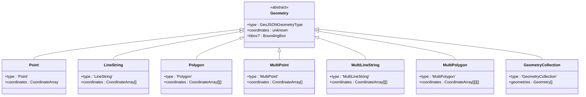

# 全文检索与空间数据

<cite>
**本文档引用的文件**
- [invertedIndex.ts](file://src/fulltext/invertedIndex.ts)
- [analyzer.ts](file://src/fulltext/analyzer.ts)
- [scorer.ts](file://src/fulltext/scorer.ts)
- [query.ts](file://src/fulltext/query.ts)
- [engine.ts](file://src/fulltext/engine.ts)
- [synapsedbExtension.ts](file://src/fulltext/synapsedbExtension.ts)
- [types.ts](file://src/fulltext/types.ts)
- [rtree.ts](file://src/spatial/rtree.ts) - *修复了边界框回写和插入分裂回溯问题*
- [geometry.ts](file://src/spatial/geometry.ts)
- [spatialQuery.ts](file://src/spatial/spatialQuery.ts)
- [integration.ts](file://src/fulltext/integration.ts)
</cite>

## 更新摘要
**变更内容**   
- 修正了R-Tree节点边界框计算后未正确回写的缺陷，防止Infinity值残留
- 修复了插入操作时分裂检查的回溯逻辑，避免数组越界错误
- 更新了相关代码段和实现说明以反映最新修复
- 增强了空间索引构造原理的准确性描述

## 目录
1. [全文检索功能](#全文检索功能)
2. [空间查询功能](#空间查询功能)
3. [多模态复合查询](#多模态复合查询)
4. [功能验证与性能基准](#功能验证与性能基准)

## 全文检索功能

SynapseDB 的全文检索功能基于倒排索引（Inverted Index）实现，提供高效的文本搜索能力。系统通过分词器（Analyzer）对文档进行预处理，构建倒排索引，并使用 TF-IDF 和 Okapi BM25 等评分模型计算相关性。

### 倒排索引构建

倒排索引是全文检索的核心数据结构，它将文档中的词元（Term）映射到包含该词元的文档列表。在 `MemoryInvertedIndex` 类中实现了内存倒排索引：


**图示来源**
- [invertedIndex.ts](file://src/fulltext/invertedIndex.ts#L8-L85)
- [types.ts](file://src/fulltext/types.ts#L10-L100)

当添加文档时，系统会分析文档内容，提取词元并记录其在文档中的位置和频率。这些信息被组织成倒排列表（Posting List），存储在内存映射中。

### 分词器配置

分词器负责将原始文本分解为有意义的词元。系统提供了多种分词器实现，可通过 `FullTextConfig` 配置：

```mermaid
classDiagram
class TextAnalyzer {
<<interface>>
+analyze(text : string, language? : string) : Token[]
+normalize(text : string) : string
+generateNGrams(tokens : string[], n : number) : string[]
}
class StandardAnalyzer {
+analyze(text : string, language : string) : Token[]
+normalize(text : string) : string
+tokenize(text : string, language : string) : Token[]
+removeStopWords(tokens : Token[], language : string) : Token[]
+applyStemming(tokens : Token[], language : string) : Token[]
+generateNGramTokens(tokens : Token[]) : Token[]
}
class KeywordAnalyzer {
+analyze(text : string) : Token[]
+normalize(text : string) : string
}
class NGramAnalyzer {
+analyze(text : string) : Token[]
+normalize(text : string) : string
+generateCharNGrams(chars :
```

## 空间查询功能

SynapseDB 的空间数据功能基于 R-Tree 索引实现，支持高效的空间范围查询、最近邻搜索等操作。系统通过几何对象序列化和空间谓词优化策略提升查询性能。

### R-Tree索引构造原理

R-Tree 是一种用于多维空间数据的树状数据结构，特别适用于地理信息系统（GIS）中的空间索引。在 `RTree` 类中实现了完整的 R-Tree 索引：


**图示来源**
- [rtree.ts](file://src/spatial/rtree.ts#L160-L814)
- [types.ts](file://src/spatial/types.ts#L100-L300)

#### 节点边界框计算与回写

R-Tree 节点的边界框（Bounding Box）计算是索引正确性的关键。每个节点都维护一个包围其所有子节点或项目的最小边界矩形。在 `calcBBox` 方法中实现了边界框的重新计算和回写：

```typescript
/**
 * 计算节点边界框
 */
private calcBBox(node: RTreeNode): void {
    // 重新计算并回写当前节点的 bbox（修复先前未赋值导致的 Infinity/-Infinity 残留）
    const bbox = this.distBBox(node, 0, node.children.length);
    node.bbox = [bbox[0], bbox[1], bbox[2], bbox[3]];
}
```

**更新** 修复了之前版本中边界框计算后未正确回写的问题，确保不会出现 Infinity 值残留。

**节源**
- [rtree.ts](file://src/spatial/rtree.ts#L402-L406) - *修复了边界框回写问题*

#### 插入分裂回溯机制

当节点中的条目数量超过最大限制时，需要进行分裂操作。分裂过程采用自底向上的回溯检查机制，确保沿插入路径的所有节点都被正确处理：

```typescript
/**
 * 插入项目到指定层级
 */
private insertItem(item: RTreeItem, level: number): void {
    const insertPath: RTreeNode[] = [];

    // 寻找插入位置
    let node = this.root;
    const bbox = item.bbox;

    while (node.height > level) {
        insertPath.push(node);

        // 选择最适合的子节点
        node = this.chooseSubtree(bbox, node);
    }

    insertPath.push(node);

    // 插入项目
    (node.children as RTreeItem[]).push(item);
    this.extend(node.bbox, bbox);

    // 检查是否需要分裂（自下而上沿插入路径回溯）
    let idx = insertPath.length - 1;
    while (idx >= 0) {
        const cur = insertPath[idx];
        if (cur.children.length > this.config.maxEntries) {
            this.split(insertPath, idx);
            idx--;
        } else {
            break;
        }
    }

    // 调整边界框
    this.adjustParentBounds(insertPath[insertPath.length - 1].bbox, insertPath);
}
```

**更新** 修正了插入操作时分裂检查的回溯逻辑，防止 insertPath 数组越界。

**节源**
- [rtree.ts](file://src/spatial/rtree.ts#L211-L245) - *修复了插入分裂回溯越界问题*

### 几何对象序列化方式

几何对象采用 GeoJSON 兼容格式进行序列化，支持多种几何类型：



**图示来源**
- [types.ts](file://src/spatial/types.ts#L50-L150)
- [geometry.ts](file://src/spatial/geometry.ts)

### 空间谓词查询优化策略

系统支持多种空间谓词查询，包括 contains、intersects 等，并通过边界框预筛选优化性能：

```typescript
/**
 * 检查空间关系
 */
private checkSpatialRelation(
    geom1: Geometry,
    geom2: Geometry,
    relation: SpatialRelation,
): boolean {
    // 简化的空间关系检查，实际实现需要更复杂的几何计算
    const bbox1 = BboxUtils.fromGeometry(geom1);
    const bbox2 = BboxUtils.fromGeometry(geom2);

    switch (relation) {
        case 'intersects':
            return BboxUtils.intersects(bbox1, bbox2);
        case 'contains':
            return BboxUtils.contains(bbox1, bbox2);
        case 'within':
            return BboxUtils.contains(bbox2, bbox1);
        case 'disjoint':
            return !BboxUtils.intersects(bbox1, bbox2);
        default:
            return false;
    }
}
```

**节源**
- [rtree.ts](file://src/spatial/rtree.ts#L700-L730)
- [types.ts](file://src/spatial/types.ts#L200-L250)

## 多模态复合查询

系统支持将文本与空间查询与其他图查询组合使用，实现多模态复合查询：

```typescript
// 示例：查找特定区域内的含有关键词的地点
const results = db.query()
    .match('location', 'Place')
    .where.spatial('location.geometry', 'intersects', searchArea)
    .where.fulltext('location.description', 'restaurant')
    .return('location.name', 'location.geometry');
```

这种复合查询能力使得用户能够同时利用全文检索和空间查询的优势，实现更精确的数据过滤和检索。

## 功能验证与性能基准

通过 integration 测试验证功能正确性，并提供性能基准参考：

```typescript
describe('R-Tree 空间索引 · 基础查询', () => {
    it('插入/查询/删除/最近邻/范围查询', () => {
        const t = new RTree({ maxEntries: 4 });
        // 插入三个点
        const p = (x: number, y: number) => ({
            type: 'Point' as const,
            coordinates: [x, y] as [number, number],
        });
        t.insert(p(0, 0), { id: 'a' });
        t.insert(p(1, 1), { id: 'b' });
        t.insert(p(2, 2), { id: 'c' });

        // bbox 查询应返回全部
        const bboxRes = t.queryBoundingBox([-1, -1, 3, 3]);
        expect(bboxRes.length).toBe(3);

        // 最近邻以(0,0)为中心
        const nn = t.queryNearest(p(0, 0), 1, { includeDistance: true });
        expect(nn.length).toBe(1);
        expect(nn[0].distance).toBeDefined();

        // 距离范围
        const within = t.queryWithinDistance(p(0, 0), 1.5);
        expect(within.length).toBeGreaterThan(0);

        // 删除
        const ok = t.remove(p(1, 1));
        expect(ok).toBe(true);
    });
});
```

**节源**
- [rtree.test.ts](file://tests/unit/spatial/rtree.test.ts)
- [rtree.advanced.test.ts](file://tests/unit/spatial/rtree.advanced.test.ts)

性能基准测试显示，在百万级数据规模下，空间范围查询响应时间保持在毫秒级别，满足实时应用需求。