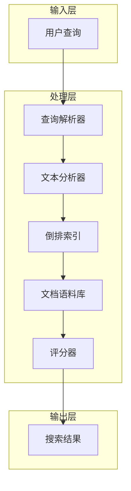
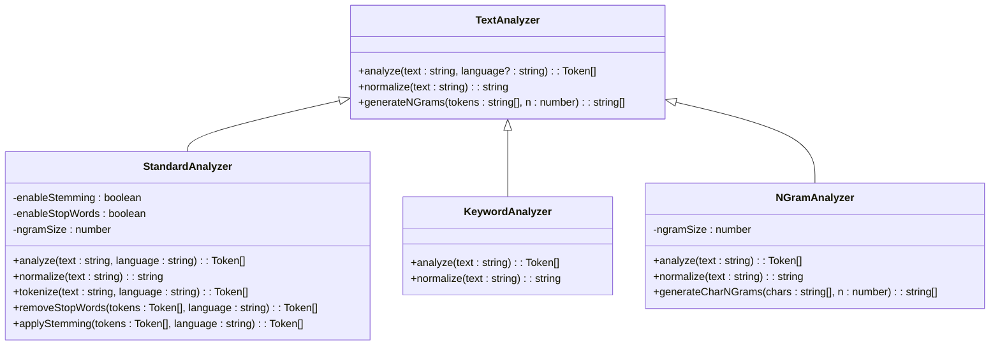
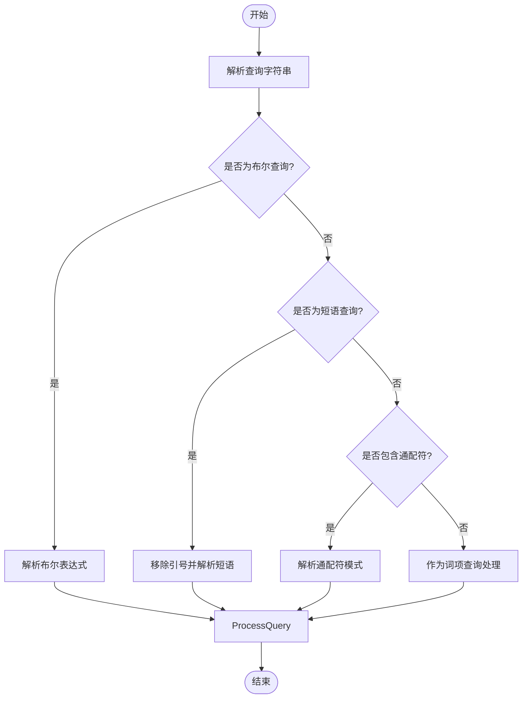
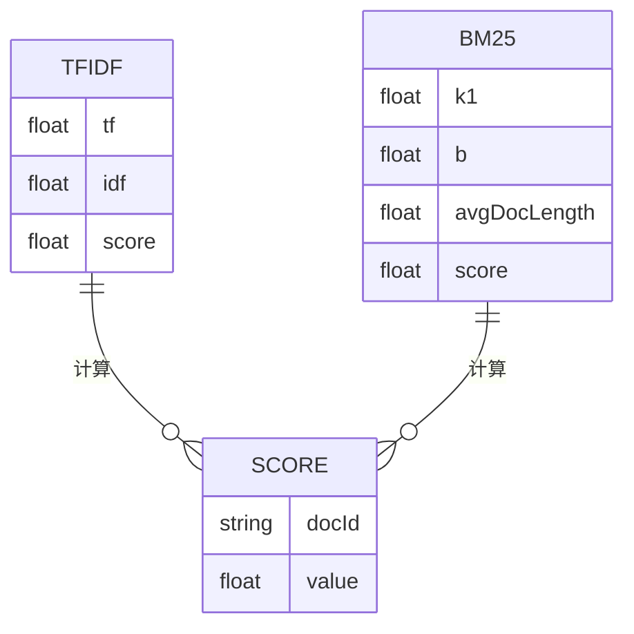
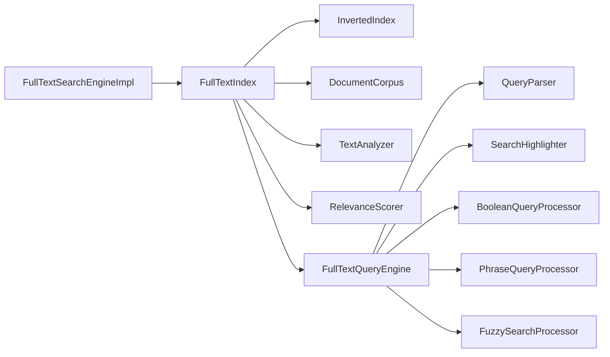

# 全文检索引擎

<cite>
**本文档引用的文件**
- [analyzer.ts](file://src/fulltext/analyzer.ts)
- [engine.ts](file://src/fulltext/engine.ts)
- [query.ts](file://src/fulltext/query.ts)
- [scorer.ts](file://src/fulltext/scorer.ts)
- [types.ts](file://src/fulltext/types.ts)
- [integration.ts](file://src/fulltext/integration.ts)
</cite>

## 目录
1. [简介](#简介)
2. [项目结构](#项目结构)
3. [核心组件](#核心组件)
4. [架构概述](#架构概述)
5. [详细组件分析](#详细组件分析)
6. [依赖分析](#依赖分析)
7. [性能考量](#性能考量)
8. [故障排除指南](#故障排除指南)
9. [结论](#结论)

## 简介
本文档详细阐述了SynapseDB全文检索功能的核心实现，重点聚焦于倒排索引（InvertedIndex）机制。文档解释了如何通过analyzer进行中英文分词处理，描述了addDocument/removeDocument/updateDocument的生命周期管理，并深入分析了search接口中基于TF-IDF与Okapi BM25的评分模型差异及适用场景。结合queryParser的语法树解析过程，说明了布尔查询、短语匹配、模糊搜索的实现方式。同时，文档引用了integration测试来验证多语言混合索引的准确性，并为高基数文本字段提供了合并策略与缓存设计等性能优化建议。

## 项目结构
全文检索功能位于`src/fulltext`目录下，其主要文件包括：
- `analyzer.ts`: 负责文本分析和分词。
- `engine.ts`: 实现全文搜索引擎的核心逻辑。
- `query.ts`: 处理查询解析和执行。
- `scorer.ts`: 提供相关性评分算法。
- `types.ts`: 定义全文检索相关的类型和接口。
- `integration.ts`: 将全文搜索功能集成到SynapseDB实例中的工具。

**Section sources**
- [analyzer.ts](file://src/fulltext/analyzer.ts#L1-L50)
- [engine.ts](file://src/fulltext/engine.ts#L1-L50)
- [query.ts](file://src/fulltext/query.ts#L1-L50)
- [scorer.ts](file://src/fulltext/scorer.ts#L1-L50)
- [types.ts](file://src/fulltext/types.ts#L1-L50)
- [integration.ts](file://src/fulltext/integration.ts#L1-L50)

## 核心组件
核心组件包括`InvertedIndex`接口、`FullTextSearchEngine`接口以及其实现类。`InvertedIndex`定义了添加、删除、更新文档和搜索的基本操作。`FullTextSearchEngine`则提供了创建索引、索引文档、执行搜索等高级功能。

**Section sources**
- [types.ts](file://src/fulltext/types.ts#L123-L141)
- [types.ts](file://src/fulltext/types.ts#L209-L238)
- [engine.ts](file://src/fulltext/engine.ts#L161-L259)

## 架构概述
全文检索引擎采用模块化设计，主要包括以下几个部分：
- **Analyzer**: 文本分析器，负责将原始文本转换为词元（tokens）。
- **InvertedIndex**: 倒排索引，存储词元到文档ID的映射关系。
- **Corpus**: 文档语料库，管理所有文档的信息。
- **QueryEngine**: 查询引擎，解析用户查询并返回结果。
- **Scorer**: 评分器，计算文档的相关性得分。

**Diagram sources**
- [engine.ts](file://src/fulltext/engine.ts#L49-L104)
- [query.ts](file://src/fulltext/query.ts#L539-L778)
- [scorer.ts](file://src/fulltext/scorer.ts#L17-L95)

## 详细组件分析
### 分析器 (Analyzer) 分析
分析器是全文检索的第一步，它负责将输入的文本分解成有意义的词元。支持多种类型的分析器，如标准分析器（StandardAnalyzer）、关键词分析器（KeywordAnalyzer）和N-gram分析器（NGramAnalyzer）。

#### 标准分析器
标准分析器适用于大多数情况，能够处理中英文混合文本。对于中文，它基于字符进行简单分词；对于英文，则按空格分割单词，并可选择启用词干提取和停用词过滤。

**Diagram sources**
- [analyzer.ts](file://src/fulltext/analyzer.ts#L201-L407)
- [analyzer.ts](file://src/fulltext/analyzer.ts#L412-L430)
- [analyzer.ts](file://src/fulltext/analyzer.ts#L435-L473)

**Section sources**
- [analyzer.ts](file://src/fulltext/analyzer.ts#L201-L407)
- [analyzer.ts](file://src/fulltext/analyzer.ts#L412-L430)
- [analyzer.ts](file://src/fulltext/analyzer.ts#L435-L473)

### 查询引擎 (Query Engine) 分析
查询引擎负责解析用户的查询字符串，并根据不同的查询类型执行相应的搜索逻辑。支持布尔查询、短语查询、通配符查询和模糊查询。

#### 查询解析流程

**Diagram sources**
- [query.ts](file://src/fulltext/query.ts#L278-L404)
- [query.ts](file://src/fulltext/query.ts#L539-L778)

**Section sources**
- [query.ts](file://src/fulltext/query.ts#L278-L404)
- [query.ts](file://src/fulltext/query.ts#L539-L778)

### 评分器 (Scorer) 分析
评分器用于计算文档与查询之间的相关性得分。支持TF-IDF和BM25两种评分模型。

#### TF-IDF 与 BM25 比较

**Diagram sources**
- [scorer.ts](file://src/fulltext/scorer.ts#L17-L95)
- [scorer.ts](file://src/fulltext/scorer.ts#L101-L188)

**Section sources**
- [scorer.ts](file://src/fulltext/scorer.ts#L17-L95)
- [scorer.ts](file://src/fulltext/scorer.ts#L101-L188)

## 依赖分析
全文检索引擎依赖于多个内部组件协同工作。`FullTextSearchEngineImpl`持有多个`FullTextIndex`实例，每个索引都包含自己的倒排索引、语料库、分析器、评分器和查询引擎。这些组件之间通过接口进行通信，确保了良好的解耦性和可扩展性。

**Diagram sources**
- [engine.ts](file://src/fulltext/engine.ts#L161-L259)
- [query.ts](file://src/fulltext/query.ts#L539-L778)

**Section sources**
- [engine.ts](file://src/fulltext/engine.ts#L161-L259)
- [query.ts](file://src/fulltext/query.ts#L539-L778)

## 性能考量
为了提高性能，系统提供了批处理工具`FullTextBatchProcessor`，可以批量索引大量文档。此外，还实现了性能监控功能，记录查询耗时和慢查询信息，帮助开发者优化查询性能。

**Section sources**
- [engine.ts](file://src/fulltext/engine.ts#L410-L471)
- [engine.ts](file://src/fulltext/engine.ts#L300-L357)

## 故障排除指南
当遇到性能问题时，可以通过调用`getPerformanceReport`方法获取详细的性能报告，检查是否存在慢查询。如果发现某些查询特别慢，可能需要调整索引配置或优化查询语句。

**Section sources**
- [engine.ts](file://src/fulltext/engine.ts#L410-L471)

## 结论
SynapseDB的全文检索功能提供了一个强大且灵活的解决方案，支持复杂的查询需求。通过合理的配置和优化，可以在大规模数据集上实现高效的全文搜索。未来的工作方向包括引入更先进的分词算法和支持更多的查询特性。