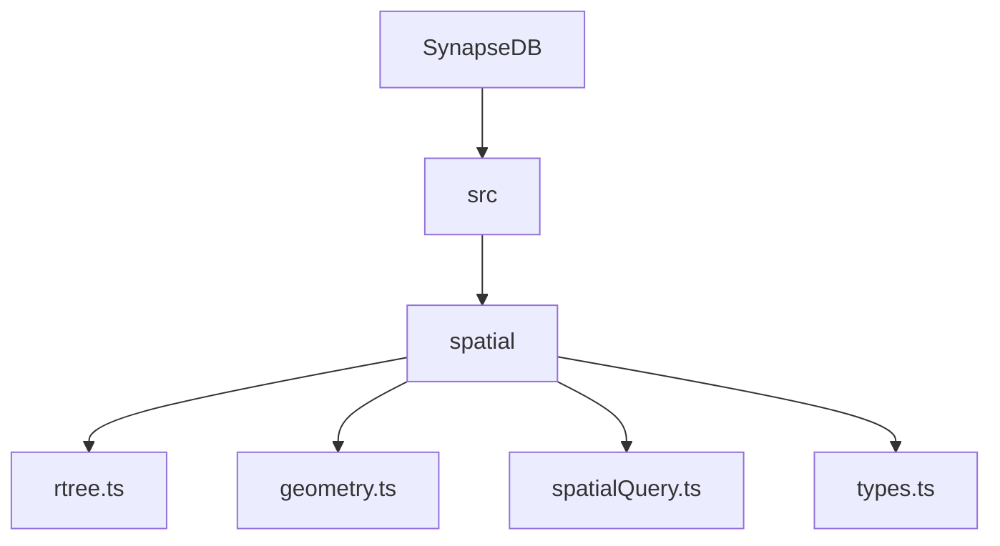
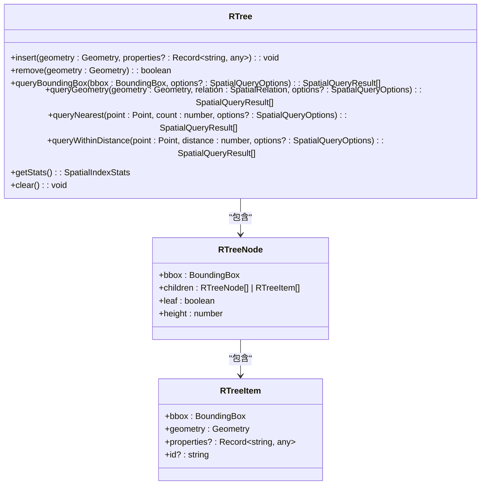
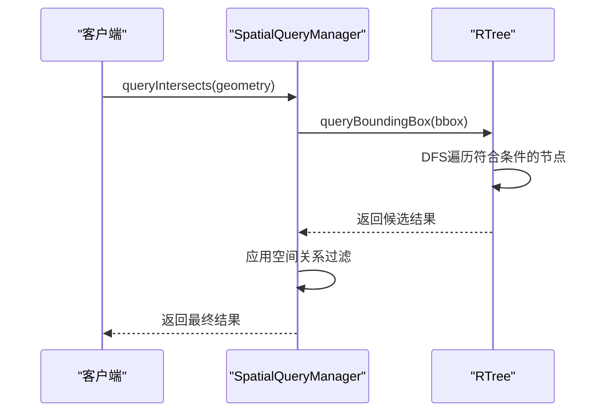
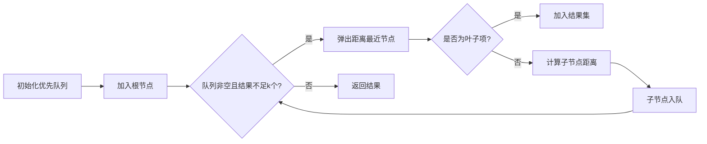

# 空间数据索引与查询

<cite>
**本文档引用的文件**  
- [rtree.ts](file://src/spatial/rtree.ts)
- [geometry.ts](file://src/spatial/geometry.ts)
- [spatialQuery.ts](file://src/spatial/spatialQuery.ts)
- [types.ts](file://src/spatial/types.ts)
</cite>

## 目录
1. [项目结构](#项目结构)  
2. [核心组件](#核心组件)  
3. [R-tree索引实现](#r-tree索引实现)  
4. [几何对象编码与边界框计算](#几何对象编码与边界框计算)  
5. [空间查询操作与优化策略](#空间查询操作与优化策略)  
6. [空间谓词过滤算法](#空间谓词过滤算法)  
7. [实际应用示例](#实际应用示例)  
8. [性能基准与参数调优](#性能基准与参数调优)

## 项目结构



**图源**  
- [rtree.ts](file://src/spatial/rtree.ts)
- [geometry.ts](file://src/spatial/geometry.ts)
- [spatialQuery.ts](file://src/spatial/spatialQuery.ts)
- [types.ts](file://src/spatial/types.ts)

**本节来源**  
- [project_structure](file://project_structure)

## 核心组件

空间数据处理系统由四个核心模块构成：`rtree.ts` 实现 R-tree 索引结构，`geometry.ts` 提供几何计算功能，`spatialQuery.ts` 封装查询接口，`types.ts` 定义类型系统。这些模块协同工作，支持高效的地理空间操作。

**本节来源**  
- [rtree.ts](file://src/spatial/rtree.ts)
- [geometry.ts](file://src/spatial/geometry.ts)
- [spatialQuery.ts](file://src/spatial/spatialQuery.ts)
- [types.ts](file://src/spatial/types.ts)

## R-tree索引实现

R-tree 是一种用于多维空间数据的树状数据结构，特别适用于嵌入式环境下的轻量级空间索引。该实现基于 `SpatialIndex` 接口，支持插入、删除和批量加载等操作，并通过配置参数控制树的平衡性。

### 插入操作对树结构的影响

插入操作从根节点开始，递归选择最合适的子树进行插入。当节点条目超过 `maxEntries` 限制时，触发分裂机制。分裂采用 R*-tree 策略，优先选择使周长增量最小的分割轴，并进一步优化以减少子树间的重叠面积。

### 删除操作与树压缩

删除操作首先定位目标几何对象所在的叶子节点并移除。随后向上遍历路径，若某节点无子节点，则将其从父节点中移除；否则重新计算其边界框。此过程确保树结构在删除后仍保持紧凑。

### 批量加载优化

批量加载（bulkLoad）虽未直接暴露为公共方法，但可通过连续插入实现。建议在初始化阶段按空间聚类顺序插入数据，以减少后续分裂次数，提升索引效率。



**图源**  
- [rtree.ts](file://src/spatial/rtree.ts#L160-L809)

**本节来源**  
- [rtree.ts](file://src/spatial/rtree.ts#L160-L809)

## 几何对象编码与边界框计算

### 几何对象类型定义

系统支持标准 GeoJSON 几何类型，包括点（Point）、线串（LineString）、多边形（Polygon）及其复合形式。所有坐标采用 `[经度, 纬度]` 格式表示。

```typescript
export type Geometry = Point | LineString | Polygon | MultiPoint | MultiLineString | MultiPolygon | GeometryCollection;
```

### 边界框计算逻辑

边界框（Bounding Box）是包含几何对象所有坐标的最小矩形区域，表示为 `[minX, minY, maxX, maxY]`。计算过程如下：

1. 遍历几何对象的所有坐标点。
2. 提取各维度的最小值和最大值。
3. 构造四元组作为边界框。

对于复杂类型（如 `GeometryCollection`），递归提取所有子几何的坐标。


**图源**  
- [geometry.ts](file://src/spatial/geometry.ts#L154-L917)

**本节来源**  
- [types.ts](file://src/spatial/types.ts#L99)
- [geometry.ts](file://src/spatial/geometry.ts#L154-L917)

## 空间查询操作与优化策略

### 查询流程概览

空间查询分为两个阶段：
1. **索引筛选**：利用 R-tree 的层次结构快速排除不相关的对象。
2. **精确匹配**：对候选集执行精确的几何关系判断。

### 图遍历协同优化

在 `queryBoundingBox` 中，使用栈结构进行深度优先搜索。仅当节点边界框与查询范围相交时才将其子节点压入栈中，有效剪枝无关分支。



**图源**  
- [spatialQuery.ts](file://src/spatial/spatialQuery.ts#L54-L591)
- [rtree.ts](file://src/spatial/rtree.ts#L160-L809)

**本节来源**  
- [spatialQuery.ts](file://src/spatial/spatialQuery.ts#L54-L591)

## 空间谓词过滤算法

### contains谓词

判断一个几何对象是否完全包含另一个。实现上先检查外接框包含关系，再通过 `pointInGeometry` 判断内部点是否全部落在容器内。

### intersects谓词

判断两个几何对象是否有公共部分。首先通过边界框相交快速否定，然后检测任一对象的点是否位于对方内部。

### nearby谓词（最近邻查询）

基于优先队列实现 k-近邻搜索。将节点到查询点的距离作为优先级，逐步展开最近的子树，直到找到足够数量的结果。



**图源**  
- [rtree.ts](file://src/spatial/rtree.ts#L160-L809)

**本节来源**  
- [rtree.ts](file://src/spatial/rtree.ts#L160-L809)

## 实际应用示例

### 地理围栏查询

使用 `queryWithinDistance` 方法实现圆形围栏查询：

```ts
const center: Point = { type: 'Point', coordinates: [116.4, 39.9] };
const results = spatialQuery.queryWithinDistance(center, 1000); // 1km范围内
```

### 邻近设施搜索

结合 `queryNearest` 查找最近的 N 个设施：

```ts
const userLocation: Point = { type: 'Point', coordinates: [116.4, 39.9] };
const nearestFacilities = spatialQuery.queryNearest(userLocation, 5);
```

**本节来源**  
- [spatialQuery.ts](file://src/spatial/spatialQuery.ts#L54-L591)

## 性能基准与参数调优

### 索引参数建议

| 参数 | 默认值 | 调优建议 |
|------|--------|----------|
| maxEntries | 16 | 嵌入式环境可设为 8-12，减少内存占用 |
| minEntries | 6 | 通常为 maxEntries 的 30%-40% |
| splitStrategy | rstar | 推荐保持默认，提供最佳查询性能 |

### 性能监控

`SpatialQueryManager` 提供统计信息接口，可用于监控查询延迟、命中率等指标，辅助性能分析。

```ts
const stats = spatialQuery.getQueryStats();
console.log(`平均查询时间: ${stats.avgQueryTime}ms`);
```

**本节来源**  
- [rtree.ts](file://src/spatial/rtree.ts#L160-L809)
- [spatialQuery.ts](file://src/spatial/spatialQuery.ts#L54-L591)