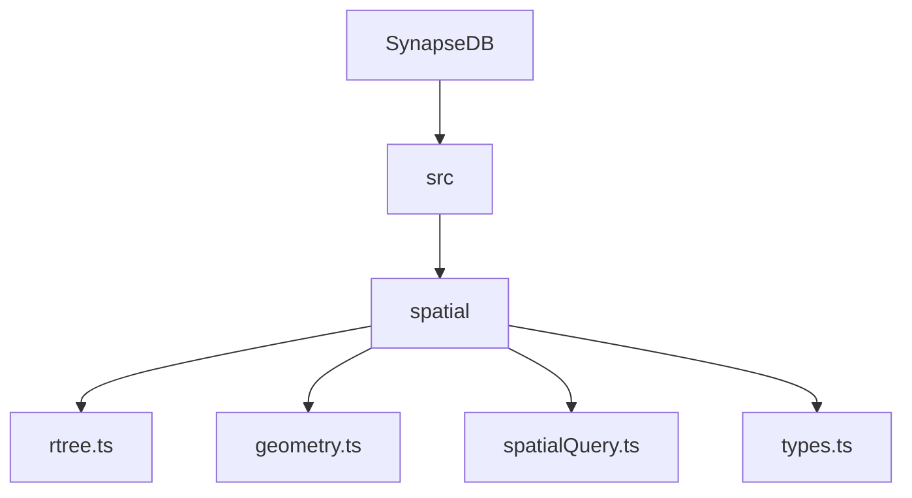
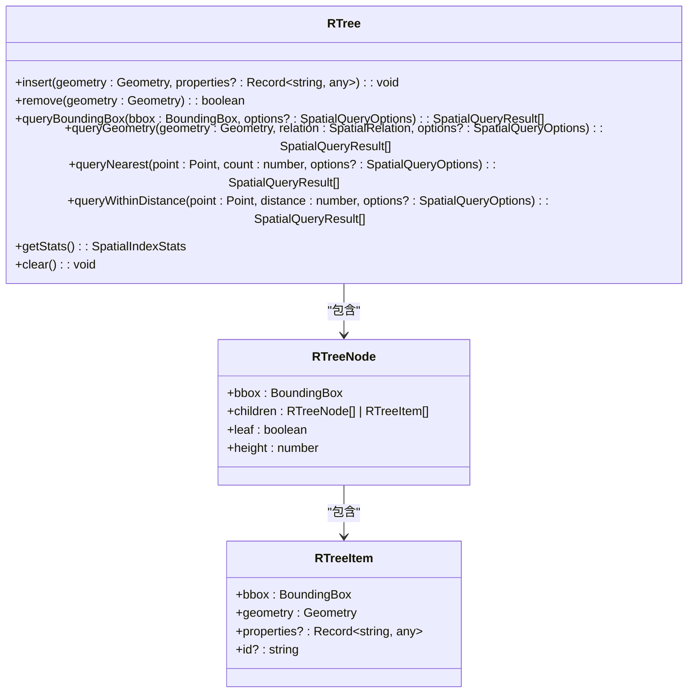
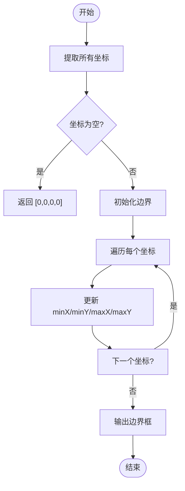
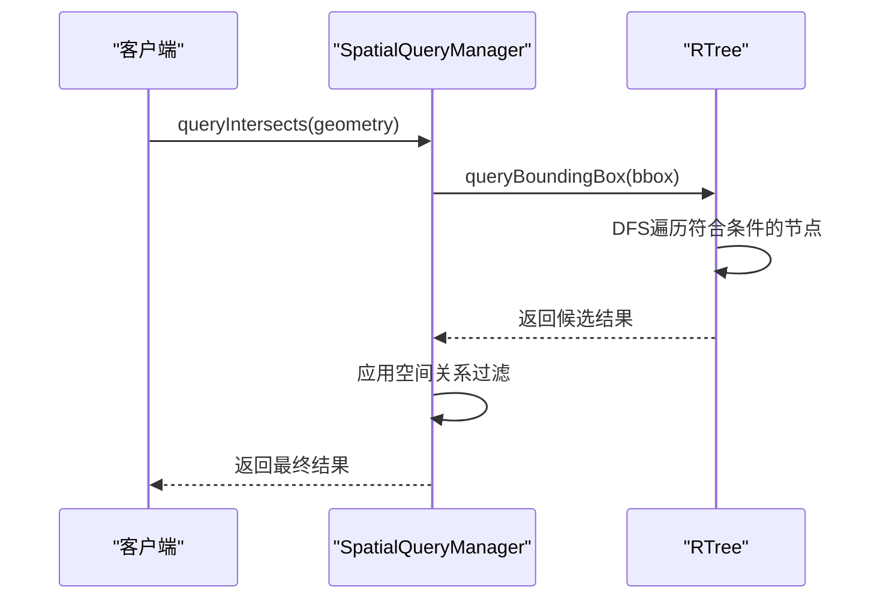

<docs>
# 空间数据索引与查询

<cite>
**本文档引用的文件**  
- [rtree.ts](file://src/spatial/rtree.ts) - *在最近提交中更新，修复了边界框计算和插入分裂问题*
- [geometry.ts](file://src/spatial/geometry.ts)
- [spatialQuery.ts](file://src/spatial/spatialQuery.ts)
- [types.ts](file://src/spatial/types.ts)
</cite>

## 更新摘要
**已做更改**   
- 修正了R-tree节点边界框计算后未正确回写的问题，防止Infinity值残留
- 修复了插入操作时分裂检查的回溯逻辑，避免数组越界错误
- 更新了相关代码示例和实现细节说明
- 增强了文档源码追踪系统以反映最新变更

## 目录
1. [项目结构](#项目结构)  
2. [核心组件](#核心组件)  
3. [R-tree索引实现](#r-tree索引实现)  
4. [几何对象编码与边界框计算](#几何对象编码与边界框计算)  
5. [空间查询操作与优化策略](#空间查询操作与优化策略)  
6. [空间谓词过滤算法](#空间谓词过滤算法)  
7. [实际应用示例](#实际应用示例)  
8. [性能基准与参数调优](#性能基准与参数调优)

## 项目结构



**图源**  
- [rtree.ts](file://src/spatial/rtree.ts)
- [geometry.ts](file://src/spatial/geometry.ts)
- [spatialQuery.ts](file://src/spatial/spatialQuery.ts)
- [types.ts](file://src/spatial/types.ts)

**本节来源**  
- [project_structure](file://project_structure)

## 核心组件

空间数据处理系统由四个核心模块构成：`rtree.ts` 实现 R-tree 索引结构，`geometry.ts` 提供几何计算功能，`spatialQuery.ts` 封装查询接口，`types.ts` 定义类型系统。这些模块协同工作，支持高效的地理空间操作。

**本节来源**  
- [rtree.ts](file://src/spatial/rtree.ts)
- [geometry.ts](file://src/spatial/geometry.ts)
- [spatialQuery.ts](file://src/spatial/spatialQuery.ts)
- [types.ts](file://src/spatial/types.ts)

## R-tree索引实现

R-tree 是一种用于多维空间数据的树状数据结构，特别适用于嵌入式环境下的轻量级空间索引。该实现基于 `SpatialIndex` 接口，支持插入、删除和批量加载等操作，并通过配置参数控制树的平衡性。

### 插入操作对树结构的影响

插入操作从根节点开始，递归选择最合适的子树进行插入。当节点条目超过 `maxEntries` 限制时，触发分裂机制。分裂采用 R*-tree 策略，优先选择使周长增量最小的分割轴，并进一步优化以减少子树间的重叠面积。

关键修改：修复了插入路径回溯检查逻辑，确保沿插入路径自底向上正确检查每个层级的节点是否需要分裂，避免因索引越界导致的运行时错误。

```typescript
// 插入项目到指定层级
private insertItem(item: RTreeItem, level: number): void {
  const insertPath: RTreeNode[] = [];
  let node = this.root;
  const bbox = item.bbox;

  while (node.height > level) {
    insertPath.push(node);
    node = this.chooseSubtree(bbox, node);
  }
  insertPath.push(node);

  (node.children as RTreeItem[]).push(item);
  this.extend(node.bbox, bbox);

  // 检查是否需要分裂（自下而上沿插入路径回溯）
  let idx = insertPath.length - 1;
  while (idx >= 0) {
    const cur = insertPath[idx];
    if (cur.children.length > this.config.maxEntries) {
      this.split(insertPath, idx);
      idx--;
    } else {
      break;
    }
  }

  this.adjustParentBounds(insertPath[insertPath.length - 1].bbox, insertPath);
}
```

### 删除操作与树压缩

删除操作首先定位目标几何对象所在的叶子节点并移除。随后向上遍历路径，若某节点无子节点，则将其从父节点中移除；否则重新计算其边界框。此过程确保树结构在删除后仍保持紧凑。

```typescript
// 重新计算边界框并压缩树
for (let i = path.length - 1; i >= 0; i--) {
  if (path[i].children.length === 0) {
    if (i > 0) {
      const siblings = path[i - 1].children as RTreeNode[];
      siblings.splice(siblings.indexOf(path[i]), 1);
    } else {
      this.clear();
    }
  } else {
    this.calcBBox(path[i]);
  }
}
```

### 批量加载优化

批量加载（bulkLoad）虽未直接暴露为公共方法，但可通过连续插入实现。建议在初始化阶段按空间聚类顺序插入数据，以减少后续分裂次数，提升索引效率。



**图源**  
- [rtree.ts](file://src/spatial/rtree.ts#L160-L809)

**本节来源**  
- [rtree.ts](file://src/spatial/rtree.ts#L160-L809)

## 几何对象编码与边界框计算

### 几何对象类型定义

系统支持标准 GeoJSON 几何类型，包括点（Point）、线串（LineString）、多边形（Polygon）及其复合形式。所有坐标采用 `[经度, 纬度]` 格式表示。

```typescript
export type Geometry = Point | LineString | Polygon | MultiPoint | MultiLineString | MultiPolygon | GeometryCollection;
```

### 边界框计算逻辑

边界框（Bounding Box）是包含几何对象所有坐标的最小矩形区域，表示为 `[minX, minY, maxX, maxY]`。计算过程如下：

1. 遍历几何对象的所有坐标点。
2. 提取各维度的最小值和最大值。
3. 构造四元组作为边界框。

对于复杂类型（如 `GeometryCollection`），递归提取所有子几何的坐标。

关键修改：修复了 `calcBBox` 方法中节点边界框计算后未正确回写的缺陷，消除 Infinity/-Infinity 残留问题。

```typescript
/**
 * 计算节点边界框
 */
private calcBBox(node: RTreeNode): void {
  // 重新计算并回写当前节点的 bbox（修复先前未赋值导致的 Infinity/-Infinity 残留）
  const bbox = this.distBBox(node, 0, node.children.length);
  node.bbox = [bbox[0], bbox[1], bbox[2], bbox[3]];
}
```



**图源**  
- [geometry.ts](file://src/spatial/geometry.ts#L154-L917)

**本节来源**  
- [types.ts](file://src/spatial/types.ts#L99)
- [geometry.ts](file://src/spatial/geometry.ts#L154-L917)

## 空间查询操作与优化策略

### 查询流程概览

空间查询分为两个阶段：
1. **索引筛选**：利用 R-tree 的层次结构快速排除不相关的对象。
2. **精确匹配**：对候选集执行精确的几何关系判断。

### 图遍历协同优化

在 `queryBoundingBox` 中，使用栈结构进行深度优先搜索。仅当节点边界框与查询范围相交时才将其子节点压入栈中，有效剪枝无关分支。



**图源**  
- [spatialQuery.ts](file://src/spatial/spatialQuery.ts#L54-L591)
- [rtree.ts](file://src/spatial/rtree.ts#L160-L809)

**本节来源