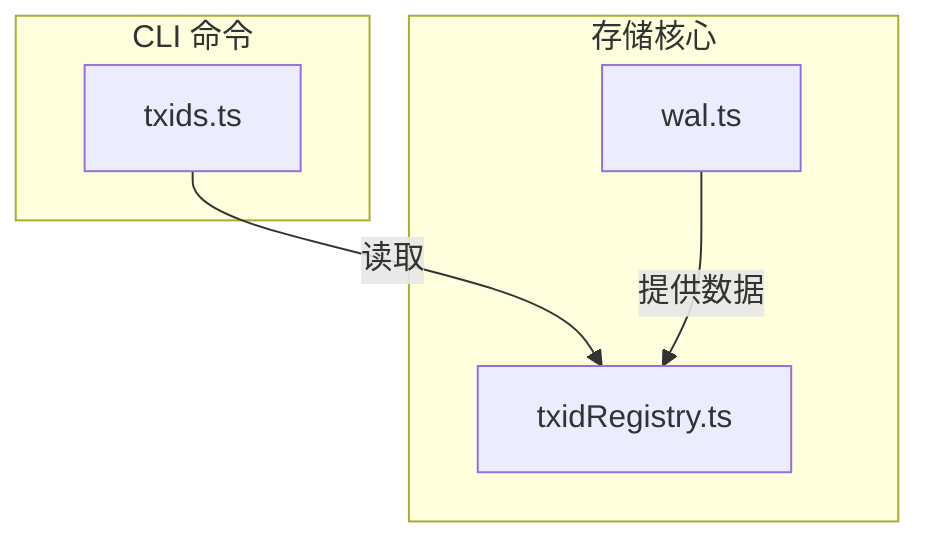
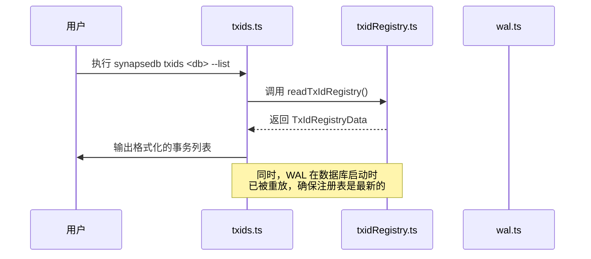
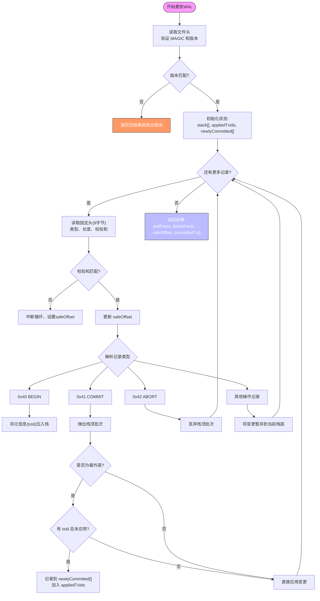

# 事务观测工具

<cite>
**本文档引用的文件**
- [wal.ts](file://src/storage/wal.ts)
- [txidRegistry.ts](file://src/storage/txidRegistry.ts)
- [txids.ts](file://src/cli/txids.ts)
</cite>

## 目录
1. [简介](#简介)
2. [项目结构](#项目结构)
3. [核心组件](#核心组件)
4. [架构概述](#架构概述)
5. [详细组件分析](#详细组件分析)
6. [依赖分析](#依赖分析)
7. [性能考虑](#性能考虑)
8. [故障排除指南](#故障排除指南)
9. [结论](#结论)

## 简介
本专业文档深入解析`synapsedb txids`命令如何读取WAL日志文件并列出所有已提交的事务ID及其时间戳。结合`wal.ts`和`txidRegistry.ts`的实现，说明事务ID的生成机制、持久化方式与幂等性保障。指导用户利用此工具进行故障排查、审计追踪和一致性验证，特别是在崩溃恢复后确认事务完整性。

## 项目结构
事务观测功能主要由三个核心模块构成：WAL日志处理（`wal.ts`）、事务ID注册表管理（`txidRegistry.ts`）和CLI命令行接口（`txids.ts`）。这些模块位于`src/storage`和`src/cli`目录下，共同实现了事务ID的持久化记录、查询和治理能力。



**图示来源**
- [txids.ts](file://src/cli/txids.ts)
- [wal.ts](file://src/storage/wal.ts)
- [txidRegistry.ts](file://src/storage/txidRegistry.ts)

**章节来源**
- [src/cli/txids.ts](file://src/cli/txids.ts)
- [src/storage/wal.ts](file://src/storage/wal.ts)
- [src/storage/txidRegistry.ts](file://src/storage/txidRegistry.ts)

## 核心组件
核心组件包括`WalReplayer`类用于重放WAL日志并提取已提交的事务，`readTxIdRegistry`和`writeTxIdRegistry`函数用于管理持久化的事务ID注册表，以及`mergeTxIds`函数负责合并新旧事务记录。`txids.ts`作为CLI入口点，协调这些组件向用户提供事务观测功能。

**章节来源**
- [wal.ts](file://src/storage/wal.ts#L145-L320)
- [txidRegistry.ts](file://src/storage/txidRegistry.ts#L17-L49)
- [txids.ts](file://src/cli/txids.ts#L0-L69)

## 架构概述
系统采用WAL（Write-Ahead Logging）预写式日志机制确保数据持久性和崩溃恢复能力。当事务提交时，其唯一标识符（txId）随元信息被记录在WAL中。通过`WalReplayer`重放日志，系统能识别出所有成功提交的事务，并将其ID和时间戳持久化到`txids.json`文件中，形成一个可查询的注册表。



**图示来源**
- [txids.ts](file://src/cli/txids.ts)
- [txidRegistry.ts](file://src/storage/txidRegistry.ts)
- [wal.ts](file://src/storage/wal.ts)

## 详细组件分析

### WalReplayer 分析
`WalReplayer`是事务观测的基础，它通过解析WAL文件中的BEGIN、COMMIT和ABORT记录来重建事务历史。只有最外层的COMMIT记录且带有txId元信息的事务才会被认定为已成功提交，并加入到返回结果的`committedTx`数组中。



**图示来源**
- [wal.ts](file://src/storage/wal.ts#L145-L320)

**章节来源**
- [wal.ts](file://src/storage/wal.ts#L145-L320)

### 事务ID注册表分析
`txidRegistry.ts`模块提供了对`txids.json`文件的读写封装。`readTxIdRegistry`函数安全地读取JSON文件，若文件不存在或损坏则返回默认的空注册表。`writeTxIdRegistry`使用原子写入（先写临时文件再重命名）和fsync确保数据持久化，防止写入过程中断导致文件损坏。

```mermaid
classDiagram
class TxIdEntry {
+id : string
+ts : number
+sessionId? : string
}
class TxIdRegistryData {
+version : number
+txIds : TxIdEntry[]
+max? : number
}
class txidRegistry {
+readTxIdRegistry(directory : string) : Promise~TxIdRegistryData~
+writeTxIdRegistry(directory : string, data : TxIdRegistryData) : Promise~void~
+toSet(reg : TxIdRegistryData) : Set~string~
+mergeTxIds(reg : TxIdRegistryData, items : {id : string, ts? : number, sessionId? : string}[], max : number | undefined) : TxIdRegistryData
}
TxIdRegistryData "1" *-- "0..*" TxIdEntry
txidRegistry ..> TxIdRegistryData : 使用
txidRegistry ..> TxIdEntry : 使用
```

**图示来源**
- [txidRegistry.ts](file://src/storage/txidRegistry.ts#L0-L76)

**章节来源**
- [txidRegistry.ts](file://src/storage/txidRegistry.ts#L0-L76)

### CLI命令分析
`txids.ts`脚本是用户与事务观测系统交互的主要界面。它解析命令行参数，调用`readTxIdRegistry`获取数据，并根据`--list`、`--since`、`--session`等选项对结果进行过滤和格式化输出。`--clear`和`--max`选项允许管理员清空注册表或设置其容量上限。

```mermaid
flowchart LR
A[解析参数] --> B{有 dbPath?}
B --> |否| C[打印用法并退出]
B --> |是| D[构建 pages 目录路径]
D --> E[动态导入 read/write 函数]
E --> F[处理 --clear]
F --> G{是?}
G --> |是| H[清空并写回，退出]
G --> |否| I[处理 --max]
I --> J{指定了?}
J --> |是| K[排序截断并写回，退出]
J --> |否| L[处理 --list (默认)]
L --> M[读取注册表]
M --> N[应用 --since 过滤]
N --> O[应用 --session 过滤]
O --> P[应用 --list=N 限制数量]
P --> Q[JSON.stringify 并输出]
```

**图示来源**
- [txids.ts](file://src/cli/txids.ts#L0-L69)

**章节来源**
- [txids.ts](file://src/cli/txids.ts#L0-L69)

## 依赖分析
各组件间存在清晰的依赖关系。CLI (`txids.ts`) 直接依赖于 `txidRegistry.ts` 来访问持久化数据。而 `txidRegistry.ts` 的数据最终来源于 `wal.ts` 中 `WalReplayer.replay` 方法的执行结果。在数据库启动时，`persistentStore.ts` 会协调这两个模块，先重放WAL以获取新提交的事务，再将其合并到持久化的注册表中。

```mermaid
graph LR
A[src/cli/txids.ts] --> B[src/storage/txidRegistry.ts]
C[src/storage/persistentStore.ts] --> D[src/storage/wal.ts]
D --> |replay().committedTx| B
C --> |mergeTxIds & writeTxIdRegistry| B
B --> |readTxIdRegistry| A
```

**图示来源**
- [txids.ts](file://src/cli/txids.ts)
- [txidRegistry.ts](file://src/storage/txidRegistry.ts)
- [wal.ts](file://src/storage/wal.ts)
- [persistentStore.ts](file://src/storage/persistentStore.ts)

**章节来源**
- [txids.ts](file://src/cli/txids.ts)
- [txidRegistry.ts](file://src/storage/txidRegistry.ts)
- [wal.ts](file://src/storage/wal.ts)

## 性能考虑
事务ID注册表的设计兼顾了性能和可靠性。`txids.json`文件的读写采用了原子操作和fsync，虽然保证