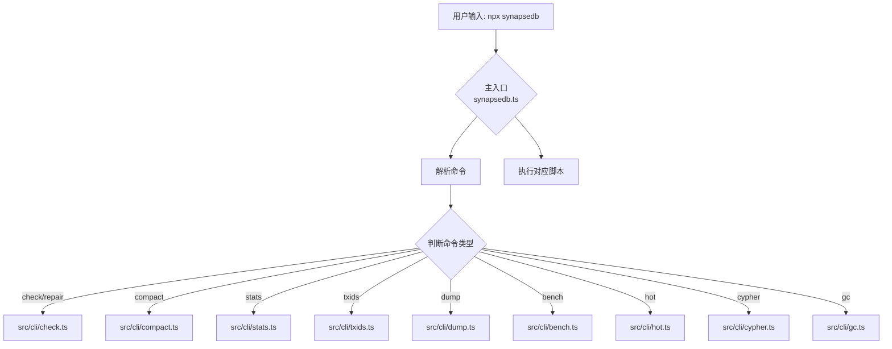

# 命令行工具

<cite>
**本文档中引用的文件**
- [package.json](file://package.json)
- [synapsedb.ts](file://src/cli/synapsedb.ts)
- [bench.ts](file://src/cli/bench.ts)
- [dump.ts](file://src/cli/dump.ts)
- [stats.ts](file://src/cli/stats.ts)
- [hot.ts](file://src/cli/hot.ts)
- [txids.ts](file://src/cli/txids.ts)
- [cypher.ts](file://src/cli/cypher.ts)
- [gc.ts](file://src/cli/gc.ts)
</cite>

## 更新摘要
**变更内容**
- 新增 **Cypher 查询执行：cypher** 命令，支持通过命令行执行 Cypher 查询语句
- 新增 **页面垃圾回收：gc** 命令，用于回收数据库中不可达的页面文件
- 更新 **CLI 入口与调用方式** 部分，补充 `cypher` 和 `gc` 命令的分发逻辑
- 更新 **核心命令详解** 目录结构，新增两个核心命令章节
- 所有引用文件列表已更新，包含新引入的 `cypher.ts` 和 `gc.ts`

## 目录
1. [简介](#简介)
2. [CLI 入口与调用方式](#cli-入口与调用方式)
3. 核心命令详解
   1. [性能压测：bench](#性能压测bench)
   2. [数据导出：dump](#数据导出dump)
   3. [存储统计：stats](#存储统计stats)
   4. [热点分析：hot](#热点分析hot)
   5. [事务ID管理：txids](#事务id管理txids)
   6. [Cypher查询执行：cypher](#cypher查询执行cypher)
   7. [页面垃圾回收：gc](#页面垃圾回收gc)
4. [实用操作示例](#实用操作示例)
5. [总结](#总结)

## 简介
SynapseDB 提供了一套功能丰富的命令行工具（CLI），用于数据库的维护、诊断和性能测试。这些工具通过 `npx synapsedb` 统一调用，支持多种子命令，涵盖从基础数据操作到高级系统分析的各类场景。本手册将详细介绍各内置 CLI 命令的功能、用法、参数选项及典型应用场景。

## CLI 入口与调用方式
SynapseDB 的 CLI 工具通过 `package.json` 中的 `bin` 字段注册为全局可执行命令。其核心入口文件为 `dist/cli/synapsedb.js`，用户可通过 `npx synapsedb <command>` 的形式调用所有子命令。

该入口是一个分发器（dispatcher），负责解析输入的子命令，并将其转发至对应的实现脚本。例如，当执行 `npx synapsedb stats mydb.synapsedb` 时，主入口会识别 `stats` 命令，并使用 Node.js 的 `spawn` 函数启动 `src/cli/stats.ts` 编译后的脚本。



**Section sources**
- [package.json](file://package.json#L20-L80)
- [synapsedb.ts](file://src/cli/synapsedb.ts#L1-L149)

## 核心命令详解

### 性能压测：bench
`bench` 命令用于对数据库进行简单的性能基准测试，主要衡量数据插入、刷新和查询的速度。

**功能与用法**
该命令接收一个数据库路径作为必需参数，并可选地指定插入记录的数量和工作模式。
- **基本语法**: `npx synapsedb bench <db_path> [count=10000] [mode=default|lsm]`
- **参数说明**:
  - `<db_path>`: 指定要操作的数据库文件路径。
  - `[count]`: 要插入的三元组数量，默认为 10,000。
  - `[mode]`: 工作模式，`lsm` 启用 LSM-Lite 暂存模式以优化写入性能。

**适用场景**
此命令适用于快速评估数据库在特定配置下的写入吞吐量和查询延迟，是开发和调优阶段的常用工具。

**Section sources**
- [bench.ts](file://src/cli/bench.ts#L1-L31)

### 数据导出：dump
`dump` 命令用于将数据库中的内容以人类可读的格式导出，便于数据检查和迁移。

**功能与用法**
该命令可以按指定的索引顺序（如 SPO, SOP）和主键值导出三元组数据。
- **基本语法**: `npx synapsedb dump <db_path> <order> <primary_value>`
- **参数说明**:
  - `<db_path>`: 数据库文件路径。
  - `<order>`: 索引顺序，如 `SPO` (主语-谓语-宾语)。
  - `<primary_value>`: 主键的数值 ID。
- **输出格式**: 输出包含三元组的 ID 和对应的字符串值，例如 `1:2:3 // Alice knows Bob`。

**适用场景**
常用于数据迁移、调试数据一致性问题或在不启动完整应用的情况下查看数据库内容。

**Section sources**
- [dump.ts](file://src/cli/dump.ts#L1-L51)

### 存储统计：stats
`stats` 命令提供数据库的全面存储统计信息，是诊断性能和存储膨胀问题的关键工具。

**功能与用法**
该命令输出 JSON 格式的详细报告，涵盖字典条目、三元组数量、WAL 大小、页面分布等。
- **基本语法**: `npx synapsedb stats <db_path> [options]`
- **常用选项**:
  - `--verbose`: 显示更详细的统计信息，包括文件大小和汇总指标。
  - `--property`: 包含属性索引的统计信息。
  - `--hotness`: 包含热度访问统计。
  - `--readers`: 显示当前活跃的读者进程。
  - `--txids[=N]`: 列出最近 N 个事务 ID（默认 50）。
  - `--all`: 包含所有扩展统计信息。

**适用场景**
用于监控数据库健康状况、诊断存储空间异常增长、分析索引效率和排查锁竞争问题。

**Section sources**
- [stats.ts](file://src/cli/stats.ts#L1-L301)

### 热点分析：hot
`hot` 命令专门用于分析数据库的访问热点，帮助识别频繁被查询的数据区域。

**功能与用法**
该命令读取并分析存储在 `.pages` 目录下的热度数据文件。
- **基本语法**: `npx synapsedb hot <db_path> [--order=SPO] [--top=10]`
- **参数说明**:
  - `<db_path>`: 数据库路径。
  - `--order`: 指定要分析的索引顺序，默认为 `SPO`。
  - `--top`: 返回访问次数最多的前 N 个主键，默认为 10。

**适用场景**
对于优化缓存策略、调整数据布局或理解查询负载模式非常有用。

**Section sources**
- [hot.ts](file://src/cli/hot.ts#L1-L28)

### 事务ID管理：txids
`txids` 命令用于管理和查看数据库的事务 ID 注册表，支持幂等性控制。

**功能与用法**
该命令允许列出、过滤、限制或清空事务 ID 记录。
- **基本语法**: `npx synapsedb txids <db_path> [options]`
- **常用选项**:
  - `--list[=N]`: 列出最近 N 个事务 ID。
  - `--since=MINUTES`: 只显示最近 M 分钟内的事务。
  - `--session=ID`: 按会话 ID 过滤事务。
  - `--max=N`: 设置事务 ID 注册表的最大容量。
  - `--clear`: 清空所有事务 ID 记录。

**适用场景**
在需要确保操作幂等性的分布式系统中，用于审计和管理事务历史。

**Section sources**
- [txids.ts](file://src/cli/txids.ts#L1-L70)

### Cypher查询执行：cypher
`cypher` 命令用于通过命令行直接执行 Cypher 查询语句，支持从参数或文件读取查询。

**功能与用法**
该命令允许用户执行只读或写操作的 Cypher 语句，并可配置查询优化和结果格式。
- **基本语法**: `npx synapsedb cypher <db> [--query|-q <cypher>] [--file <path>] [--readonly] [--optimize[=basic|aggressive]] [--params JSON] [--format table|json] [--limit N]`
- **参数说明**:
  - `<db>`: 数据库文件路径。
  - `--query` 或 `-q`: 直接指定 Cypher 查询语句。
  - `--file`: 从指定文件读取 Cypher 查询。
  - `--readonly`: 以只读模式执行查询。
  - `--optimize`: 启用查询优化，可指定 `basic` 或 `aggressive` 级别。
  - `--params`: 提供 JSON 格式的查询参数。
  - `--format`: 指定输出格式，`table` 或 `json`。
  - `--limit`: 限制返回结果的行数。

**适用场景**
适用于自动化脚本、查询调试、性能测试以及与 CI/CD 流程集成的场景。

**Section sources**
- [cypher.ts](file://src/cli/cypher.ts#L1-L166)
- [synapseDb.ts](file://src/synapseDb.ts#L577-L594)
- [index.ts](file://src/query/pattern/index.ts#L218-L267)

### 页面垃圾回收：gc
`gc` 命令用于回收数据库中不再被引用的页面文件，帮助减少存储占用。

**功能与用法**
该命令扫描数据库的页面清单（manifest），识别并移除不可达的页面。
- **基本语法**: `npx synapsedb gc <db> [--no-respect-readers] [--dry-run] [--force]`
- **参数说明**:
  - `<db>`: 数据库文件路径。
  - `--no-respect-readers`: 忽略活跃读者，强制执行 GC。
  - `--dry-run`: 仅模拟执行，不实际修改文件（默认行为）。
  - `--force`: 实际执行垃圾回收操作。
- **输出格式**: 输出 JSON 格式的回收统计信息，包括回收前后的字节数、处理的页面数等。

**适用场景**
在执行 `compact` 命令后，用于清理产生的孤儿页面，或作为定期维护任务的一部分。

**Section sources**
- [gc.ts](file://src/cli/gc.ts#L1-L20)
- [gc.ts](file://src/maintenance/gc.ts#L22-L135)

## 实用操作示例

### 使用 dump 进行数据迁移
以下命令将数据库 `source.db` 中 `SPO` 索引下主键为 `1` 的所有三元组导出，并重定向到文件：
```bash
npx synapsedb dump source.db SPO 1 > exported_data.ndjson
```
导出的 NDJSON 文件可用于初始化另一个数据库实例。

### 通过 stats 诊断存储膨胀
运行以下命令获取数据库的详细存储信息，重点关注 `fileSizes` 和 `summary` 部分：
```bash
npx synapsedb stats mydb.synapsedb --all --verbose
```
如果发现 `totalBytes` 远大于有效数据量，可能表明存在未清理的 WAL 或过期页面，需要执行 `compact` 或 `gc` 操作。

### 利用 hot 识别频繁访问的数据
分析数据库 `mydb.synapsedb` 中最热门的 20 个 `SPO` 页面：
```bash
npx synapsedb hot mydb.synapsedb --order=SPO --top=20
```
输出结果可以帮助确定哪些数据应优先加载到内存缓存中。

## 总结
SynapseDB 的命令行工具集为数据库的日常运维和深度分析提供了强大支持。通过 `npx synapsedb` 统一入口，用户可以高效地执行性能测试、数据导出、状态诊断和热点分析等任务。熟练掌握这些工具的用法，能够显著提升数据库的可维护性和系统稳定性。