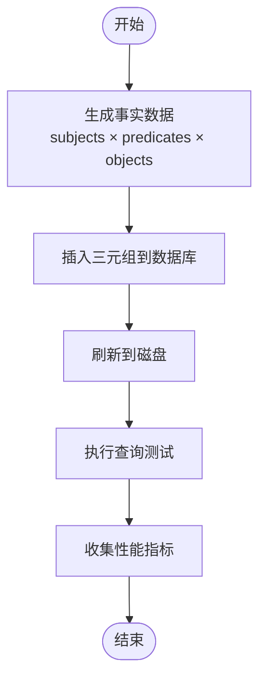
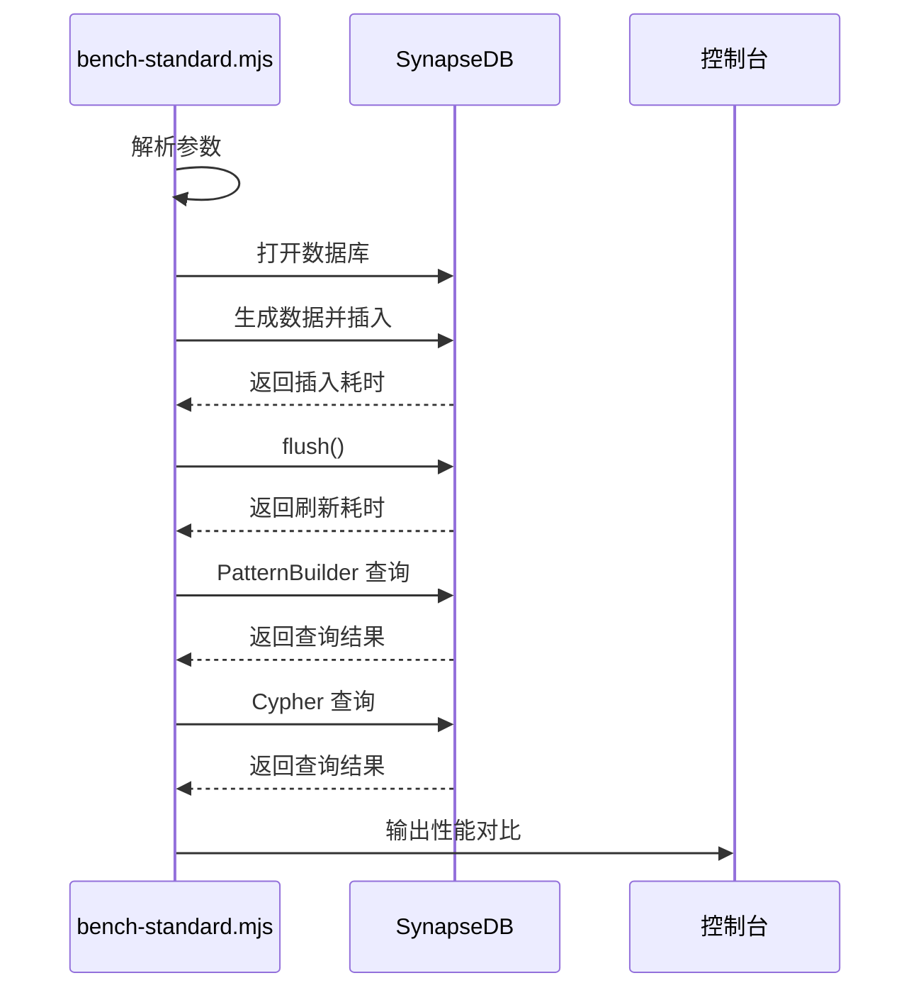
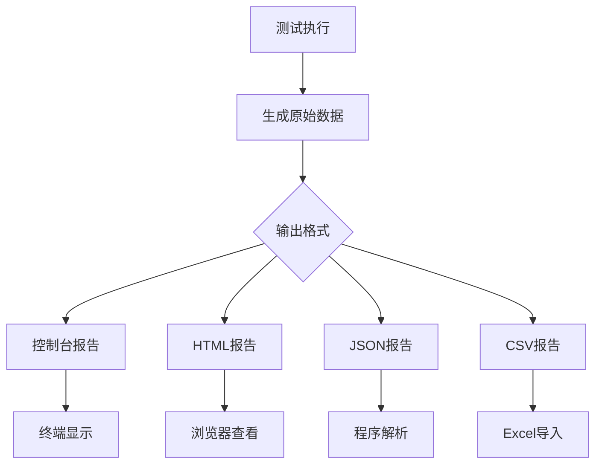

# 性能测试工具

<cite>
**本文档引用的文件**
- [bench.ts](file://src/cli/bench.ts)
- [benchmark/index.ts](file://src/benchmark/index.ts)
- [benchmark/runner.ts](file://src/benchmark/runner.ts)
- [benchmark/reporter.ts](file://src/benchmark/suites.ts)
- [benchmark/suites.ts](file://src/benchmark/suites.ts)
- [suites.ts](file://src/benchmark/suites.ts)
- [runner.ts](file://src/benchmark/runner.ts)
- [reporter.ts](file://src/benchmark/reporter.ts)
- [types.ts](file://src/benchmark/types.ts)
- [bench-standard.mjs](file://scripts/bench-standard.mjs)
</cite>

## 目录
1. [简介](#简介)
2. [核心架构与实现机制](#核心架构与实现机制)
3. [基准测试套件详解](#基准测试套件详解)
4. [命令行接口使用方法](#命令行接口使用方法)
5. [自动化压测流程](#自动化压测流程)
6. [性能指标解读指南](#性能指标解读指南)
7. [报告生成与输出格式](#报告生成与输出格式)
8. [性能回归检测](#性能回归检测)

## 简介
SynapseDB 提供了一套完整的性能测试框架，用于评估数据库系统在不同负载下的表现。该框架通过 `synapsedb bench` 命令驱动，支持多种预定义的基准测试套件（如 basic、comprehensive），并允许用户自定义参数以适应不同的测试场景。本文档详细说明了该性能测试工具的实现机制和使用方法。

## 核心架构与实现机制

SynapseDB 的性能测试框架基于模块化设计，主要由以下几个核心组件构成：

- **BenchmarkManager**: 作为高层管理器，提供统一的 API 接口来运行测试和生成报告。
- **BenchmarkRunnerImpl**: 负责实际执行测试用例，包括预热、正式运行和结果收集。
- **PerformanceMonitorImpl**: 实现对内存使用和执行时间的监控，确保测试数据的准确性。
- **BenchmarkReporterImpl**: 将测试结果格式化为多种输出形式，如控制台、HTML、JSON 和 CSV。

```mermaid
classDiagram
class BenchmarkManager {
+runSuite(suite : BenchmarkSuite) Promise~BenchmarkResult[]~
+runAllSuites() Promise~BenchmarkReport~
+runSuites(suites : BenchmarkSuite[]) Promise~BenchmarkReport~
+generateConsoleReport(report : BenchmarkReport) string
+generateHTMLReport(report : BenchmarkReport) string
+generateJSONReport(report : BenchmarkReport) string
+generateCSVReport(report : BenchmarkReport) string
+benchmark(options : any) Promise~{report, outputs}~
+runRegressionTest(baseline : BenchmarkReport, config? : RegressionConfig) Promise~RegressionResult[]~
}
class BenchmarkRunnerImpl {
+runTest(test : BenchmarkTest, config : BenchmarkConfig) Promise~BenchmarkResult~
+runSuite(suite : BenchmarkSuite) Promise~BenchmarkResult[]~
+runAll(suites : BenchmarkSuite[]) Promise~BenchmarkReport~
}
class PerformanceMonitorImpl {
+start() void
+stop() PerformanceMetrics
+reset() void
}
class BenchmarkReporterImpl {
+generateConsoleReport(report : BenchmarkReport) string
+generateHTMLReport(report : BenchmarkReport) string
+generateJSONReport(report : BenchmarkReport) string
+generateCSVReport(report : BenchmarkReport) string
}
BenchmarkManager --> BenchmarkRunnerImpl : "使用"
BenchmarkManager --> BenchmarkReporterImpl : "使用"
BenchmarkRunnerImpl --> PerformanceMonitorImpl : "依赖"
```

**图示来源**
- [index.ts](file://src/benchmark/index.ts#L67-L257)
- [runner.ts](file://src/benchmark/runner.ts#L98-L246)
- [reporter.ts](file://src/benchmark/reporter.ts#L19-L505)

**本节来源**
- [index.ts](file://src/benchmark/index.ts#L67-L257)
- [runner.ts](file://src/benchmark/runner.ts#L98-L246)
- [reporter.ts](file://src/benchmark/reporter.ts#L19-L505)

## 基准测试套件详解

SynapseDB 定义了多个基准测试套件，覆盖了核心功能、全文搜索、图算法和空间几何计算等模块。每个套件包含一组相关的测试用例，并配置了默认的运行参数。

### 测试套件类型

| 套件名称 | 描述 | 包含测试 |
|--------|------|---------|
| SynapseDB Core | 核心三元组操作性能测试 | 三元组插入、查询、链式查询 |
| Full-Text Search | 全文搜索引擎性能测试 | 文档索引、全文搜索 |
| Graph Algorithms | 图算法库性能测试 | PageRank 计算、Dijkstra 路径查找、社区发现 |
| Spatial Geometry | 空间几何计算性能测试 | 距离计算、边界框计算 |

### 数据生成策略

所有测试套件均使用 `DataGenerator` 类生成合成数据，确保测试的一致性和可重复性。例如，三元组数据通过组合预定义的主题、谓词和对象生成，而图数据则随机连接节点形成边。



**图示来源**
- [suites.ts](file://src/benchmark/suites.ts#L27-L47)
- [runner.ts](file://src/benchmark/runner.ts#L98-L177)

**本节来源**
- [suites.ts](file://src/benchmark/suites.ts#L27-L47)
- [runner.ts](file://src/benchmark/runner.ts#L98-L177)

## 命令行接口使用方法

`synapsedb bench` 命令提供了灵活的参数选项，允许用户定制测试行为。

### 基本语法
```bash
pnpm bench <db_path> [count=10000] [mode=default|lsm]
```

### 参数说明

| 参数 | 说明 | 默认值 |
|------|------|-------|
| `<db_path>` | 数据库文件路径 | 必需 |
| `count` | 插入记录数量 | 10000 |
| `mode` | 存储模式（default 或 lsm） | default |

### 示例
```bash
# 运行默认测试
pnpm bench ./test.db

# 指定插入10万条记录
pnpm bench ./test.db 100000

# 使用LSM存储模式
pnpm bench ./test.db 10000 lsm
```

**本节来源**
- [bench.ts](file://src/cli/bench.ts#L1-L30)

## 自动化压测流程

`scripts/bench-standard.mjs` 脚本实现了自动化的标准基准测试流程，主要用于对比 PatternBuilder 与 Cypher 引擎的查询性能。

### 执行步骤
1. 解析命令行参数
2. 生成指定数量的合成数据
3. 执行插入操作并计时
4. 刷新数据库状态
5. 分别使用 PatternBuilder 和 Cypher 进行查询测试
6. 输出性能对比结果



**图示来源**
- [bench-standard.mjs](file://scripts/bench-standard.mjs#L1-L58)

**本节来源**
- [bench-standard.mjs](file://scripts/bench-standard.mjs#L1-L58)

## 性能指标解读指南

测试结果包含多项关键性能指标，帮助用户全面评估系统表现。

### 主要性能指标

| 指标 | 说明 | 单位 |
|------|------|-----|
| executionTime | 测试执行总时间 | 毫秒 |
| memoryUsage | 内存使用量 | 字节 |
| operationsPerSecond | 每秒操作数 | ops/s |
| averageLatency | 平均延迟 | 毫秒 |
| p95Latency | 95% 请求延迟 | 毫秒 |
| p99Latency | 99% 请求延迟 | 毫秒 |

### 性能评估建议
- **高吞吐量**: operationsPerSecond 越高越好
- **低延迟**: averageLatency、p95Latency、p99Latency 越低越好
- **内存效率**: memoryUsage 应保持稳定，避免持续增长
- **一致性**: 多次运行结果应具有良好的一致性

**本节来源**
- [types.ts](file://src/benchmark/types.ts#L9-L38)

## 报告生成与输出格式

性能测试框架支持多种报告输出格式，满足不同场景的需求。

### 支持的输出格式

| 格式 | 特点 | 适用场景 |
|------|------|---------|
| console | 终端友好显示 | 快速查看 |
| html | 图形化展示，包含图表 | 详细分析 |
| json | 结构化数据 | 自动化处理 |
| csv | 表格数据 | 导入电子表格 |

### 报告内容结构
1. **环境信息**: Node.js 版本、操作系统、CPU、内存
2. **测试摘要**: 总测试数、通过率、总执行时间
3. **详细结果**: 各测试项的具体性能数据
4. **性能回归**: 与基线版本的对比分析
5. **性能建议**: 基于测试结果的优化建议



**图示来源**
- [reporter.ts](file://src/benchmark/reporter.ts#L23-L133)
- [reporter.ts](file://src/benchmark/reporter.ts#L145-L369)

**本节来源**
- [reporter.ts](file://src/benchmark/reporter.ts#L23-L133)
- [reporter.ts](file://src/benchmark/reporter.ts#L145-L369)

## 性能回归检测

系统内置了性能回归检测功能，可用于比较新旧版本之间的性能变化。

### 回归检测逻辑
1. 获取基线报告（baselineReport）
2. 运行当前版本测试获取最新报告
3. 对比相同测试项的关键指标
4. 判断是否超过预设阈值（默认10%）

### 检测指标
- 执行时间增加 > 10%
- 内存使用增加 > 10%
- 每秒操作数下降 > 10%

当任一指标超出阈值时，系统将标记为性能回归，并在报告中突出显示。

**本节来源**
- [index.ts](file://src/benchmark/index.ts#L198-L256)
- [types.ts](file://src/benchmark/types.ts#L141-L152)