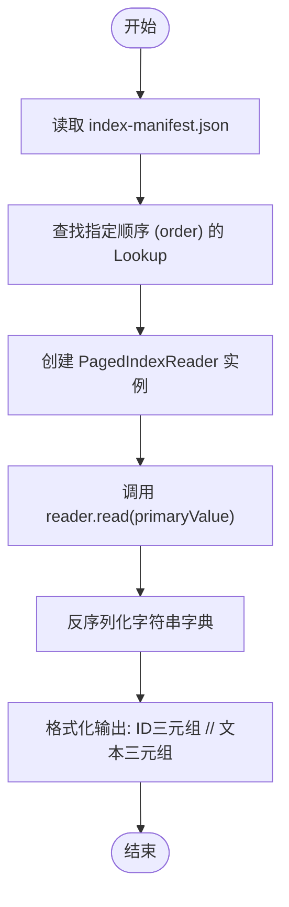
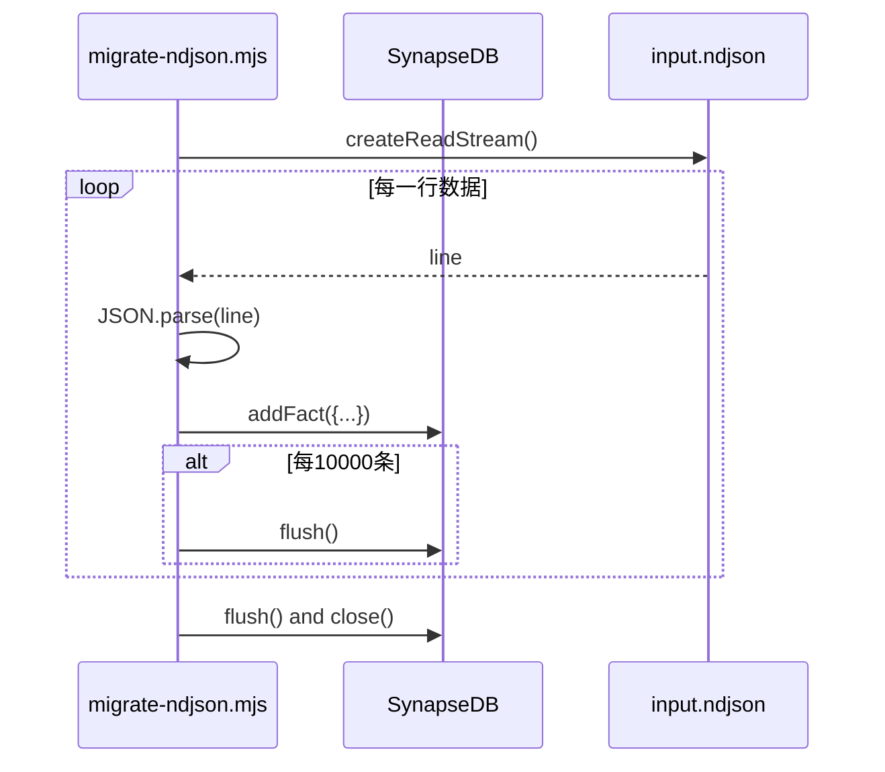
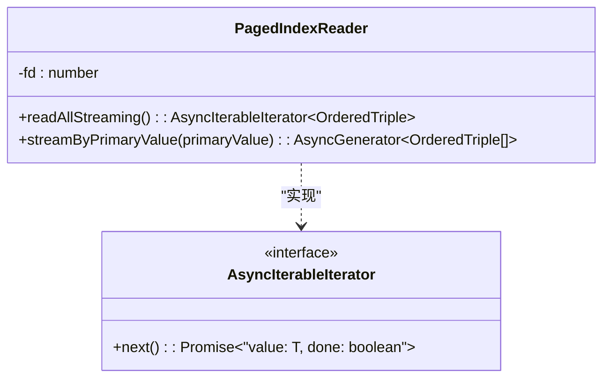

# 数据导出工具

<cite>
**本文档引用文件**  
- [dump.ts](file://src/cli/dump.ts)
- [migrate-ndjson.mjs](file://scripts/migrate-ndjson.mjs)
- [pagedIndex.ts](file://src/storage/pagedIndex.ts)
- [synapseDb.ts](file://src/synapseDb.ts)
</cite>

## 目录
1. [功能概述](#功能概述)
2. [核心命令详解](#核心命令详解)
3. [数据迁移与同步场景](#数据迁移与同步场景)
4. [批量导入/导出最佳实践](#批量导入导出最佳实践)
5. [大容量数据处理优化策略](#大容量数据处理优化策略)
6. [流式传输机制分析](#流式传输机制分析)

## 功能概述

`synapsedb dump` 命令是 SynapseDB 提供的核心数据导出工具，用于将数据库中的三元组事实（SPO）以可读格式序列化输出。该功能在数据迁移、备份恢复和跨环境同步等关键运维场景中发挥着重要作用。通过结合 `migrate-ndjson.mjs` 脚本，可以实现完整的 NDJSON 格式批量导入/导出流程，满足大规模知识图谱的持久化与交换需求。

**Section sources**
- [README.md](file://README.md#L0-L354)

## 核心命令详解

`synapsedb dump` 命令通过 CLI 接口暴露，其核心逻辑位于 `src/cli/dump.ts` 文件中。该命令接受三个参数：数据库路径、索引顺序（order）和主键值（primaryValue）。执行时，它首先读取分页索引的 manifest 文件，定位到指定顺序的索引查找表（lookup），然后使用 `PagedIndexReader` 读取对应主键下的所有三元组数据。

导出的数据不仅包含原始的 ID 三元组（subjectId:predicateId:objectId），还通过反序列化字符串字典（StringDictionary）将其转换为人类可读的文本形式，并以注释方式附加显示。这种设计使得导出结果既可用于机器解析，也便于人工审查和调试。

**Diagram sources**
- [dump.ts](file://src/cli/dump.ts#L5-L32)
- [pagedIndex.ts](file://src/storage/pagedIndex.ts#L200-L250)

**Section sources**
- [dump.ts](file://src/cli/dump.ts#L5-L32)

## 数据迁移与同步场景

`synapsedb dump` 命令在多种数据管理场景中至关重要：

- **数据迁移**：当需要将知识库从一个存储位置迁移到另一个位置时，可以通过 `dump` 命令导出特定索引顺序下的数据，再利用导入脚本重建新库。
- **备份与恢复**：定期导出关键数据集作为备份，在发生数据损坏或丢失时，可快速通过导入脚本恢复服务。
- **跨环境同步**：在开发、测试和生产环境之间同步知识图谱数据，确保各环境间的数据一致性。

这些场景依赖于 `dump` 命令提供的精确、可控的数据提取能力，能够针对特定的主键范围进行操作，避免了全量导出带来的性能开销。

**Section sources**
- [README.md](file://README.md#L0-L354)

## 批量导入/导出最佳实践

结合 `scripts/migrate-ndjson.mjs` 脚本，可以构建高效的批量数据迁移流水线。该脚本实现了从 NDJSON 文件到 SynapseDB 的批量导入功能。其工作流程如下：创建文件读取流，逐行解析 JSON 对象，调用 `db.addFact()` 添加事实，并在每 10,000 条记录后执行一次 `flush()` 操作以持久化数据。

最佳实践建议：
1. **分批提交**：如脚本所示，定期调用 `flush()` 可以防止内存占用过高，并确保数据及时落盘。
2. **错误处理**：在导入循环中加入对空行和无效 JSON 的检查，提高脚本的健壮性。
3. **资源清理**：在脚本末尾正确关闭数据库连接，释放系统资源。

此脚本与 `dump` 命令形成互补，共同构成了完整的数据交换解决方案。

**Diagram sources**
- [migrate-ndjson.mjs](file://scripts/migrate-ndjson.mjs#L1-L42)

**Section sources**
- [migrate-ndjson.mjs](file://scripts/migrate-ndjson.mjs#L1-L42)

## 大容量数据处理优化策略

面对大容量数据处理，`synapsedb dump` 和相关组件采用了多项内存优化策略：

- **分页索引**：数据被组织成固定大小的页面（默认 1024 条/页），避免一次性加载整个索引到内存。
- **增量刷新**：`PersistentStore` 类维护了一个 `txStack` 事务栈，仅将增量变更暂存于内存，通过 `flush()` 操作合并到持久化存储。
- **流式查询**：`streamFacts` 和 `findStreaming` 方法提供了异步迭代器接口，允许应用以批次方式消费结果，显著降低峰值内存占用。

这些策略确保了即使在处理数百万级三元组时，系统也能保持稳定和高效。

**Section sources**
- [synapseDb.ts](file://src/synapseDb.ts#L200-L300)
- [persistentStore.ts](file://src/storage/persistentStore.ts#L800-L900)

## 流式传输机制分析

SynapseDB 的流式传输机制是其高性能的关键。`PagedIndexReader` 类提供了 `readAllStreaming()` 和 `streamByPrimaryValue()` 等方法，它们返回 `AsyncIterableIterator`，允许调用者以拉取模式逐条处理数据。

该机制的核心优势在于：
- **内存效率**：数据按需读取，不会在内存中累积整个结果集。
- **响应性**：第一个数据项可以立即返回，无需等待全部数据加载完成。
- **可组合性**：流式接口易于与其他异步操作（如网络传输、文件写入）组合，构建复杂的数据管道。

这一设计充分体现了现代 Node.js 应用对异步 I/O 和背压处理的最佳实践。

**Diagram sources**
- [pagedIndex.ts](file://src/storage/pagedIndex.ts#L250-L300)

**Section sources**
- [pagedIndex.ts](file://src/storage/pagedIndex.ts#L250-L300)