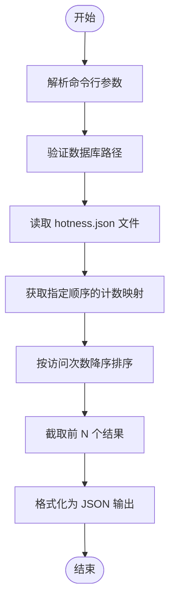
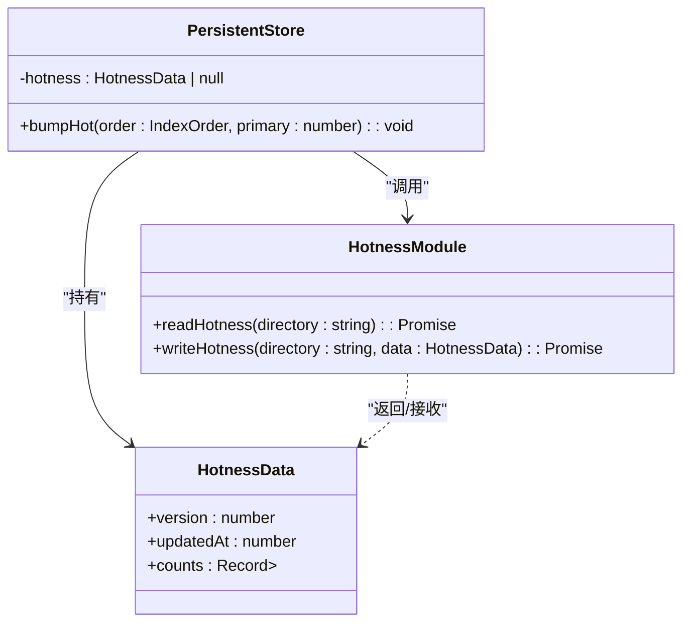
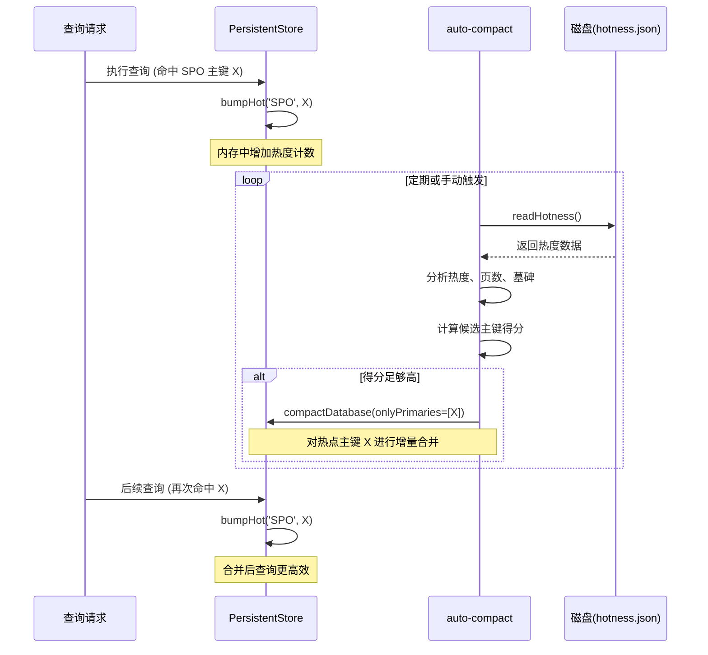

# hot 命令：数据页热度分析

<cite>
**本文档引用文件**
- [hot.ts](file://src/cli/hot.ts)
- [hotness.ts](file://src/storage/hotness.ts)
- [persistentStore.ts](file://src/storage/persistentStore.ts)
- [autoCompact.ts](file://src/maintenance/autoCompact.ts)
</cite>

## 目录
1. [简介](#简介)
2. [核心工作机制](#核心工作机制)
3. [热度更新策略](#热度更新策略)
4. [自动合并与缓存管理](#自动合并与缓存管理)
5. [使用案例与性能优化](#使用案例与性能优化)
6. [结论](#结论)

## 简介
`hot` CLI命令是SynapseDB中用于分析数据页访问热度的核心工具。该命令通过读取数据库的热度计数文件，展示特定索引顺序下主键（primary）的访问频率，帮助用户识别热点数据、优化查询局部性，并为自动合并和缓存管理提供决策依据。

**Section sources**
- [hot.ts](file://src/cli/hot.ts#L0-L26)
- [README.md](file://README.md#L85-L122)

## 核心工作机制
`hot`命令的工作流程始于解析用户输入的数据库路径及可选参数（如索引顺序`--order`和显示数量`--top`）。其核心功能依赖于`readHotness`函数从数据库的`.pages`目录中读取`hotness.json`文件，该文件存储了各索引顺序下主键的访问计数。

命令执行时，首先根据指定的索引顺序（默认为SPO）获取对应的热度计数映射，然后按访问次数降序排序，截取前N个最热的主键并以JSON格式输出结果，包含主键值、访问次数及最后更新时间戳。

**Diagram sources**
- [hot.ts](file://src/cli/hot.ts#L0-L26)

**Section sources**
- [hot.ts](file://src/cli/hot.ts#L0-L26)

## 热度更新策略
### LRU近似计数
系统采用一种轻量级的LRU（最近最少使用）近似计数机制来追踪数据页的访问热度。每当一个查询命中某个索引顺序下的特定主键时，系统会调用`bumpHot`方法，将该主键在对应顺序下的计数加一。这种计数方式不记录精确的访问时间序列，而是通过累积访问次数来反映数据的“热度”，实现简单且开销低。

### 写入触发更新
热度计数的更新并非实时同步到磁盘，而是在数据库执行`flush`操作或关闭时，由`writeHotness`函数将内存中的`HotnessData`对象持久化到`hotness.json`文件。此过程采用原子写入（先写临时文件再重命名）和目录同步，确保数据的完整性和一致性。

**Diagram sources**
- [hotness.ts](file://src/storage/hotness.ts#L5-L9)
- [persistentStore.ts](file://src/storage/persistentStore.ts#L1453-L1460)

**Section sources**
- [hotness.ts](file://src/storage/hotness.ts#L13-L25)
- [persistentStore.ts](file://src/storage/persistentStore.ts#L1453-L1460)

## 自动合并与缓存管理
### 指导自动合并（auto-compact）
`auto-compact`功能深度集成热度数据，以实现智能化的增量合并。当配置为增量模式（incremental）时，`auto-compact`会加载`hotness.json`中的计数信息，结合多页主键的数量和墓碑比例等因素，计算每个候选主键的综合得分。

得分计算公式为：`score = hotCount * w_hot + (pageCount - 1) * w_pages + tombTerm * w_tomb`。只有当主键的热度超过`hotThreshold`且综合得分高于`minScore`时，才会被选中进行合并。这确保了资源优先用于优化那些频繁访问且碎片化的热点数据，从而显著提升后续查询性能。

### 优化缓存管理
虽然当前代码未直接展示基于热度的缓存驱逐策略，但`hot`命令提供的热度数据为实现高级缓存算法（如LFU或W-TinyLFU）奠定了基础。通过识别出的高热度主键，可以将其对应的页或数据块优先保留在高速缓存中，减少对慢速存储的访问，有效降低查询延迟。

**Diagram sources**
- [autoCompact.ts](file://src/maintenance/autoCompact.ts#L81-L113)
- [autoCompact.ts](file://src/maintenance/autoCompact.ts#L175-L207)

**Section sources**
- [autoCompact.ts](file://src/maintenance/autoCompact.ts#L0-L338)

## 使用案例与性能优化
### 识别热点争用
通过运行`synapsedb hot mydb.synapsedb --order=SPO --top=5`，管理员可以快速发现哪些主语（Subject）被最频繁地查询。如果发现少数几个主语占据了绝大部分访问量，这可能表明存在热点争用问题。此时，可以通过调整数据模型或应用层缓存来分散负载。

### 优化查询局部性
分析不同索引顺序（如SPO vs POS）的热度分布，可以帮助理解应用的查询模式。例如，若POS顺序的某些主键非常热，说明应用经常根据谓词（Predicate）查找事实，这验证了POS索引的有效性，并提示应保持这些数据的紧凑性。

### 发现频繁访问路径
结合业务逻辑，`hot`命令的结果可用于发现高频访问路径。例如，在知识图谱应用中，频繁访问的“类定义”或“关系类型”主键揭示了核心的数据访问路径。开发者可以据此对这些关键路径进行针对性优化，如预加载相关数据或创建专用视图。

**Section sources**
- [auto_compact_hot.test.ts](file://tests/integration/maintenance/auto_compact_hot.test.ts#L0-L16)
- [maintenance_combo.test.ts](file://tests/integration/maintenance/maintenance_combo.test.ts#L0-L39)

## 结论
`hot`命令及其背后的热度追踪机制是SynapseDB实现自适应性能优化的关键组件。它不仅提供了一个直观的工具来洞察数据库的访问模式，还为`auto-compact`等后台维护任务提供了至关重要的决策数据。通过利用这一机制，用户能够主动识别性能瓶颈，优化数据布局，并最终构建出响应更快、效率更高的数据驱动应用。