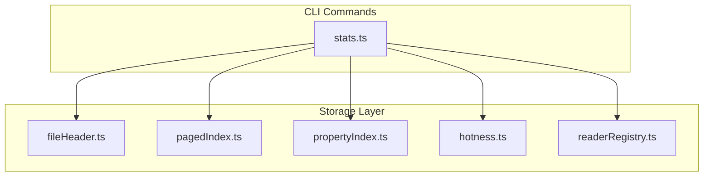
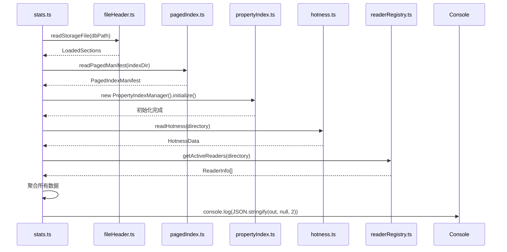
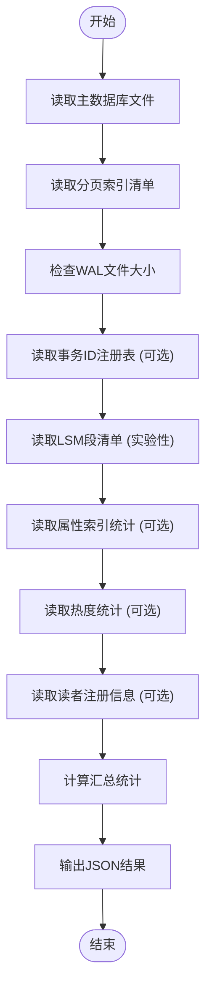

# stats 命令：数据库统计信息

<cite>
**本文档引用的文件**
- [stats.ts](file://src/cli/stats.ts)
- [persistentStore.ts](file://src/storage/persistentStore.ts)
- [fileHeader.ts](file://src/storage/fileHeader.ts)
- [pagedIndex.ts](file://src/storage/pagedIndex.ts)
- [propertyIndex.ts](file://src/storage/propertyIndex.ts)
- [hotness.ts](file://src/storage/hotness.ts)
- [readerRegistry.ts](file://src/storage/readerRegistry.ts)
</cite>

## 目录
1. [简介](#简介)
2. [项目结构](#项目结构)
3. [核心组件](#核心组件)
4. [架构概述](#架构概述)
5. [详细组件分析](#详细组件分析)
6. [依赖分析](#依赖分析)
7. [性能考虑](#性能考虑)
8. [故障排除指南](#故障排除指南)
9. [结论](#结论)

## 简介
`stats` CLI命令是SynapseDB中用于诊断和监控数据库实例健康状况的核心工具。该命令通过收集并输出数据库内部的关键统计信息，帮助用户理解存储状态、识别潜在问题，并进行性能调优。它能够提供关于页面计数、索引分布、事务日志（WAL）状态以及存储层结构等多维度的指标。

此文档旨在深入解析`stats`命令的实现机制，阐明其如何与PersistentStore和Storage模块交互以获取数据，并说明这些统计数据在诊断存储膨胀、监控系统健康度方面的实际应用价值。同时，文档将展示经过可读性优化的输出示例，以便用户更好地理解和利用这些信息。

## 项目结构
SynapseDB的项目结构清晰地划分了不同功能模块。`stats`命令的逻辑实现在`src/cli/stats.ts`文件中，而其依赖的数据访问和存储管理功能则分布在`src/storage/`目录下的多个文件中。这种分层设计使得CLI命令可以专注于业务逻辑，而将底层的I/O操作和数据处理委托给专门的模块。

**图表来源**
- [stats.ts](file://src/cli/stats.ts)
- [fileHeader.ts](file://src/storage/fileHeader.ts)
- [pagedIndex.ts](file://src/storage/pagedIndex.ts)
- [propertyIndex.ts](file://src/storage/propertyIndex.ts)
- [hotness.ts](file://src/storage/hotness.ts)
- [readerRegistry.ts](file://src/storage/readerRegistry.ts)

**章节来源**
- [stats.ts](file://src/cli/stats.ts)
- [project_structure]

## 核心组件
`stats`命令的核心在于其能够聚合来自数据库不同层面的信息。主要涉及以下几个方面：
- **基础元数据**：从主数据库文件头读取字典条目数和三元组数量。
- **分页索引**：分析`.pages`目录中的索引文件，获取页面文件数、总页数及各索引顺序的分布情况。
- **事务日志(WAL)**：检查`.wal`文件大小，评估未持久化写入量。
- **扩展统计**：根据选项，可包含属性索引、热度数据和活动读者等高级信息。

这些组件共同构成了对数据库存储状态的全面视图。

**章节来源**
- [stats.ts](file://src/cli/stats.ts#L1-L300)

## 架构概述
`stats`命令的工作流程遵循一个典型的“收集-处理-输出”模式。首先，它通过一系列异步函数调用从磁盘读取必要的文件和数据结构。然后，在内存中对这些原始数据进行聚合和计算，生成有意义的统计指标。最后，将结果格式化为JSON并输出到控制台。

整个过程体现了模块化的设计思想，各个功能单元（如读取文件头、解析清单、获取热度数据）被封装成独立的函数或类方法，便于维护和测试。

**图表来源**
- [stats.ts](file://src/cli/stats.ts)
- [fileHeader.ts](file://src/storage/fileHeader.ts)
- [pagedIndex.ts](file://src/storage/pagedIndex.ts)
- [propertyIndex.ts](file://src/storage/propertyIndex.ts)
- [hotness.ts](file://src/storage/hotness.ts)
- [readerRegistry.ts](file://src/storage/readerRegistry.ts)

## 详细组件分析
### stats 函数分析
`stats`函数是命令的核心执行体，负责协调所有统计信息的收集工作。它接收数据库路径和一组选项作为参数，并返回一个Promise。

#### 数据收集流程

**图表来源**
- [stats.ts](file://src/cli/stats.ts#L15-L290)

**章节来源**
- [stats.ts](file://src/cli/stats.ts#L15-L290)

### PersistentStore 交互分析
`stats`命令虽然不直接实例化`PersistentStore`，但它所调用的底层函数（如`readStorageFile`, `readPagedManifest`）正是由`PersistentStore`在初始化时所使用的。这表明`