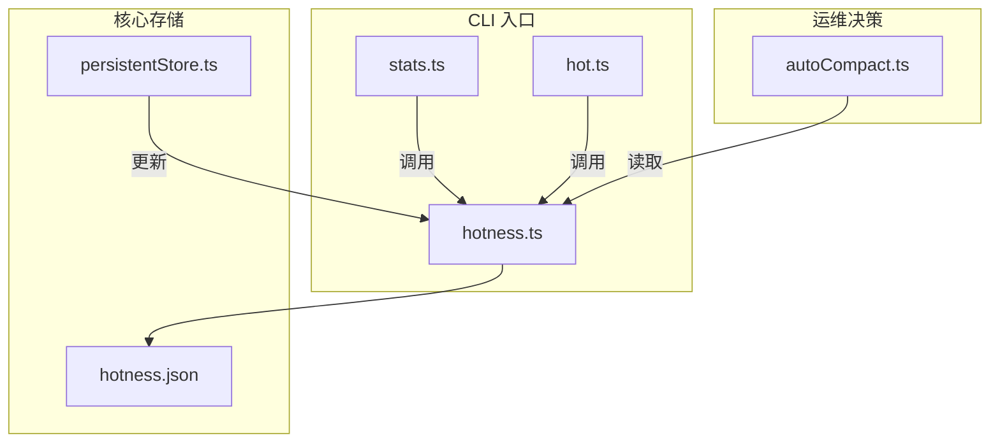
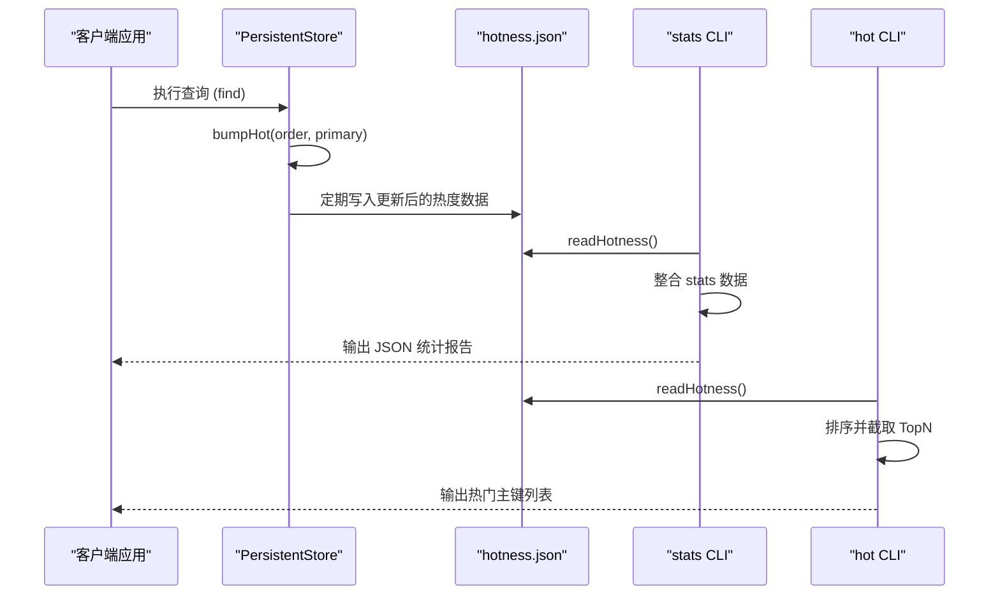
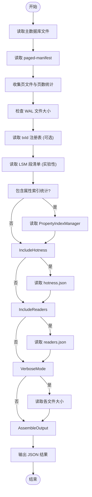
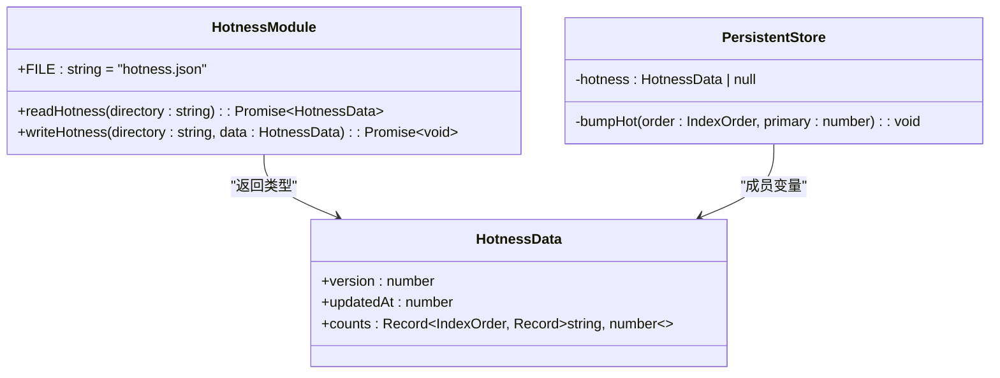
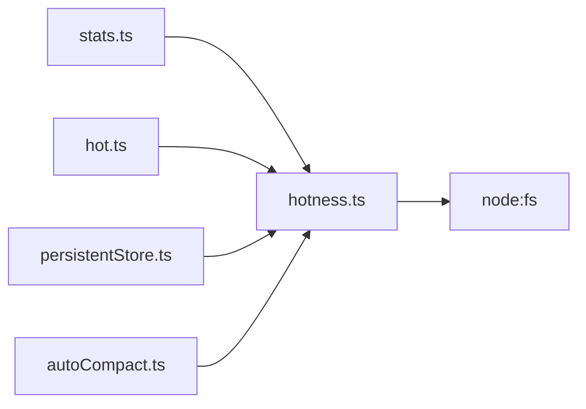

# 状态监控工具

<cite>
**本文档引用的文件**
- [stats.ts](file://src/cli/stats.ts)
- [hot.ts](file://src/cli/hot.ts)
- [hotness.ts](file://src/storage/hotness.ts)
- [persistentStore.ts](file://src/storage/persistentStore.ts)
- [autoCompact.ts](file://src/maintenance/autoCompact.ts)
</cite>

## 目录
1. [简介](#简介)
2. [项目结构](#项目结构)
3. [核心组件](#核心组件)
4. [架构概述](#架构概述)
5. [详细组件分析](#详细组件分析)
6. [依赖分析](#依赖分析)
7. [性能考量](#性能考量)
8. [故障排除指南](#故障排除指南)
9. [结论](#结论)

## 简介
本综合文档旨在深入解析 SynapseDB 的状态监控子系统，重点阐述 `stats` 和 `hot` 两个核心 CLI 命令。文档将详细说明 `stats` 命令如何收集并展示数据库的存储结构统计信息（如页面数量、索引大小、事务日志状态），以及 `hot` 命令如何基于热度计数器识别高频访问的数据页。通过结合 `hotness.ts` 中的热度更新逻辑，解释其对自动合并与缓存优化的指导意义，并提供诊断存储膨胀或热点争用的实际案例。

## 项目结构
SynapseDB 项目的源代码组织清晰，主要功能模块位于 `src` 目录下。与状态监控直接相关的文件分布在 `cli` 和 `storage` 子目录中。`cli` 目录包含 `stats.ts` 和 `hot.ts` 两个独立的命令行脚本，它们是用户与监控功能交互的入口点。`storage` 目录下的 `hotness.ts` 文件定义了核心的热度数据模型和读写逻辑，而 `persistentStore.ts` 则在数据访问时负责更新这些热度计数。此外，`maintenance` 目录中的 `autoCompact.ts` 展示了如何利用热度数据来驱动数据库维护操作。



**图例来源**
- [stats.ts](file://src/cli/stats.ts)
- [hot.ts](file://src/cli/hot.ts)
- [hotness.ts](file://src/storage/hotness.ts)
- [persistentStore.ts](file://src/storage/persistentStore.ts)
- [autoCompact.ts](file://src/maintenance/autoCompact.ts)

## 核心组件
本节分析构成状态监控子系统的三个核心组件：`stats` 命令用于全面的数据库健康检查，`hot` 命令用于识别热点数据，而 `hotness` 模块则提供了底层的热度追踪机制。

**章节来源**
- [stats.ts](file://src/cli/stats.ts#L10-L252)
- [hot.ts](file://src/cli/hot.ts#L1-L27)
- [hotness.ts](file://src/storage/hotness.ts#L5-L9)

## 架构概述
状态监控子系统的架构围绕一个中心化的热度数据文件 `hotness.json` 构建。当客户端执行查询时，`PersistentStore` 类会记录被访问的数据页主键，这些信息被累积在内存中，并定期持久化到磁盘。`stats` 和 `hot` 这两个 CLI 工具通过读取此文件以及其他数据库元数据（如分页清单 `manifest`）来生成各自的报告。这种设计实现了监控功能与核心数据引擎的解耦，使得监控操作不会干扰正常的数据库读写性能。



**图例来源**
- [persistentStore.ts](file://src/storage/persistentStore.ts#L1453-L1460)
- [hotness.ts](file://src/storage/hotness.ts#L13-L25)
- [stats.ts](file://src/cli/stats.ts#L119-L163)
- [hot.ts](file://src/cli/hot.ts#L16-L16)

## 详细组件分析
### stats 命令分析
`stats` 命令是一个功能丰富的诊断工具，它聚合了来自数据库多个层面的信息。该命令不仅报告基础的字典条目和三元组数量，还深入到分页索引的细节，统计每个索引顺序（SPO, SOP 等）的页文件数量、总页数以及存在碎片化的主键数量。通过可选标志，它可以进一步包含属性索引的统计、热度数据摘要和活跃读者进程的信息。

#### 对于 API/服务组件：


**图例来源**
- [stats.ts](file://src/cli/stats.ts#L10-L252)

**章节来源**
- [stats.ts](file://src/cli/stats.ts#L10-L252)

### hot 命令分析
`hot` 命令的设计目标更为单一和直接：快速识别出最常被访问的数据页。它通过 `readHotness` 函数加载 `hotness.json` 文件，然后根据用户指定的索引顺序（默认为 SPO）筛选出对应的热度计数。接着，它对所有主键的访问次数进行降序排序，并截取前 N 个（默认为 10）作为结果输出。这个过程高效且轻量，非常适合用于快速定位性能瓶颈。

#### 对于复杂逻辑组件：
```mermaid
flowchart TD
A([程序启动]) --> B{参数校验}
B --> |无效| C[打印用法并退出]
B --> |有效| D[解析命令行参数]
D --> E[调用 readHotness()]
E --> F{读取成功?}
F --> |否| G[使用默认空热度数据]
F --> |是| H[获取指定顺序的计数]
G --> I
H --> I[按访问次数降序排序]
I --> J[截取 TopN]
J --> K[格式化输出结果]
K --> L[打印 JSON]
L --> M([程序结束])
```

**图例来源**
- [hot.ts](file://src/cli/hot.ts#L1-L27)

**章节来源**
- [hot.ts](file://src/cli/hot.ts#L1-L27)

### 热度追踪机制分析
`hotness` 模块是整个监控系统的基础。它定义了一个简单的数据结构 `HotnessData`，其中 `counts` 字段是一个嵌套的对象，第一层键是索引顺序（如 'SPO'），第二层键是主键值（转换为字符串），值则是该主键被访问的累计次数。`PersistentStore` 在每次查询命中一个数据页时，都会调用私有的 `bumpHot` 方法来递增相应的计数器。`readHotness` 和 `writeHotness` 函数则负责与磁盘上的 `hotness.json` 文件进行安全的读写交互。

#### 对于对象导向的组件：


**图例来源**
- [hotness.ts](file://src/storage/hotness.ts#L5-L9)
- [persistentStore.ts](file://src/storage/persistentStore.ts#L1453-L1460)

**章节来源**
- [hotness.ts](file://src/storage/hotness.ts#L5-L9)
- [persistentStore.ts](file://src/storage/persistentStore.ts#L1453-L1460)

## 依赖分析
状态监控子系统内部及与其他模块的依赖关系清晰。`stats.ts` 和 `hot.ts` 都直接依赖 `hotness.ts` 来获取热度数据。`hotness.ts` 本身依赖 Node.js 的文件系统 API 进行持久化。`persistentStore.ts` 是唯一向 `hotness` 数据写入的组件，它依赖 `hotness.ts` 的接口来读取初始状态和写回更新。值得注意的是，`autoCompact.ts` 也依赖 `hotness.ts` 来做出运维决策，这表明热度数据不仅是诊断工具，更是主动优化策略的输入。



**图例来源**
- [stats.ts](file://src/cli/stats.ts#L1)
- [hot.ts](file://src/cli/hot.ts#L1)
- [persistentStore.ts](file://src/storage/persistentStore.ts#L1)
- [autoCompact.ts](file://src/maintenance/autoCompact.ts#L1)

**章节来源**
- [stats.ts](file://src/cli/stats.ts)
- [hot.ts](file://src/cli/hot.ts)
- [hotness.ts](file://src/storage/hotness.ts)
- [persistentStore.ts](file://src/storage/persistentStore.ts)
- [autoCompact.ts](file://src/maintenance/autoCompact.ts)

## 性能考量
从性能角度看，`hot` 命令由于其操作简单，开销极低。`stats` 命令在启用 `--verbose` 或 `--all` 标志时，会进行大量的文件系统调用以获取文件大小，这可能会导致显著的延迟，尤其是在存储设备较慢的情况下。热度追踪机制本身非常高效，`bumpHot` 操作仅涉及内存中的哈希表查找和递增，对查询性能的影响微乎其微。然而，频繁地将内存中的热度数据刷新到磁盘可能会产生 I/O 开销，但目前的实现似乎是在数据库关闭或特定事件时才进行持久化。

## 故障排除指南
当遇到与状态监控相关的问题时，可以参考以下步骤进行排查：
1.  **`hotness.json` 文件缺失或损坏**：如果 `stats --hotness` 或 `hot` 命令报错，首先检查 `<db_path>.pages/hotness.json` 是否存在。如果不存在，可能是数据库从未被打开过，或者文件权限有问题。
2.  **热度数据为空**：如果 `hot` 命令返回空列表，这可能意味着没有查询被执行过，或者查询模式没有命中任何已建立索引的主键。
3.  **`stats` 命令执行缓慢**：如果 `stats` 命令运行时间过长，很可能是由于启用了 `--verbose` 选项，导致需要遍历计算所有相关文件的大小。建议在生产环境中避免使用此选项进行频繁检查。
4.  **自动合并未按预期工作**：如果 `auto-compact` 没有因为高热度而触发增量合并，请检查 `hotness.json` 文件中的计数值是否达到了配置的 `hotThreshold`。

**章节来源**
- [hotness.ts](file://src/storage/hotness.ts#L13-L25)
- [stats.ts](file://src/cli/stats.ts#L119-L163)
- [autoCompact.ts](file://src/maintenance/autoCompact.ts#L89-L89)

## 结论
SynapseDB 的状态监控子系统通过 `stats` 和 `hot` 两个 CLI 命令，为用户提供了一套强大的数据库健康状况和性能洞察工具。其核心在于一个轻量级的、基于文件的热度追踪机制 (`hotness.json`)，该机制由 `PersistentStore` 在后台透明地维护。这套设计不仅能够有效地诊断问题，例如通过 `hot` 命令发现热点争用，还能为更高级的自动化运维（如 `auto-compact`）提供数据支持，从而实现数据库的自我优化。整体而言，该子系统在功能性和性能之间取得了良好的平衡。