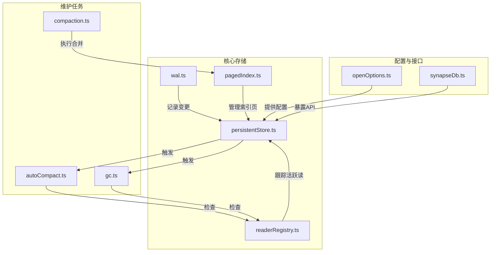
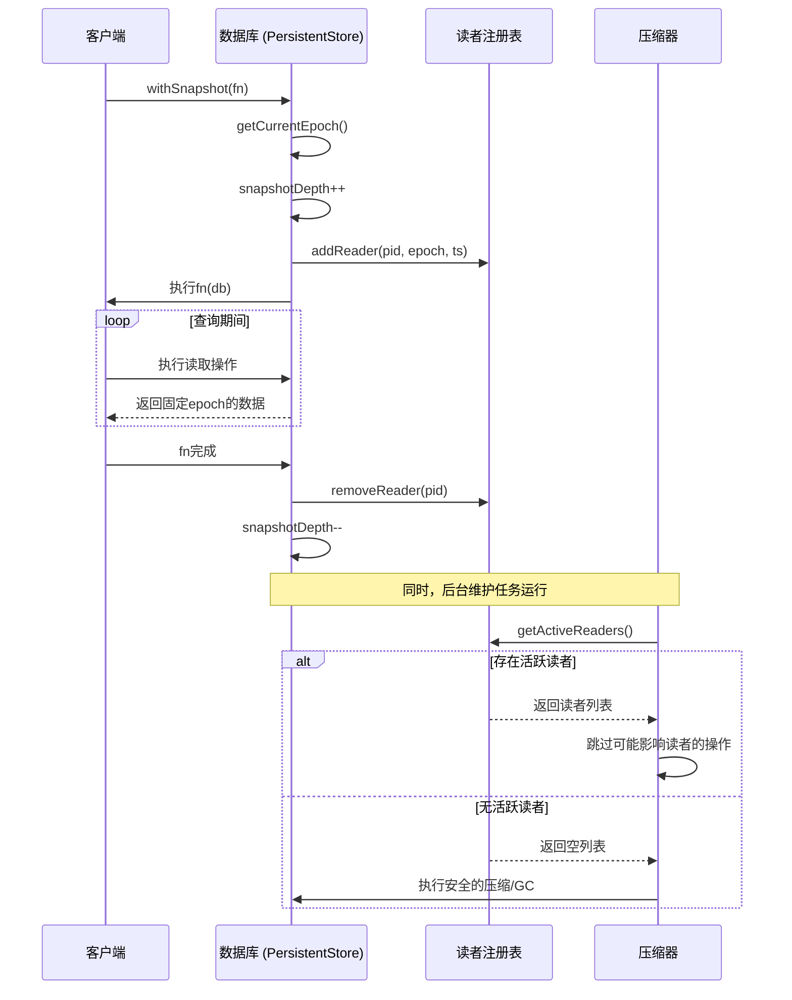
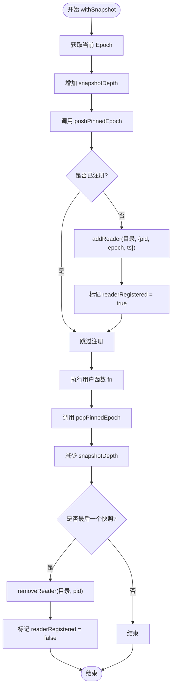

# 事务日志与隔离控制

<cite>
**本文档引用的文件**
- [readerRegistry.ts](file://src/storage/readerRegistry.ts)
- [openOptions.ts](file://src/types/openOptions.ts)
- [wal.ts](file://src/storage/wal.ts)
- [persistentStore.ts](file://src/storage/persistentStore.ts)
- [query_snapshot_isolation.test.ts](file://tests/system/query_snapshot_isolation.test.ts)
- [autoCompact.ts](file://src/maintenance/autoCompact.ts)
- [gc.ts](file://src/maintenance/gc.ts)
- [compaction.ts](file://src/maintenance/compaction.ts)
- [pagedIndex.ts](file://src/storage/pagedIndex.ts)
- [hotness.ts](file://src/storage/hotness.ts)
</cite>

## 目录
1. [简介](#简介)
2. [项目结构](#项目结构)
3. [核心组件](#核心组件)
4. [架构概述](#架构概述)
5. [详细组件分析](#详细组件分析)
6. [依赖分析](#依赖分析)
7. [性能考量](#性能考量)
8. [故障排除指南](#故障排除指南)
9. [结论](#结论)

## 简介
本文档深入阐述SynapseDB中基于WAL（Write-Ahead Log）和读者注册表（readerRegistry）实现的快照隔离（Snapshot Isolation）机制。重点解析`withSnapshot` API如何冻结事务视图以防止陈旧写入干扰，以及`readerRegistry`如何跟踪活跃读事务以安全地判定可清理的WAL段或暂存数据。文档结合`openOptions.ts`中的配置项（如`snapshotInterval`）探讨了隔离级别与资源消耗之间的权衡，并通过系统测试用例展示了多版本并发控制（MVCC）在长时间查询与高频写入共存场景下的行为。最后，提供了针对“长时间读导致无法compact”等常见问题的诊断与规避方案。

## 项目结构
SynapseDB的代码库遵循清晰的模块化设计，主要功能分散在`src`目录下的多个子目录中。与事务隔离机制直接相关的代码位于`src/storage`、`src/maintenance`和`src/types`目录。`src/storage`包含核心存储引擎、WAL和读者注册表的实现；`src/maintenance`负责压缩（compaction）和垃圾回收（GC）等后台维护任务；`src/types`定义了数据库的配置选项。系统级测试用例位于`tests/system`目录，用于验证高并发场景下隔离机制的正确性。



**Diagram sources**
- [wal.ts](file://src/storage/wal.ts)
- [readerRegistry.ts](file://src/storage/readerRegistry.ts)
- [persistentStore.ts](file://src/storage/persistentStore.ts)
- [pagedIndex.ts](file://src/storage/pagedIndex.ts)
- [autoCompact.ts](file://src/maintenance/autoCompact.ts)
- [gc.ts](file://src/maintenance/gc.ts)
- [compaction.ts](file://src/maintenance/compaction.ts)
- [openOptions.ts](file://src/types/openOptions.ts)

**Section sources**
- [src/storage](file://src/storage)
- [src/maintenance](file://src/maintenance)
- [src/types](file://src/types)
- [tests/system](file://tests/system)

## 核心组件
本节分析实现快照隔离的核心组件：WAL、读者注册表和`withSnapshot`机制。这些组件协同工作，确保读取操作的原子性和一致性，同时允许后台维护任务在不干扰现有查询的前提下进行数据优化。

**Section sources**
- [wal.ts](file://src/storage/wal.ts)
- [readerRegistry.ts](file://src/storage/readerRegistry.ts)
- [synapseDb.ts](file://src/synapseDb.ts#L477-L491)
- [persistentStore.ts](file://src/storage/persistentStore.ts)

## 架构概述
SynapseDB采用多版本并发控制（MVCC）来实现快照隔离。其核心思想是为每个写入操作分配一个唯一的`epoch`（时代），而读取操作则在一个固定的`epoch`上运行。当客户端调用`withSnapshot`时，系统会获取当前的`epoch`并将其“钉住”（pin），从而创建一个一致的数据视图。所有后续的读取操作都将基于这个固定的`epoch`，不受在此之后发生的任何写入影响。

为了确保数据完整性，后台的压缩和垃圾回收任务必须尊重活跃的读取操作。这是通过`readerRegistry`实现的。当一个快照被创建时，该进程的相关信息（包括PID、`epoch`和时间戳）会被写入一个独立的文件。维护任务在执行前会扫描`readers`目录，如果发现有与待清理数据相关联的活跃读者，则会跳过该操作，直到所有相关读者完成。



**Diagram sources**
- [synapseDb.ts](file://src/synapseDb.ts#L477-L491)
- [persistentStore.ts](file://src/storage/persistentStore.ts)
- [readerRegistry.ts](file://src/storage/readerRegistry.ts)
- [autoCompact.ts](file://src/maintenance/autoCompact.ts)
- [gc.ts](file://src/maintenance/gc.ts)

## 详细组件分析
本节将对关键组件进行深入分析，揭示其内部工作机制。

### 快照隔离机制 (withSnapshot) 分析
`withSnapshot`方法是用户访问快照隔离的主要入口。它通过与`PersistentStore`交互来实现视图的冻结。

#### 实现流程:
1.  **获取当前Epoch**: 首先调用`getCurrentEpoch()`获取数据库当前的逻辑时间点。
2.  **增加快照深度**: `snapshotDepth`计数器递增，用于管理嵌套快照。
3.  **注册读者**: 调用`pushPinnedEpoch(epoch)`，这会触发向`readerRegistry`添加一条记录，将当前进程和`epoch`关联起来。
4.  **执行用户函数**: 在此期间，所有读取操作都基于固定的`epoch`。
5.  **清理**: 在`finally`块中，调用`popPinnedEpoch()`从注册表中移除读者记录，并减少`snapshotDepth`。

此机制确保了即使在`fn`执行期间发生了新的写入，这些写入也不会反映在查询结果中，从而实现了快照的一致性。



**Diagram sources**
- [synapseDb.ts](file://src/synapseDb.ts#L477-L491)
- [persistentStore.ts](file://src/storage/persistentStore.ts#L1355-L1378)
- [readerRegistry.ts](file://src/storage/readerRegistry.ts)

**Section sources**
- [synapseDb.ts](file://src/synapseDb.ts#L477-L491)
- [persistentStore.ts](file://src/storage/persistentStore.ts)

### 读者注册表 (readerRegistry) 分析
`readerRegistry`是一个基于文件系统的轻量级注册中心，用于跨进程协调读取操作。

#### 关键特性:
*   **进程隔离**: 每个进程使用`{pid}-{timestamp}.reader`命名的独立文件，避免了多进程竞争同一文件的锁问题。
*   **自动过期**: 文件带有时间戳，`getActiveReaders`在读取时会检查文件年龄（默认30秒），自动清理过期文件，防止僵尸进程占用资源。
*   **原子写入**: 使用临时文件+重命名的方式保证写入的原子性，防止读取到半写状态的文件。
*   **核心接口**:
    *   `addReader`: 为当前进程创建`.reader`文件。
    *   `removeReader`: 删除属于指定PID的所有`.reader`文件。
    *   `getActiveReaders`: 扫描目录，读取所有有效且未过期的`.reader`文件。
    *   `isEpochInUse`: 检查是否有活跃读者正在使用某个特定的`epoch`。

该设计借鉴了LSM-Tree的分层思想，简单而高效，非常适合于需要高并发和可靠性的场景。

```mermaid
classDiagram
    class ReaderInfo {
        +pid: number
        +epoch: number
        +ts: number
    }
    
    class ReaderRegistry {
        +version: number
        +readers: ReaderInfo[]
    }
    
    class ReaderRegistryFunctions {
        +ensureReadersDir(directory): Promise~string~
        +getReader