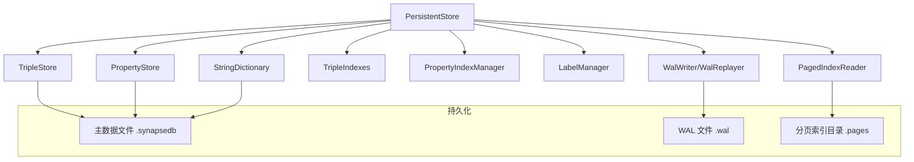
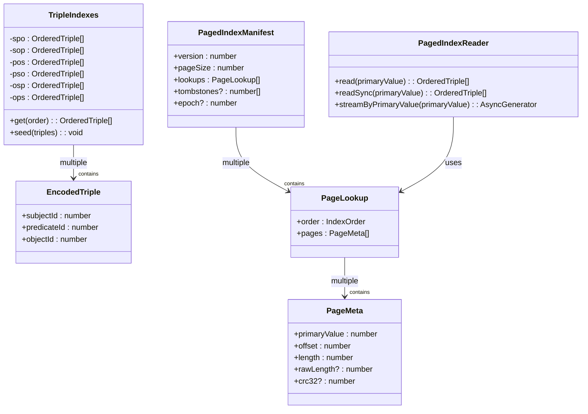

# 存储引擎

<cite>
**本文档引用文件**
- [persistentStore.ts](file://src/storage/persistentStore.ts)
- [tripleStore.ts](file://src/storage/tripleStore.ts)
- [propertyStore.ts](file://src/storage/propertyStore.ts)
- [pagedIndex.ts](file://src/storage/pagedIndex.ts)
- [wal.ts](file://src/storage/wal.ts)
- [staging.ts](file://src/storage/staging.ts)
- [propertyIndex.ts](file://src/storage/propertyIndex.ts)
- [fileHeader.ts](file://src/storage/fileHeader.ts)
- [layout.ts](file://src/storage/layout.ts)
</cite>

## 目录
1. [引言](#引言)
2. [核心组件与协作关系](#核心组件与协作关系)
3. [三元组主键编码与索引组织](#三元组主键编码与索引组织)
4. [WAL v2 日志机制](#wal-v2-日志机制)
5. [LSM-Lite staging 机制](#lsm-lite-staging-机制)
6. [属性索引构建与查询下推](#属性索引构建与查询下推)
7. [分页索引空间分配与缓存](#分页索引空间分配与缓存)
8. [文件头结构与元数据管理](#文件头结构与元数据管理)
9. [性能调优建议](#性能调优建议)

## 引言

SynapseDB 的存储引擎是其高性能图数据库能力的核心，负责数据的持久化、事务处理和高效查询。该引擎采用多组件协同设计，以 `PersistentStore` 作为核心协调者，统一管理 `TripleStore`（三元组存储）、`PropertyStore`（属性存储）、`PagedIndex`（分页索引）等关键模块。通过 WAL v2（预写式日志）保证原子性和持久性，利用 LSM-Lite staging 机制实现高效的增量写入与段合并，并通过属性索引和分页索引优化复杂查询性能。本权威文档将深入剖析其内部机制。

**本文档引用文件**
- [persistentStore.ts](file://src/storage/persistentStore.ts)

## 核心组件与协作关系

`PersistentStore` 是整个存储系统的中枢，它在初始化时创建并协调所有底层组件。当数据库打开时，`PersistentStore` 负责从磁盘加载或重建各个组件的状态，并确保它们之间的数据一致性。

### 组件初始化流程

1.  **基础组件创建**：`PersistentStore` 构造函数接收路径和选项后，会创建 `StringDictionary`（字符串字典）、空的 `TripleStore`（用于存放 WAL 重放后的增量数据）、反序列化的 `PropertyStore` 和 `TripleIndexes`。
2.  **索引系统初始化**：`PersistentStore` 创建 `PropertyIndexManager` 来管理内存中的属性倒排索引，并创建 `LabelManager` 管理标签索引。
3.  **WAL 重放**：`PersistentStore` 打开 `WalWriter` 并启动 `WalReplayer`。重放器会读取未落盘的日志，将新增的三元组、删除标记、节点和边属性变更应用到 `TripleStore`、`tombstones` 集合和 `PropertyStore` 中，从而恢复数据库到最新状态。
4.  **分页索引构建**：根据配置和是否存在清单（manifest），`PersistentStore` 决定是全量重建还是复用现有的分页索引。它通过 `buildPagedIndexes` 或 `hydratePagedReaders` 方法，为六种排序顺序（SPO, SOP, POS, PSO, OSP, OPS）创建对应的 `PagedIndexReader` 实例。
5.  **属性索引重建**：最后，`PersistentStore` 调用 `rebuildPropertyIndex`，利用 `PropertyStore` 提供的所有属性数据，在 `PropertyIndexManager` 的内存索引中重建完整的倒排索引。

在整个生命周期中，`PersistentStore` 拦截所有外部读写请求，并将其路由到正确的组件进行处理。例如，一个 `addFact` 请求会被记录到 WAL，然后由 `PersistentStore` 决定是否直接添加到 `TripleStore` 或暂存于事务栈中。

**Diagram sources**
- [persistentStore.ts](file://src/storage/persistentStore.ts#L138-L250)

**本文档引用文件**
- [persistentStore.ts](file://src/storage/persistentStore.ts)
- [tripleStore.ts](file://src/storage/tripleStore.ts)
- [propertyStore.ts](file://src/storage/propertyStore.ts)
- [propertyIndex.ts](file://src/storage/propertyIndex.ts)
- [pagedIndex.ts](file://src/storage/pagedIndex.ts)
- [wal.ts](file://src/storage/wal.ts)

## 三元组主键编码与索引组织

为了高效地存储和检索三元组，系统采用了特定的编码和索引策略。

### 三元组主键 (TripleKey) 编码

三元组主键并非直接使用原始字符串，而是经过了双重转换：
1.  **字符串 -> ID 映射**：`StringDictionary` 将每个唯一的字符串（主体、谓词、客体）映射为一个递增的整数 ID。这极大地减少了存储空间和比较开销。
2.  **ID 元组 -> 字符串键**：对于一个已编码的三元组 `{subjectId, predicateId, objectId}`，系统通过 `encodeTripleKey` 函数将其转换为一个形如 `"sId:pId:oId"` 的字符串。这个字符串键被用作多个场景下的唯一标识：
    *   在 `TripleStore` 的 `keys` 集合中，用于快速判断三元组是否存在。
    *   在 `PersistentStore` 的 `tombstones` 集合中，用于标记已被逻辑删除的三元组。
    *   在 `PropertyStore` 的 `edgeProperties` 映射中，作为边属性的键。

这种编码方式平衡了可读性、去重效率和跨组件通信的便利性。

### 索引组织结构

系统维护了两种主要的索引结构来加速查询：

1.  **内存暂存索引 (`TripleIndexes`)**：
    *   这是一个基于内存的、临时的索引，用于存放尚未合并到分页索引中的增量写入。
    *   它为六种可能的排序顺序（SPO, SOP, POS, PSO, OSP, OPS）分别维护一个有序的三元组列表。
    *   当执行 `addFact` 或 `deleteFact` 时，新数据首先被追加到 `TripleIndexes` 对应的列表中，同时 `tombstones` 集合也会被更新。
    *   这个索引的存在使得增量数据可以立即被查询到。

2.  **分页索引 (`PagedIndex`)**：
    *   这是持久化的主要索引形式，存储在 `.pages` 目录下。
    *   数据按主键（Primary Key）分页存储。例如，在 SPO 顺序下，主键是 `subjectId`；在 POS 顺序下，主键是 `predicateId`。
    *   每个主键值对应一个或多个“页面”（page），页面内存储着所有具有该主键值的三元组。
    *   页面的物理位置和大小信息记录在 `index-manifest.json` 清单文件中，`PagedIndexReader` 利用此清单进行随机访问。
    *   查询时，系统会根据查询条件选择最优的索引顺序（通过 `getBestIndexKey` 函数），然后使用 `PagedIndexReader` 快速定位到相关页面进行读取。

最终的查询结果是分页索引中的历史数据与内存暂存索引中的增量数据的合并。

**Diagram sources**
- [tripleStore.ts](file://src/storage/tripleStore.ts#L6-L66)
- [pagedIndex.ts](file://src/storage/pagedIndex.ts#L28-L129)
- [persistentStore.ts](file://src/storage/persistentStore.ts#L138-L1633)

**本文档引用文件**
- [tripleStore.ts](file://src/storage/tripleStore