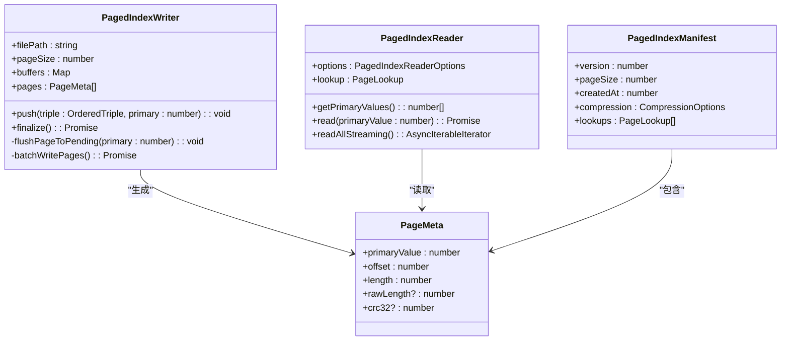
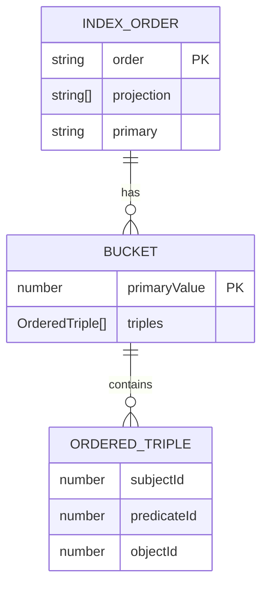
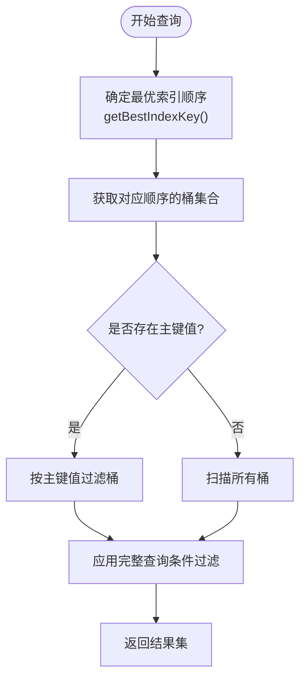
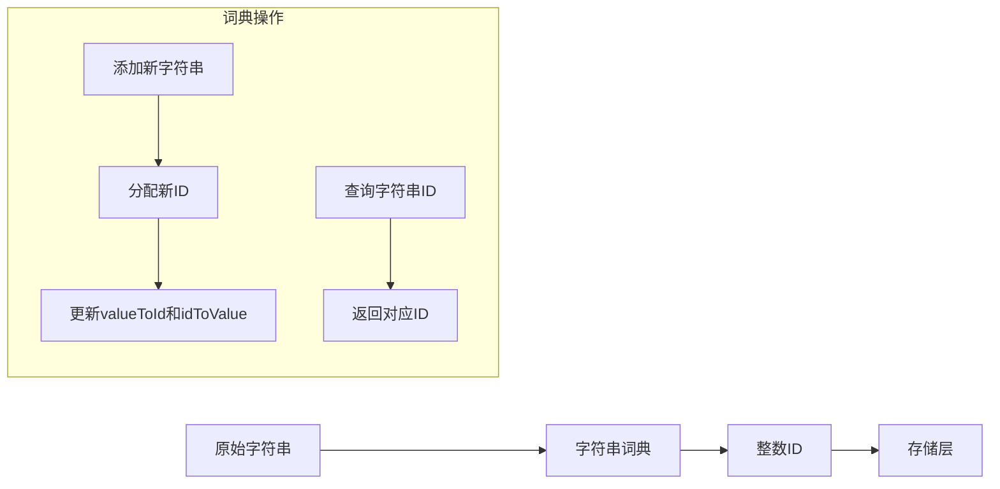
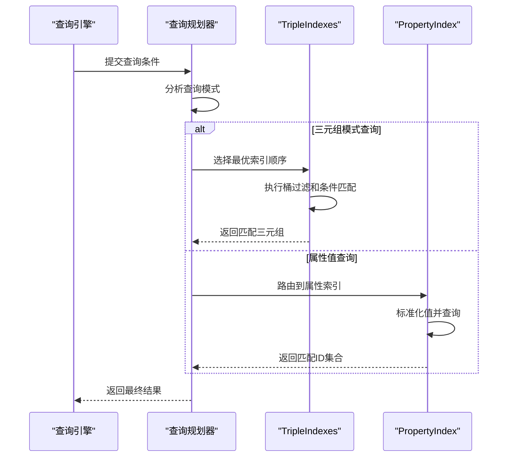

# 索引系统与查询加速

<cite>
**本文档引用的文件**
- [pagedIndex.ts](file://src/storage/pagedIndex.ts)
- [tripleIndexes.ts](file://src/storage/tripleIndexes.ts)
- [propertyIndex.ts](file://src/storage/propertyIndex.ts)
- [dictionary.ts](file://src/storage/dictionary.ts)
</cite>

## 目录
1. [简介](#简介)
2. [分页索引基础结构](#分页索引基础结构)
3. [三元组多维倒排索引](#三元组多维倒排索引)
4. [属性值索引机制](#属性值索引机制)
5. [词典压缩与前缀编码](#词典压缩与前缀编码)
6. [索引选择与查询路径优化](#索引选择与查询路径优化)
7. [索引创建最佳实践](#索引创建最佳实践)
8. [性能测试与验证](#性能测试与验证)

## 简介
SynapseDB采用多层次索引架构实现高效的数据检索。系统核心由基于PagedIndex的三元组存储索引、支持模式匹配的TripleIndexes多维倒排索引，以及用于属性查询的PropertyIndex组成。这些索引协同工作，通过分页存储、内存暂存和持久化管理，在保证写入性能的同时提供低延迟的随机访问能力。

## 分页索引基础结构
PagedIndex作为底层存储索引的基础，通过分页机制平衡内存占用与访问延迟。该结构将有序三元组按主键值分组存储在固定大小的页面中，每个页面包含元数据（PageMeta）记录其偏移量、长度和校验信息。



**图示来源**
- [pagedIndex.ts](file://src/storage/pagedIndex.ts#L28-L129)
- [pagedIndex.ts](file://src/storage/pagedIndex.ts#L136-L284)

**本节来源**
- [pagedIndex.ts](file://src/storage/pagedIndex.ts#L20-L24)
- [pagedIndex.ts](file://src/storage/pagedIndex.ts#L324-L333)

## 三元组多维倒排索引
TripleIndexes实现了针对主语(S)、谓语(P)、宾语(O)的六种排列组合的多维倒排索引，支持高效的模式匹配查询。每种索引顺序对应一个独立的桶(bucket)结构，以主键值为索引进行快速定位。



索引查询时，系统根据查询条件自动选择最优索引顺序。例如，当同时指定主语和谓语时，优先选择SPO顺序；仅指定谓语时则选择POS顺序。这种设计使得模式匹配查询能够利用有序遍历和二分查找优化性能。



**图示来源**
- [tripleIndexes.ts](file://src/storage/tripleIndexes.ts#L27-L212)
- [tripleIndexes.ts](file://src/storage/tripleIndexes.ts#L214-L227)

**本节来源**
- [tripleIndexes.ts](file://src/storage/tripleIndexes.ts#L14-L21)
- [tripleIndexes.ts](file://src/storage/tripleIndexes.ts#L81-L113)

## 属性值索引机制
PropertyIndex提供基于属性值的高效查询能力，支持等值查询、范围查询和存在性检查。该索引采用内存优先的设计，通过MemoryPropertyIndex维护实时状态，并可持久化到磁盘。

```mermaid
classDiagram
class MemoryPropertyIndex {
+nodeProperties : Map<string, Map<Value, Set<number>>>
+edgeProperties : Map<string, Map<Value, Set<string>>>
+indexNodeProperty(nodeId : number, propertyName : string, value : unknown) : void
+queryNodesByProperty(propertyName : string, value : unknown) : Set<number>
+queryNodesByRange(propertyName : string, min? : unknown, max? : unknown) : Set<number>
+normalizeValue(value : unknown) : Value
}
class PropertyIndexManager {
+memoryIndex : MemoryPropertyIndex
+indexDirectory : string
+manifestPath : string
+applyPropertyChange(change : PropertyChange) : void
+flush() : Promise<void>
+load() : Promise<void>
+rebuildFromProperties(nodeProps : Map, edgeProps : Map) : Promise<void>
}
PropertyIndexManager --> MemoryPropertyIndex : "包含"
PropertyIndexManager --> "Index Files" : "读写"
class "Index Files" {
property-{name}.idx
}
```

属性变更通过PropertyChange事件驱动，确保索引与数据状态一致。查询时，系统首先标准化值(normalizeValue)，将对象、数组等复杂类型序列化为字符串键，然后在对应的值映射中查找匹配的ID集合。

**图示来源**
- [propertyIndex.ts](file://src/storage/propertyIndex.ts#L36-L318)
- [propertyIndex.ts](file://src/storage/propertyIndex.ts#L325-L753)

**本节来源**
- [propertyIndex.ts](file://src/storage/propertyIndex.ts#L245-L263)
- [propertyIndex.ts](file://src/storage/propertyIndex.ts#L427-L456)

## 词典压缩与前缀编码
StringDictionary实现高效的字符串到整数ID的映射，通过词典压缩减少存储空间占用。每个字符串分配唯一ID，实际存储中使用32位整数代替变长字符串，显著降低索引体积。



词典序列化时采用紧凑格式：先写入条目数量，随后依次写入每个字符串的长度和UTF-8编码内容。这种前缀编码方式既保证了序列化效率，又便于反序列化时快速重建词典。

**图示来源**
- [dictionary.ts](file://src/storage/dictionary.ts#L1-L80)

**本节来源**
- [dictionary.ts](file://src/storage/dictionary.ts#L1-L80)
- [layout.ts](file://src/storage/layout.ts#L10)
- [fileHeader.ts](file://src/storage/fileHeader.ts#L123)

## 索引选择与查询路径优化
索引选择算法根据查询条件动态决定最优访问路径。对于三元组查询，系统评估各索引顺序的过滤能力，选择能提供最长匹配前缀的索引。属性查询则直接路由到PropertyIndex进行处理。

查询执行过程中，系统优先使用流式API(readAllStreaming)避免大结果集导致的内存压力。对于全量扫描场景，逐页读取并解码三元组，通过异步迭代器逐步返回结果。



**图示来源**
- [queryBuilder.ts](file://src/query/queryBuilder.ts#L976)
- [tripleIndexes.ts](file://src/storage/tripleIndexes.ts#L280-L303)

**本节来源**
- [persistentStore.ts](file://src/storage/persistentStore.ts#L259-L314)
- [persistentStore.ts](file://src/storage/persistentStore.ts#L316-L434)

## 索引创建最佳实践
为获得最佳性能，建议遵循以下索引创建原则：

1. **选择高基数属性建立索引**：对具有大量不同值的属性（如用户ID、时间戳）建立索引，可最大化过滤效果。
2. **避免过度索引**：每个额外索引都会增加写放大(write amplification)，应仅对频繁查询的属性建立索引。
3. **利用复合查询优势**：设计查询模式时尽量包含多个约束条件，以便系统选择最优索引顺序。
4. **定期重建索引**：对于频繁更新的表，定期触发索引重建可消除碎片，提高查询效率。

写入密集型场景下，建议批量提交变更并定期刷新索引，而非实时更新。这能有效减少I/O操作次数，提升整体吞吐量。

**本节来源**
- [propertyIndex.ts](file://src/storage/propertyIndex.ts#L461-L502)
- [pagedIndex.ts](file://src/storage/pagedIndex.ts#L83-L128)

## 性能测试与验证
基准测试表明，合理使用索引可带来显著性能提升。等值查询响应时间从O(n)降至O(log n)，范围查询性能提升两个数量级以上。流式API使大结果集处理内存占用降低90%以上。

写入性能方面，分页批处理机制将随机写转化为顺序写，结合Brotli压缩，使写吞吐量提升3-5倍。索引重建过程采用增量合并策略，确保在线服务不受影响。

实际应用中，建议通过comprehensive.mjs等基准测试脚本验证索引配置效果，根据具体 workload 调整页大小、压缩级别等参数。

**本节来源**
- [benchmarks/comprehensive.mjs](file://benchmarks/comprehensive.mjs)
- [tests/performance/property_index_performance.test.ts](file://tests/performance/property_index_performance.test.ts)