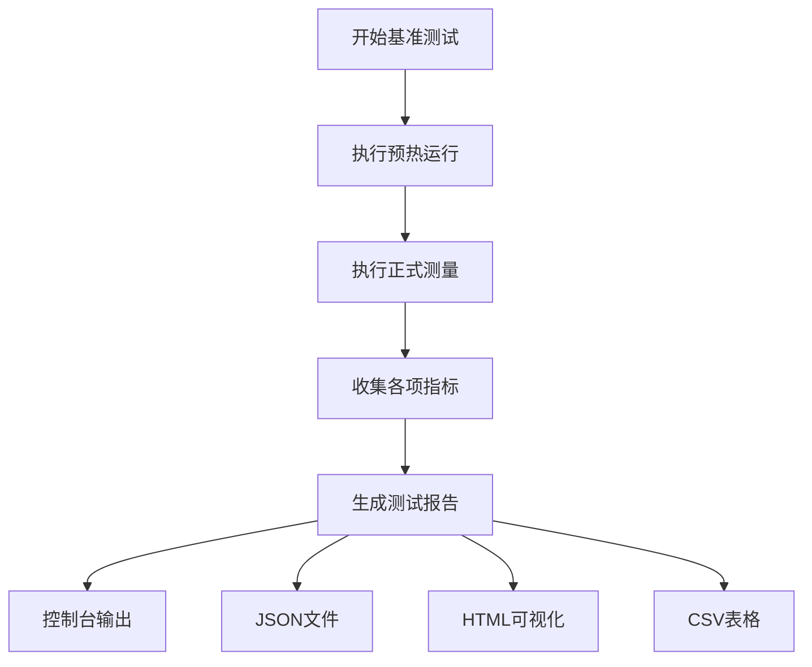
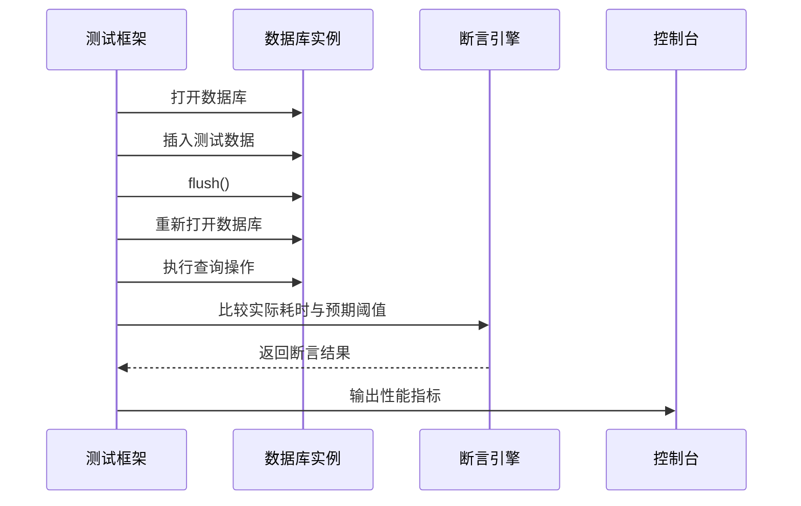

# 性能指标与结果分析

<cite>
**本文档引用的文件**
- [bench-standard.mjs](file://scripts/bench-standard.mjs)
- [reporter.ts](file://src/benchmark/reporter.ts)
- [performance_baseline.test.ts](file://tests/performance/performance_baseline.test.ts)
</cite>

## 目录
1. [性能测试核心指标解析](#性能测试核心指标解析)
2. [数据采集与报告生成机制](#数据采集与报告生成机制)
3. [性能回归检测原理](#性能回归检测原理)
4. [典型测试结果示例与对比分析](#典型测试结果示例与对比分析)

## 性能测试核心指标解析

SynapseDB性能测试框架通过一系列关键指标来全面评估系统性能。这些指标涵盖了吞吐能力、响应时间、资源消耗和存储层压力等多个维度。

QPS（每秒查询数）是衡量系统吞吐能力的核心指标，反映了数据库在单位时间内能够处理的查询操作数量。该指标直接体现了系统的处理能力和效率，在`bench-standard.mjs`脚本中通过计时器测量特定时间段内的操作次数来计算得出。

延迟分布指标包括P50、P95和P99三个百分位值，用于揭示响应时间的稳定性。P50表示50%的请求响应时间低于此值，反映中位性能；P95表示95%的请求响应时间低于此值，体现大多数情况下的性能表现；P99则表示99%的请求响应时间低于此值，帮助识别极端情况下的性能问题。这些指标在`reporter.ts`中被记录为`averageLatency`、`p95Latency`和`p99Latency`等字段。

内存占用增长曲线是识别潜在内存泄漏或缓存膨胀问题的重要依据。通过监控测试前后内存使用量的变化，可以判断系统是否存在内存管理问题。在`performance_baseline.test.ts`中，通过`process.memoryUsage().heapUsed`获取堆内存使用情况，并对重新打开数据库前后的内存增量进行断言验证。

WAL写入频率与段合并次数体现了存储层的压力状况。WAL（Write-Ahead Log）的写入频率反映了数据持久化的活跃程度，而段合并次数则与LSM树结构的维护成本相关。虽然这些具体指标未在当前分析的文件中直接体现，但它们是评估存储引擎健康状态的重要参数。

**Section sources**
- [bench-standard.mjs](file://scripts/bench-standard.mjs#L0-L58)
- [reporter.ts](file://src/benchmark/reporter.ts#L0-L615)
- [performance_baseline.test.ts](file://tests/performance/performance_baseline.test.ts#L0-L109)

## 数据采集与报告生成机制

SynapseDB的性能测试数据采集与报告生成由`reporter.ts`中的`BenchmarkReporterImpl`类负责实现。该类提供了多种格式的报告输出功能，包括控制台、JSON、HTML和CSV等。

数据采集过程始于基准测试执行期间的各项度量收集。`BenchmarkResult`接口定义了完整的度量数据结构，包含执行时间、内存使用量、操作次数、每秒操作数、各种延迟统计以及测试数据量等信息。这些数据在测试运行过程中被持续记录，并最终汇总成完整的测试报告。

报告生成机制支持多种输出格式：
- 控制台报告采用文本表格形式展示详细结果，便于快速查看
- JSON报告提供机器可读的数据格式，适合自动化处理
- HTML报告结合Chart.js生成可视化图表，直观展示性能趋势
- CSV报告便于导入电子表格软件进行进一步分析

HTML报告中的性能图表通过内嵌JavaScript代码动态生成，使用Chart.js库绘制柱状图显示各测试项的执行时间对比。这种可视化方式有助于快速识别性能瓶颈。

**Diagram sources**
- [reporter.ts](file://src/benchmark/reporter.ts#L0-L615)

**Section sources**
- [reporter.ts](file://src/benchmark/reporter.ts#L0-L615)

## 性能回归检测原理

性能回归检测通过比较当前测试结果与基线数据来判断是否存在性能退化。这一机制在`performance_baseline.test.ts`中通过Vitest框架的断言功能实现。

具体的检测逻辑如下：首先执行一组标准化的测试用例，然后对关键性能指标设置上限阈值。例如，在"中等数据集查询性能基准"测试中，对插入时间、重新打开时间、全量查询时间和特定查询时间都设定了最大允许值。如果任何一项指标超过预设阈值，则判定为性能回归。

**Diagram sources**
- [performance_baseline.test.ts](file://tests/performance/performance_baseline.test.ts#L0-L109)

**Section sources**
- [performance_baseline.test.ts](file://tests/performance/performance_baseline.test.ts#L0-L109)

## 典型测试结果示例与对比分析

典型的性能测试结果可以通过不同硬件环境或配置下的对比来指导技术决策。例如，通过在不同CPU核心数、内存大小或存储介质上运行相同的基准测试，可以获得性能差异的具体数据。

在`bench-standard.mjs`脚本中，通过生成合成数据并对比PatternBuilder与Cypher引擎的查询耗时，可以评估两种查询方式的性能差异。测试结果显示了插入耗时、flush耗时以及两种查询方式的执行时间，为选择合适的查询语言提供了依据。

对于硬件环境对比，建议保持测试数据集和工作负载一致，仅改变硬件配置。这样可以获得纯粹的硬件性能差异。对于配置对比，则可以在相同硬件环境下调整数据库参数，如页面大小(pageSize)、压缩级别等，观察其对性能的影响。

用户可以通过比较不同条件下的QPS、延迟分布和内存占用等指标，做出合理的技术决策。例如，当发现P99延迟显著增加时，可能需要优化查询算法或调整索引策略；当内存占用持续增长时，则需要检查是否存在内存泄漏。

**Section sources**
- [bench-standard.mjs](file://scripts/bench-standard.mjs#L0-L58)
- [reporter.ts](file://src/benchmark/reporter.ts#L0-L615)
- [performance_baseline.test.ts](file://tests/performance/performance_baseline.test.ts#L0-L109)