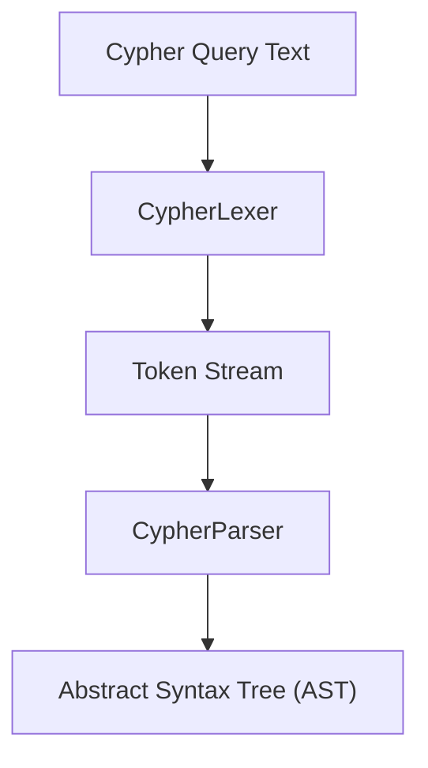
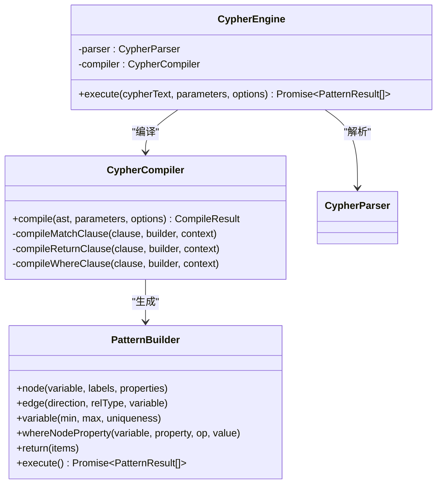
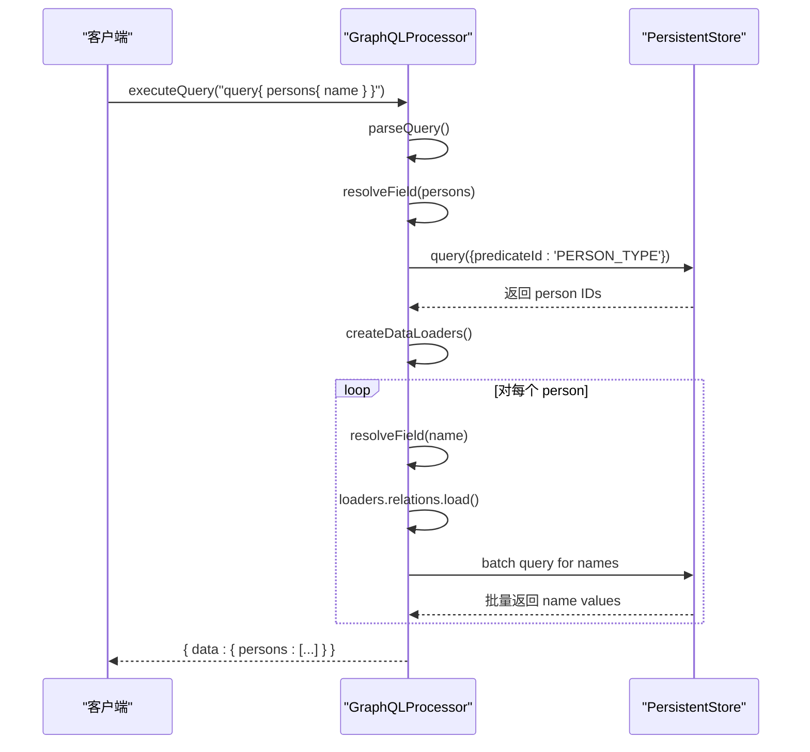

# 多语言查询接口

<cite>
**本文档引用的文件**   
- [Cypher语法参考.md](file://docs/使用示例/Cypher语法参考.md)
- [graphql_usage.md](file://docs/使用示例/graphql_usage.md)
- [gremlin_usage.md](file://docs/使用示例/gremlin_usage.md)
- [迁移指南-从Neo4j与TinkerGraph.md](file://docs/使用示例/迁移指南-从Neo4j与TinkerGraph.md)
- [cypher.ts](file://src/query/cypher.ts)
- [index.ts](file://src/query/pattern/index.ts)
- [compiler.ts](file://src/query/pattern/compiler.ts)
- [parser.ts](file://src/query/pattern/parser.ts)
- [processor.ts](file://src/query/graphql/processor.ts)
- [executor.ts](file://src/query/gremlin/executor.ts)
- [traversal.ts](file://src/query/gremlin/traversal.ts)
- [step.ts](file://src/query/gremlin/step.ts)
</cite>

## 目录
1. [Cypher 支持机制](#cypher-支持机制)
2. [GraphQL 支持机制](#graphql-支持机制)
3. [Gremlin 支持机制](#gremlin-支持机制)
4. [性能比较与测试用例](#性能比较与测试用例)
5. [跨语言迁移指南](#跨语言迁移指南)
6. [最佳实践建议](#最佳实践建议)

## Cypher 支持机制

SynapseDB 提供了对 Cypher 查询语言的子集支持，其核心是将 Cypher 文本查询转换为内部的模式匹配（Pattern Matching）执行引擎。该机制通过解析、编译和执行三个阶段完成。

### 语法兼容性级别

SynapseDB 当前支持的 Cypher 语法是一个有限的子集，主要聚焦于读取操作。其支持范围如下：

- **核心子句**：`MATCH`, `WHERE`, `RETURN`, `WITH`。
- **模式定义**：支持节点 `(n:Label {k:v})` 和关系 `[r:TYPE]` 的模式，包括方向 `->`, `<-`, `-`。
- **变长路径**：支持 `*min..max` 语法，例如 `*1..3`。
- **过滤条件**：在 `WHERE` 子句中支持基本的属性比较（如 `a.age > 25`）以及 `IN` / `NOT IN` 操作符。
- **投影与别名**：`RETURN a, b.name AS name`。
- **分页与排序**：支持 `LIMIT`, `ORDER BY`, `SKIP`。
- **参数化查询**：支持 `$param` 形式的参数绑定。

不支持或计划中的功能包括写入操作（`CREATE`, `SET`, `DELETE`, `MERGE`）和更复杂的子句（如 `OPTIONAL MATCH`）。

**Section sources**
- [Cypher语法参考.md](file://docs/使用示例/Cypher语法参考.md#L0-L57)
- [cypher.ts](file://src/query/cypher.ts#L35-L42)

### CYPHER AST 解析流程

Cypher 查询的执行始于一个完整的解析过程，该过程将文本字符串转换为抽象语法树（AST），以便后续处理。

1.  **词法分析 (Lexing)**：首先，`CypherLexer` 将输入的 Cypher 字符串分解成一系列标记（Token），如关键字（`MATCH`, `WHERE`）、运算符（`->`, `=`）、标识符和字面量。
2.  **语法分析 (Parsing)**：接着，`CypherParser` 使用递归下降算法，根据预定义的语法规则，将这些 Token 流构建成一棵结构化的 AST。这棵 AST 精确地表示了查询的逻辑结构，例如，一个 `MATCH` 子句会被解析为一个包含节点和关系元素的 `Pattern` 对象。
3.  **AST 输出**：`CypherEngine` 类提供了 `parseAST()` 方法，允许开发者直接获取解析后的 AST，这对于调试和理解查询非常有用。

此解析流程确保了查询的语法正确性，并为后续的编译阶段提供了坚实的基础。



**Diagram sources **
- [parser.ts](file://src/query/pattern/parser.ts#L64-L382)
- [index.ts](file://src/query/pattern/index.ts#L73-L165)

### 与本地 DSL 的映射关系

解析得到的 AST 并非直接执行，而是需要被“编译”成 SynapseDB 内部的可执行指令。这个过程的核心是将其映射到名为 `PatternBuilder` 的本地领域特定语言（DSL）上。

-   **编译器 (`CypherCompiler`)**：`CypherCompiler` 负责遍历 AST 并调用 `PatternBuilder` 的相应方法。
-   **节点映射**：当遇到 `NodePattern` 时，编译器会调用 `builder.node(variable, labels, properties)`。
-   **关系映射**：当遇到 `RelationshipPattern` 时，编译器会调用 `builder.edge(direction, relType, variable)`。对于变长路径，还会调用 `builder.variable(min, max, uniqueness)`。
-   **过滤映射**：`WHERE` 子句中的属性比较会被转换为 `builder.whereNodeProperty(variable, property, op, value)` 调用。
-   **返回映射**：`RETURN` 子句中的变量列表会被传递给 `builder.return(returnItems)`。

这种映射策略实现了“一次编写，多处运行”的目标，使得基于文本的 Cypher 查询能够无缝地利用 SynapseDB 高效的底层查询引擎。



**Diagram sources **
- [compiler.ts](file://src/query/pattern/compiler.ts#L65-L750)
- [index.ts](file://src/query/pattern/index.ts#L73-L165)

## GraphQL 支持机制

SynapseDB 的 GraphQL 支持并非基于静态 Schema，而是一种创新的动态 Schema 生成机制。它能自动分析图数据库中的数据结构，并实时生成对应的 GraphQL API。

### Schema 映射

Schema 的生成是一个自动化发现过程，由 `SchemaDiscovery` 组件驱动。

1.  **实体类型识别**：系统扫描数据库中的三元组事实（facts）。通过识别 `TYPE` 谓词（如 `subject:person:1 TYPE Person`）或具有相似属性模式的节点集合，来推断出实体类型（如 `Person`）。
2.  **属性分析**：对于每个发现的实体类型，系统会采样其实例，分析其所有属性（谓词）的数据类型（字符串、数字等）。
3.  **关系发现**：系统通过分析连接两个实体类型的边（关系）来发现关联。例如，`KNOWS` 关系会建立 `Person` 到 `Person` 的连接。
4.  **反向关系**：如果配置启用，系统会自动生成反向关系字段，例如，`Person` 上的 `friends` 可以对应另一个 `Person` 上的 `knowsMe`。

最终，这些发现的信息被 `SchemaBuilder` 转换为标准的 GraphQL SDL（Schema Definition Language），定义了 `type`, `input`, `enum` 等。

**Section sources**
- [graphql_usage.md](file://docs/使用示例/graphql_usage.md#L0-L545)
- [processor.ts](file://src/query/graphql/processor.ts#L74-L562)

### 字段解析器集成

生成 Schema 后，关键在于如何响应客户端的查询请求。这是由 `GraphQLProcessor` 和其内置的解析器（Resolvers）完成的。

-   **根查询解析器**：对于顶层查询（如 `persons`），解析器会根据传入的参数（如 `filter`, `first`）构建一个 SynapseDB 的查询，从存储层获取符合条件的实体 ID。
-   **对象字段解析器**：对于嵌套字段（如 `person.name`），解析器会接收父对象（包含 ID）和字段名，然后查询该 ID 下对应属性值。
-   **数据加载器 (DataLoader)**：为了优化性能，避免 N+1 查询问题，系统使用了 `DataLoader` 模式。它会将多个针对同一类型的查询（如获取多个 `person` 的 `name`）批量化，一次性从存储层拉取所有数据。

这种集成方式使得 GraphQL 查询能够高效地转化为对底层图存储的精确访问。



**Diagram sources **
- [processor.ts](file://src/query/graphql/processor.ts#L74-L562)

### 嵌套查询的扁平化处理策略

GraphQL 的强大之处在于其深度嵌套的查询能力，但这可能带来性能挑战。SynapseDB 采用了一种“延迟求值”和“批量加载”的扁平化策略来应对。

-   **查询解析**：`GraphQLProcessor` 首先解析整个查询的结构，识别出所有需要的字段和参数。
-   **惰性执行**：它不会立即执行最深层的查询。相反，它会先获取顶层实体（如 `persons`）。
-   **批量聚合**：当需要获取嵌套字段（如 `friends`）时，`DataLoader` 会收集所有待查询的 ID，然后发起一次批量查询，而不是为每个 `person` 发起一次独立的 `friends` 查询。
-   **结果组装**：最后，处理器将批量获取的数据按照原始查询的嵌套结构重新组装并返回。

这种方法有效地将一个潜在的 O(N*M) 复杂度的查询，优化为 O(N + M) 的复杂度，极大地提升了性能。

**Section sources**
- [processor.ts](file://src/query/graphql/processor.ts#L74-L562)

## Gremlin 支持机制

SynapseDB 的 Gremlin 支持旨在提供与 Apache TinkerPop 兼容的图遍历体验，其核心是一个链式 API 和一个强大的执行引擎。

### Traversal API 的设计哲学

Gremlin API 的设计遵循了函数式编程和流式处理的思想。

-   **链式调用 (Fluent Interface)**：API 设计为一系列可以链接的方法调用，如 `g.V().has('name', 'Alice').out('knows')`。每个方法都返回一个新的 `GraphTraversal` 实例，从而形成一条清晰的“遍历路径”。
-   **步骤 (Steps) 作为一等公民**：每一个方法（如 `V`, `has`, `out`）都对应一个具体的 `GremlinStep`。整个遍历过程就是由这些步骤组成的有序列表。
-   **延迟求值 (Lazy Evaluation)**：遍历的构建是即时的，但执行是延迟的。只有当调用终端操作（如 `toList()` 或 `next()`）时，整个步骤链才会被提交给执行引擎进行计算。这允许用户灵活地构建和修改查询，而无需担心过早执行。

这种设计使得 Gremlin 查询既直观又高效。

```mermaid
classDiagram
    class GraphTraversalSource {
        +V(): GraphTraversal
        +E(): GraphTraversal
    }
    
    class GraphTraversal {
        +V(ids): GraphTraversal
        +has(key, value): GraphTraversal
        +out(label): GraphTraversal
        +values(key): GraphTraversal
        +toList(): Promise~Array~
        +next(): Promise~Element~
    }
    
    class GremlinExecutor {
        +execute(steps): Promise~