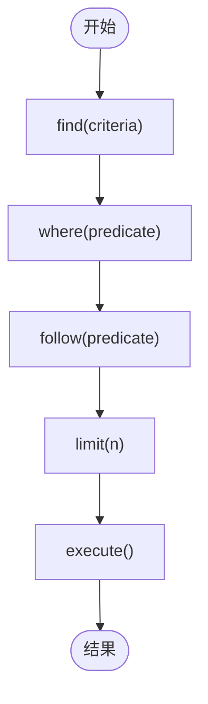
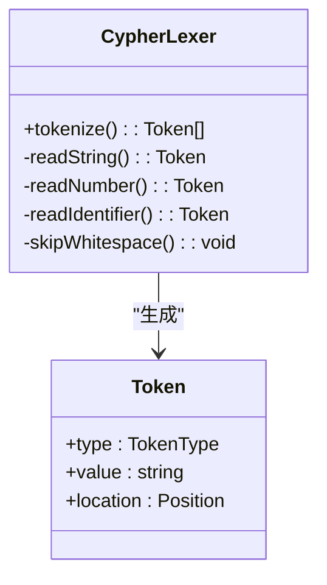
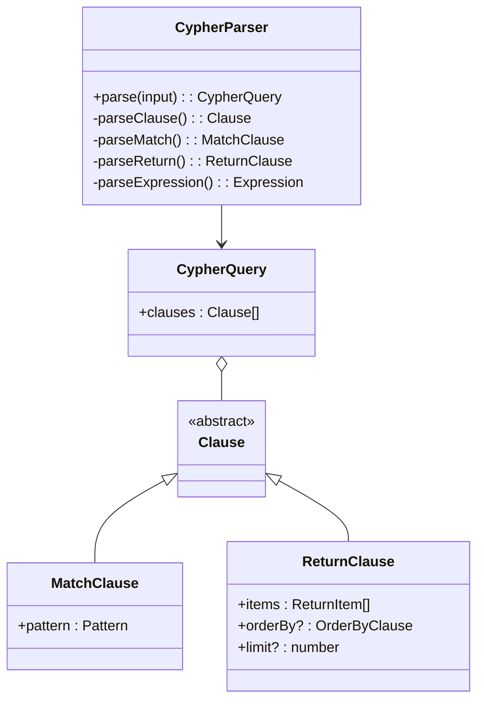
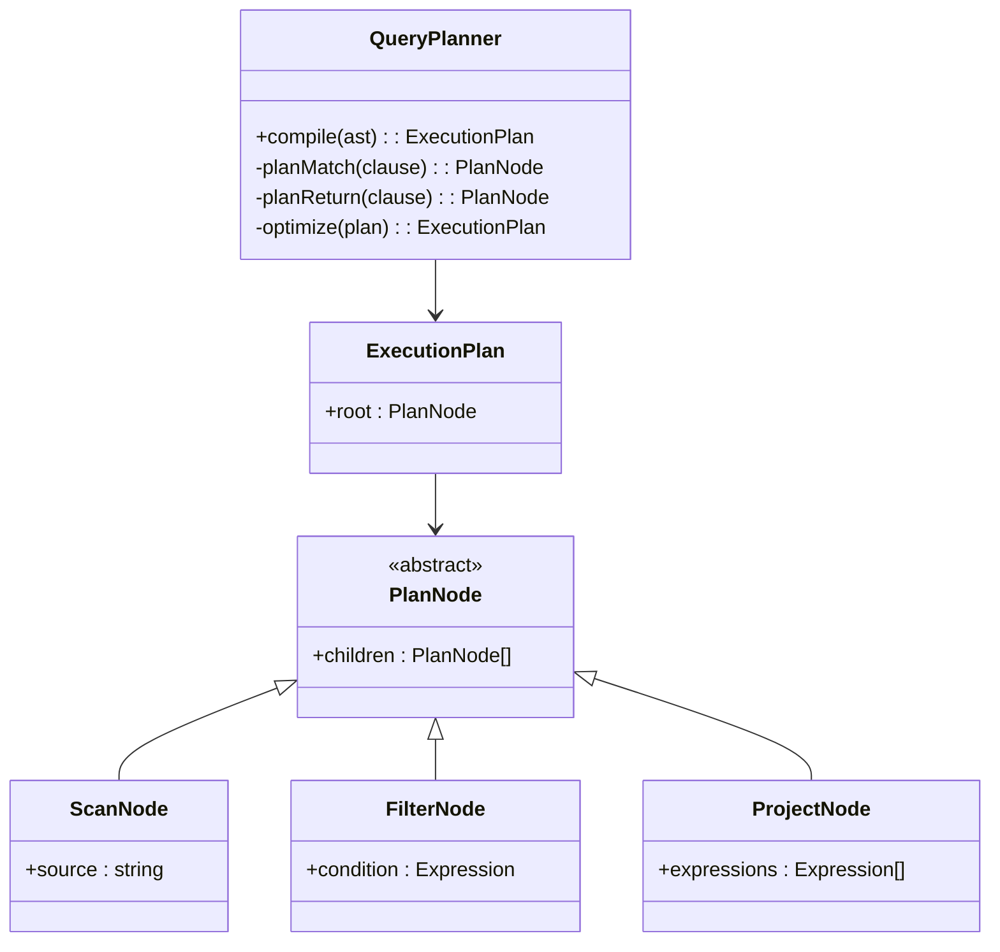
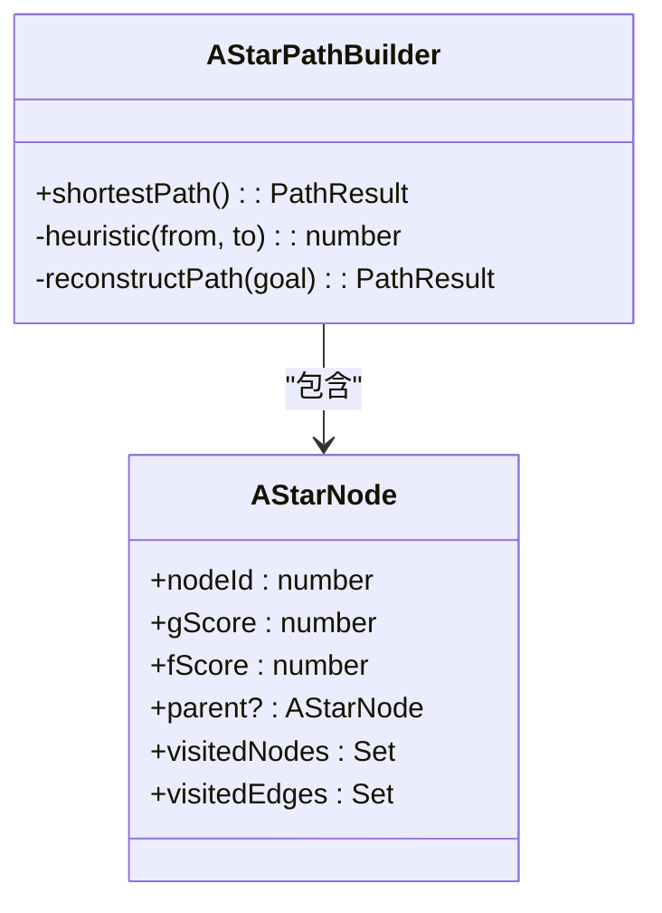
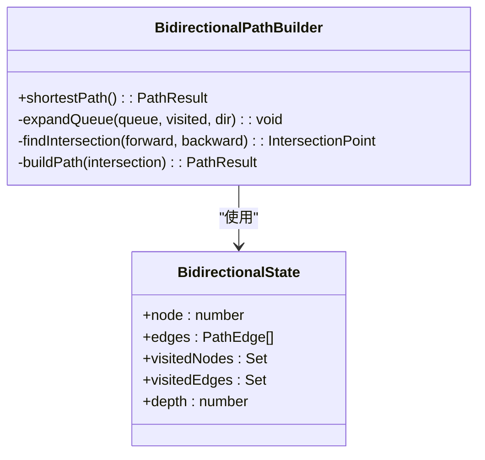
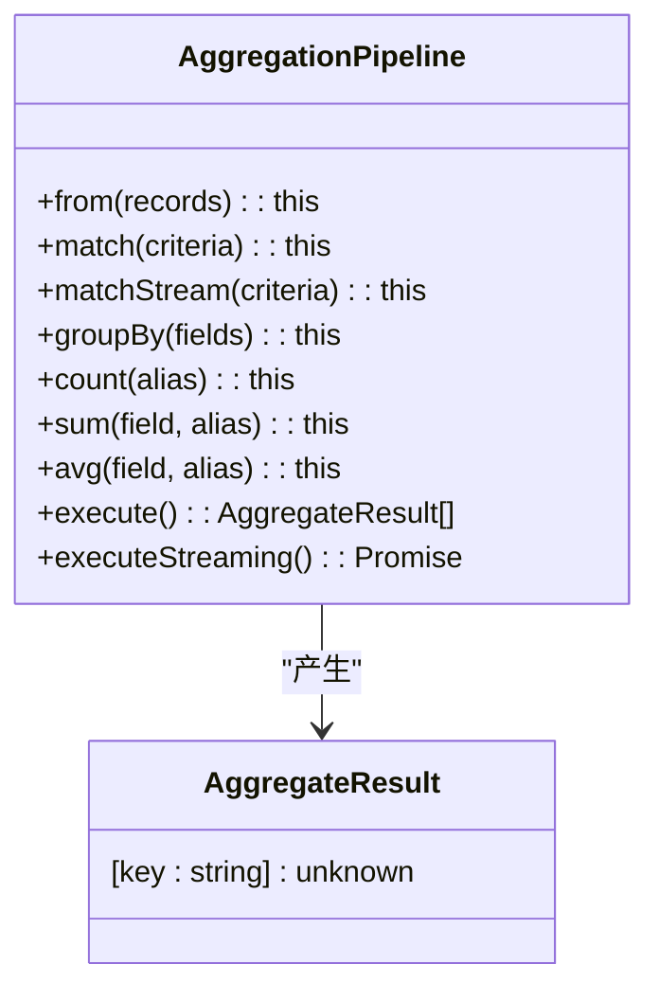
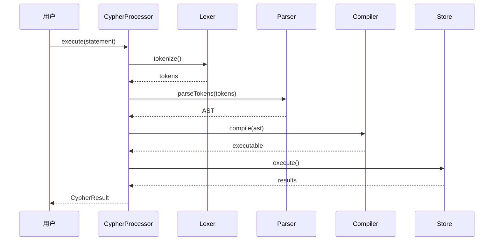
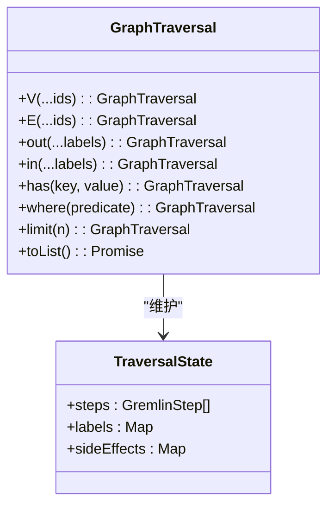
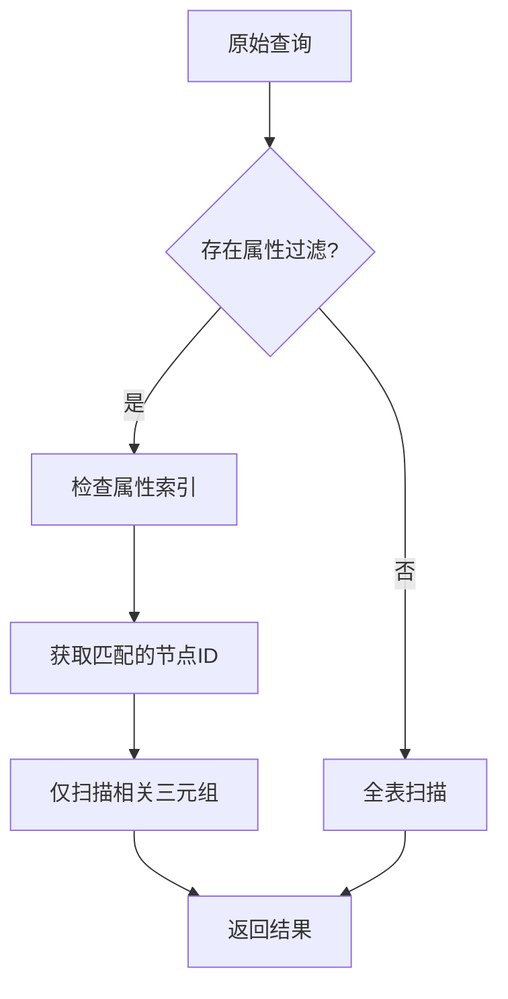

# 查询引擎

<cite>
**本文档引用的文件**  
- [queryBuilder.ts](file://src/query/queryBuilder.ts)
- [cypher.ts](file://src/query/cypher.ts)
- [lexer.ts](file://src/query/pattern/lexer.ts)
- [parser.ts](file://src/query/pattern/parser.ts)
- [planner.ts](file://src/query/pattern/planner.ts)
- [astar.ts](file://src/query/path/astar.ts)
- [bidirectional.ts](file://src/query/path/bidirectional.ts)
- [variable.ts](file://src/query/path/variable.ts)
- [aggregation.ts](file://src/query/aggregation.ts)
- [builder.ts](file://src/query/graphql/builder.ts)
- [traversal.ts](file://src/query/gremlin/traversal.ts)
</cite>

## 目录
1. [简介](#简介)
2. [查询构建器DSL](#查询构建器dsl)
3. [模式匹配与执行计划](#模式匹配与执行计划)
4. [路径查找算法](#路径查找算法)
5. [聚合查询机制](#聚合查询机制)
6. [多语言查询支持](#多语言查询支持)
7. [性能优化与索引下推](#性能优化与索引下推)

## 简介
本文档全面介绍SynapseDB查询引擎的核心架构与实现细节。该引擎支持多种查询接口，包括链式DSL、Cypher、GraphQL和Gremlin，能够高效处理复杂的图数据查询需求。系统通过模块化设计实现了高可扩展性，并针对不同查询场景提供了相应的优化策略。

## 查询构建器DSL
查询构建器提供了一种直观的链式API语法，允许用户以函数式编程的方式构造复杂查询。其核心方法包括`find()`、`where()`、`follow()`和`limit()`等，这些方法返回新的查询构建器实例，从而支持方法链调用。



**图源**
- [queryBuilder.ts](file://src/query/queryBuilder.ts#L38-L812)

**节源**
- [queryBuilder.ts](file://src/query/queryBuilder.ts#L38-L812)

## 模式匹配与执行计划
模式匹配功能通过词法分析、语法解析和执行计划生成三个阶段完成。首先使用词法分析器将输入字符串分解为标记流，然后由语法解析器构建成抽象语法树（AST），最后通过查询规划器生成可执行的查询计划。

### 词法分析
词法分析器负责将原始查询文本转换为标记序列。它识别关键字、标识符、字符串字面量、数字和操作符等各种语言元素。



**图源**
- [lexer.ts](file://src/query/pattern/lexer.ts#L160-L540)

### 语法解析
语法解析器接收标记流并构建出符合语法规则的抽象语法树。每个节点代表一个语言结构，如MATCH子句、RETURN子句或表达式。



**图源**
- [parser.ts](file://src/query/pattern/parser.ts#L64-L928)

### 执行计划生成
查询规划器将AST转换为具体的执行计划，决定如何最优地访问数据和执行操作。



**图源**
- [planner.ts](file://src/query/pattern/planner.ts#L90-L479)

## 路径查找算法
路径查找模块实现了多种高效的图遍历算法，适用于不同的查询场景。

### A*搜索算法
A*算法结合了Dijkstra算法的准确性和贪心最佳优先搜索的效率，使用启发式函数估算从当前节点到目标的距离。



**图源**
- [astar.ts](file://src/query/path/astar.ts#L0-L344)

### 双向搜索算法
双向BFS从起点和终点同时开始搜索，直到两个搜索前沿相遇，显著减少了搜索空间。



**图源**
- [bidirectional.ts](file://src/query/path/bidirectional.ts#L0-L301)

## 聚合查询机制
聚合查询模块支持流式处理大规模数据集，避免一次性加载全部记录到内存中。



**图源**
- [aggregation.ts](file://src/query/aggregation.ts#L0-L441)

**节源**
- [aggregation.ts](file://src/query/aggregation.ts#L0-L441)

## 多语言查询支持
查询引擎提供了对多种查询语言的支持，满足不同用户的使用习惯。

### Cypher兼容性
通过完整的词法分析、语法解析和编译流程实现Cypher查询支持。



**图源**
- [cypher.ts](file://src/query/cypher.ts#L0-L286)

### GraphQL映射实现
动态生成GraphQL Schema并将GraphQL查询转换为底层数据访问。

```mermaid
classDiagram
class SchemaBuilder {
+buildSchema(types) : GeneratedSchema
-generateTypes(entityTypes) : GraphQLType[]
-generateRootTypes(entityTypes) : GraphQLType[]
-generateResolvers(entityTypes) : Resolvers
}
class GraphQLContext {
+store : PersistentStore
}
class GraphQLResolver {
(parent, args, context) : Promise<unknown>
}
SchemaBuilder --> GraphQLContext
SchemaBuilder --> GraphQLResolver
```

**图源**
- [builder.ts](file://src/query/graphql/builder.ts#L0-L799)

### Gremlin遍历API
提供类似Gremlin的链式API用于图遍历操作。



**图源**
- [traversal.ts](file://src/query/gremlin/traversal.ts#L0-L546)

## 性能优化与索引下推
查询优化器利用属性索引下推技术提升查询效率，将过滤条件尽可能早地下推到存储层执行。



**节源**
- [queryBuilder.ts](file://src/query/queryBuilder.ts#L38-L812)