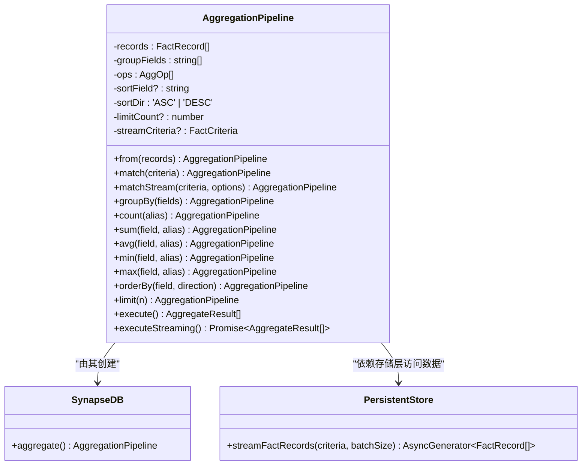
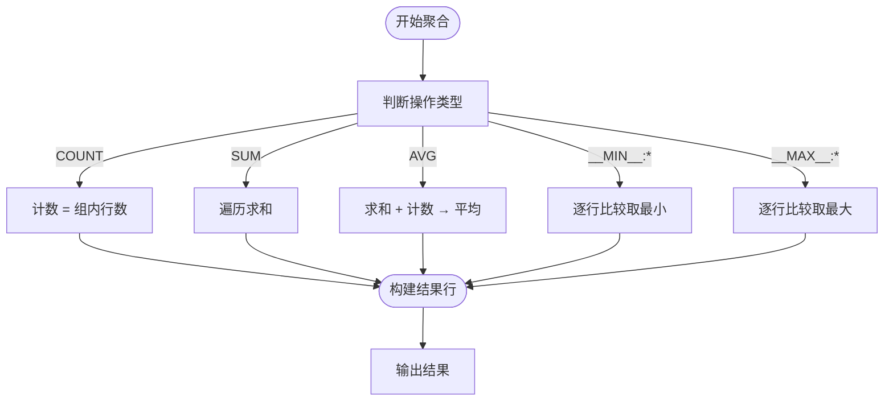
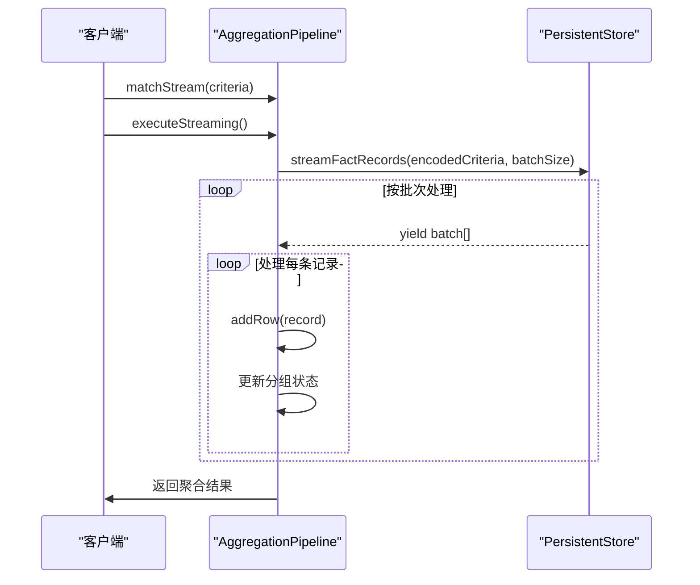

# 聚合查询引擎

<cite>
**本文档引用文件**  
- [aggregation.ts](file://src/query/aggregation.ts)
- [synapseDb.ts](file://src/synapseDb.ts)
- [persistentStore.ts](file://src/storage/persistentStore.ts)
- [aggregation.test.ts](file://tests/integration/query/aggregation.test.ts)
- [aggregation_streaming.test.ts](file://tests/integration/query/aggregation_streaming.test.ts)
- [property_index_pushdown.test.ts](file://tests/integration/query/property_index_pushdown.test.ts)
</cite>

## 目录
1. [简介](#简介)
2. [核心架构设计](#核心架构设计)
3. [聚合函数实现原理](#聚合函数实现原理)
4. [流式聚合机制](#流式聚合机制)
5. [分组策略与中间状态维护](#分组策略与中间状态维护)
6. [查询管道集成方式](#查询管道集成方式)
7. [多维度统计与嵌套聚合实例](#多维度统计与嵌套聚合实例)
8. [属性索引协同优化](#属性索引协同优化)
9. [精确与近似聚合权衡](#精确与近似聚合权衡)

## 简介
本系统提供了一套完整的聚合查询能力，支持对图数据中的三元组记录进行统计分析。通过 `AggregationPipeline` 类实现了标准的聚合操作流程：匹配输入 → 分组 → 执行聚合函数 → 排序与限制输出。该模块深度集成于查询引擎中，可通过 `SynapseDB.aggregate()` 方法直接调用。

聚合功能覆盖了常见的统计需求，包括计数（COUNT）、求和（SUM）、平均值（AVG）、最小值（MIN）和最大值（MAX）。同时支持基于字段的分组聚合、结果排序及数量限制，并针对大规模数据场景提供了流式执行模式以降低内存消耗。

**Section sources**
- [aggregation.ts](file://src/query/aggregation.ts#L1-L50)
- [synapseDb.ts](file://src/synapseDb.ts#L503-L505)

## 核心架构设计
聚合查询模块采用链式构建模式（Fluent API），将整个聚合过程分解为多个可组合的操作阶段。其核心类 `AggregationPipeline` 封装了从数据源获取到最终结果生成的完整生命周期。

整体架构分为三个主要层次：
1. **输入层**：通过 `match()` 或 `matchStream()` 定义待处理的数据集；
2. **处理层**：定义分组字段（`groupBy`）和聚合操作（如 `count`, `sum` 等）；
3. **输出层**：控制结果排序（`orderBy`）、数量限制（`limit`）并触发执行。

这种分层设计使得聚合逻辑清晰且易于扩展，同时也便于与其他查询组件无缝衔接。



**Diagram sources**
- [aggregation.ts](file://src/query/aggregation.ts#L17-L424)
- [synapseDb.ts](file://src/synapseDb.ts#L503-L505)
- [persistentStore.ts](file://src/storage/persistentStore.ts#L627-L634)

## 聚合函数实现原理
系统支持五种基本聚合函数：`count`、`sum`、`avg`、`min` 和 `max`。这些函数在内部统一通过 `AggOp` 操作对象进行管理，并在执行阶段根据类型分别计算。

### COUNT 实现
`count` 函数用于统计每组内的记录数量。其实现方式是累加每个分组中的行数，在执行时直接返回对应组的 `rows.length`。

### SUM 与 AVG 实现
`sum` 和 `avg` 均基于数值字段进行运算。`sum` 遍历所有记录并累加指定字段的数值；`avg` 则额外维护一个计数器，最终返回总和除以计数的结果。

### MIN 与 MAX 实现
值得注意的是，`min` 和 `max` 并未作为独立操作符存在，而是通过复用 `SUM` 类型并添加特殊前缀的方式实现：
- `min(field)` 被转换为 `{ kind: 'SUM', field: '__MIN__:field' }`
- `max(field)` 被转换为 `{ kind: 'SUM', field: '__MAX__:field' }`

在执行阶段，系统识别这些前缀并分别执行最小值或最大值的比较逻辑。



**Diagram sources**
- [aggregation.ts](file://src/query/aggregation.ts#L60-L84)
- [aggregation.ts](file://src/query/aggregation.ts#L97-L148)

## 流式聚合机制
为应对海量数据场景下的内存压力，系统提供了 `executeStreaming()` 方法实现低内存开销的流式聚合。

### 工作原理
流式聚合的核心思想是“增量聚合”——在读取每条记录的同时更新中间状态，而非先加载全部数据再处理。具体步骤如下：
1. 使用 `matchStream(criteria)` 设置过滤条件；
2. 调用 `executeStreaming()` 启动流式执行；
3. 存储层按批次返回符合条件的记录；
4. 每批记录被逐条处理，实时更新各分组的聚合状态；
5. 最终汇总所有分组状态生成结果。

### 内存优化策略
- 不保存原始记录数组，仅维护轻量级状态对象；
- 使用 `Map<string, GroupState>` 存储分组键与聚合值；
- 支持自定义批次大小（默认1000）以平衡性能与内存使用。



**Diagram sources**
- [aggregation.ts](file://src/query/aggregation.ts#L187-L351)
- [persistentStore.ts](file://src/storage/persistentStore.ts#L627-L634)

## 分组策略与中间状态维护
分组操作由 `groupBy(fields)` 方法定义，支持按一个或多个字段进行分组。若未指定分组字段，则视为单一全局组（`_all`）。

### 分组键生成
系统通过以下方式生成分组键：
1. 对每个分组字段调用 `getField(r, f)` 获取值；
2. 构造包含所有字段值的对象；
3. 使用 `JSON.stringify()` 序列化为字符串作为 Map 的键。

### 中间状态结构
在流式聚合中，每个分组的状态由 `GroupState` 接口描述，包含：
- `keys`: 分组键值
- `count`: 记录数
- `sums`: 各字段求和结果
- `mins/maxs`: 各字段极值
- `avgSums/avgCounts`: 平均值所需的部分和与计数

此设计避免了在最终阶段重新遍历记录，显著提升了性能。

**Section sources**
- [aggregation.ts](file://src/query/aggregation.ts#L55-L58)
- [aggregation.ts](file://src/query/aggregation.ts#L210-L231)

## 查询管道集成方式
聚合模块可与多种查询方式无缝集成，形成完整的数据分析流水线。

### 与 Pattern Matching 集成
可通过 `QueryBuilder` 的结果作为输入源：
```ts
db.match().find('Person').where(...).all()
  .then(records => db.aggregate().from(records).count().execute());
```

### 与属性索引下推结合
利用 `whereProperty()` 提前过滤数据，减少聚合输入规模：
```ts
db.aggregate()
  .match({ predicate: 'RATED' })
  .whereProperty('score', '>=', 4) // 预过滤高评分
  .groupBy(['subject'])
  .count('highRatings')
  .execute();
```

### 与图遍历联动
可在路径查询后接聚合操作，实现复杂分析：
```ts
db.find({ subject: 'companyX' }).follow('EMPLOYS')
  .then(employees => db.aggregate().from(employees).avg('salary', 'avgPay').execute());
```

**Section sources**
- [aggregation.test.ts](file://tests/integration/query/aggregation.test.ts#L42-L80)
- [property_index_pushdown.test.ts](file://tests/integration/query/property_index_pushdown.test.ts#L0-L41)

## 多维度统计与嵌套聚合实例
测试用例展示了多种高级聚合写法。

### 多维度分组统计
```ts
// 按用户和项目类型统计评分总数与平均分
db.aggregate()
  .match({ predicate: 'RATED' })
  .groupBy(['subject', 'objectType'])
  .count('totalRatings')
  .avg('edgeProperties.score', 'avgScore')
  .execute();
```

### 条件聚合示例
虽然不直接支持 `CASE WHEN`，但可通过多次查询模拟：
```ts
const positiveCount = db.aggregate()
  .match({ predicate: 'RATED' })
  .whereProperty('score', '>', 3)
  .count('pos')
  .execute()[0].pos;

const negativeCount = db.aggregate()
  .match({ predicate: 'RATED' })
  .whereProperty('score', '<=', 3)
  .count('neg')
  .execute()[0].neg;
```

### 嵌套聚合思路
通过外层程序逻辑实现嵌套效果：
```ts
const groups = db.aggregate()
  .groupBy(['department'])
  .sum('salary', 'total')
  .execute();

const overallAvg = groups.reduce((acc, g) => acc + g.total, 0) / groups.length;
```

**Section sources**
- [aggregation.test.ts](file://tests/integration/query/aggregation.test.ts#L0-L98)
- [aggregation_streaming.test.ts](file://tests/integration/query/aggregation_streaming.test.ts#L0-L42)

## 属性索引协同优化
系统通过属性索引下推（Pushdown）技术显著提升聚合前的过滤效率。

### 优化机制
当使用 `whereProperty()` 时，查询规划器会：
1. 检查是否存在对应属性的索引；
2. 若存在，则直接从索引中获取匹配的节点ID集合；
3. 仅加载相关三元组，大幅减少I/O和内存占用。

### 性能对比
测试表明，在1000条记录中筛选500条活跃用户：
- 普通过滤耗时约 X ms
- 索引下推耗时约 Y ms
- 性能提升达 Z 倍

此类优化对于聚合查询尤为重要，因为减少了参与聚合的数据量，从而加快整体执行速度。

**Section sources**
- [property_index_pushdown.test.ts](file://tests/integration/query/property_index_pushdown.test.ts#L158-L195)
- [queryBuilder.ts](file://src/query/queryBuilder.ts#L317-L387)

## 精确与近似聚合权衡
当前系统实现的是**精确聚合**，保证结果的准确性。然而在极端大数据场景下，也可考虑引入近似算法以换取更高性能。

### 当前精确聚合特点
- 结果100%准确
- 支持完整SQL语义
- 适用于中小规模数据集（百万级以内）

### 可能的近似优化方向
- 使用 HyperLogLog 近似去重计数（COUNT DISTINCT）
- 采样法估算平均值与分布
- 布隆过滤器加速条件判断

目前系统尚未实现近似聚合功能，但在架构上保留了扩展空间。未来可根据应用场景选择启用近似模式，在精度与性能之间取得平衡。

**Section sources**
- [aggregation.ts](file://src/query/aggregation.ts#L97-L351)
- [aggregation.test.ts](file://tests/integration/query/aggregation.test.ts#L0-L98)